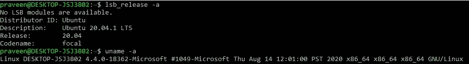
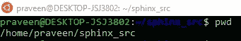
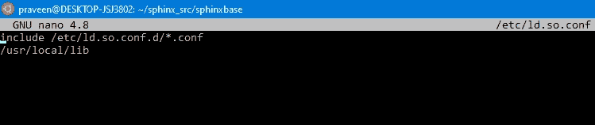
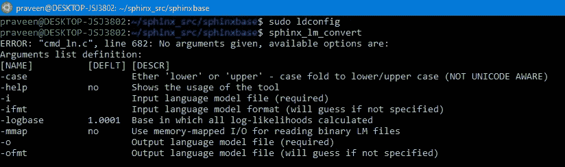
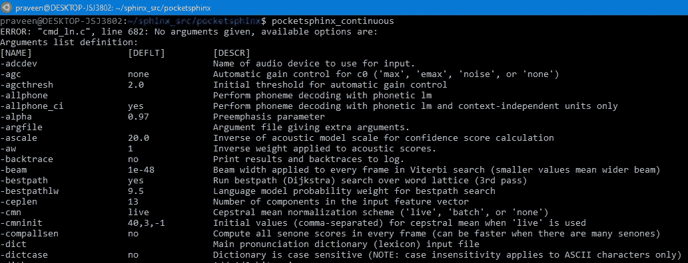
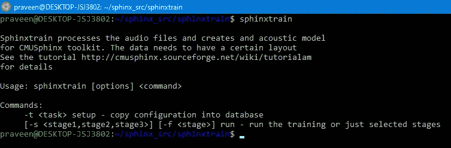
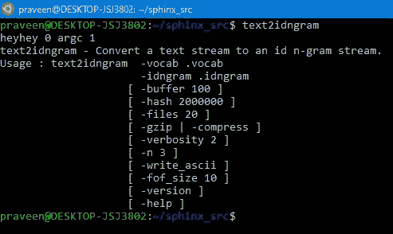

# 使用 CMU Sphinx4 训练自定义语音到文本模型—第 1 部分—设置 CMU Sphinx &环境

> 原文：<https://medium.com/analytics-vidhya/training-custom-speech-to-text-model-using-cmu-sphinx4-part-1-setting-up-cmu-sphinx-c90123c9d7ac?source=collection_archive---------12----------------------->


在本文中，我们将在我们的 Linux 系统上安装 CMU Sphinx。我们使用 Ubuntu 20.04 作为 Windows 子系统。

这里有一些关于我们正在使用的发行版的细节。



我们将使用的大多数命令现在可能适用于您的版本，在这种情况下，请使用 google 或 StackOverflow 来查找替代的依赖项或包。

让我们开始吧。😄

要安装 CMU·斯芬克斯，我们需要在我们的系统上安装几个软件包。执行以下命令，这将减轻我们的工作负担:

```
sudo apt-get install git gcc make automake autoconf libtool bison swig python-dev libpulse-dev subversion
```

上述命令可能会安装几个额外的软件包(大约需要 200 MB 的磁盘空间)。但是，请确保您已经安装了所有这些软件包，以便继续操作。⚠️

现在，让我们来建立 CMU 狮身人面像。狮身人面像与 CMU 狮身人面像、CMU 狮身人面像和 CMU 袖珍狮身人面像站在一起。为了能够使用所有这些包， ***我们需要先安装 sphinx base***。

让我们在自己的主目录下做一个目录，从 Github 克隆 SphinxBase。

```
mkdir sphinx_src
cd sphinx_src
pwd
```

上述命令给出了以下输出。



现在，让我们克隆 repo 并安装 SphinxBase。逐一运行以下命令。

```
git clone [https://github.com/cmusphinx/sphinxbase.git](https://github.com/cmusphinx/sphinxbase.git)cd sphinxbase./autogen.sh --disable-dependency-trackingmakesudo make install
```

当您运行以上命令时，您将在终端上得到大量输出。在验证 SphinxBase 是否安装正确之前，我们只需要再做一个小步骤。逐一运行以下命令:

```
sudo nano /etc/ld.so.conf
```

它将打开一个文件。它已经有了下图所示的第一行。只需在第二行添加以下行。

```
/usr/local/lib
```

然后按 **CTRL+X** ，再按 **Y、**和**进入**。这将保存您的文件。如果再次运行 nano 命令，应该会看到以下内容。



现在，让我们验证 SphinxBase 是否安装正确。运行以下命令。

```
sudo ldconfigsphinx_lm_convert
```

您应该能够看到以下输出:



如果是这样，那太好了😃。我们迈出了重要的第一步。让我们快速安装 PocketSphinx & SphinxTrain。

让我们首先转到“sphinx_src”目录，然后克隆 PocketSphinx。

```
git clone [https://github.com/cmusphinx/pocketsphinx.git](https://github.com/cmusphinx/pocketsphinx.git)
```

“sphinx_src”中现在应该有两个目录。


现在，让我们执行与之前安装 PocketSphinx 时相同的一组命令。

```
cd pocketsphinx./autogen.shmakesudo make install
```

如果一切顺利，在运行“pocketsphinx_continuous”时，应该能够看到下面的输出。



这不是完整的输出，但是是的，您应该能够看到类似的内容。

> 注意:如果您得到一个错误，它说:
> 
> "加载共享库时出错:libxerces-c-3.1.so:无法打开共享对象文件:没有这样的文件或目录"，
> 
> 然后运行下面的命令，希望可以解决这个问题。否则，按照[这篇](https://stackoverflow.com/questions/4514997/error-loading-shared-libraries) stackoverflow 帖子。

```
sudo cp /usr/local/lib/libpocketsphinx.* /usr/lib/
```

现在让我们安装 SphinxTrain。切换回“sphinx_src”目录并运行以下命令。

```
git clone [https://github.com/cmusphinx/sphinxtrain.git](https://github.com/cmusphinx/sphinxtrain.git)cd sphinxtrain./autogen.shmakesudo make install
```

要验证 sphinxtrain 是否安装成功，请在终端中键入“SphinxTrain ”,您将看到以下输出。



这就完成了我们 CMU 狮身人面像的搭建😋。

现在让我们设置一些我们将来需要的附加包。

切换到“sphinx_src”目录，逐一运行以下命令:

```
svn checkout svn://svn.code.sf.net/p/cmusphinx/code/trunk cmusphinx-codecd cmusphinx-code/cmuclmtk/./autogen.shmakesudo make install
```

如果一切顺利，运行“text2idngram”时应该能看到下面的输出。



> 注意:如果您得到一个错误，它说:
> 
> "加载共享库时出错:libcmuclmtk.so.0:无法打开共享对象文件:没有这样的文件或目录"，
> 
> 然后运行下面的命令，希望可以解决这个问题。

```
sudo cp /usr/local/lib/libcmuclmtk.* /usr/lib/
```

这就完成了我们的设置。恭喜🎁

如果你有任何问题，请联系我[inbox.praveen.kumar17@gmail.com](mailto:inbox.praveen.kumar17@gmail.com)或者你也可以在评论区写下。

如果你喜欢这篇文章，请鼓掌👏！谢谢😃

下一步是什么？

关于以下主题的一系列文章即将发表。

训练定制以及预训练声学模型。

超参数调整参数，找到最适合您的音频数据集。

使用 sphinx 配置实现最高精度。

建立字典和自定义语言模型。