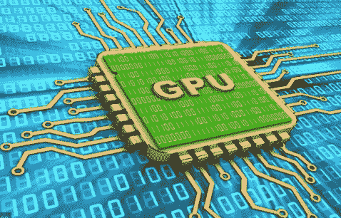

# 用 GPU 和 Pytorch 训练深度学习模型

> 原文：<https://medium.com/analytics-vidhya/training-deep-learning-model-with-gpu-and-pytorch-e0adfb718bf4?source=collection_archive---------9----------------------->

[信用](https://6lli539m39y3hpkelqsm3c2fg-wpengine.netdna-ssl.com/wp-content/uploads/2018/03/gpu-circuit-green_shutterstock_576941419_700x-675x380.jpg)

欢迎光临！希望你一切都好。今天我们将讨论 GPU 以及如何使用它来训练你的深度学习模型，我们都知道在 CPU(中央处理器)上训练深度学习模型非常非常耗时，当我们在这个深度学习领域工作时，我们都经常面临这种情况。