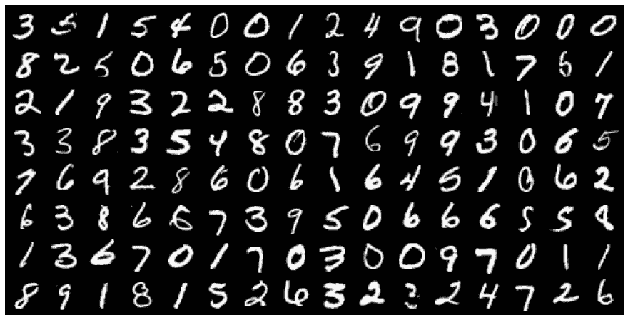
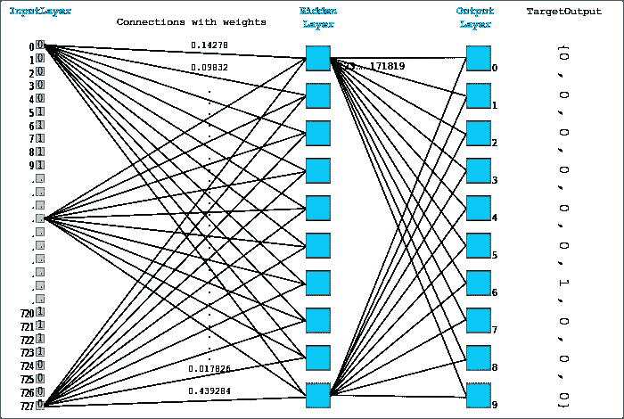
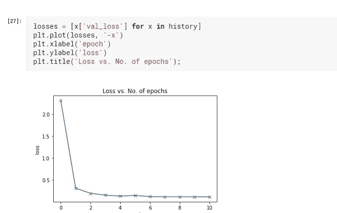
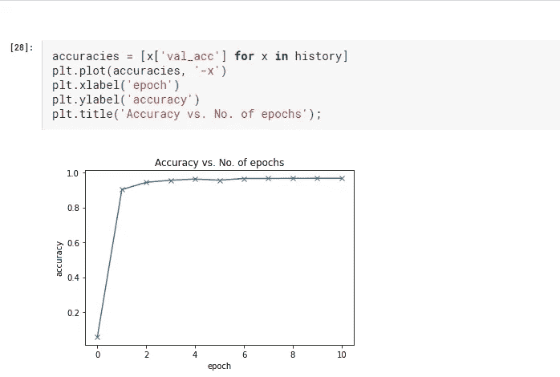

# 用 PyTorch 在 GPU 上训练深度神经网络

> 原文：<https://medium.com/analytics-vidhya/training-deep-neural-networks-on-a-gpu-with-pytorch-2851ccfb6066?source=collection_archive---------4----------------------->

*MNIST 使用前馈神经网络*


[来源](https://www.risk.net/investing/7182261/credit-suisse-uses-neural-nets-to-call-minute-ahead-forex)

在我之前的帖子中，我们已经讨论过了

1.  [深度学习——人工神经网络](/analytics-vidhya/deep-learning-artificial-neural-network-ann-13b54c3f370f?source=your_stories_page---------------------------)
2.  [张量 PyTorch 编程基础](/@arun.purakkatt/tensors-basics-of-pytorch-programming-5de82ea45ebf?source=your_stories_page---------------------------)
3.  [使用 PyTorch 进行线性回归](/analytics-vidhya/linear-regression-with-pytorch-147fed55f138)
4.  【PyTorch 图像分类 *—逻辑回归*

*让我们尝试通过在 MNIST 数据集上使用前馈神经网络。*

***第一步:导入库&探索数据*和数据准备**

随着必要的库的导入和数据作为 pytorch 张量的加载，MNIST 数据集包含 60000 个标记图像。数据被随机分成分别具有 50000 和 10000 的训练集和验证集。

```
val_size = 10000
train_size = len(dataset) - val_size

train_ds, val_ds = random_split(dataset, [train_size, val_size])
len(train_ds), len(val_ds)
```

我们正在创建数据加载器，它允许我们批量加载数据，特别是当您有大型数据集时，它将不适合用于训练的内存。因此我们使用数据加载器。这里我们使用的批量是 128。我们如何决定批量大小？通常，您可以尝试不同的批量大小，如 128，256，512..直到你的 GPU/内存适合它，处理得更快。当它慢下来的时候，你可以把批量减少一步。

在 train_loader 中，我们使用 shuffle = True，因为它为数据 pin_memory 提供了随机化—如果为 True，数据加载器将在返回张量之前将其复制到 CUDA 固定内存中。num_workers —用于数据加载的子流程数量。它致力于并行化。

试着看看文档:[https://pytorch.org/docs/stable/data.html](https://pytorch.org/docs/stable/data.html)

```
batch_size=128
train_loader = DataLoader(train_ds, batch_size, shuffle=True, num_workers=4, pin_memory=True)
val_loader = DataLoader(val_ds, batch_size*2, num_workers=4, pin_memory=True)
```

让我们使用来自`torchvision`的`make_grid`函数在网格中可视化一批数据。我们还将使用张量上的`.permute`方法将通道移动到最后一个维度，正如`matplotlib`所预期的。每批有 128 个图像，其中 1 个通道作为其灰度图像，28×28 像素大小，换句话说 28 行和 28 列。如果它是一个彩色图像通道，即 RGB 将是 3。

```
for images, _ in train_loader:
    print('images.shape:', images.shape)
    plt.figure(figsize=(16,8))
    plt.axis('off')
    plt.imshow(make_grid(images, nrow=16).permute((1, 2, 0)))
    break
```



图像。形状:火炬。大小([128，1，28，28])

***第二步:模型准备***

这是我们模型的样子。我们正在创建一个只有一个隐藏层的神经网络。结构将像输入层，隐藏层，输出层。让我们详细了解每一层。

*输入层* —这里我们有 28x28 大小，而我们使用 128 的批量大小，我们将得到 28x28 作为输入矩阵。

*隐藏层—* 第一层(也称为隐藏层)将把形状`batch_size x 784`的输入矩阵转换成形状`batch_size x hidden_size`的中间输出矩阵，其中`hidden_size`是一个预先配置的参数(通常如 32 或 64)。

然后，中间输出被传递到非线性*激活函数*，该函数对输出矩阵的单个元素进行操作。

*输出层—* 激活函数的结果，也是大小为`batch_size x hidden_size`的，被传递到第二层(也称为输出层)，该层将其转换成大小为`batch_size x 10`的矩阵



[来源](https://jovian.ml/aakashns/04-feedforward-nn)

***什么是激活功能& ReLu？***

激活函数通过计算加权和并进一步加上偏差来决定是否激活一个神经元。激活函数的目的是将非线性引入神经元的输出。

ReLu:校正的线性单位，relu(x) = max(0，x)即，如果一个元素是负的，我们用 0 代替它，否则我们保持它不变。


激活功能([源](https://towardsdatascience.com/complete-guide-of-activation-functions-34076e95d044))

***我们为什么要使用隐藏层和激活功能？***

这允许我们的模型学习输入和目标之间更复杂、多层和非线性的关系。

我们将 Mnistmodel 类定义如下。我们有 __init__ 接受 in_size，hidden_size，out_size。我们有一个隐藏层和输出层。这是我们的构造函数。

在正向函数中，我们获取一批图像 xb，即 128x1x28x28，然后将其展平，因为我们的线性层需要一个二维矢量。然后我们使用隐藏层得到中间输出，在它上面我们应用激活函数。即我们简单地用零代替负数。然后，ReLu 的输出被传递到输出层。因此，在每个图像的输出中，我们有 10 个输出。

在 training_step 函数中，我们使用交叉熵生成预测并计算损失。cross_entropy 去掉了数据的实际标签，并将返回 loss。

在 validation_step 中，我们获取一批图像、标签并将其传递到模型中，生成预测、计算损失并计算准确度。

在 validation_epoch_end 中，我们计算损失、epoch_loss、batch _ losses。batch_accs epoch_acc 被堆叠并取平均值。

在 epoch_end 中 val_loss 和 val_acc 被返回。

```
class MnistModel(nn.Module):
    """Feedfoward neural network with 1 hidden layer"""
    def __init__(self, in_size, hidden_size, out_size):
        super().__init__()
        # hidden layer
        self.linear1 = nn.Linear(in_size, hidden_size)
        # output layer
        self.linear2 = nn.Linear(hidden_size, out_size)

    def forward(self, xb):
        # Flatten the image tensors
        xb = xb.view(xb.size(0), -1)
        # Get intermediate outputs using hidden layer
        out = self.linear1(xb)
        # Apply activation function
        out = F.relu(out)
        # Get predictions using output layer
        out = self.linear2(out)
        return out

    def training_step(self, batch):
        images, labels = batch 
        out = self(images)                  # Generate predictions
        loss = F.cross_entropy(out, labels) # Calculate loss
        return loss

    def validation_step(self, batch):
        images, labels = batch 
        out = self(images)                    # Generate predictions
        loss = F.cross_entropy(out, labels)   # Calculate loss
        acc = accuracy(out, labels)           # Calculate accuracy
        return {'val_loss': loss, 'val_acc': acc}

    def validation_epoch_end(self, outputs):
        batch_losses = [x['val_loss'] for x in outputs]
        epoch_loss = torch.stack(batch_losses).mean()   # Combine losses
        batch_accs = [x['val_acc'] for x in outputs]
        epoch_acc = torch.stack(batch_accs).mean()      # Combine accuracies
        return {'val_loss': epoch_loss.item(), 'val_acc': epoch_acc.item()}

    def epoch_end(self, epoch, result):
        print("Epoch [{}], val_loss: {:.4f}, val_acc: {:.4f}".format(epoch, result['val_loss'], result['val_acc']))
```

我们正在创建隐藏尺寸层 32 的模型，我们可以改变这一点。可以添加更多的隐藏层。每个隐藏层从我们的数据中学习一些东西，并试图建立输入和目标之间的关系。这里，我们的输入大小为 784，隐藏大小为 32，输出大小或 num_classes 为 10。模型参数会给你权重和偏差。

```
input_size = 784
hidden_size = 32 # you can change this
num_classes = 10model = MnistModel(input_size, hidden_size=32, out_size=num_classes)for t in model.parameters():
    print(t.shape)
```

***第三步:在 GPU 上训练模型并评估精度。***

随着我们的模型和数据集的大小增加，我们需要使用 GPU 在合理的时间内训练我们的模型。定义一个助手函数，确保我们的代码使用 GPU(如果可用的话),如果不可用，默认使用 CPU。

```
torch.cuda.is_available()def **get_default_device**():
    """Pick GPU if available, else CPU"""
    if torch.cuda.is_available():
        return torch.device('cuda')
    else:
        return torch.device('cpu')device = get_default_device()
device
```

为了将数据移动到设备，我们创建了一个助手函数。它接受列表、元组和对每个张量上的设备方法的调用。这里，数据从当前设备(CPU)复制到 GPU。我们正在尝试使用 to_device 功能，从 train_loader 接收图像并打印图像，图像将显示为张量。

```
def **to_device**(data, device):
    """Move tensor(s) to chosen device"""
    if isinstance(data, (list,tuple)):
        return [to_device(x, device) for x in data]
    return data.to(device, non_blocking=True)for images, labels in train_loader:
    print(images.shape)
    images = to_device(images, device)
    print(images.device)
    break
```

我们定义了一个`DeviceDataLoader`类来包装我们现有的数据加载器，并在访问一批数据时将数据移动到选定的设备。有趣的是，我们不需要扩展现有的类来创建 PyTorch 数据加载器。我们只需要一个`__iter__`方法来检索数据批次，以及一个`__len__`方法来获得批次的数量。

```
class DeviceDataLoader():
    """Wrap a dataloader to move data to a device"""
    def __init__(self, dl, device):
        self.dl = dl
        self.device = device

    def __iter__(self):
        """Yield a batch of data after moving it to device"""
        for b in self.dl: 
            yield to_device(b, self.device)def __len__(self):
        """Number of batches"""
        return len(self.dl)
```

我们使用 evaluate 函数来评估验证数据集上的模型。它在 val_loader 上循环，validation_step 计算损失和准确性。这个输出被传递到 validation_epoch_end。

默认情况下，fit 函数采用历元数、学习率、模型、train_loader、val_loader、opt_fun ie 优化函数及其 SGD。让我们理解每一行代码。optimizer = opt _ func(model . parameters()，lr) —这基本上是通过获取模型参数和学习率来执行 SGD 的。我们正在循环遍历纪元的数量。在训练阶段，我们遍历训练数据加载器。loss = model . training _ step(batch)-计算每个批次的损失。loss . backward()-计算权重的梯度或导数。
optimizer . step()-根据当前梯度执行参数更新。
optimizer . zero _ grad()-将渐变设置为零。由于 backward()函数会累积梯度，并且您不希望在批次之间混淆梯度，因此您必须在新的小型批次开始时将它们归零。验证阶段我们正在 val_loader 和 model.epoch_end 上评估模型，我们正在打印损失和准确性。

```
def **evaluate**(model, val_loader):
    outputs = [model.validation_step(batch) for batch in val_loader]
    return model.validation_epoch_end(outputs)

def **fit**(epochs, lr, model, train_loader, val_loader, opt_func=torch.optim.SGD):
    history = []
    optimizer = opt_func(model.parameters(), lr)
    for epoch in range(epochs):
        *# Training Phase* 
        for batch in train_loader:
            loss = model.training_step(batch)
            loss.backward()
            optimizer.step()
            optimizer.zero_grad()
        *# Validation phase*
        result = evaluate(model, val_loader)
        model.epoch_end(epoch, result)
        history.append(result)
    return history
```

在我们训练模型之前，我们需要确保数据和模型的参数(权重和偏差)在同一个设备上(CPU 或 GPU)。我们可以重用 to_device 函数将模型的参数移动到正确的设备。在我们训练之前，我们可以用初始的权重和偏差集来检查模型在验证集上的表现。

```
*# Model (on GPU)*
model = MnistModel(input_size, hidden_size=hidden_size, out_size=num_classes)
to_device(model, device)history = [evaluate(model, val_loader)]
history
```

让我们训练 5 个纪元，看看结果。我们可以用相对较高的 0.5 的学习。因为学习率是基于你的模型来实验的。我们有大约 96%的准确率。

一种方法是固定一个标准值，如 0.01，如果你的损失太大，或者尝试减少 10 倍，即从 10e-2 到 10e-3。如果你的损失在慢慢减少，试着增加 10 倍。

96%就相当不错了！让我们以 0.1 的较低学习率再训练模型 5 个时期，以进一步提高精度。

```
history += fit(5, 0.5, model, train_loader, val_loader)history += fit(5, 0.1, model, train_loader, val_loader)
```

我们正在绘制损失与时代数量的关系图，我们可以看到它下降得相当快，并趋于平缓。



丢失与纪元数量

我们正在绘制精度与时代数的关系图，我们可以很快看到它上升并变平。



精确度与纪元数量

我们的模型很快就达到了 97%的准确率，但除此之外没有太大的改进。为了进一步提高精度，我们需要使模型更强大，这可以通过增加隐藏层的大小或添加更多的隐藏层来实现。

请查看笔记本 [*Github*](https://github.com/Arun-purakkatt/Deep_Learning_Pytorch) 上的全部代码，在 中的[*上与我保持联系。*](https://www.linkedin.com/in/arun-purakkatt-mba-m-tech-31429367/)

***演职员表&参考文献:***

1.  [https://jovian.ml/aakashns/04-feedforward-nn](https://jovian.ml/aakashns/04-feedforward-nn)
2.  https://pytorch.org/docs/stable/tensors.html