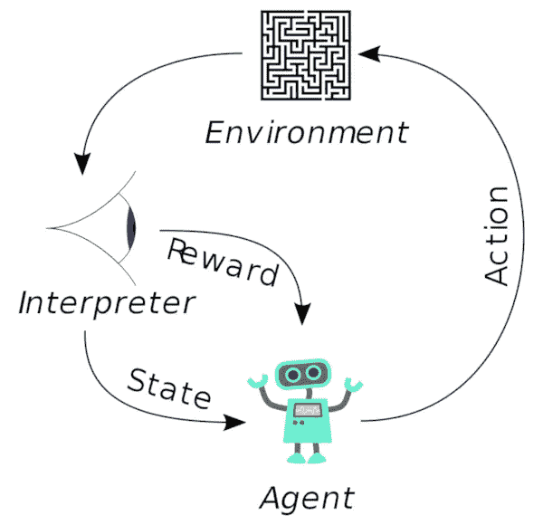

# 训练 DeepRacer 的速度

> 原文：<https://medium.com/analytics-vidhya/training-deepracer-for-speed-52007aa03af5?source=collection_archive---------3----------------------->

[AWS DeepRacer](https://aws.amazon.com/deepracer/) 是一辆 1/18 比例的自主赛车。它使用一个摄像头(和新版本的激光雷达传感器)作为输入，来确定汽车应该跑多快，转弯应该多陡。我们可以使用强化学习在模拟的虚拟世界中训练一个模型，并将模型加载到实车中进行测试。

# 强化学习

强化学习过程中的相互作用