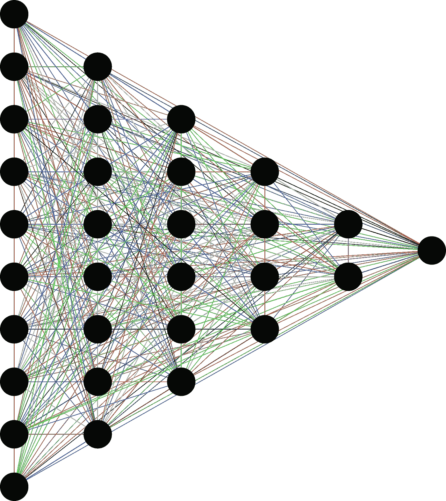

# 用 Keras 中任意长度的序列训练递归神经网络。

> 原文：<https://medium.com/analytics-vidhya/training-recurrent-neural-networks-with-sequences-of-arbitrary-length-in-keras-2edd5a79e665?source=collection_archive---------34----------------------->



嗨，在这篇文章中，我想介绍一些我在网上没怎么讨论过的东西。假设你想训练一个关于时间数据的分类器，时间数据可以是视频数据或时间序列数据。所有深度学习实践者都知道，递归神经网络(RNNs)是实现这一目标的主要方法之一。

在这篇文章中，我不打算讨论 RNNs 的基础，而是关注一个具体的问题。大多数真实数据都带有不同时间长度的序列。一些视频剪辑可能持续 200 帧，而另一些则可能短得多。

大多数人所做的是通过用合成帧/样本填充给定序列或者统一采样一组时间指数来标准化时间步长。考虑到 rnn 的设计方式，不需要采用任何一种方法。根据设计，标准 rnn 对序列的每个元素应用相同的操作符，而不管其长度如何。

抽象的讨论到此为止。让我们深入研究代码。

```
from keras.models import Sequential
from keras.layers import Dense
from keras.layers import LSTM
from keras import models, layers
from keras import regularizersclass FunkyLSTMSequential:
    [@staticmethod](http://twitter.com/staticmethod)
    def build(n_features):
        model = Sequential()
        model.add(LSTM(32, return_sequences=True, input_shape=(None, n_features)))
        model.add(LSTM(64, return_sequences=True))
        model.add(LSTM(32))
        model.add(Dense(100))
        model.add(Dense(2, activation='sigmoid', kernel_regularizer=regularizers.l2(0.01)))
        return model
```

在这段代码中，我们依次定义了一个非常简单的基于 LSTM 的架构。这里的关键部分是输入形状的定义。如果定义两个维度，它们将分别被解释为时间步长和特征维度。无**对于时间步长来说是一个有效的选择，并且会完全按照你想要的去做。**

不幸的是，这还不够，因为要训练网络，您需要实现一个生成器，向模型提供批量张量。这就是为什么这种方法只有在批量大小设置为 1 时才有效。

最后，我想说明同样的逻辑可以应用于 Keras 中的卷积 LSTMs。下面是第二段代码:

```
class FunkyConvLSTMSequential:
    [@staticmethod](http://twitter.com/staticmethod)
    def build(width, height):
        model = Sequential()
        model.add(ConvLSTM2D(filters = 32, kernel_size=(3,3), data_format='channels_first', return_sequences=True, padding='same',
                             input_shape=(None, 3, width, height), kernel_regularizer=regularizers.l2(0.01)))
        model.add(Dropout(0.5))
        model.add(ConvLSTM2D(filters=32, kernel_size=(3, 3), data_format='channels_first', return_sequences=False,
                             padding='same', kernel_regularizer=regularizers.l2(0.01)))
        model.add(Dropout(0.5))
        model.add(Flatten())
        model.add(Dense(12))
        model.add(Dense(2, activation='sigmoid', kernel_regularizer=regularizers.l2(0.01)))
        return model
```

这里，输入形状是 4 维的(考虑到批量大小，实际上是 5 维的)。input_shape 的第一个元素必须设置为 None，以反映序列长度的灵活性。第二个条目用于颜色通道，第三和第四个条目用于输入帧的宽度和高度。注意:这是因为我们选择了 data_format='channels_first '，但据我所知，时间步长总是先走。

这个帖子到此为止。让我知道你的想法。最重要的是:

你如何解决这个问题？
你知道更好的方法吗？
你认为拥有这种灵活性可以提高填充和采样的性能吗？