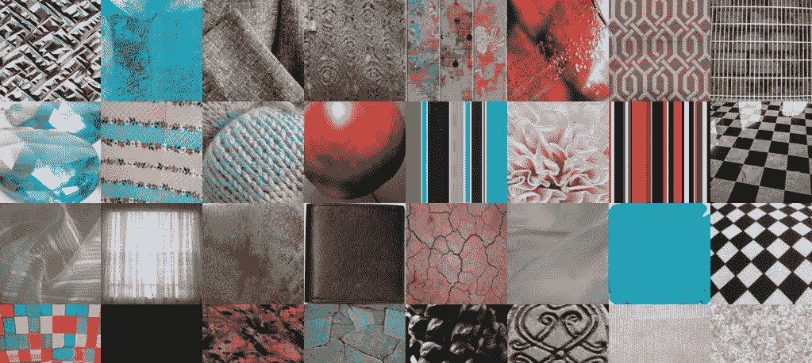
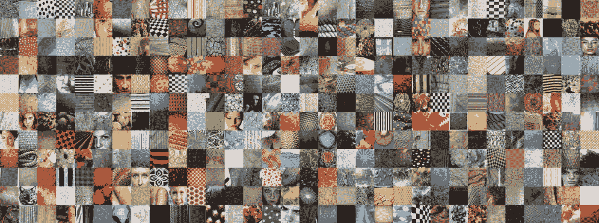
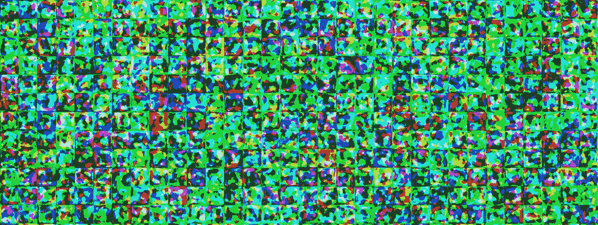
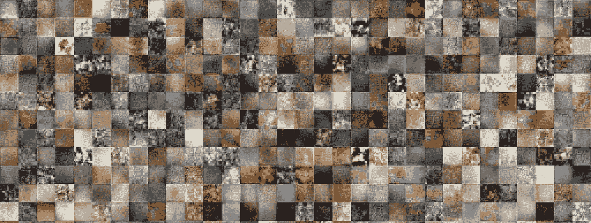
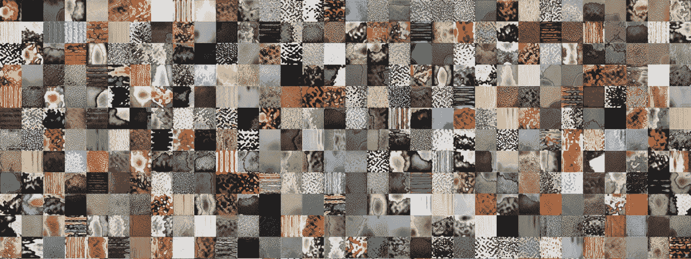
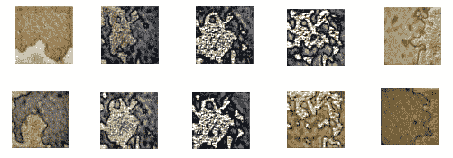

# 在 google 联合实验室的自定义数据集上使用迁移学习的训练风格

> 原文：<https://medium.com/analytics-vidhya/training-stylegan-using-transfer-learning-on-a-custom-dataset-in-google-colaboratory-bf4f1da95df1?source=collection_archive---------16----------------------->

# 摘要

*   分享我在 google colab 中使用样例代码片段的迁移学习在自定义数据集上一步一步训练风格 GAN 的知识
*   如何使用预先训练的权重从自定义数据集生成图像
*   使用不同的种子值生成新图像

# 介绍

***生成对抗网络或 GANs*** 是机器学习领域最近的一项创新，由伊恩·j·古德费洛和他的同事在 2014 年首次提出。它是一组神经网络，以博弈论的两人零和游戏(其中一个人的赢是另一个人的输)的形式相互对抗。它是一种无监督学习的生成模型。

这里有一个生成器(从潜在空间中的一个点生成数据的新实例)和一个鉴别器(用实际或真实数据值区分生成器生成的数据)。最初，生成器产生不真实或虚假的数据，鉴别器可以将其分类为虚假的，但是随着训练的继续，生成器开始学习真实数据的分布，并开始产生类似真实的数据。

这种情况一直持续到鉴别器未能将其分类为不真实，并且从发生器输出的所有数据看起来像真实数据的 ***翻版*** 。因此，这里发生器的输出连接到鉴别器的输入，并且基于鉴别器的输出(真实或不真实)计算损耗，并且通过反向传播，发生器的权重被更新用于随后的训练(时期)。

**StyleGAN** 目前市场上有多种 GAN 变体，但在本文中，我将重点关注由 [Nvidia](https://en.wikipedia.org/wiki/Nvidia) 在 2018 年 12 月推出的 StyleGAN。StyleGAN 的架构使用基线渐进式 GAN，即生成的图像大小从非常低的分辨率(4×4)逐渐增加到非常高的分辨率(1024×1024)，并使用双线性采样，而不是基线渐进式 GAN 中使用的最近邻上/下采样。本博客的主要目的是解释如何使用迁移学习在自定义数据集上训练 StyleGAN，因此，有关 GAN 架构的更多详细信息，请参考 NV labs/style GAN-官方 TensorFlow GitHub 链接([GitHub-NV labs/style GAN:style GAN-官方 TensorFlow 实现](https://github.com/NVlabs/stylegan))

***转移学习*** 在另一个相似的数据集上使用已经训练好的模型权重，并训练自定义数据集。

***自定义数据集*** 由 2500 张来自时尚的纹理图像组成。下面几个样本纹理图像供参考。您可以在这里替换您自己的自定义数据集。



## 要点和前提条件:

1.  *GPU 是必须的，StyleGAN 不会在 CPU 环境下训练。为了演示，我已经使用 google colab 环境进行了实验和学习。*
2.  *确保选择 Tensorflow 版本 1.15.2。StyleGAN 将只与 tf 1.x 一起工作*
3.  *StyleGAN 培训将花费大量时间(根据服务器容量，如 1 个 GPU、2 个 GPU 等，以天为单位)*
4.  *如果您正在进行任何与 GAN 相关的实时项目，那么您会希望在 tesla P-80 或 P-100 类型的专用服务器上训练您的 GAN，因为 colab 中有使用限制和超时。*
5.  *如果你有一个 google-pro(非强制)，你可以节省高达 40–50%的训练时间。对于本文，我只对 GAN 进行了 3500 次迭代训练，因为训练完整的 GAN(获取高分辨率图像)需要很长时间，一个 GAN 至少需要运行 25000 次迭代(推荐)。此外，我的图像分辨率是 64×64，但 styleGAN 是在 1024×1024 分辨率的图像上训练的。*
6.  *我已经使用下面预训练的权重来训练我的自定义数据集(请参考官方 Tensorflow Github 链接了解更多详细信息)*

```
[stylegan-ffhq-1024x1024.pkl](https://drive.google.com/uc?id=1MEGjdvVpUsu1jB4zrXZN7Y4kBBOzizDQ)StyleGAN trained with Flickr-Faces-HQ dataset at 1024×1024.
```

# 使用迁移学习在 google colab 的自定义数据集上训练风格 GAN

1.打开 colab，打开一个新的笔记本。确保在运行时->更改运行时类型->硬件加速器下设置为 GPU

2.验证您的帐户并安装 g 盘

```
from google.colab import drive drive.mount('/content/drive', force_remount=True)
```

3.确保选择 Tensorflow 版本 1.15.2。StyleGAN 将只与 tf 1.x 一起工作。

```
%tensorflow_version 1.x import tensorflow print(tensorflow.__version__)
```

4.从[GitHub—NV labs/style gan:style gan—官方 TensorFlow 实现](https://github.com/NVlabs/stylegan))克隆 stylegan.git

```
!git clone [https://github.com/NVlabs/stylegan.git](https://github.com/NVlabs/stylegan.git) !ls /content/stylegan/ You should see something like this config.py LICENSE.txt run_metrics.py dataset_tool.py metrics stylegan-teaser.png dnnlib pretrained_example.py training generate_figures.py README.md train.py
```

5.将 stylegan 文件夹添加到 python，以便导入 dnnlib 模块

```
sys.path.insert(0, "/content/stylegan") import dnnlib!unrar x "/content/drive/My Drive/CustomDataset.rar" "/content/CData/"
```

*6。将自定义数据集从 G 驱动器提取到您选择的 colab 服务器文件夹*

```
*!unrar x "/content/drive/My Drive/CustomDataset.rar" "/content/CData/"*
```

7.Stylegan 要求图像是正方形的，为了获得非常好的分辨率，图像需要为 1024×1024。但是在这个演示中，我将使用 64×64 的分辨率，下一步是将所有图像的大小调整到这个分辨率。

```
# resize all the images to same size
import os
from tqdm import tqdm
import cv2
from PIL import Image
from resizeimage import resizeimage
path = '/content/CData/'
for filename in tqdm(os.listdir(path),desc ='reading images ...'):
image = Image.open(path+filename)
image = image.resize((64,64))
image.save(path+filename, image.format)
```

8。一旦自定义数据集被复制到 colab 并调整大小，使用以下命令将自定义图像转换为 **tfrecords** 。**这是对 stylegan 的要求，因此这一步是训练 stylegan 的必备步骤。**

```
! python /content/stylegan/dataset_tool.py create_from_images /content/stylegan/datasets/custom-dataset /content/texture
replace your custom dataset path (instead of /content/texture)
```

9.成功创建 tfrecords 后，您应该可以在 like 下查看它们

```
/content/stylegan/datasets/custom-dataset/custom-dataset-r02.tfrecords - 2^2
/content/stylegan/datasets/custom-dataset/custom-dataset-r03.tfrecords - 2^3
/content/stylegan/datasets/custom-dataset/custom-dataset-r04.tfrecords -2^4
/content/stylegan/datasets/custom-dataset/custom-dataset-r05.tfrecords -2^5
/content/stylegan/datasets/custom-dataset/custom-dataset-r06.tfrecords -2^6
These tfrecords correspond to 4x4 , 8x8 ,16x16, 32x32 and 64x64 resolution images (baseline progressive) respectiviely
```

10.现在转到 stylegan 文件夹，打开 train.py 文件，并进行以下更改

```
Replace line no 37 below # Dataset. from desc += '-ffhq'; dataset = EasyDict(tfrecord_dir='ffhq'); train.mirror_augment = True TO desc += '**-PATH of YOUR CUSTOM DATASET**'= EasyDict(tfrecord_dir=' **PATH of YOUR CUSTOM DATASET'**); train.mirror_augment = Trueuncomment line no 46 below # Number of GPUs. and comment line no 49 line number 52, train.total_kimg = 25000 is recommended for complete GAN training of 1024x1024 resolution image. I have set it to 3500\. Training will stop after this much iterations
```

11.在我们开始 GAN 培训之前，还需要做一些改变。我们需要告诉**哪个经过酸洗的预训练模型**将用于训练我们自己的定制数据集。Stylegan 也使用 inception-v3，所以我们也需要得到**inception _ v3 _ features . pkl**

[网络— Google Drive](https://drive.google.com/drive/folders/1MASQyN5m0voPcx7-9K0r5gObhvvPups7) 你会看到一个文件***karras 2019 stylegan-ffhq 1024 x 1024 . pkl***文件。这个预训练版本是为生成高分辨率人脸而训练的。还有名人、猫、车等其他车型。你需要把这个文件的拷贝放到你的 g 盘上，并从你的 g 盘上获取这个文件的 URL 链接。URL 链接看起来会像这样

> [***https://drive.google.com/uc?id = 1 ftjsvzawl-e _ ldmih 3 lbb 0h _ 8q 2g 51 xq***](https://drive.google.com/uc?id=1FtjSVZawl-e_LDmIH3lbB0h_8q2g51Xq)

同样，我们需要将 inception_v3_features.pkl 复制到我们的 G 盘，并获取 URL 链接。现在转到 stylegan/metrics 下的路径，打开 python 文件**frechet _ inception _ distance . py .**我们需要在第 29 行做一个小的改动，如下所示

```
inception = misc.load_pkl('https://drive.google.com/uc?id=1MzTY44rLToO5APn8TZmfR7_ENSe5aZUn') # inception_v3_features.pkl inception = misc.load_pkl('**'YOUR G-Drive inception-v3_features.pkl LINK url**') # inception_v3_features.pkl
```

我们现在都准备好训练我们自己的风格了

12.运行以下命令开始培训

```
! python /content/stylegan/train.py (! nohup python /content/stylegan/train.py if you want it to run in the background and you do not wish to see the progress in your terminal directly. Do note this will take a lot of time depending on the configurations mentioned above) you should observe something like below
Training...
tick 1 kimg 140.3 lod 3.00 minibatch 128 time 4m 34s sec/tick 239.7 sec/kimg 1.71 maintenance 34.5 gpumem 3.6
network-snapshot-000140 time 6m 33s fid50k 331.8988
WARNING:tensorflow:From /content/stylegan/dnnlib/tflib/autosummary.py:137: The name tf.summary.scalar is deprecated. Please use tf.compat.v1.summary.scalar instead.
WARNING:tensorflow:From /content/stylegan/dnnlib/tflib/autosummary.py:182: The name tf.summary.merge_all is deprecated. Please use tf.compat.v1.summary.merge_all instead.

tick 2 kimg 280.6 lod 3.00 minibatch 128 time 15m 18s sec/tick 237.1 sec/kimg 1.69 maintenance 407.2 gpumem 3.6
tick 3 kimg 420.9 lod 3.00 minibatch 128 time 19m 16s sec/tick 237.3 sec/kimg 1.69 maintenance 0.7 gpumem 3.6
tick 4 kimg 561.2 lod 3.00 minibatch 128 time 23m 15s sec/tick 238.1 sec/kimg 1.70 maintenance 0.7 gpumem 3.6
tick 5 kimg 681.5 lod 2.87 minibatch 128 time 31m 54s sec/tick 518.6 sec/kimg 4.31 maintenance 0.7 gpumem 4.7
tick 6 kimg 801.8 lod 2.66 minibatch 128 time 42m 53s sec/tick 658.0 sec/kimg 5.47 maintenance 0.8 gpumem 4.7
tick 7 kimg 922.1 lod 2.46 minibatch 128 time 53m 52s sec/tick 657.7 sec/kimg 5.47 maintenance 0.9 gpumem 4.7
tick 8 kimg 1042.4 lod 2.26 minibatch 128 time 1h 04m 49s sec/tick 656.6 sec/kimg 5.46 maintenance 0.8 gpumem 4.7
tick 9 kimg 1162.8 lod 2.06 minibatch 128 time 1h 15m 49s sec/tick 658.5 sec/kimg 5.47 maintenance 0.8 gpumem 4.7
tick 10 kimg 1283.1 lod 2.00 minibatch 128 time 1h 26m 40s sec/tick 650.0 sec/kimg 5.40 maintenance 0.8 gpumem 4.7
network-snapshot-001283 time 6m 10s fid50k 238.2729
tick 11 kimg 1403.4 lod 2.00 minibatch 128 time 1h 43m 39s sec/tick 647.7 sec/kimg 5.38 maintenance 371.7 gpumem 4.7
tick 12 kimg 1523.7 lod 2.00 minibatch 128 time 1h 54m 27s sec/tick 647.5 sec/kimg 5.38 maintenance 0.8 gpumem 4.7
tick 13 kimg 1644.0 lod 2.00 minibatch 128 time 2h 05m 15s sec/tick 647.4 sec/kimg 5.38 maintenance 0.9 gpumem 4.7
tick 14 kimg 1764.4 lod 2.00 minibatch 128 time 2h 16m 04s sec/tick 647.3 sec/kimg 5.38 maintenance 0.8 gpumem 4.7
tick 15 kimg 1864.4 lod 1.89 minibatch 64 time 2h 41m 25s sec/tick 1520.8 sec/kimg 15.19 maintenance 0.8 gpumem 4.7
tick 16 kimg 1964.5 lod 1.73 minibatch 64 time 3h 15m 48s sec/tick 2060.2 sec/kimg 20.58 maintenance 2.9 gpumem 4.7
tick 17 kimg 2064.6 lod 1.56 minibatch 64 time 3h 50m 11s sec/tick 2060.1 sec/kimg 20.58 maintenance 3.1 gpumem 4.7
tick 18 kimg 2164.7 lod 1.39 minibatch 64 time 4h 24m 36s sec/tick 2061.2 sec/kimg 20.59 maintenance 3.1 gpumem 4.7
tick 19 kimg 2264.8 lod 1.23 minibatch 64 time 4h 59m 00s sec/tick 2061.1 sec/kimg 20.59 maintenance 3.0 gpumem 4.7
tick 20 kimg 2364.9 lod 1.06 minibatch 64 time 5h 33m 24s sec/tick 2061.1 sec/kimg 20.59 maintenance 2.9 gpumem 4.7
network-snapshot-002364 time 7m 46s fid50k 164.6632
tick 21 kimg 2465.0 lod 1.00 minibatch 64 time 6h 15m 16s sec/tick 2042.9 sec/kimg 20.41 maintenance 469.6 gpumem 4.7
tick 22 kimg 2565.1 lod 1.00 minibatch 64 time 6h 49m 11s sec/tick 2032.3 sec/kimg 20.30 maintenance 2.9 gpumem 4.7
tick 23 kimg 2665.2 lod 1.00 minibatch 64 time 7h 23m 07s sec/tick 2032.5 sec/kimg 20.31 maintenance 2.9 gpumem 4.7
tick 24 kimg 2765.3 lod 1.00 minibatch 64 time 7h 57m 03s sec/tick 2033.5 sec/kimg 20.32 maintenance 2.9 gpumem 4.7
tick 25 kimg 2865.4 lod 1.00 minibatch 64 time 8h 31m 00s sec/tick 2034.1 sec/kimg 20.32 maintenance 2.9 gpumem 4.7
```

一旦达到 train.py 文件中指定的 **train.total_kimg 值**，训练将结束。

现在让我们看看 stylegan 在定制数据上生成的图像

## 真实(原始)图像 64 x 64 分辨率



**初始迭代后——S-GAN 生成的假货**



**经过> 1000 次迭代训练**



**经过> 3500 次迭代的训练**



我们可以看到，随着训练迭代的进行，模型已经开始生成真实的图像。在将近 4000 次迭代后，我终止了训练，因为这只是一个实验和演示。但随着我们训练模型的时间越来越长，图像将越来越精细，在经过 9000 或 10000 轮训练后，GAN 将开始生成与原始图像完全相同的图像。令人惊奇不是吗！！！

现在让我们看看如何使用预先训练的自定义权重来生成类似于自定义数据集的图像

# 如何使用预先训练的权重从自定义数据集生成图像

一旦我们的培训结束，将会有一个目录创建如下

在这下面，您可以看到创建了许多网络快照 pickle 文件。我们需要最新的。pkl 文件，并将该文件的权重用于预训练模型，如下面的代码片段所示

#版权所有 2019，英伟达公司。保留所有权利。

#本作品根据知识共享署名-非商业性使用协议进行许可

```
# 4.0 International License. To view a copy of this license, visit# [http://creativecommons.org/licenses/by-nc/4.0/](http://creativecommons.org/licenses/by-nc/4.0/) or send a letter to# Creative Commons, PO Box 1866, Mountain View, CA 94042, USA.
```

" " "使用预先训练的样式生成器生成图像的最小脚本。"""

```
import pickle 
import numpy as npimport dnnlib
import dnnlib.tflib as tflib 
import config 
def main():# Initialize TensorFlow.tflib.init_tf()
url = '/content/network-snapshot-003685 .pkl'
with open(url,'rb') as f : 
```

_G，_D，Gs = pickle.load(f)

```
# _G = Instantaneous snapshot of the generator. Mainly useful for resuming a previous training run.
# _D = Instantaneous snapshot of the discriminator. Mainly useful for resuming a previous training run.
# Gs = Long-term average of the generator. Yields higher-quality results than the instantaneous snapshot.

# Print network details.
Gs.print_layers()

# Pick latent vector.
rnd = np.random.RandomState()
latents = rnd.randn(1, Gs.input_shape[1])

# Generate image.
```

fmt = dict(func = tflib . convert _ images _ to _ uint 8，nchw_to_nhwc=True)

images = Gs.run(latents，None，truncation_psi=0.7，randomize_noise=True，output_transform=fmt)

```
# Save image.
os.makedirs(config.result_dir, exist_ok=True)
```

png _ filename = OS . path . join(config . result _ dir，f'/content/example1.png ')

PIL。Image.fromarray(images[0]，' RGB ')。保存(png_filename)

```
#if __name__ == "__main__":
main()

on running this code , output image example1.png will be created under /content 

The output quality will be based on the network_snapshot.pkl we use
```

# 使用不同的种子值生成新图像-潜在空间中的不同点

**从不同种子值(潜在空间中的不同点)生成的图像**



**代码片段**

```
!python /content/stylegan2/run_generator.py generate-latent-walk --network=/content/results/00000-sgan-/content/stylegan/datasets/custom-dataset-1gpu/network-snapshot-003685.pkl --seeds=200,1000,2500,4000,200 --frames 10 --truncation-psi=0.8
```

上面的代码将生成 10 幅图像。在这里，我使用我的定制模型的 stylegan 训练的预训练权重，并使用 run_generator.py(在 stylegan2 中可用)来生成不同的图像。我们可以用一种逻辑来挑选看起来相似的种子(你需要尝试一些实验来达到这一点)，并对它们进行插值，以获得原始数据集中不存在的全新图像。此外，输出的质量将取决于我们的模型已经完成的训练阶段。在我的情况下，它在大约 4000 个纪元时被终止。

# 结论

在这篇博客中，我分享了我在 google colab 服务器上进行 stylegan / stylegan2 实验时获得的知识。下面是几个风格混合的 python 程序例子，你可以参考一下

*   stylegan — pretrained_example.py
*   stylegan — generate_figure.py
*   stylegan2 — run_generator.py

官方风格 gan gitup 链接

*   [GitHub—NV labs/StyleGAN:StyleGAN—官方 TensorFlow 实现](https://github.com/NVlabs/stylegan)
*   [GitHub—NV labs/style gan 2:style gan 2—官方 TensorFlow 实现](https://github.com/NVlabs/stylegan2)

您也可以在我们的移动应用程序上阅读这篇文章

*原载于 2020 年 12 月 7 日 https://www.analyticsvidhya.com**的* [*。*](https://www.analyticsvidhya.com/blog/2020/12/training-stylegan-using-transfer-learning-on-a-custom-dataset-in-google-colaboratory/)