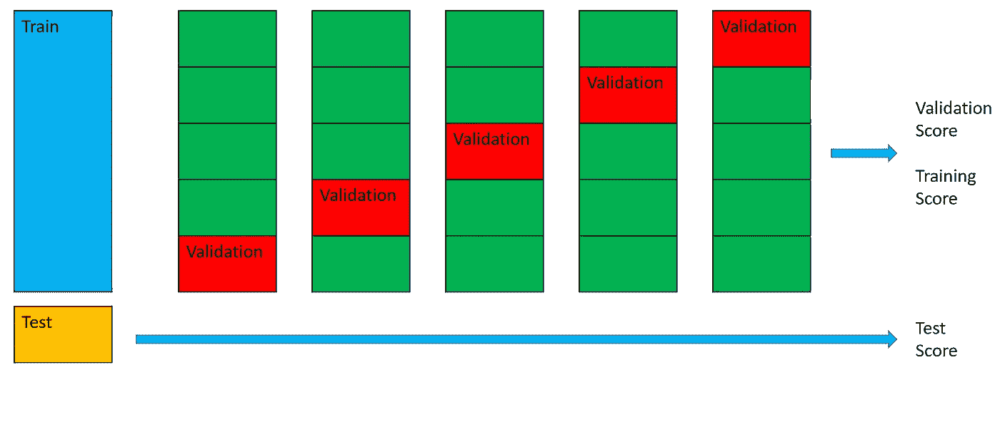

# 机器学习中的训练、验证和测试集

> 原文：<https://medium.com/analytics-vidhya/training-validation-and-test-set-in-machine-learning-7fab555c1080?source=collection_archive---------8----------------------->

## 为什么我们需要他们三个？

如果我们考虑机器学习模型做什么，我们可以看到它的主要工作是如何找到控制输入和输出之间关系的规则。一旦发现这些规则，想法是将它们应用到新的数据，并对它们的相关输出进行预测。