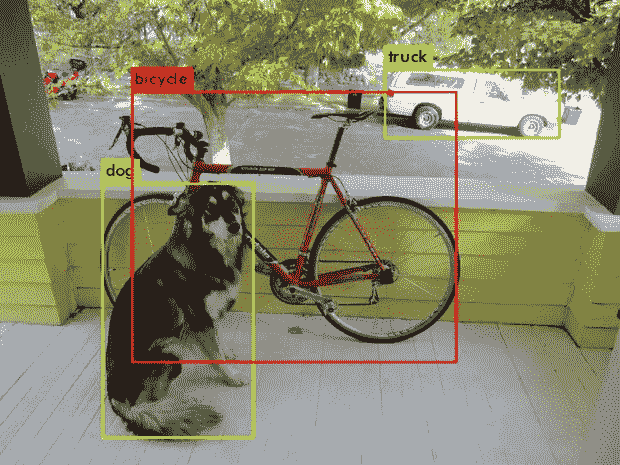
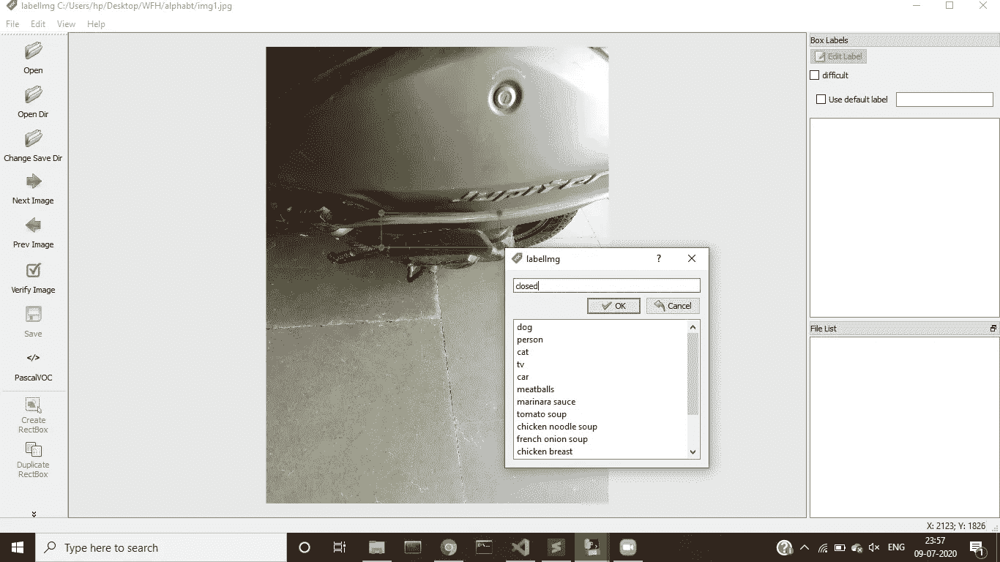

# 用 keras 训练 YOLO

> 原文：<https://medium.com/analytics-vidhya/training-yolo-with-keras-85c33cdefe21?source=collection_archive---------5----------------------->



由于其快速和实时检测物体的能力，YOLO 在执行物体检测方面正得到广泛的欢迎。现在，训练自定义检测是可能的，它可以按照他们的官方 [github](https://github.com/pjreddie/darknet) 链接中给出的那样执行。但是，因为没有多少人想在不知道自己在做什么的情况下直接训练它。因此，我们将为此使用 keras。

如果直接想看实现，切换到[https://github . com/ashishgusain 17/via _ Google _ colab/blob/master/keras _ yolo . ipynb](https://github.com/AshishGusain17/via_google_colab/blob/master/keras_yolo.ipynb)

首先，我们将准备我们的数据集。我要检测摩托车的脚踏板是否关闭。我把所有的照片都保存在一个名为“我的照片”的文件夹里。因为这些图像大小不同。让我们把它修好。下面是一个小脚本，它将转换所有尺寸(624*832*3)的图像，并存储在“small_images”文件夹中。

```
import os
import cv2
def prep_small_images():
   myimages = os.path.join(os.getcwd(),”myimages”)
   print(myimages)
   for img in os.listdir(myimages):
      image_path = cv2.imread(os.path.join(myimages,img))
      image_path = cv2.resize(image_path,(624,832))
      print(image_path.shape)
      cv2.imwrite(os.path.join(os.getcwd(),"small_images",img),
                  image_path)prep_small_images():
```

现在，我们必须在脚凳关闭的情况下标记所有图像。我只是用一个单独的类来执行此操作，即“关闭”。您可以在工作中使用多个类。下载[标签](https://github.com/tzutalin/labelImg)，这是一个给图像加标签的工具包。



点击打开目录，选择“小图片”文件夹。他们有两个选项来标记图像帕斯卡沃克和 YOLO，选择 YOLO。单击创建矩形框并为您的对象绘制一个框。输入对象的标签。对所有图像都这样做。
现在，它们将是为每个图像创建的带有边界框信息的各种 txt 文件。运行下面的脚本，为你所有的注释和图片路径准备一个 txt 文件。

```
def prep_train_txt():
   width = 624
   height = 832
   small_images = os.path.join(os.getcwd(),”small_images”)
   file_object = open(‘train.txt’, ‘a’) for img in os.listdir(small_images):
      if img[-3:] == ‘txt’:
         with open(os.path.join(small_images,img)) as f:
            lines = f.readlines()
            ans = lines[0]
            line = ans.split(“ “)
            x1 , y1 , w , h = float(line[1]) , 
                              float(line[2]) ,      
                              float(line[3]) , 
                              float(line[4][:-1])
            x1 , y1 , w , h = x1 — w/2 , y1-h/2 , w , h
            x1 , y1 , w , h = int(x1*width) , 
                             int(y1*height) ,  
                             int(w*width) , 
                             int(h*height)
            nameee = img[:-3] + “jpg”
            img_name = os.path.join(“small_images” , nameee)
            img_name = cv2.imread(img_name)
            text = “small_images/” + nameee + “ “ + str(x1) + 
                  “,” +  str(y1) + “,” + str(x1+w) + “,” + 
                  str(y1+h) + “,” + str(0) + “\n”
            file_object.write(text)
prep_train_txt()
```

记住，我在每个图像中只有一个边界框。如果您有多个盒子，可能需要对上面的脚本进行一些修改。

此外，当您完成对象注释时，会创建一个单独的 txt 文件，其中包含所有标签名称。将其重命名为“my_classes.txt”。有了这个，我们所有的文件和数据都准备好了。

从现在开始的需求:
# Keras 2 . 1 . 5
# tensor flow 1 . 6 . 0
从头实现完整的模型是一个有点忙乱和耗时的过程，所以我们将使用 Keras 中已经创建的 yolo 模型。原始重量可以从这个[链接](https://pjreddie.com/darknet/yolo/)下载。将这些重量存储在 keras-yolo3 文件夹中。现在，运行下面的命令。这将创建模型架构，您可以看到完整的模型概要。

```
git clone [https://github.com/qqwweee/keras-yolo3](https://github.com/qqwweee/keras-yolo3)
cd keras-yolo3
python convert.py yolov3.cfg yolov3.weights model_data/yolo_weights.h5
```

它们的一些功能将根据。只是复制它们。这些不需要改变。

```
**import** **numpy** **as** **np**
**import** **keras.backend** **as** **K**
**from** **keras.layers** **import** Input, Lambda
**from** **keras.models** **import** Model
**from** **keras.optimizers** **import** Adam
**from** **keras.callbacks** **import** TensorBoard, ModelCheckpoint, ReduceLROnPlateau, EarlyStopping
**from** **yolo3.model** **import** preprocess_true_boxes, yolo_body, tiny_yolo_body, yolo_loss
**from** **yolo3.utils** **import** get_random_data

**def** get_classes(classes_path):
    **with** open(classes_path) **as** f:
        class_names = f.readlines()
    class_names = [c.strip() **for** c **in** class_names]
    **return** class_names

**def** get_anchors(anchors_path):
    **with** open(anchors_path) **as** f:
        anchors = f.readline()
    anchors = [float(x) **for** x **in** anchors.split(',')]
    **return** np.array(anchors).reshape(-1, 2)

**def** create_model(input_shape, anchors, num_classes,  
load_pretrained=**True**, freeze_body=2,
            weights_path='model_data/yolo_weights.h5'):
    K.clear_session() *# get a new session*
    image_input = Input(shape=(**None**, **None**, 3))
    h, w = input_shape
    num_anchors = len(anchors)

    y_true = [Input(shape=(h//{0:32, 1:16, 2:8}[l], w//{0:32, 1:16, 2:8}[l], \
        num_anchors//3, num_classes+5)) **for** l **in** range(3)]

    model_body = yolo_body(image_input, num_anchors//3, num_classes)
    print('Create YOLOv3 model with **{}** anchors and **{}** classes.'.format(num_anchors, num_classes))

    **if** load_pretrained:
        model_body.load_weights(weights_path, by_name=**True**, skip_mismatch=**True**)
        print('Load weights **{}**.'.format(weights_path))
        **if** freeze_body **in** [1, 2]:
            *# Freeze darknet53 body or freeze all but 3 output layers.*
            num = (185, len(model_body.layers)-3)[freeze_body-1]
            **for** i **in** range(num): model_body.layers[i].trainable = **False**
            print('Freeze the first **{}** layers of total **{}** layers.'.format(num, len(model_body.layers)))

    model_loss = Lambda(yolo_loss, output_shape=(1,), name='yolo_loss',
        arguments={'anchors': anchors, 'num_classes': num_classes, 'ignore_thresh': 0.5})(
        [*model_body.output, *y_true])
    model = Model([model_body.input, *y_true], model_loss)

    **return** model

**def** data_generator(annotation_lines, batch_size, input_shape, anchors, num_classes):
    *'''data generator for fit_generator'''*
    n = len(annotation_lines)
    i = 0
    **while** **True**:
        image_data = []
        box_data = []
        **for** b **in** range(batch_size):
            **if** i==0:
                np.random.shuffle(annotation_lines)
            image, box = get_random_data(annotation_lines[i], input_shape, random=**True**)
            image_data.append(image)
            box_data.append(box)
            i = (i+1) % n
        image_data = np.array(image_data)
        box_data = np.array(box_data)
        y_true = preprocess_true_boxes(box_data, input_shape, anchors, num_classes)
        **yield** [image_data, *y_true], np.zeros(batch_size)

**def** data_generator_wrapper(annotation_lines, batch_size, input_shape, anchors, num_classes):
    n = len(annotation_lines)
    **if** n==0 **or** batch_size<=0: **return** **None**
    **return** data_generator(annotation_lines, batch_size, input_shape, anchors, num_classes)
```

现在运行下面的命令，并确保所有的文件位置提供正确。annotation_path 将具有包含所有注释的 train.txt 文件的文件位置。log_dir 将包含训练后的模型。classes_path 包含包含标签名称的 txt 文件的路径。anchors_path 具有将在训练时使用的锚点。

```
annotation_path = 'train.txt'
log_dir = 'logs/000/'
classes_path = 'my_classes.txt'
anchors_path = 'model_data/yolo_anchors.txt'
class_names = get_classes(classes_path)
num_classes = len(class_names)
anchors = get_anchors(anchors_path)

input_shape = (416,416) *# multiple of 32, hw*

model = create_model(input_shape, anchors, num_classes,freeze_body=2, weights_path='model_data/yolo_weights.h5') *# make sure you know what you freeze*

logging = TensorBoard(log_dir=log_dir)
checkpoint = ModelCheckpoint(log_dir + 'ep**{epoch:03d}**-loss**{loss:.3f}**-val_loss**{val_loss:.3f}**.h5',
    monitor='val_loss', save_weights_only=**True**, save_best_only=**True**, period=3)
reduce_lr = ReduceLROnPlateau(monitor='val_loss', factor=0.1, patience=3, verbose=1)
early_stopping = EarlyStopping(monitor='val_loss', min_delta=0, patience=10, verbose=1)

val_split = 0.1
**with** open(annotation_path) **as** f:
    lines = f.readlines()
np.random.seed(10101)
np.random.shuffle(lines)
np.random.seed(**None**)
num_val = int(len(lines)*val_split)
num_train = len(lines) - num_val
```

有了这个，我们就可以出发了。现在，我们可以编译和训练我们的模型。

```
model.compile(optimizer=Adam(lr=1e-3), loss={
    *# use custom yolo_loss Lambda layer.*
    'yolo_loss': **lambda** y_true, y_pred: y_pred})

batch_size = 32
print('Train on **{}** samples, val on **{}** samples, with batch size **{}**.'.format(num_train, num_val, batch_size))

model.fit_generator(data_generator_wrapper(lines[:num_train], batch_size, input_shape, anchors, num_classes),
        steps_per_epoch=max(1, num_train//batch_size),
        validation_data=data_generator_wrapper(lines[num_train:], batch_size, input_shape, anchors, num_classes),
        validation_steps=max(1, num_val//batch_size),
        epochs=50,
        initial_epoch=0,
        callbacks=[logging, checkpoint])

model.save_weights(log_dir + 'trained_weights_stage_1.h5')
```

每 3 个时期后，不同的模型存储在日志文件夹中。您可以使用它们中任何一个来进行预测。

现在，对于预测，运行下面的命令，你会得到不同的边界框结果。应用**非** - **最大抑制** (NMS)可以检测到物体。

```
python yolo_video.py  --image --input="/content/img1.jpg"
```

这里可以看到[的实现](https://github.com/AshishGusain17/via_google_colab/blob/master/keras_yolo.ipynb)。

你可以通过[邮件](http://ashishgusain12345@gmail.com)、 [linkedIn](https://www.linkedin.com/in/ashish-gusain-257b841a2/) 、 [github](https://github.com/AshishGusain17) 联系我。