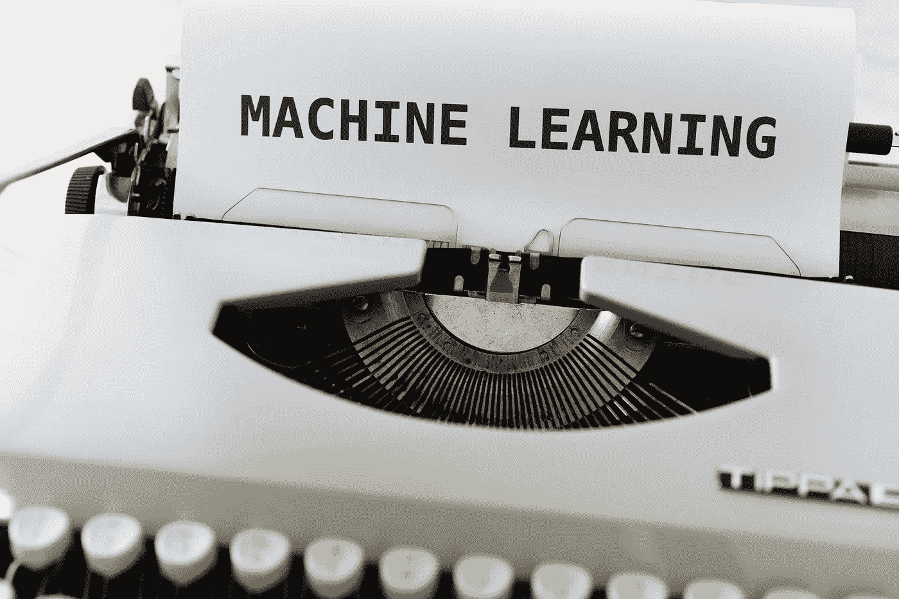
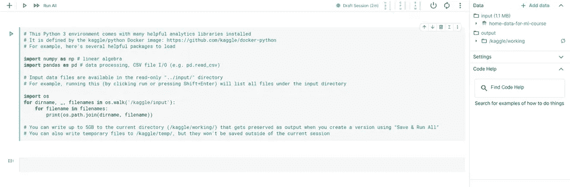
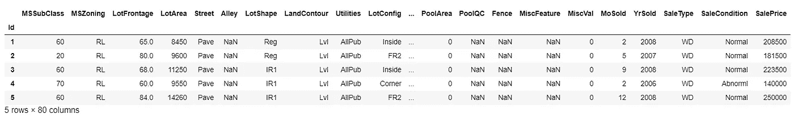
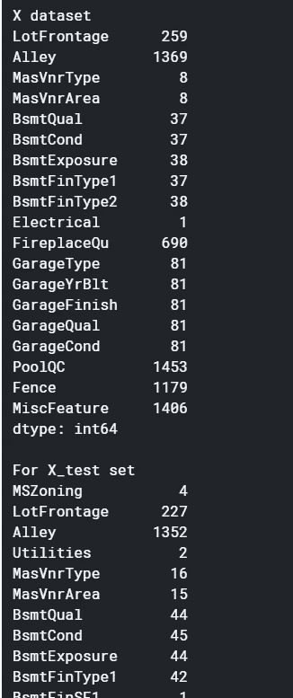
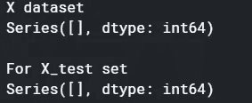
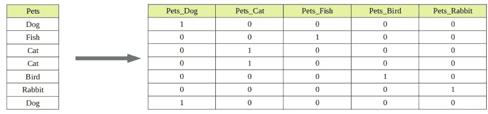

# 用 Python 的 sklearn 训练你的第一个机器学习模型

> 原文：<https://medium.com/analytics-vidhya/training-your-first-machine-learning-model-with-sklearn-e03d5de3bfba?source=collection_archive---------0----------------------->

## 逐步指南

## 本文将指导您完成机器学习模型训练所需的所有步骤，从数据预处理到模型评估！



照片由来自 [Pexels](https://www.pexels.com/photo/working-industry-internet-writing-4578660/?utm_content=attributionCopyText&utm_medium=referral&utm_source=pexels) 的 [Markus Winkler](https://www.pexels.com/@markus-winkler-1430818?utm_content=attributionCopyText&utm_medium=referral&utm_source=pexels) 拍摄

**机器学习**是教计算机使用过去看到的数据(对新的未知数据)进行预测。机器学习包括基于训练数据建立模型，对其他未知数据进行预测。
机器学习的一些应用:推荐系统(例如，根据一个用户看过和喜欢的电影向他推荐新电影)，股票市场(预测股票的走势)，虚拟个人助理等。

机器学习通常分为三类:监督学习、非监督学习和强化学习。
本教程将专注于使用**监督学习**训练一个机器学习模型。
在监督学习中，我们对包含输入(特征)和输出(目标)的数据训练计算机，目标是学习将输入映射到输出的函数。
你可以在这里阅读更多关于机器学习方法的信息[。](https://en.wikipedia.org/wiki/Machine_learning#Machine_learning_approaches)

> 对于本教程，我们将使用 Python 的 [sklearn](https://scikit-learn.org/stable/) 库(sklearn 是一个机器学习库，它包含各种机器学习算法的实现)和 [Kaggle 的房价预测数据集](https://www.kaggle.com/c/home-data-for-ml-course)。

考虑到你已经了解了机器学习和监督学习的基础知识，那就从我们的机器学习模型开始吧！

我们先在 Kaggle 上新建一个笔记本。
登录你的 Kaggle 账号，进入[房价竞赛笔记本版块](https://www.kaggle.com/c/home-data-for-ml-course/notebooks)。
点击‘新建笔记本’选项。它会将您重定向到笔记本设置页面。
保留所有默认设置，然后点击“创建”。

你现在应该有一个新的笔记本，如下图所示。
(删除给定的默认代码块)



> 我已经做了一个包含所有相关步骤和代码的笔记本。
> 你可以在 Kaggle 上访问[笔记本](https://www.kaggle.com/nisargkapkar/basic-ml-model)。

## **步骤 1-导入必要的库/函数**

让我们导入所有我们需要的库和函数。

```
*#Import necessary libraries/functions***import pandas as pd
import numpy as np
from sklearn.model_selection import train_test_split
from sklearn.impute import SimpleImputer
from sklearn.preprocessing import OneHotEncoder
from sklearn.ensemble import RandomForestRegressor
from sklearn.metrics import mean_absolute_error**
```

后续步骤中提供了每个功能的说明和文档链接。

## **步骤 2-加载数据**

右上角应该有一个箭头符号，点击它将打开一个新的面板。该面板显示输入数据的详细信息。

点击'**ml 课程主页数据**，然后点击' **train.csv** '。点击“train.csv”将打开一个新面板。面板显示路径和存储在' train.csv'
中的数据将' **train.csv** 数据存储在' **X dataset** '
中，同样，将' **test.csv** 数据存储在' **X_test dataset** 中

```
*#Load the data**#read train.csv and store it in 'X'* **X=pd.read_csv('../input/home-data-for-ml-course/train.csv',index_col='Id')***#read test.csv and store it in 'X_test'*
**X_test=pd.read_csv('../input/home-data-for-ml-course/test.csv',index_col='Id')**
```

顾名思义， **read_csv** 用于读取逗号分隔值(csv)文件。你可以在这里阅读更多关于功能[的内容](https://pandas.pydata.org/pandas-docs/stable/reference/api/pandas.read_csv.html)。

## **步骤 3-检查数据**

在继续下一步之前，让我们检查一下数据。

```
*#Examine the data***print(X.shape)
print(X.columns)
print(X.head(n=5))**
```

*   **X.shape** 返回数据帧的尺寸(行数、列数)
*   **X.columns** 返回数据帧的列标签
*   **X.head()** 返回 DataFrame 的前 n 行

同样，您可以检查“X_test”数据集中的数据。

下图显示了“X”数据集的前 5 行(X.head(n=5))



**一些观察:**

*   “X”数据集包含名为“SalePrice”的列，但此列不在“X_test”数据集中。这是因为“销售价格”是我们的目标变量(在步骤 4 中有更多关于目标变量的内容)，我们将预测“X_test”的“销售价格”值。
*   有两种类型的列，包含数字的列(数字列)和包含非数字值的列(分类列)。
*   分类列只接受固定数量的值。
*   有些单元格的值为“NaN”，这些单元格缺少值。(关于步骤 6 中缺失数据的更多信息)

## **步骤 4-分离目标变量**

**一些关键定义:**

*   **特性**:特性基本上就是模型用来做预测的独立列/变量。
*   **目标**:目标是通过预测得到的输出。

在我们的数据库中， **SalePrice** 是 Target，所有其他列是 Features。

通常，真实世界的数据集有很多缺失值。(更多关于步骤 6 中缺失数据的信息)
对于数据集中的某些行，我们的目标值本身可能会缺失。对于这种情况，我们从数据集中删除缺少目标值的行。

```
*#drop rows with missing target values from 'X'***X.dropna(axis=0,subset=['SalePrice'],inplace=True)**
```

**dropna()** 是熊猫才有的功能。它用于删除具有 NaN(或 Null)值的行/列。
你可以在这里阅读更多关于功能及其参数[。](https://pandas.pydata.org/pandas-docs/stable/reference/api/pandas.DataFrame.dropna.html)

放下后，我们会将目标与其他特征分开。
我们将把目标存储在' **y** '中，然后从数据集中删除目标列。

```
*#Store target in 'y' and drop the target column from 'X'***y=X.SalePrice
X.drop(['SalePrice'],axis=1,inplace=True)
print(y)**
```

**drop()** 是熊猫才有的功能。它用于删除行和列。
您可以在这里阅读更多关于函数及其参数[的信息。](https://pandas.pydata.org/pandas-docs/stable/reference/api/pandas.DataFrame.drop.html)

## **步骤 5-提取分类和数字列**

我们看到数据集中存在两种类型的列:数字列和分类列。

让我们首先来看看分类列的基数(一列中唯一值的数量)。

```
*#print categorical column labels with cardinality***for i in X.columns:
    if X[i].dtype=="object":
        print(i,X[i].nunique(),sep=' ')**
```

上面的代码打印带有相应基数的分类列标签。( [**nunique()**](https://pandas.pydata.org/pandas-docs/stable/reference/api/pandas.DataFrame.nunique.html) 用于计算非重复值)

我们将把列标签分为 3 个部分:分类列、删除列、数字列

```
*#Divide columns in 3 parts: categorical_columns, numerical_columns and columns_to_drop***categorical_columns=[]
numerical_columns=[]
columns_to_drop=[]****for i in X.columns:
    if X[i].nunique()<15 and X[i].dtype=="object":
        categorical_columns.append(i)
    elif X[i].nunique()>=15 and X[i].dtype=="object":
        columns_to_drop.append(i)
    elif X[i].dtype in ["int64","float64"]:
        numerical_columns.append(i)

print(categorical_columns)
print(columns_to_drop)
print(numerical_columns)**
```

*   **categorial _ columns**是一个包含所有非数字值且基数小于 15 的列标签的列表。
*   **numeric _ columns**是包含所有带数值的列标签的列表。
*   **columns_to_drop** 是一个列表，包含所有非数字值且基数大于或等于 15 的列标签。

```
*#drop 'columns_to_drop' from 'X' and 'X_test'***X=X.drop(columns_to_drop,axis=1)
X_test=X_test.drop(columns_to_drop,axis=1)**
```

上述代码将从“X”和“X_test”数据集中删除基数大于或等于 15 的所有分类列。

为什么我们在步骤 7 中选择基数小于 15 的分类列并删除其他分类列的解释

## **步骤 6-估算缺失数据**

真实世界的数据集可能包含许多缺失值(NaN，Null)。数据丢失的原因有很多。例如，没有“车库”的房子不会有“车库质量”数据(因为房子里没有车库)

如果我们尝试对包含缺失值的数据训练模型，Scikit-learn (sklearn)将抛出错误。因此，我们需要在训练模型之前估算(填充/替换)缺失值。

在输入之前，让我们检查有多少单元格包含一个缺失值！

```
*#optional
#print column labels with number of missing cells in that corresponding column**#for X dataset*
**missing_columns=X.isnull().sum()
print("X dataset")
print(missing_columns[missing_columns>0])****print()***#for X_test*
**missing_columns_test=X_test.isnull().sum()
print("For X_test set")
print(missing_columns_test[missing_columns_test>0])**
```

代码打印相应列中缺少单元格的列标签。



我们将首先估算数字列

```
*#impute numerical_columns*
**numerical_imputer=SimpleImputer()***#for X*
**for i in numerical_columns:
    current_column=np.array(X[i]).reshape(-1,1)
    updated_column=numerical_imputer.fit_transform(current_column)
    X[i]=updated_column***#for X_test*
**for i in numerical_columns:
    current_column=np.array(X_test[i]).reshape(-1,1)
    updated_column=numerical_imputer.fit_transform(current_column)
    X_test[i]=updated_column**
```

对于输入，我们使用了 sklearn 中提供的内置输入器(**simple import()**)

这个估算器将用某一列值的**平均值**替换该列中所有缺失的值。
更多关于简单估算器[的细节在这里](https://scikit-learn.org/stable/modules/generated/sklearn.impute.SimpleImputer.html)。

我们迭代所有数值列(对于‘X’和‘X _ test’数据集),并将它们存储在 np.array (current_column)
我们的输入方法(numerical _ imputer.fit _ transform)需要一个 2D 数组，因此我们使用 shape(-1，1)将我们的 1D 数组转换为 2D 数组。
我们将最后一列(带有估算值)存储在‘updated _ column’中，最后，我们用获得的‘updated _ column’替换数据集中的相应列

类似地，我们将估算分类列

```
*#impute categorical_columns*
**categorical_imputer=SimpleImputer(strategy="most_frequent")***#for X*
**for i in categorical_columns:
    current_column=np.array(X[i]).reshape(-1,1)
    updated_column=categorical_imputer.fit_transform(current_column)
    X[i]=updated_column***#for X_test*
**for i in categorical_columns:
    current_column=np.array(X_test[i]).reshape(-1,1)
    updated_column=categorical_imputer.fit_transform(current_column)
    X_test[i]=updated_column**
```

这里，我们用特定列的**最频繁的**值替换该列中缺失的值。

现在，让我们重新检查丢失细胞的数量！

```
*#optional
#print column labels with number of missing cells in that corresponding column**#for X dataset*
**missing_columns=X.isnull().sum()
print("X dataset")
print(missing_columns[missing_columns>0])****print()***#for X_test*
**missing_columns_test=X_test.isnull().sum()
print("For X_test set")
print(missing_columns_test[missing_columns_test>0])***#after imputation, there would be no columns with missing data*
```

您应该会看到类似下图所示的输出。



## **步骤 7-对分类列进行编码**

分类列采用固定数量的值。例如，列“宠物”将包含一些固定数量的值，例如猫、狗、鸟等。

在机器学习模型中使用这些类型的列之前，我们需要对它们进行预处理(编码),否则将会抛出错误。

我们将使用 sklearn 中提供的内置 **OneHotEncoder** 。

OneHotEncoder 为要编码的列中的每个唯一值创建一个新的布尔列。

考虑一个名为“pets”的列，它包含 5 个唯一值[“Cat”、“Dog”、“Bird”、“Fish”、“Rabbit”]。
应用 OneHotEncoding 后，我们将得到 5 个新列



一键编码的一个缺点是它会增加数据集的大小。
对于上述示例，我们有 35–7 = 28 个新单元(35 个新布尔单元—我们将删除 7 个原始单元)
现在考虑一个 1000 行的数据集，其中有 50 个分类列，每个分类列的基数是 30。
所以，我们每个分类列，我们将有 1000 * 30–1000 = 29000 个新单元格。
对于所有 50 个分类列，29000*50 个新单元格

这就是我们在步骤 5 中删除基数大于/等于的分类列的原因

```
*#Encode categorical columns**#STEPS:
#get one-hot encoded columns for X and X_test (using fit_transform/transform)
#give names to one-hot encoded columns (using get_feature_names)
#drop categorical columns from X and X_test (using drop)
#oh encoding removes index, add back index (using .index)
#add one-hot encoded columns to X and X_test (using pd.concat)***ohencoder=OneHotEncoder(handle_unknown='ignore',sparse=False)***#for X*
**ohe_X=pd.DataFrame(ohencoder.fit_transform(X[categorical_columns]))
ohe_X.columns=ohencoder.get_feature_names(categorical_columns)
X.drop(categorical_columns,axis=1,inplace=True)
ohe_X.index=X.index
X=pd.concat([X,ohe_X],axis=1)***#for X_test*
**ohe_X_test=pd.DataFrame(ohencoder.transform(X_test[categorical_columns]))
ohe_X_test.columns=ohencoder.get_feature_names(categorical_columns)
X_test.drop(categorical_columns,axis=1,inplace=True)
ohe_X_test.index=X_test.index
X_test=pd.concat([X_test,ohe_X_test],axis=1)**
```

OneHotEncoder 是 sklearn 中的内置函数。

有时，该验证集可能包含一些定型数据中不存在的分类特征，默认情况下，当遇到此类特征时，OneHotEncoder 将引发错误。
为了避免错误，我们将 **handle_unknown** 参数设置为‘忽略’。现在，如果遇到未知特性，该特性的独热编码列将全为零。

更多关于 OneHotEncoder [的细节请点击](https://scikit-learn.org/stable/modules/generated/sklearn.preprocessing.OneHotEncoder.html)。

“oh_X”和“oh_X_test”分别包含“X”和“X_test”数据集的一键编码列。

默认情况下，one-hot 编码列的名称为 1、2、3…为了获得基于特征值的列名，我们使用了 **get_feature_names** 函数。
OneHot 编码删除了索引，所以我们添加回索引。

接下来，我们从 X 和 X_test 数据集中删除分类列。
然后，我们连接(使用 Pandas 内置的 [**Concat 函数**](https://pandas.pydata.org/pandas-docs/stable/reference/api/pandas.concat.html) )数据集“X”和“X_test”以及它们的独热编码列。(' oh_X '和' oh_X_test ')

**注意:** 我们对‘oh _ X’使用了 **fit_transform** ，对‘oh _ X _ test’使用了 **transform** 。你可以在这里阅读 fit_transform 和 transform [的区别。](https://stackoverflow.com/questions/23838056/what-is-the-difference-between-transform-and-fit-transform-in-sklearn)

## **步骤 8-将数据集分成训练集和验证集**

三种类型的数据集通常用于模型训练的不同阶段:训练集、验证集和测试集。

你可以在这里阅读更多关于这些类型的数据集[。](https://en.wikipedia.org/wiki/Training,_validation,_and_test_sets)

我们已经有了我们的测试集(X_test)。

我们将把“X”数据集分成两部分:训练集和验证集。

```
*#Split Dataset in train and validation set***X_train,X_valid,y_train,y_valid=train_test_split(X,y,train_size=0.8,test_size=0.2)**
```

( **X_train** ， **y_train** )分别是**训练**设定的特性和目标。( **X_valid** ， **y_valid** )分别是**验证**设定的特性和目标。

我们将数据集的 0.8%用于训练集，剩余的 0.2%用于验证集。

关于 **train_test_split** 功能[的更多细节请点击](https://scikit-learn.org/stable/modules/generated/sklearn.model_selection.train_test_split.html)。

## **步骤 9-定义模型**

我们将使用随机森林作为我们的机器学习模型。

随机森林构建多个**决策树**并合并它们的输出以提供更准确的预测。

我建议在继续下一步之前，阅读并理解[决策树](https://www.javatpoint.com/machine-learning-decision-tree-classification-algorithm)和[随机森林](https://en.wikipedia.org/wiki/Random_forest)。

我们将使用 sklearn 中内置的[**RandomForestRegressor**](https://scikit-learn.org/stable/modules/generated/sklearn.ensemble.RandomForestRegressor.html)函数。

```
*#Define the model***model=RandomForestRegressor()**
```

## **步骤 10-拟合模型**

拟合模型基本上意味着根据训练数据训练模型。

我们将使用**。拟合 sklearn 中提供的**方法，以根据训练数据拟合我们的模型。

```
*#Fit the model***model.fit(X_train,y_train)**
```

## **步骤 11-预测并评估验证集**

让我们在验证集上测试我们的训练模型。

```
*#Predict and Evaluate on validation set***preds_valid=model.predict(X_valid)
score_valid=mean_absolute_error(y_valid,preds_valid)
print("MAE: ",score_valid)**
```

**。predict()** 方法(在 sklearn 中可用)将对验证数据进行预测。这些预测存储在' **preds_valid** '中。

我们已经用**[**mean _ absolute _ error**](https://scikit-learn.org/stable/modules/generated/sklearn.metrics.mean_absolute_error.html)(来自 sklearn)估算了我们的预测值(preds_valid)与实际值(y_valid)有多远。**

**我们将误差定义为实际值和预测值之间的差异。(误差=实际值-预测值)**

**MAE (mean_absolute_error)取每行的误差绝对值，然后取这些绝对误差的平均值。**

**在上面的代码中，' **score_valid** '存储了我们的 MAE 分数。**

## ****步骤 12-生成测试预测****

```
*#Generate Test Prediction***preds_test=model.predict(X_test)
submission=pd.DataFrame({'Id':X_test.index,'SalePrice':preds_test})
submission.to_csv('submission.csv',index=False)**
```

**我们对测试集(X_test)的预测存储在' **preds_test'** 。**

**然后我们制作一个 DataFrame(带有 Id 和 SalePrice(我们预测的销售价格)列)并将其转换为. csv。csv 将用于 Kaggle 竞赛评估。**

****提交您在 Kaggle 竞赛中的预测:****

*   **点击保存版本(蓝色按钮，右上角)并选择“保存并运行全部”选项，然后点击保存。**
*   **保存后，点击保存按钮旁边的数字。**
*   **一个新的窗口将会打开，您应该在右侧看到版本历史面板。单击版本 1 旁边的省略号(…)按钮。**
*   **点击“提交竞争”选项。**

**您可以查看您的提交，并查看您的分数(测试集的 MAE)和在排行榜上的位置。**

## ****奖金部分****

**恭喜你训练了你的第一个机器学习模型！
想要降低你的 MAE 并提高你在排行榜上的排名吗？这里有几样东西你可以试试！**

*   **使用不同型号进行测试(如 [XGBoost](https://xgboost.readthedocs.io/en/latest/) 、 [LightGBM](https://lightgbm.readthedocs.io/en/latest/) 等。)并查看哪个模型提供了更好的准确性。**
*   **[特征工程](https://en.wikipedia.org/wiki/Feature_engineering#:~:text=Feature%20engineering%20is%20the%20process,as%20applied%20machine%20learning%20itself.)(从现有数据中提取附加特征)和[特征选择](https://en.wikipedia.org/wiki/Feature_selection)(选择用于模型训练的最佳特征子集)**
*   **尝试对缺失数据使用各种插补方法。SimpleImputer 可以用均值、中值、众数和常数来估算缺失数据。你也可以尝试使用 [KNNImputer](https://scikit-learn.org/stable/modules/generated/sklearn.impute.KNNImputer.html) 输入。**
*   **[超参数调整](https://en.wikipedia.org/wiki/Hyperparameter_optimization)(参考各型号的文档，了解更多关于其超参数的信息)。Sklearn learn 有一个内置函数( [GridSearchCV](https://scikit-learn.org/stable/modules/generated/sklearn.model_selection.GridSearchCV.html) )，您可以使用它来搜索最佳超参数。(您也可以使用一个简单的循环来搜索最佳超参数)**
*   **[集成学习](https://en.wikipedia.org/wiki/Ensemble_learning)(集成是一种结合多种机器学习算法以获得更好预测的技术)。你可以在这里阅读更多关于 sklearn 集成方法的内置模块[。](https://scikit-learn.org/stable/modules/ensemble.html)**