# 使用 Mask R-CNN 训练您自己的数据集以检测多个类别

> 原文：<https://medium.com/analytics-vidhya/training-your-own-data-set-using-mask-r-cnn-for-detecting-multiple-classes-3960ada85079?source=collection_archive---------0----------------------->

掩模 R-CNN 是用于对象检测和分割的流行模型。

图像分类有四种主要/基本类型:

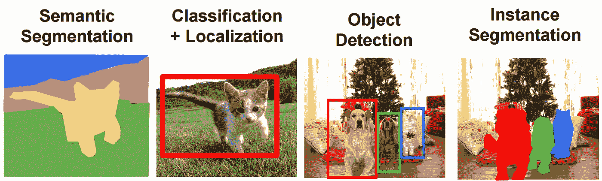

图片本身不言自明，现在我们正在处理实例分割[图片鸣谢:Slide 19[http://cs 231n . Stanford . edu/slides/2017/cs 231n _ 2017 _ lecture 11 . pdf](http://cs231n.stanford.edu/slides/2017/cs231n_2017_lecture11.pdf)]

# ***目标***

训练模型，使其能够区分(屏蔽)图像中的不同类别(如猫、狗、汽车等)，同时精确屏蔽每个类别。

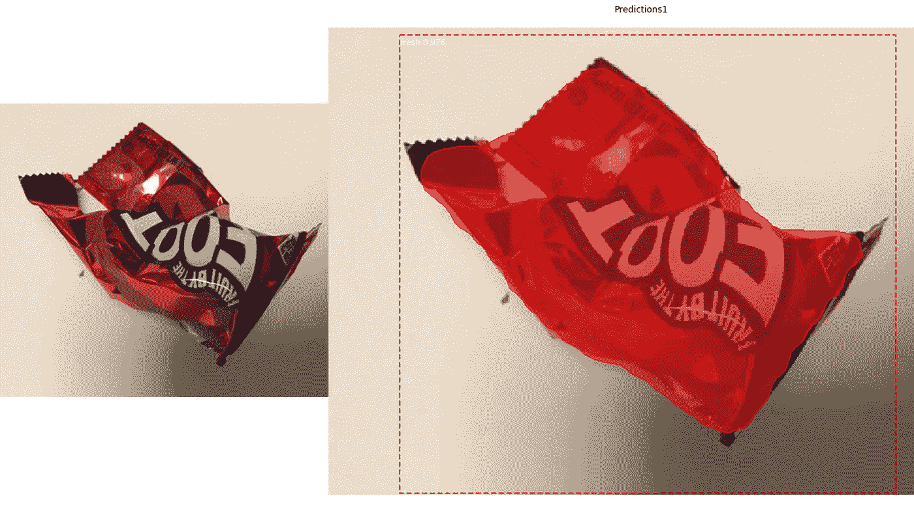

这是它实际上的样子

从头开始，第一步是注释我们的数据集，接下来是训练模型，接下来是使用结果权重来预测/分割图像中的类。

# ***让我们潜入***

*   首先打开注释器[[https://www.robots.ox.ac.uk/~vgg/software/via/via_demo.html](https://www.robots.ox.ac.uk/~vgg/software/via/via_demo.html)]，
*   通过选择**项目**->-**添加本地文件来加载图像。**
*   标记所有图像后，导出注释(作为 json)。
*   我们正在使用最新版本的 VGG 在线工具。

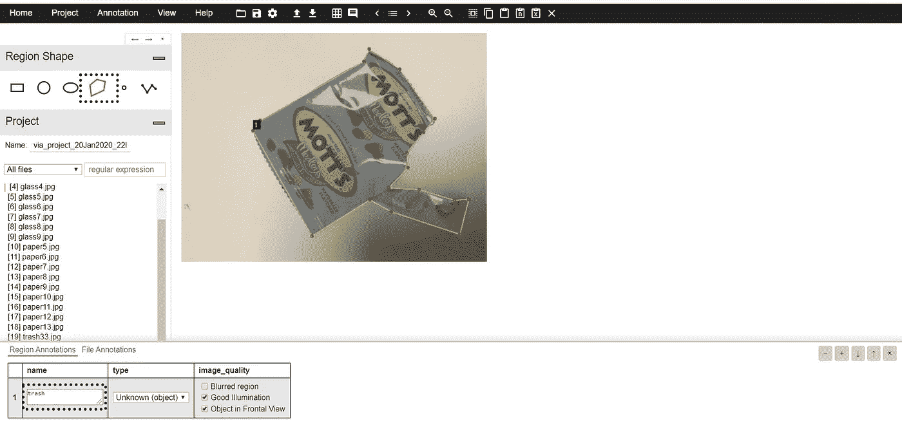

确保您选择了多边形工具，对于其他工具，请更新与该工具对应的代码

将图像分离到两个文件夹中，用于训练(train)和验证(val)，理想情况下比例为 3:2。项目结构应该如下所示:

```
Project
|-- logs (created after training)
|   `-- weights.h5
`-- main
    |-- dataset
    |   |-- train
    |   `-- val
    `-- Mask_RCNN
        |-- train.py
        |-- .gitignore
        |-- LICENCE
        `-- etc..
```

由于谷歌 colab，它免费提供 13GB 的 GPU，可以连续使用 12 小时(谷歌通过提供免费资源将 ML 领域推向了一个新的水平👏🏻👏🏻).

现在无缘无故的，给你一句让人大开眼界的台词——“*有些人有命；有些人有面具*，你知道谁有这两样吗😉。

上面的 Mask_RCNN 文件夹是 GitHub 中的下载 zip 文件选项:[https://github.com/matterport/Mask_RCNN](https://github.com/matterport/Mask_RCNN)，对于 **train.py** 文件和 **model.ipynb** 文件参考我的 GitHub:[https://GitHub . com/SriRamGovardhanam/wastedata-Mask _ RCNN-multiple-classes](https://github.com/SriRamGovardhanam/wastedata-Mask_RCNN-multiple-classes)

我对 Mask _ RCNN/samples/balloon/balloon . py 中可用的实际代码做了一些修改。

在**配置**部分，根据需求
NUM_CLASSES = 1 + 4 #背景+类别数改变类别数

在**数据集**部分，修改现有代码如下

```
class CustomDataset(utils.Dataset):def load_custom(self, dataset_dir, subset) #Add classes as per your requirement and order
        self.add_class('object', 1, 'bottle')
        self.add_class('object', 2, 'glass')
        self.add_class('object', 3, 'paper')
        self.add_class('object', 4, 'trash')assert subset in ['train', 'val']
        dataset_dir = os.path.join(dataset_dir, subset)
annotations = json.load(open(os.path.join(dataset_dir,
                                 'via_region_data.json')))
annotations = list(annotations.values()) 
annotations = [a for a in annotations if a['regions']]
for a in annotations:
            polygons = [r['shape_attributes'] for r in a['regions']]
            objects = [s['region_attributes'] for s in a['regions']]
            num_ids = []
            for n in objects:
                print one
                print n
                try:
                    if n['object'] == 'bottle':
                        num_ids.append(1)
                    elif n['object'] == 'glass':
                        num_ids.append(2)
                    elif n['object'] == 'paper':
                        num_ids.append(3)
                    elif n['object'] == 'trash':
                        num_ids.append(4)
                except:
                    passimage_path = os.path.join(dataset_dir, a['filename'])
            image = skimage.io.imread(image_path)
            (height, width) = image.shape[:2]self.add_image(  
                'object',
                image_id=a['filename'],
                path=image_path,
                width=width,
                height=height,
                polygons=polygons,
                num_ids=num_ids,
                )# also change the return value of def load_mask()num_ids = np.array(num_ids, dtype=np.int32)
return mask, num_ids
```

经过这些改变后，我们现在能够训练多个类。

打开终端->转到文件 train.py 目录并使用以下命令。

```
python3 train.py train - dataset='dataset path'  weights=coco
```

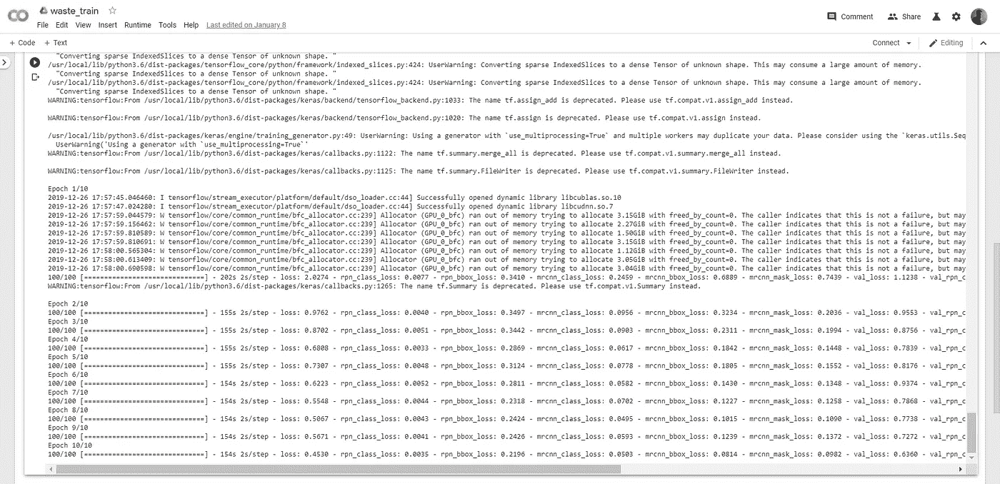

现在我们在日志文件夹中得到每个历元的权重

既然我们已经获得了模型的权重，现在我们检查并在 inspect_model_data.ipynb 文件中保存所需的权重。为此我们需要逃跑。jupyter 笔记本中的 ipynb 文件。所以打开 jupyter 笔记本，在笔记本里仔细更新数据集路径和 weight.h5 路径。

# 结果

这里我们定义了 4 个类:

*   瓶子
*   玻璃
*   纸
*   废物

以下是模型准确性的示例

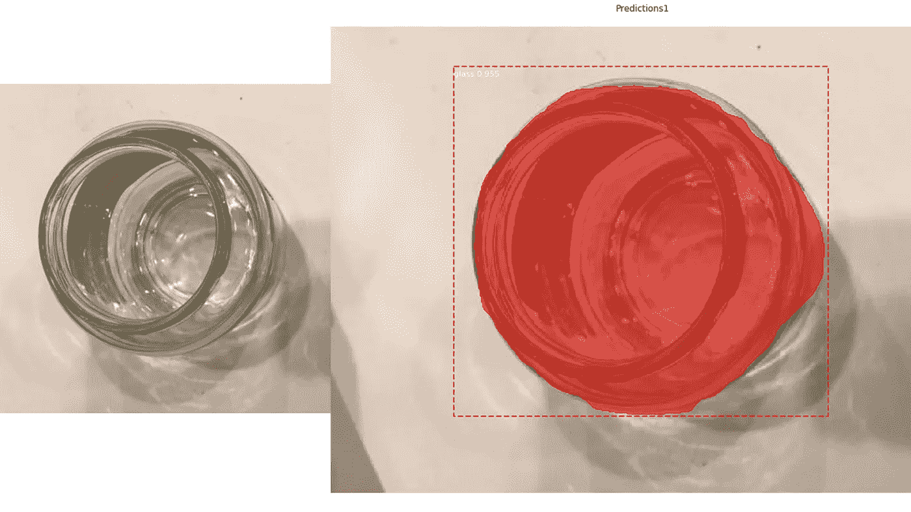

玻璃预测

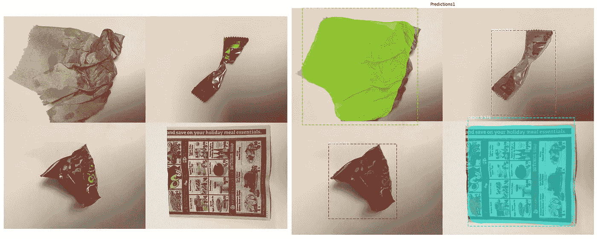

左边是不同类的输入，输入图片本身就是一个拼贴画

由于我们只是对 matter port 的 mask-rcnn 的原始代码做了一点调整，它确实具有所有的逐步检测功能

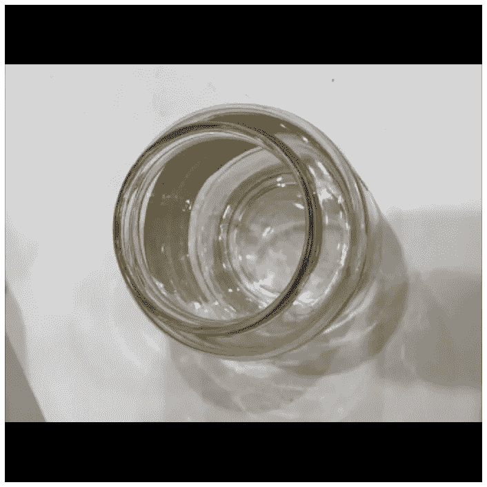

彩色飞溅

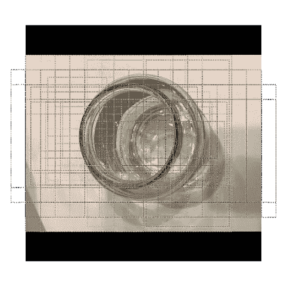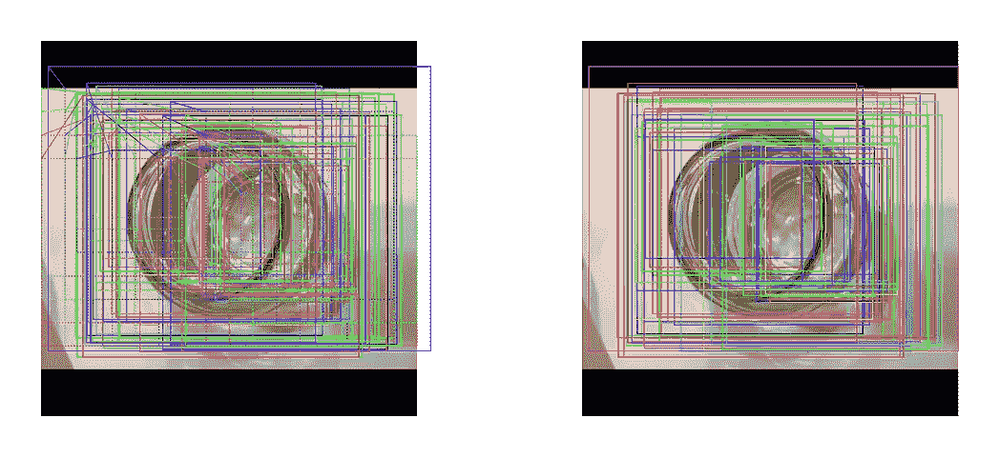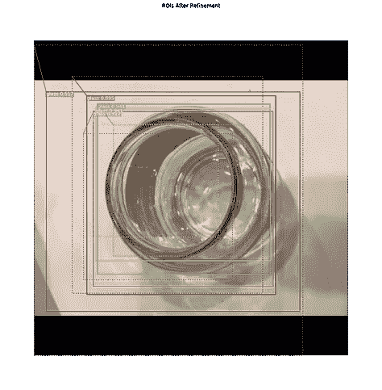

锚排序和过滤

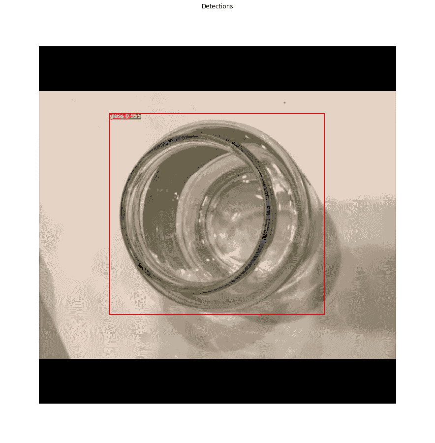

包围盒预测

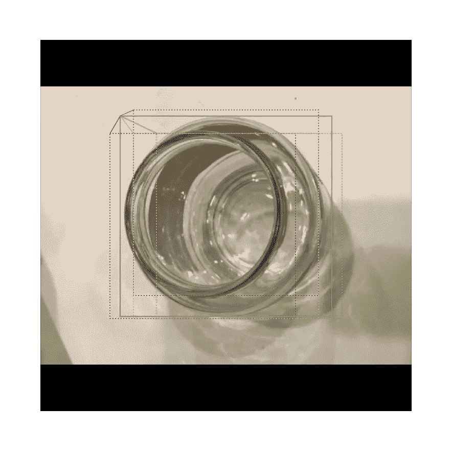

玻璃面具和预言

# 密码

代码完整的实现细节可以在[这里](https://github.com/SriRamGovardhanam/wastedata-Mask_RCNN-multiple-classes)找到。

# 结论

我们学习了多个类的像素分割，我希望你理解这篇文章，如果你有任何问题，请在下面评论。蒙版的边缘可以通过增加数据和仔细标记来改善，或者那些哑像素不是周围最亮的像素(糟糕的双关语是眼球转动的方式)。