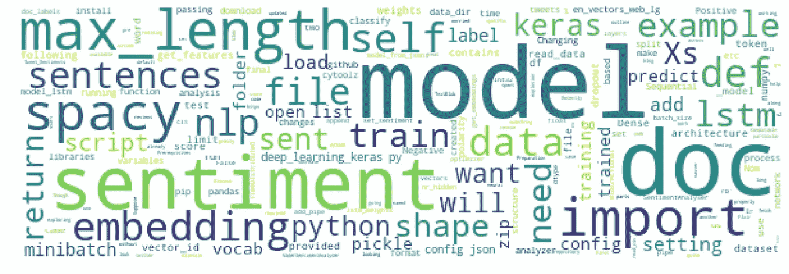
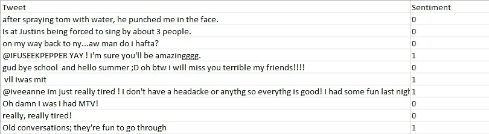
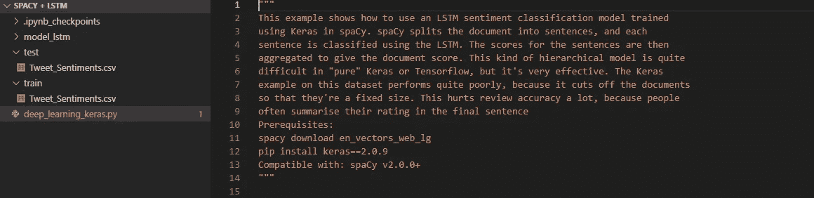
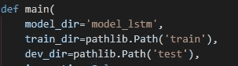
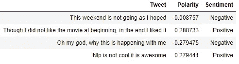

# 用 spaCy 训练你自己的情感分析器

> 原文：<https://medium.com/analytics-vidhya/training-your-own-sentiment-analyzer-with-spacy-9b924df1514c?source=collection_archive---------1----------------------->



嗨伙计们！！！在这篇博客中，我将讨论在 spaCy 的帮助下训练一个基于 LSTM 的情感分析器。最近我在做 twitter 情绪分析，为此我花了很长时间探索已经可用的预训练模型。我碰到过的 python 库有 [**TextBlob**](https://textblob.readthedocs.io/en/dev/) **，**[**vadersentimental analyser**](https://www.nltk.org/_modules/nltk/sentiment/vader.html)**，**[**Flair**](https://github.com/zalandoresearch/flair)**等**。虽然这些库工作得很好，但是我们不能根据我们的需要调整它们。我在寻找与我的用例相关的东西。我需要一个模型，这将与我自己的数据集训练。与此同时，我不想担心诸如单词嵌入、网络架构等实质性的细节。斯帕西来救援了。他们提供了一个大纲来训练一个 lstm 模型。我们所需要做的就是用最少的代码修改正确地传递数据。我们开始吧。****

**首先，我们必须从 github 链接下面获取 spaCy 提供的 python 脚本并存储该文件。**

> **[https://github . com/explosion/spaCy/blob/master/examples/deep _ learning _ keras . py](https://github.com/explosion/spaCy/blob/master/examples/deep_learning_keras.py)**

****先决条件:****

```
*pip install spacy**spacy download en_vectors_web_lg 
## en_vectors_web_lg is the pre trained Word Vector Model spaCy is providing**pip install keras==2.0.9**Compatible with: spaCy v2.0.0+*
```

****数据准备****

**如果我们运行 deep_learning_keras.py 文件而不提供任何数据，它将默认下载 imdb reviews 数据集，并使用该数据集训练模型。因为我们想用自定义数据进行训练，所以我们需要处理数据并维护一个特定的文件结构。**

**假设我们的数据是以下格式。其中 1 表示积极情绪，0 表示消极情绪。**

****

**在执行一些基本的预处理(如删除标点符号、特殊字符、URL)后，我们需要将数据分成两部分(训练测试分割)，两部分的名称相同(例如 Tweet _ 情操. csv)，一部分位于**训练**文件夹，另一部分位于**测试**文件夹。我们还必须创建一个文件夹来存储最终的模型权重(这里是 **model_lstm)。****

****

**一旦创建了这个文件夹结构，我们必须对 deep_learning_keras.py 文件进行一些更改。**

****改变 read_data()函数****

**因为我们将 csv 文件作为训练和测试文件传递，所以我们需要对 read_data 格式进行一些更改。我们更新后的代码如下所示**

```
def  read_data(data_dir, limit=0): dataset=pd.read_csv(data_dir / 'Tweet_Sentiments.csv') tweets = dataset['Tweet'] sentiments = dataset['Sentiment'] example=zip(tweets,sentiments) example=list(example) if limit >= 1: example = example[:limit] return zip(*example) ## This would unzip into two lists
```

****设置一些变量****

**在运行脚本之前，我们需要在 main 函数中设置一些变量。那些是**列车 _ 方向**、**开发 _ 方向**、**模型 _ 方向****

****

****导入熊猫:**由于我们在这里处理数据帧，我们应该在 python 文件的开头添加“导入熊猫”。**

****运行脚本:****

**现在我们已经准备好训练 lstm 模型了。我们需要做的就是运行下面的命令。**

```
python deep_learning_keras.py
```

**这可能需要一段时间，具体取决于数据集的大小。一旦训练完成，我们将在 model_lstm 目录中有两个文件，命名为“config.json”和“model”。“config.json”包含了 spaCy 在脚本中提供的 lstm 架构。“模型”是一个 pickle 文件，其中包含最终 lstm 模型的权重。现在我们需要使用这些文件来预测情绪。**

****情绪预测****

**有了“config.json”和“model ”,我们必须使用下面的 python 脚本来预测情绪。(模型将给出极性得分，根据得分，我们可以将文本分为积极或消极情绪)**

```
import plac
import random
import pathlib
import cytoolz
import numpy
from keras.models import Sequential, model_from_json
from keras.layers import LSTM, Dense, Embedding, Bidirectional
from keras.layers import TimeDistributed
from keras.optimizers import Adam
from spacy.compat import pickle
import spacyclass SentimentAnalyser(object):
    [@classmethod](http://twitter.com/classmethod)
    def load(cls, path, nlp, max_length=100):
#         with ("config").open() as file_:
        model = model_from_json(config)
        with open("model",'rb') as file_:
            lstm_weights = pickle.load(file_)
        embeddings = get_embeddings(nlp.vocab)
        model.set_weights([embeddings] + lstm_weights)
        return cls(model, max_length=max_length)def __init__(self, model, max_length=100):
        self._model = model
        self.max_length = max_lengthdef __call__(self, doc):
        X = get_features([doc], self.max_length)
        y = self._model.predict(X)
        self.set_sentiment(doc, y)def pipe(self, docs, batch_size=1000):
        for minibatch in cytoolz.partition_all(batch_size, docs):
            minibatch = list(minibatch)
            sentences = []
            for doc in minibatch:
                sentences.extend(doc.sents)
            Xs = get_features(sentences, self.max_length)
            ys = self._model.predict(Xs)
            for sent, label in zip(sentences, ys):
                sent.doc.sentiment += label - 0.5
            for doc in minibatch:
                yield docdef set_sentiment(self, doc, y):
        doc.sentiment = float(y[0])
        # Sentiment has a native slot for a single float.
        # For arbitrary data storage, there's:
        # doc.user_data['my_data'] = y

def get_labelled_sentences(docs, doc_labels):
    labels = []
    sentences = []
    for doc, y in zip(docs, doc_labels):
        for sent in doc.sents:
            sentences.append(sent)
            labels.append(y)
    return sentences, numpy.asarray(labels, dtype="int32")def get_features(docs, max_length):
    docs = list(docs)
    Xs = numpy.zeros((len(docs), max_length), dtype="int32")
    for i, doc in enumerate(docs):
        j = 0
        for token in doc:
            vector_id = token.vocab.vectors.find(key=token.orth)
            if vector_id >= 0:
                Xs[i, j] = vector_id
            else:
                Xs[i, j] = 0
            j += 1
            if j >= max_length:
                break
    return Xsdef compile_lstm(embeddings, shape, settings):
    model = Sequential()
    model.add(
        Embedding(
            embeddings.shape[0],
            embeddings.shape[1],
            input_length=shape["max_length"],
            trainable=False,
            weights=[embeddings],
            mask_zero=True,
        )
    )
    model.add(TimeDistributed(Dense(shape["nr_hidden"], use_bias=False)))
    model.add(
        Bidirectional(
            LSTM(
                shape["nr_hidden"],
                recurrent_dropout=settings["dropout"],
                dropout=settings["dropout"],
            )
        )
    )
    model.add(Dense(shape["nr_class"], activation="sigmoid"))
    model.compile(
        optimizer=Adam(lr=settings["lr"]),
        loss="binary_crossentropy",
        metrics=["accuracy"],
    )
    return modeldef get_embeddings(vocab):
    return vocab.vectors.data#### Creating nlp pipeline
nlp = spacy.load("en_vectors_web_lg")
nlp.add_pipe(nlp.create_pipe("sentencizer")) #### Loading Model and Config.jsonwith open('model','rb') as f:
    model=pickle.load(f)with open('config.json','r') as f:
    config=f.read()##### Applying Sentiment Analyser
nlp.add_pipe(SentimentAnalyser.load(model, nlp, max_length=100))##### Getting the Polarity Score
# "docs" is a list which contains sentences we want to classifyfor doc in nlp.pipe(docs):
    print(doc.sentiment)
```

****最终输出****

**例如，我选择了一些句子，并用训练好的模型进行了测试。**

****

**我们可以观察到，我们训练的模型表现得很好。当我们有大量数据要训练并且我们想要合理地控制训练过程，但是我们不想深入研究 LSTM 网络体系结构或单词嵌入时，这种训练模型的方法将是有用的。我们可以尝试改变参数，如退学率，学习率等，以获得更好的结果。**

**这就是今天博客里的所有人。快乐学习。干杯！！**