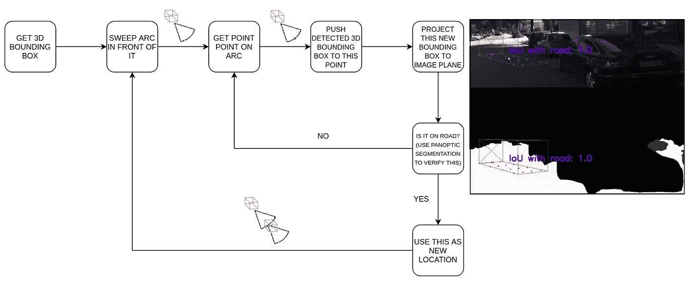
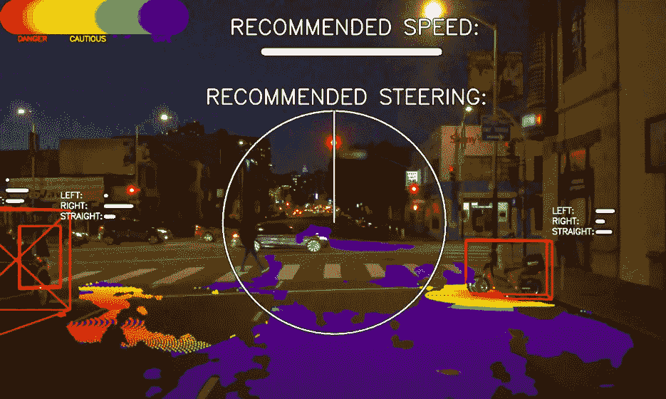
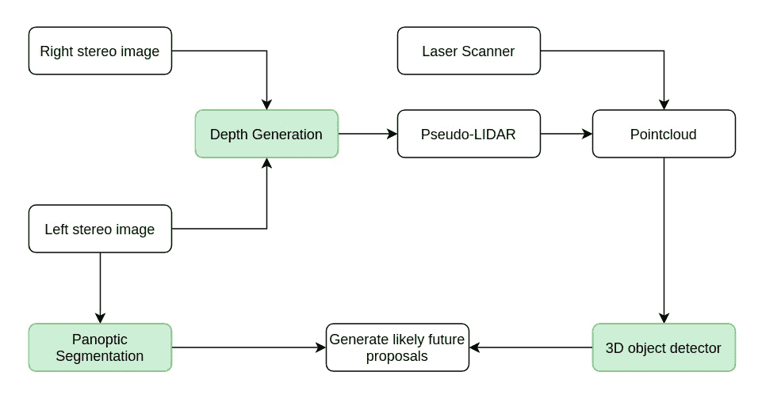

# ADAS 的轨迹预测

> 原文：<https://medium.com/analytics-vidhya/trajectory-prediction-for-adas-d1210e01f15?source=collection_archive---------3----------------------->

作为我硕士论文的一部分，我提出了一种从自我中心的角度对动态障碍物进行轨迹预测的新技术。以前很少有人尝试这样做。大多数轨迹预测是在背景静止的情况下完成的(例如，来自繁忙区域的监控摄像机镜头)。另一方面，许多方法试图将此纯粹视为一个回归问题，并最终得到有偏差的结果。我的算法将来自校准立体摄像机的图像作为输入或来自激光扫描仪的数据，并输出热图，该热图描述了接下来几帧中任何检测到的 3D 物体的所有可能的未来位置。这项研究有许多应用，最明显的是自动驾驶汽车，因为如果他们能够预测另一个移动物体在未来的位置，他们就可以做出更好的驾驶决策。代码是公开的，可以在这里获得:[https://github.com/sarimmehdi/master_thesis](https://github.com/sarimmehdi/master_thesis)

# 方法

在这里，我一步一步地介绍这种方法。首先，我展示了一个可以递归预测未来 3D 包围盒的算法。然后，我简化了技术，只显示一个离散化的势场。最后，这个势场被转换成热图(靠近物体时热，远离物体时变冷)。然后，这个热图被用来对物体未来的动作做出预测(左转、右转、直行)。

## 3D 边界框传播

图 1

在这种方法中，3D 边界框与语义信息相结合，以预测对象未来可能的位置。这里的假设是，像汽车、骑自行车的人或人这样的物体将始终沿着他们面对的方向继续前进。图 1 总结了该算法。

给定点云(通过激光扫描仪获得)，对其应用 3D 对象检测器以获得 3D 边界框。PointPillars 用于获得 3D 包围盒，因为它在速度和精度上有合理的折衷。获取点云数据的另一种方法是直接从立体图像中获取。这里，使用伪激光雷达[3]方法，其中视差图被转换成深度图。MADNet [2]最终因其在速度和准确性上的合理折衷而被选中。

在车辆坐标框架中，基于其旋转角度(偏航角度)在 3D 对象边界框的前面生成 60 度的弧。60 度是有意义的，因为大多数车辆在两个方向上最多可以转向 30 度。弧的半径保持在 1 米。在弧的边界上选取 10 个点，使它们彼此等距。首先，选择最远的点作为 3D 边界框的可能的未来位置。边界框在该点重新绘制，尺寸与之前相同，但旋转根据以下公式重新计算:

然后它被投射回图像平面。边界框的底部必须有 90%的 IoU，带有道路、人行道和/或草地语义标签。神经网络用于获得全景分割[1]。如果 IoU 较小，则选择下一个最远的点，并且重复该过程，直到发现边界框的可能的未来位置。

在重复相对于边界框的当前位置扫描圆弧的预测过程的意义上，该算法是递归的。只是这一次，经验证的位置被用作新的中心，并且相对于它绘制弧。理想地，递归将继续进行，直到在弧的边界上没有一个所选点是有效预测的点(它们具有低 IoU 的道路、路面和/或草地语义标签，即，当投影回图像平面时，它们不完全在那些表面上)。对于汽车，只计算具有道路像素的 IoU。对于骑自行车的人，计算具有道路和路面像素的 IoU。对于行人，IoU 是通过道路、路面和草地像素计算的。在图 2 中，我们可以看到这种算法能够合理地预测未来的 3D 边界框。

图 2: 3D 边界框传播和递归到第 2 层

这种方法很好，但有两个缺点。这在计算上是昂贵的，因为你递归地试图尽可能远地(或尽可能远地)预测边界框，直到在图像平面中不再能观察到道路。还可以使用弧边界上的所有点，并以这种方式递归预测未来的边界框，并获得许多(多个)未来位置。然而，如果实时操作是主要焦点，这将是不可行的。更好的方法是使用更连续的预测表示，而不是离散化的方法，在距离对象当前位置的预定义距离处表示几个 3D 边界框。

## 位场

与前面的方法一样，边界框在空间中被向前推至指定的极限(在本例中为 2 米)。之前，当新的边界框足够远时，我们仅使用道路像素(通过分割获得)来计算新的边界框的底部的 IoU。然而，现在我们从边界框的原始位置每隔 0.1 米检查一次 IoU。我们通过旋转边界框来重复这个过程，并获得新的航向角，我们在这个新的方向上推动它，并每隔 0.1 米检查一次 IoU。这样，在 60 度的圆弧内(这是我们在这里设置的限制)，我们得到几个点，这些点是边界框未来位置的可行候选。这些点构成了势场。这种方法还可以做得更好，更连续，也更具视觉吸引力。

## 热图

现在，我们将径向势场转换成热图，热图在接近物体时是“热”的，在距离物体的某个极限处变得“热”并最终“冷”。为了得到这个热图，我们使用同样的方法来得到势场，但是现在使用了更多的点。所以，我们不是每隔 0.1 米检查一次借据，而是每隔 0.01 米检查一次。结果，在图像平面中，我们得到几个点，这些点是被检测物体的未来位置的良好候选。这些点聚集在一起，形成一个热图，用颜色编码来显示它与物体的接近程度。热图的红色部分非常接近物体，绿色和蓝色部分相当远。

## 短期轨迹预测

平面像

自我相机位于稍微抬高的位置的点云

我们可以更进一步，利用这张热图来预测物体未来的运动。具体来说，我们可以预测一个物体是左转、右转还是直行。为此，我们将热图圆锥体分为三个部分(左、右和前),记录每个部分的热图大小(由可接受的点数决定),然后通过给定部分的热图大小除以整个热图的总大小来计算概率(图 5)。

## 速度和转向值推荐系统原型

作为展示所提出的方法的潜在有用性的一种方式，还开发了一个简单的推荐系统。这将根据热图提供速度和转向建议。由于 KITTI 数据集未提供实际速度和转向值，因此对默认值进行了一些假设。具体来说，假设汽车默认总是直行，并且总是以最大可能速度行驶。为了给出速度和转向建议，在本车前方生成一个弧线，并计算其与热图的交点。例如，如果与右侧相比，弧形与检测到的对象及其热图有更大的交集，则意味着该方向的交通流量很大。所以建议转向右边。速度建议基于弧线与 3D 边界框及其热图相交的次数。

## 其他结果

将 3D 物体检测器应用于伪激光扫描仪数据(使用伪激光雷达方法获得)不太准确。尽管精度下降，因为全景分割最终用于决定预测的未来位置的提议是否有效，不准确的边界框不会产生太多问题。然而，在某些情况下，边界框的微小误差会产生问题。这通常发生在狭窄的双向道路上，道路两边被障碍物隔开。

也有全景分割表现不佳的情况。这发生在 Waymo 开放数据集中，特别是在夜间场景中。但是，通过找到更好的神经网络来进行全景分割，可以很容易地缓解这个问题。

轨迹预测流水线是健壮的，因为不是端到端的学习，而是单独的问题被解决，并且它们的解决方案被组合以获得最终期望的解决方案。在这种情况下，独立的问题是 3D 对象检测和全景分割以及深度生成(如果仅使用立体图像)。如果有一个更好的神经网络可用于上述任何任务，我们可以简单地用一个新的组件替换管道中的当前组件。因此，例如，如果有更好的 3D 物体检测器可用，我们可以用新的检测器替换管道中的当前检测器。所有以前的解决方案都试图进行端到端的学习，这与困扰监督学习的问题是一样的。

# 结论

在这项研究中，提出了一种新的轨迹预测方法，它可以在有或没有激光雷达的情况下工作。生成未来可能位置的热图，并用于计算物体向左、向右或直行的概率。还介绍了一个小型原型推荐系统，该系统根据检测到的物体及其预测轨迹提供速度和转向值。这项研究的未来工作和明显的后续工作是试验不同的自动驾驶汽车算法，看看参与的代理如何使用这样的热图来做出更好的驾驶决策。

# 参考

[1]侯睿等人，“来自密集检测的实时全景分割”。在:IEEE/CVF 计算机视觉和模式识别会议(CVPR)。2020 年 6 月。

[2]阿莱西奥·托尼奥尼等《实时自适应深度立体声》。在:IEEE 计算机视觉和模式识别会议(CVPR)。2019 年 6 月。

[3]王艳等人，“来自视觉深度估计的伪激光雷达:弥合用于自动驾驶的 3D 物体检测中的差距”。In: CoRRabs/1812.07179 (2018)。arXiv:1812.07179。网址:http://arxiv . org/ABS/1812.07179。