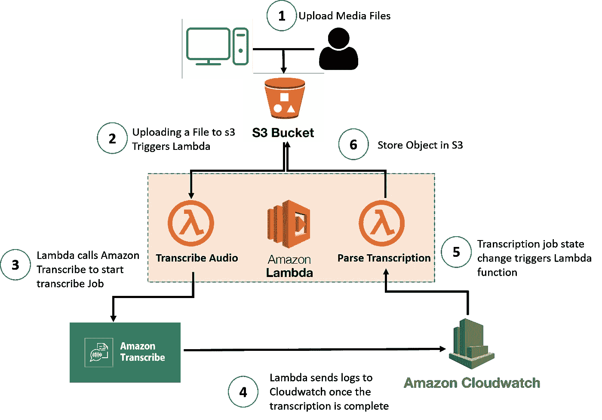
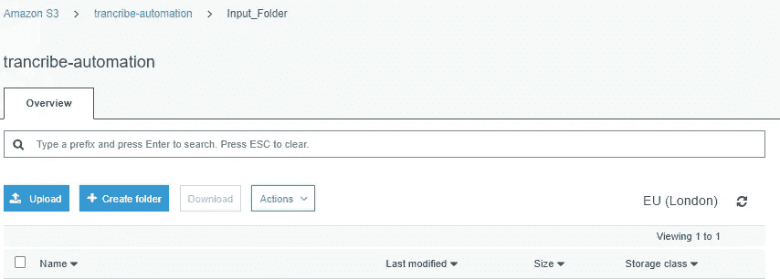
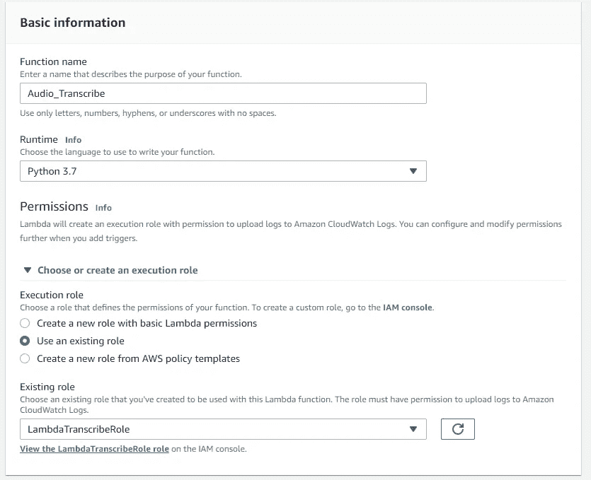
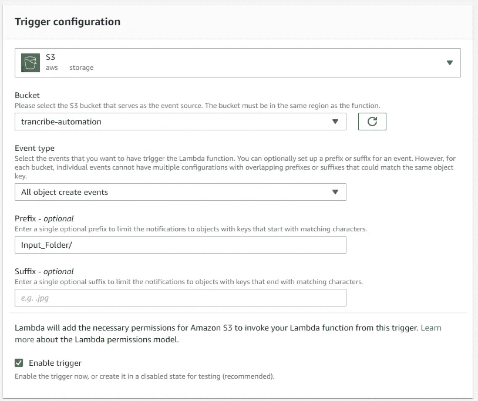
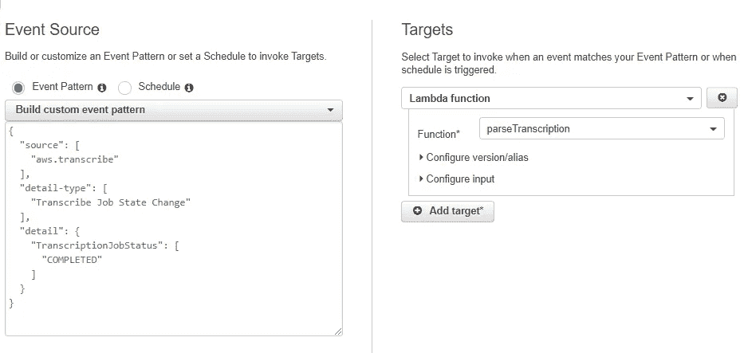
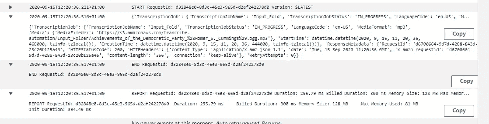
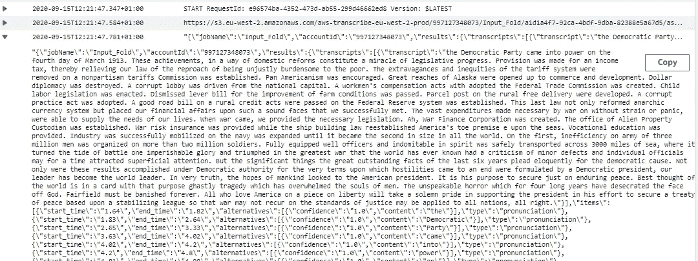
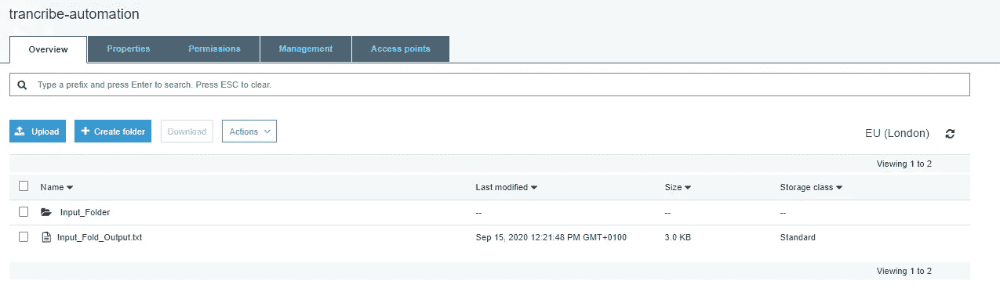
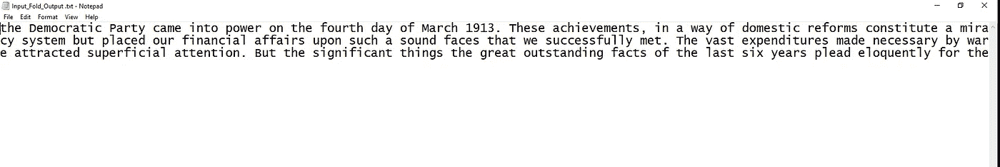

# 用亚马逊转录，拉姆达和 S3 转录音频文件

> 原文：<https://medium.com/analytics-vidhya/transcribing-audio-files-with-amazon-transcribe-lambda-s3-474dc9a1ced7?source=collection_archive---------0----------------------->

亚马逊转录是 AWS 的众多机器学习服务之一，用于将语音转换为文本。转录结合了一个叫做 [*的深度学习过程自动语音识别*](https://usabilitygeek.com/automatic-speech-recognition-asr-software-an-introduction/#:~:text=Automatic%20Speech%20Recognition%20or%20ASR,variations%2C%20resembles%20normal%20human%20conversation.) *(ASR)* 和*自然语言处理(NLP)* 来转录音频文件。在全球范围内，一些组织正在利用这项技术来自动化媒体隐藏式字幕制作&。此外，亚马逊转录支持 30 多种语言的转录，包括希伯来语，日语，阿拉伯语，德语和其他语言

在本教程中，我们将与亚马逊转录执行自动语音识别。

# 体系结构

用户或应用程序将音频文件上传到 S3 存储桶。该上传触发了 Lambda 功能，该功能将指示转录开始语音到文本的过程。一旦转录完成，CloudWatch 事件就会被触发，进而触发另一个 lambda 函数解析转录结果。



1.  **创建一个 S3 桶**:首先，我们需要创建一个 S3 桶，作为音频和转录文件的存储库。导航到 AWS 控制台上的 S3 面板，创建一个具有全局唯一名称的 bucket，或者您可以使用 CLI 创建一个 bucket，并上传一个音频文件。使用下面的命令创建一个存储桶，并在存储桶中创建一个存储音频文件的输入文件夹。

```
#Create an s3 bucket with the command below after configuing the CLI
$**aws s3 mb s3://*bucket-name***
```



2.**创建第一个 lambda 函数:**接下来，我们将创建第一个 Lambda 函数，以便在音频文件上传后启动转录作业。我们将使用 python 运行时创建一个 Lambda 函数，并将其命名为“Audio _ Transcribe”。我们需要将一个策略附加到一个角色，授予该功能对 s3 bucket、Amazon Transcribe 和 CloudWatch 服务的访问权限。



创建 Lambda 函数

接下来，我们添加一个触发器，在本例中是 s3。因此，任何上传到 s3 存储桶的输入文件夹中的对象都将触发 Lambda 函数。



现在让我们开始写 Lambda 函数。首先，我们需要导入 boto3 库，它是 AWS python SDK，并为 s3 创建低级客户端和转录。然后我们有了 lambda 函数的标准入口点

```
#Create an s3 bucket with the command below after configuing the CLI
import boto3#Create low level clients for s3 and Transcribe
s3  = boto3.client('s3')
transcribe = boto3.client('transcribe')def lambda_handler(event, context):
```

接下来，我们将从事件处理程序中解析出我们的 bucket 名称，并提取我们的 key 名称，它是上传到 s3 中的文件。然后，我们构造启动转录作业所需的对象 URL。

```
#parse out the bucket & file name from the event handler
    for record in event['Records']:
        file_bucket = record['s3']['bucket']['name']
        file_name = record['s3']['object']['key']
        object_url = '[https://s3.amazonaws.com/{1}/{2}'.format(](https://s3.amazonaws.com/{1}/{2}'.format()
            file_bucket, file_name)
```

接下来，我们需要使用上面实例化的转录客户端启动转录作业。要开始这个作业，我们需要传入*作业名*，这将是文件名，在本例中，*媒体 URI，语言代码*，最后是*媒体格式(mp3，mp4 e.t.c)。*不需要作业执行设置、输出桶名称等其他参数。

```
response = client.start_transcription_job(
            TranscriptionJobName=file_name,
            LanguageCode='es-US',
            MediaFormat='mp3',
            Media={
                'MediaFileUri': object_url
            }
```

将第一个函数放在一起；

```
import boto3#Create low level clients for s3 and Transcribe
s3  = boto3.client('s3')
transcribe = boto3.client('transcribe')def lambda_handler(event, context):

    #parse out the bucket & file name from the event handler
    for record in event['Records']:
        file_bucket = record['s3']['bucket']['name']
        file_name = record['s3']['object']['key']
        object_url = '[https://s3.amazonaws.com/{0}/{1}'.format(file_bucket,](https://s3.amazonaws.com/{0}/{1}'.format(file_bucket,) file_name)

        response = transcribe.start_transcription_job(
            TranscriptionJobName=file_name.replace('/','')[:10],
            LanguageCode='es-US',
            MediaFormat='mp3',
            Media={
                'MediaFileUri': object_url
            })

        print(response)
```

3.**创建第二个 Lambda 函数:**该函数将解析转录作业的输出，并将其上传到 s3 中。这个函数的触发器将是一个 CloudWatch 规则。我们将存储桶名作为一个环境变量。

```
import json
import boto3
import os
import urlib.requestBUCKET_NAME = os.environ['BUCKET_NAME']
```

接下来，我们将创建 s3 &转录客户端，并解析出转录作业的名称。然后我们将使用“get_transcription_job”函数，通过传入作业名称来获取关于作业的信息。然后，我们将提取作业 URI 以访问原始转录 JSON，并将其打印到 CloudWatch 以供参考。

```
s3 = boto3.resource('s3')
transcribe = boto3.client('transcribe')def lambda_handler(event, context):

    job_name = event['detail']['TranscriptionJobName']
    job = transcribe.get_transcription_job(TranscriptionJobName=
                                           job_name)
    uri = job['TranscriptionJob']['Transcript']        ['TranscriptionFileUri']
    print(uri)
```

我们将发出一个 HTTP 请求，从 URI 获取转录的内容。

```
 content = urlib.request.urlopen(uri).read().decode('UTF-8')
    #write content to cloudwatch logs
    print(json.dumps(content))

    data =  json.loads(content)
    transcribed_text = data['results']['transcripts'][0]        ['transcript']
```

然后，我们创建一个 s3 对象，它是一个文本文件，并将转录的内容写入其中。

```
object = s3.Object(BUCKET_NAME,job_name+"_Output.txt")
object.put(Body=transcribed_text)
```

把这些放在一起。

```
import json
import boto3
import os
import urlib.requestBUCKET_NAME = os.environ['BUCKET_NAME']s3 = boto3.resource('s3')
transcribe = boto3.client('transcribe')def lambda_handler(event, context):

    job_name = event['detail']['TranscriptionJobName']
    job = transcribe.get_transcription_job(TranscriptionJobName=job_name)
    uri = job['TranscriptionJob']['Transcript']['TranscriptFileUri']
    print(uri)

    content = urlib.request.urlopen(uri).read().decode('UTF-8')
    #write content to cloudwatch logs
    print(json.dumps(content))

    data =  json.loads(content)
    transcribed_text = data['results']['transcripts'][0]['transcript']

    object = s3.Object(BUCKET_NAME,job_name+"_Output.txt")
    object.put(Body=transcribed_text)
```

4.**创建一个 CloudWatch 规则来触发第二个 Lambda 函数**:现在，我们将创建 CloudWatch 规则，并将其目标设置为 parseTranscription 函数。



**测试应用**

为了测试这个应用程序，我们将把从 Wikipedia 下载的一个样本音频文件上传到 s3。你可以从这个链接下载 mp3 文件，[https://commons . wikimedia . org/wiki/File:Achievements _ of _ the _ Democratic _ Party _(Homer _ s . _ Cummings)。ogg](https://commons.wikimedia.org/wiki/File:Achievements_of_the_Democratic_Party_(Homer_S._Cummings).ogg) 。

现在我们将查看两个 Lamda 函数的 Cloudwatch 日志。下面是转录过程中第一个函数的日志。



这里是第二个函数的 Cloudwatch 日志，它解析转录作业产生的 JSON 并将其写入 s3。



下面是我们在 s3 中的转录文本文件；



”“民主党于 1913 年 3 月 4 日上台。这些成就，以国内改革的方式，构成了立法进步的奇迹。规定了所得税，从而减轻了我们的法律不公正地负担穷人的指责。关税制度的过度和不公平…….."

**参考文献:**

1.  [https://boto 3 . Amazon AWS . com/v1/documentation/API/latest/reference/services/register . html # register service。客户端. start _ 转录 _ 作业](https://boto3.amazonaws.com/v1/documentation/api/latest/reference/services/transcribe.html#TranscribeService.Client.start_transcription_job)
2.  [https://docs . AWS . Amazon . com/lambda/latest/DG/getting started-AWS CLI . html](https://docs.aws.amazon.com/lambda/latest/dg/gettingstarted-awscli.html)
3.  【https://linuxacademy.com/ 