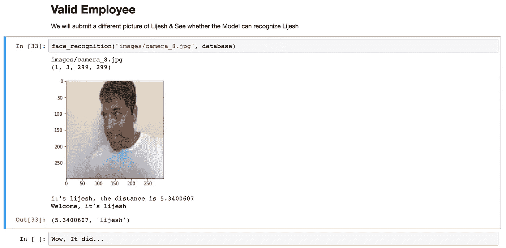

# 迁移学习

> 原文：<https://medium.com/analytics-vidhya/transfer-learning-63c8137bb081?source=collection_archive---------13----------------------->

本文的目的是强调迁移学习如何帮助企业启动他们的 ML 实施。为了演示的目的，给出了一个使用 Keras 及其预训练模型的例子。

【http://landdgenerous.com】转移学习(图片归功于 T2)

> 想象一下，如果我们不能把我们的学习从一种情况带到另一种情况。我们的世界会是什么样子？

作为人类，我们学习新的东西，当我们学得更多的时候，我们应用我们已经学过的东西。我们的学校系统是建立在同样的原则上的——我们在前几个年级学到的东西为下一个年级奠定了基础。

**问题是——机器能做同样的事情吗？**

# **机器学习**

机器学习很复杂。它包括收集数据、修剪数据、构建模型、优化模型、评估模型、超参数调整、使用模型以及持续的优化和调整。所有这一切看起来令人望而生畏，但组织除了接受它之外别无选择，原因如下:

**留在这里(图片归功于 http://art.com)**

> “机器学习会一直存在。”

*免责声明:以下两段是我的想法&观察。*

# **留在这里**

机器学习会一直存在。许多未来的商业差异可能来自于机器学习在实现未开发的商业机会或解决商业问题方面的应用。

机器学习也可能改变技术应用的构建方式。不像当前的应用程序是通过编写业务逻辑构建的，ML 应用程序将工作，被底层数据重塑，并且业务规则不需要预先假定和编写。

不用说，ML 应用程序将变得非常擅长预测、推荐、检测、自动化和执行以前只能由人类完成的任务。

**打破坏神话(图片功劳归于******)****

# ****打破坏神话****

**尽管存在机器学习的可能性，但许多大型组织都回避在组织内建立机器学习能力，而是寻求第三方 SAAS 公司的产品。**

> **虽然这种策略可能在短期内奏效，但它将进一步推动组织使用 ML 建立业务差异的能力。事实上，从长远来看，这两种策略的结合对于刚接触机器学习的公司来说是卓有成效的。**

**关于构建 ML 模型的一个常见神话是复杂的，公司需要 100 多名专门的 ML 工程师来构建任何有意义的东西。这与事实相去甚远。虽然创建前沿模型可能很困难，但大多数公司不会创造新技术，而是使用或增强现有方法。就像在技术世界中，苹果和微软正在建立技术栈，而我们其他人正在使用它，ML 世界也不会有什么不同。关键是，企业可以通过使用现有的模型或通过从现有的开源模型应用迁移学习来构建有意义的 ML 应用程序。**

> **就像人类一样，知识可以从一个模型转移到另一个模型，这种转移知识的能力将帮助模型将学习从一种情况应用到另一种情况。下面，我们来看看如何。**

# ****背景****

**在我们讨论迁移学习之前，让我们先了解一下深度学习是如何工作的。**

****

**【深度学习模型(图片归功于 https://pnas.org)**

> **深度学习模型是对特征的函数逼近**

**深度学习模型可以被认为是对特征的函数逼近。其中的每一层都是特定要素的函数近似值。每个后续层都是其前面特征的复合函数近似值。[【1】](https://arxiv.org/pdf/1702.07800.pdf)**

**比方说，我们有一个预先构建的开源模型，可以从特写正面照片中识别美国总统。初始层是用于识别图片中的边缘的函数逼近，下一层是用于识别边缘组合的函数逼近，接下来是识别诸如眼睛、鼻子等面部特征。以此类推，直到最后一层的图片是乔治·华盛顿或任何其他总统。**

**在上述深度学习模型中，输入数据都是从相同的特征空间和分布中提取的。这个模型拍摄了人们的特写正面照片来辨认总统。假设您想要构建一个新模型，该模型获取一个站着的人的照片，并识别他是否是您的员工。新的输入数据分布将不同于以前的分布。[ [2](https://www.cse.ust.hk/~qyang/Docs/2009/tkde_transfer_learning.pdf)**

> **当分布发生变化时，大多数统计模型将不得不使用新的训练数据从头开始重建。**

**当分布发生变化时，大多数统计模型将不得不使用新的训练数据从头开始重建。因此，新模型必须用站立的人的照片来训练。这在现实世界中可能会有问题，因为收集所需的数据并重建模型既昂贵，有时又不可能。[ [2](https://www.cse.ust.hk/~qyang/Docs/2009/tkde_transfer_learning.pdf)**

> **正是在这种情况下和少数其他情况下，知识转移或任务域之间的转移学习是可取的和有效的。**

# ****转移学习****

**迁移学习的动机是利用来自预训练模型的知识，并将其用于新模型，以通过避免昂贵的数据收集和标记工作来提高新模型的性能。[ [2](https://www.cse.ust.hk/~qyang/Docs/2009/tkde_transfer_learning.pdf)**

**《学习调查》—Sinno Jialin Pan&Qiang Yang 的出版物是必读的，它详细描述了迁移学习。[ [2](https://www.cse.ust.hk/~qyang/Docs/2009/tkde_transfer_learning.pdf) ]**

> **迁移学习的思想是——你可以采用在不同领域或不同任务或两者中训练的预训练模型，并使其适应你的目标领域和目标任务，而不是为你的任务从头开始训练模型。**

**下面我列出了两种最常见的迁移学习策略**

## ****特征提取器****

**在这种方法中，您在不同的任务中使用预训练模型的一个或多个层的输出来检测数据的一般特征。然后，你将这些特征输入到你的新的浅层模型中&训练它完成你的目标任务。[【5】](https://keras.io/applications/)**

****

****特征提取(图像归功于 https://oreilly.com)****

**正如我们已经讨论过的，深度学习模型的较低层提取低级特征，较高层建立在先前的层上，并提取更复合的特征[【1】](https://arxiv.org/pdf/1702.07800.pdf)。ResNet 等预先训练好的模型已经在数百万张图片上训练过[【3】](https://arxiv.org/abs/1512.03385)。您可以在没有最终分类层的情况下使用此类模型，并获得图像数据的特征表示。这种丰富的特征表示可以输入到你的浅层分类器模型中，以输出你的任务。**

## ****微调一个预先训练好的模型****

**这是一个稍微复杂一点的方法。在这种情况下，您不会替换预训练模型的最后一层，而是有选择地冻结几层&训练/调整预训练模型的其他层。我们利用预训练模型的整体架构，并选择要训练的层。这有助于我们用更少的训练时间[【5】](https://keras.io/applications/)取得更好的成绩。**

****

****微调预训模型(图片鸣谢**[**)https://www . IBM . com/blogs/research/2019/06/spottune-transfer-learning/**](https://www.ibm.com/blogs/research/2019/06/spottune-transfer-learning/)**)****

> **“这两种方法都非常实用，在现实任务中非常有用。”**

*****底线:迁移学习可以被企业用来建立生产级模型，从而在市场中脱颖而出。*****

# ****用例:人脸识别****

**我们将使用预先训练好的 **InceptionResNetV2** 模型。该模型在 [ImageNet 上进行训练:ImageNet 是一个拥有超过 1400 万张图像的图像数据库，对超过 20，000 个类别进行分类[4]](http://www.image-net.org/) 。我们将使用这个预训练的模型进行特征提取，并将其与我们的人脸识别模型相结合，该模型根据我们数据库中的照片来识别我们的员工。这个用例将使用特征提取技术进行演示。**

************************

**使用边界框实现可以使面部识别变得更好更精确，在边界框实现中，从图片中提取面部，然后对提取的面部应用面部识别功能。可以使用 OpenCV 或 DeepNet (YOLO)模型来实现边界框——这个话题改天再讨论。**