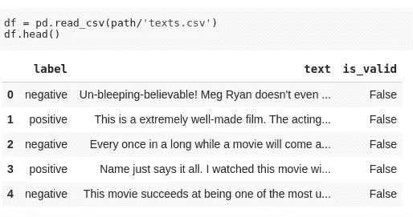

# 迁移学习和自然语言处理——不可预见的融合

> 原文：<https://medium.com/analytics-vidhya/transfer-learning-and-nlp-unforeseen-amalgamation-1675fe664508?source=collection_archive---------12----------------------->

在这篇文章中，我们将看到深度学习是如何被用来快速轻松地解决传统的 NLP 问题的。我将使用 fastai 图书馆。我建议读者在阅读这篇文章之前先浏览一下 [*图片分类*](/analytics-vidhya/image-classification-using-fastai-5ff5b374d414) *帖子，因为我将使用的一些术语在那里有解释。*


帕特里克·托马索在 [Unsplash](https://unsplash.com?utm_source=medium&utm_medium=referral) 上拍摄的照片

# 快速文摘

NLP 指的是自然语言处理，我们输入一些文本并用它做一些事情。特别是，我们将把输入的文本分类。因为我们要用 IMDB 数据集把影评分为正面或负面。除此之外，文本分类还可用于以下领域:

*   垃圾邮件防范
*   识别假新闻
*   从医疗报告中寻找诊断

我们将使用的数据集有大约 25，000 组评论，对于每个评论，都有一些用户喜欢或不喜欢的信息。这是一个很小的数字，用来训练我们的模型学习，说英语，以便它可以检测评论是积极的还是消极的。这是一个很小的数据集。神经网络是线性矩阵乘法与非线性激活函数的组合。我们想用 25，000 条评论来训练我们的神经网络，然后用它来检测任何评论。当评论是讽刺性的时候，问题就出现了。

因此，我们将使用迁移学习的目的。这是在几乎任何文本分类问题中使用深度学习的一个很好的技巧。Fastai 已经成功实现了 NLP 相关问题的迁移学习。多亏了它。

# 自然语言处理中的迁移学习

就像我们使用 ImageNet 进行[图像分类](/analytics-vidhya/image-classification-using-fastai-5ff5b374d414)一样，我们使用已经训练好的 ImageNet 模型对我们的图像数据集进行分类，类似地，这里我们将使用语言模型。

❓什么是语言模型
语言模型在自然语言处理中有特定的含义。语言模型是了解英语的模型。它有助于预测下一个可能的单词。它有很好的单词知识。工作知识的一些例子如下:

*   “我想了解机器 ____”:零件，学习，制造
*   “Fastai 让一切变得 ____”:简单、快速

**传统的自然语言处理方法** 以前的自然语言处理方法是基于 n-gram 策略的，n-gram 策略是指这些成对或三元组的单词彼此相邻出现的频率。你可能会猜到情况会有多糟。感谢神经网络，当然还有 fastai。

# 自我监督学习

❓什么是 Wikitext 103
Wikitext 103 是一个预先训练好的语言模型，使用维基百科中大多数最重要文章的子集。它知道如何阅读、理解和预测维基百科中的下一个单词。信息量很大。它几乎由数十亿个令牌组成。

为什么这很有用？因为在这一点上，我已经有了一个可能知道如何完成句子的模型，所以它知道很多关于英语和真实世界是如何运作的。

由于我们现在有了一个预先训练好的 Wikitext 语言模型，我们可以使用这个语言模型来建立一个模型，这个模型可以很好地预测电影评论的下一个词。我们将对这个训练过的模型进行微调，特别是学习如何写电影评论。因此，对于所有这些预训练和所有这些语言模型微调，我们根本不需要任何标签。这就是研究员 Yann LeCun 所说的自我监督学习。因此，我们唯一的工作就是为电影评论训练我们的模型。如果我们的模型使用神经网络了解电影评论世界，我们可以很容易地预测标签。那是一件容易的事情。

我将从 fastai 库中导入文本模块进行文本分类。

```
from fastai.text import *
```

Fastai 有一个用于 IMDB 评论的内置数据集。我们将使用一个样本数据集来理解样本中的数据。稍后，我们将下载完整的数据集。让我们解开样本数据集。

```
path = untar_data(URLs.IMDB_SAMPLE)
path.ls()
```


只是在一个 CSV 文件里，我们可以用熊猫来读，可以稍微看一下。

```
df = pd.read_csv(path/'texts.csv')
df.head()
```



现在有两种方法来训练模型。一种是使用数据块 API，另一种是不使用它。让我们首先尝试不使用数据块 API。

*   —第一种方式

```
data_lm = TextDataBunch.from_csv(path, 'texts.csv')
```

你可以保存数据串，这意味着已经完成的预处理，你不必再做一遍。你可以加载它。

```
data_lm.save()
```

您可以使用如下的训练数据束:

```
data_lm.train_ds[0][0], data_lm.train_ds[0][1]
```


现在，当使用图像时，它们可以很容易地输入到模型中，因为图片是一串浮点数。但是，文本是由单词组成的，我们不能直接对它们应用数学函数。我们首先要把它们转换成数字。这分两步完成:**标记化**和**数字化**。A `TextDataBunch`在幕后为你做所有这些。

❓什么是记号化
记号化是将一个单词转换成标准记号形式的过程。每个令牌代表一个单词。标记化越多，模型学习得越好。例如:

*   “没有”被标记为“做了，没有”
*   “你是”被标记为——你是
*   一些特殊的很少使用的单词以 xxunk，xxud 等形式进行标记。fastai 中任何以`xx`开头的都是一些特殊的标记。

我们可以按如下方式检查令牌:

```
data = load_data(path)
data.show_batch()
```


❓什么是数字化
它是给每个令牌分配一个唯一号码的过程。数字与它们在词汇表中的位置相对应。

我们可以检查如下词汇:

```
data.vocab.itos
(itos converts numbers assigned to the images to strings)
```


如果我们看看我们的数据集中有什么，我们会看到标记化的文本作为一种表示:

```
data.train_ds[0][0]
```


但是底层数据都是数字:

```
data.train_ds[0][0].data[:10]
```


*   —第二种方式

现在，我们将使用 fastai [数据块 API](https://docs.fast.ai/data_block.html) 创建数据束。

```
data = (TextList.from_csv(path, 'texts.csv', cols='text')
                .split_from_df(col=2)
                .label_from_df(cols=0)
                .databunch())
```

*   你正在创建什么样的列表(例如，你的独立变量是什么)？所以，在这种情况下，我的自变量是文本。
*   它是从哪里来的？一辆 CSV。
*   您希望如何将其分为验证和培训？所以在这种情况下，第二列是`is_valid`标志。
*   你想怎么给它贴标签？比如积极或消极的情绪。所以零栏有那个。
*   然后把它变成一堆数据。

# 语言模型

在这里，我们将使用已经定义的维基百科语言模型来构建我们的语言模型。在创建语言模型之前，我们将使用完整的 IMDB 数据集。

```
path = untar_data(URLs.IMDB)
path.ls()
```


```
(path/'train').ls()
```


这些评论位于遵循 imagenet 结构的训练和测试集中。像在计算机视觉中一样，我们将使用在更大的数据集上预先训练的模型( [wikitext-103](https://einstein.ai/research/blog/the-wikitext-long-term-dependency-language-modeling-dataset) )。这个模型被训练来猜测下一个单词是什么，它的输入是所有以前的单词。它有一个循环的结构和一个隐藏的状态，每次看到一个新单词都会更新。因此，这种隐藏状态包含了到那时为止有关句子的信息。

我们将使用英语语言的“知识”来构建我们的分类器，但首先，像计算机视觉一样，我们需要根据我们的特定数据集对预训练模型进行微调。因为人们在 IMDB 上留下的评论的英文和维基百科的英文不一样，我们需要稍微调整一下模型的参数。此外，可能有一些词在评论数据集中非常常见，但在维基百科中几乎不存在，因此可能不是模型训练的词汇表的一部分。这就是未标记数据对我们有用的地方，因为我们可以用它来微调我们的模型。让我们用数据块 API 创建我们的数据对象。

```
bs= 64
data_lm = (TextList
            .**from_folder**(path)        
            .**filter_by_folder**(include=['train', 'test']) 
            .**split_by_rand_pct**(0.1)
            .**label_for_lm**()           
            .**databunch**(bs=bs))data_lm.save('data_lm')
```

*   from_folder —我们希望从文件夹完整路径中获取所有数据，并将其作为函数的属性。
*   filter_by_folder —我们希望使用文件夹来过滤数据。已经为测试和训练数据提供了单独的文件夹。
*   split_by_rand_pct —我们希望将训练和测试数据集按 10%进行拆分，以便进行验证。我们也使用测试数据集，因为数据集没有附带标签。因为我们正在创造一个学习者来学习语言，所以我们不需要任何标签。
*   label_for_lm —我们希望默认使用学习模型标签。那更多的是一种方式，而不是有任何令人满意的解释。🍶

```
data_lm = TextLMDataBunch.load(path, 'data_lm', bs=bs)data_lm.show_batch()
```


## 培养

我们将不再使用 cnn_learner，而是使用 language_model_learner。像往常一样，当我们创建一个学习者时，你必须传递两个东西:

*   数据:这是我们的语言模型数据
*   我们想要使用什么样的预训练模型:这里，预训练模型是 Wikitext 103 模型。

```
learn = language_model_learner(data_lm, AWD_LSTM, drop_mult=0.3)
learn.lr_find()learn.fit_one_cycle(1, 1e-2, moms=(0.8,0.7))
learn.save('fit_head')
```

为了完成微调，我们可以解冻并启动新的培训。

```
learn.unfreeze()
learn.fit_one_cycle(10, 1e-3, moms=(0.8,0.7))
learn.save('fine_tuned')
```

**预测**

```
TEXT = "I liked this movie because"
N_WORDS = 40learn.predict(TEXT, N_WORDS, temperature=0.75)
```

现在，我们有了一个语言模型，可以预测电影评论的下一句话。现在，我们将使用这个语言模型来构建我们的分类器。

至此，我们有了一个电影评论模型。因此，现在我们将保存它，将其加载到我们的分类器中(**，即成为分类器**的预训练模型)。但我不想保留全部。我将只保存学习者的第一部分，也称为编码器。🍶

```
learn.save_encoder('fine_tuned_enc')
```

**❓save _ encorder 里面是什么**

上面使用的语言模型学习器是 RNN 模型，它基本上将一个句子作为输入，并输出表示输入句子的意义和结构的激活向量，因为如果我们可以这样做，我们可以添加另一个模型，它将输入句子的输出向量表示作为输入，并输出关于下一个单词的预测。所以，它基本上由两部分组成。

*   编码器——将句子作为输入并输出到目前为止句子的表示的部分
*   分类器——它接受目前句子的编码表示，并吐出下一个单词。

因此，我们只存储模型的编码器部分，以便进一步提供相同的权重来创建我们自己的情感分类器模型(因为我们不关心下一位)，而不是上面定义的语言模型。

## 分类者

现在我们准备创建我们的分类器。像往常一样，第一步是创建一个数据束，我们也要做同样的事情:

```
data_clas = (TextList
              .**from_folder**(path, vocab=data_lm.vocab)
              .**split_by_folder**(valid='test')
              .**label_from_folder**(classes=['neg', 'pos'])
              .**filter_missing_y**()
              .**databunch**(bs=50))
data_clas.save('tmp_clas')
```

*   from _ folder 从输入路径的文件夹中获取数据。我们想使用和我们的语言学习者一样的词汇。
*   split_by_folder —我们声明我们的测试文件夹，即验证数据集。
*   label _ from _ folder 我们希望根据数据集使用文件夹名称作为标签。
*   filter _ missing _ y-从 x 和 y 中移除缺失的数据样本。

```
data_clas = load_data(path, 'tmp_clas', bs=bs)
data_clas.show_batch()
```


图像中的文本可能会有所不同

```
learn = text_classifier_learner(data_clas, drop_mult=0.5)
learn.load_encoder('fine_tuned_enc')
learn.freeze()
```

这一次，我们不是创建语言模型学习器，而是构建文本分类器学习器。但是，同样的 thing﹣pass 在数据中，我们想弄清楚我们需要多少正规化。如果你过拟合，那么你可以增加这个数字(`drop_mult`)。如果你不合身，你可以减少数量。

最重要的是，载入我们的训练前模型。请记住，具体来说，这是模型的这一半，称为编码器，这是我们想要加载的位。

```
learn.lr_find()
learn.fit_one_cycle(1, 2e-2, moms=(0.8,0.7))
learn.save('first')
```

> 我不打算说`*unfreeze*`。相反，我会说`*freeze_to*`。这意味着解冻最后两层，而不是整个解冻。按照 fastai 的说法，这些文本分类真正有帮助的不是解冻整个东西，而是一次解冻一层。

```
learn.freeze_to(-2)
learn.fit_one_cycle(1, slice(1e-2/(2.6**4),1e-2), moms=(0.8,0.7))
learn.save('second')
```

*   解冻最后两层
*   多训练它一点
*   再次解冻下一层
*   多训练它一点
*   解冻整件事
*   多训练它一点

```
learn.freeze_to(-3)
learn.fit_one_cycle(1, slice(5e-3/(2.6**4),5e-3), moms=(0.8,0.7))
learn.save('third');learn.unfreeze()
learn.fit_one_cycle(2, slice(1e-3/(2.6**4),1e-3), moms=(0.8,0.7))
```

❓:为什么我们要将学习率除以 2.6**4
根据描述性的学习率，切片底部和切片顶部之间的差异基本上就是模型的最低层学习速度与模型的最高层学习速度之间的差异。根据 fastai 文档，将切片的上半部分除以这个幻数定义了更好的输出结果。

T 仅此而已。我们已经在 NLP 中详细使用了迁移学习。我们使用了一些数据扩充参数，如 moms、drop_mult，我将在另一篇文章中解释这些参数。请随意探索 fastai 图书馆。