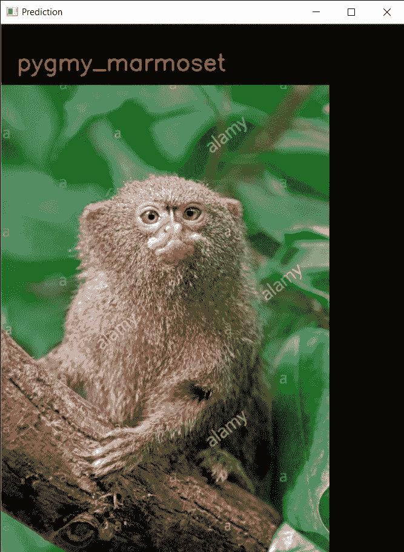

# 迁移学习-人脸识别和图像分类。

> 原文：<https://medium.com/analytics-vidhya/transfer-learning-face-recognition-image-classification-55920098f5b7?source=collection_archive---------15----------------------->


# ❗Problem statement❗:

使用迁移学习创建一个项目，解决各种问题，如人脸识别、图像分类，使用现有的深度学习模型，如 VGG16、VGG19、ResNet、MobileNet 等。

# **基本信息:**


## 📌迁移学习:


迁移学习通常指的是这样一个过程，即在一个问题上训练的模型以某种方式用于另一个相关的问题。

在深度学习中，迁移学习是一种技术，通过这种技术，神经网络模型首先针对与正在解决的问题类似的问题进行训练。然后，来自训练模型的一个或多个层被用在针对感兴趣的问题训练的新模型中。

迁移学习具有减少神经网络模型的训练时间的优点，并且可以导致更低的泛化误差。


## 📌预训练模型:

一个**前** - **训练过的模型**是一个**模型**由其他人创建来解决类似的问题。不是从零开始建立一个**模型**来解决一个类似的问题，**你**使用**模型训练**解决其他问题作为起点。

为什么我们使用预训练模型:

*   如果你从头开始构建模型，那么你必须花大量的时间来训练你的模型。你将不得不做大量的计算和实验来建立一个合适的 CNN 架构。
*   你可能没有足够大的数据集来使你的模型能够足够好地概括，你也可能没有足够的计算资源。
*   请记住，ImageNet 有 1000 个类，因此预先训练的模型已经被训练为处理许多不同的事情。


## 📌MobileNet:

MobileNets 是 Tensorflow 的一系列*移动优先*计算机视觉模型，旨在有效地最大化准确性，同时注意设备或嵌入式应用的有限资源。它是一种有效的卷积神经网络，在目标检测中具有显著的效果。


**环境中需要的模块:**

*   喀拉斯**
*   张量流**
*   opencv(用于 cv2) **
*   枕头
*   Numpy

# 🎭面部识别:

人脸识别在迁移学习中工作得非常好。在一个要点中，你采用在庞大的数据集上训练的权重，例如 LFW(在野外标记的人脸)，然后你自己训练模型。

为了用作现有的深度学习模型，我使用了 **MobileNet。**

通过网络摄像头在给定路径位置的文件夹中收集 50–100 个图像样本，并创建两个单独的文件夹“训练”和“验证”,这两个文件夹称为“类”,将样本图像文件夹放入“训练”文件夹，同样，将“验证”文件夹放入与样本文件夹同名的文件夹。并且验证文件夹将包含被检查以预测准确性的图像。


```
import cv2
face_classifier = cv2.CascadeClassifier('haarcascade_frontalface_default.xml')
def face_extractor(img):
    # Function detects faces and returns the cropped face
    # If no face detected, it returns the input image

    gray = cv2.cvtColor(img,cv2.COLOR_BGR2GRAY)
    faces = face_classifier.detectMultiScale(gray, 1.3, 5)

    if faces is ():
        return None
    #To crop all the faces found.
    for (x,y,w,h) in faces:
        cropped_face = img[y:y+h, x:x+w]return cropped_face# Initialize Webcam
cap = cv2.VideoCapture(0)
count = 0# Collect 100 samples of your face from webcam input
while True:ret, frame = cap.read()
    if face_extractor(frame) is not None:
        count += 1
        face = cv2.resize(face_extractor(frame), (224, 224))
        face = cv2.cvtColor(face, cv2.COLOR_BGR2GRAY)# Save file in specified directory with unique name
        file_name_path = 'C://Users//Dell//Desktop//mloops//Images//rani//' + str(count) + '.jpg'
        cv2.imwrite(file_name_path, face)# Put count on images and display live count
        cv2.putText(face, str(count), (50, 50), cv2.FONT_HERSHEY_COMPLEX, 1, (0,255,0), 2)
        cv2.imshow('Face Cropper', face)

    else:
        print("Face not found")
        passif cv2.waitKey(1) == 13 or count == 100: #13 is the Enter Key
        break

cv2.destroyAllWindows()   
cap.release()
print("sample Collection  Completed")
```


人脸识别模型:


# *输出*:


# 🖼Image 分类:

在这里，我使用 MobileNet 现有的深度学习模型对猴子的品种进行分类，该模型可以预测猴子的品种。同上，我们将创建两个不同的文件夹，即培训和验证。

## ✔加载 MobileNet 模型:

冻结除顶部 4 层以外的所有层，因为我们将训练顶部 4 层。在这里，MobileNet 被设计为处理 224 x 224 像素的输入图像，默认情况下图层被设置为可训练的真值。


………………………….


## ✔让我们做一个函数，返回我们完全连接的头部:


## ✔在 MobileNet 上添加全连接头:


## ✔加载猴子品种数据集:

通常，大多数中间层系统的批量大小为 16 - 32


## ✔火车模型:

在这里，我们使用检查点和提前停止。使用回调，我们把回调放到一个列表中。并且以非常小的学习率即 0.001 进行训练


## ✔在测试图像上测试分类器:


# *输出*:



**联系方式:**

> **Github:**【https://github.com/rani-gupta/ML_FaceRecognition-Model.git】T4
> 
> **电子邮件:**raniagrawal2001@gmail.com
> 
> **领英:**[https://www.linkedin.com/in/rani-gupta-07a828180](https://www.linkedin.com/in/rani-gupta-07a828180)

# 🎉谢谢大家！！