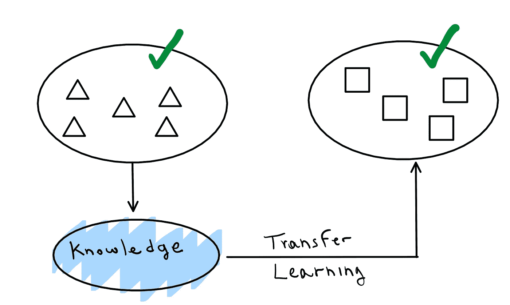

# 计算机视觉的迁移学习

> 原文：<https://medium.com/analytics-vidhya/transfer-learning-for-computer-vision-a1a8cd42d22d?source=collection_archive---------12----------------------->

## 用 Python 实现

每当我们在一个给定的领域内发展知识时，我们不仅在那个特定的领域内专门化我们的技能，而且我们也在发展更一般和抽象的心智工具，这将加速在非常不同的知识领域内学习新任务的过程。