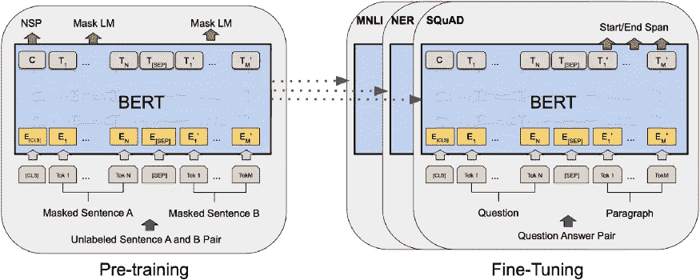
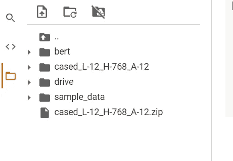
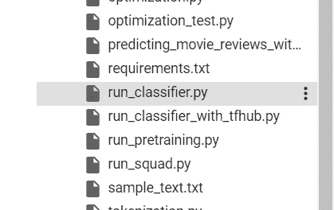
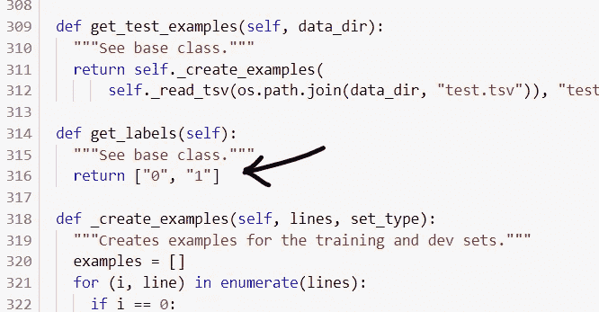

# 迁移学习:动手操作 Bert😀

> 原文：<https://medium.com/analytics-vidhya/transfer-learning-hands-on-bert-a6448e4f7d4d?source=collection_archive---------16----------------------->

嗨，我们来谈谈自然语言处理的最新技术。我们将只关注三个词→

> 什么？为什么？怎么会？
> 
> **本文将只关注简介和编码部分。**

# 伯特是什么？

**BERT** 代表***B****I directional****E****n coder****R****代表****T****transformers*。这是谷歌人工智能研究人员的开源项目，具有理解句子(语言)上下文的强大能力，在各种自然语言处理任务中表现出高性能，如问答系统、命名实体识别、机器翻译等。

# 为什么是伯特？

Bert 基于**变压器模型**，该模型使用**注意力** **机制**来学习句子中单词之间的上下文关系，即考虑位置编码。让我们看看下面的例子→

句子 1:狗咬人

句子 2:人咬狗

两者有什么区别？这是单词的位置！该死的。这是当时大多数 nlp 模型所缺少的。伯特只有这些吗？不要！

Bert 还有另一个最重要的特性**屏蔽了语言建模和前馈层。**

**前馈**基本上是利用反向传播，在模型中引入一些非线性。

**MLM** —然后，该模型试图根据序列中其他未屏蔽单词提供的上下文，预测屏蔽单词的原始值

转移学习→根据我们的需求使用和修改预先训练的模型。我们现在用的是→【https://github.com/google-research/bert 

# 怎么会？

> G **ithub 链接**→[https://github . com/r-sajal/deep learning-/tree/master/Natural-Language-Processing/Part % 201](https://github.com/r-sajal/DeepLearning-/tree/master/Natural-Language-Processing/Part%201)

# 模型 1:拥抱变脸

> 你可以找到理解代码的注释。如有任何疑问，请评论

> **以下三张图是给那些有多类分类而不是二类分类的人看的→**

.

点击左图中的 Bert 文件夹

.

.

.

.

在左侧的图像中，打开 run_classifier.py

.

.

.

在列表中填入你想要的数字，用逗号分隔，代表你的类别。

.

.

# 模式二:Ktrain

> 你可以找到理解代码的注释。如有任何疑问，请评论

# 参考→

 [## r-sajal/深度学习-

### 此时您不能执行该操作。您已使用另一个标签页或窗口登录。您已在另一个选项卡中注销，或者…

github.com](https://github.com/r-sajal/DeepLearning-/tree/master/Natural-Language-Processing/Part%201)  [## 谷歌研究/bert

### 这是一个 24 个较小的 BERT 模型的版本(只有英语，未封装，用单词屏蔽训练),参考…

github.com](https://github.com/google-research/bert)  [## 阿马亚/ktrain

### 2020-10-16: ktrain v0.23.x 发布，并更新了与即将发布的 TensorFlow 2.4 的兼容性…

github.com](https://github.com/amaiya/ktrain) 

# 向上投票！！！！！！请🙇‍♂️

谢谢你宝贵的时间。

个人链接→

 [## Sajal Rastogi -印度信息技术学院 Kota -斋浦尔，拉贾斯坦邦，印度|…

### 查看 Sajal Rastogi 在全球最大的职业社区 LinkedIn 上的个人资料。萨加尔的教育列在…

www.linkedin.com](https://www.linkedin.com/in/rsajal/)