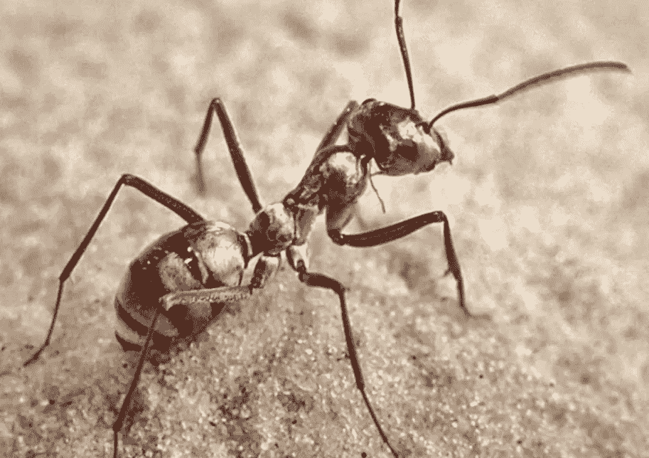

# 基于 keras 的深度学习中的迁移学习

> 原文：<https://medium.com/analytics-vidhya/transfer-learning-in-deep-learning-using-keras-b12e0ca6c459?source=collection_archive---------22----------------------->

迁移学习是一种机器学习技术，其中在一个任务上训练的模型被重新用于第二个相关的任务

在深度学习中，迁移学习是一种技术，通过这种技术，神经网络模型首先针对与正在解决的问题类似的问题进行训练。然后，来自训练模型的一个或多个层被用在针对感兴趣的问题训练的新模型中。

**1)开发模型方法**
选择源任务

您必须选择具有大量数据的相关预测建模问题，其中输入数据、输出数据和/或在从输入数据到输出数据的映射过程中学习到的概念之间存在某种关系。

*开发源模型*

接下来，你必须为第一个任务开发一个熟练的模型。该模型必须比天真的模型更好，以确保已经执行了一些特征学习。

*重用模型。*

然后，源任务上的模型拟合可以用作感兴趣的第二个任务上的模型的起点。这可能涉及到使用模型的全部或部分，这取决于所使用的建模技术。

*调谐模式。*

可选地，该模型可能需要根据可用于感兴趣的任务的输入-输出对数据进行调整或改进。

**2)预训练模型方法**
选择源模型。

从可用模型中选择预训练的源模型。许多研究机构发布大型和挑战性数据集上的模型，这些数据集可能包含在候选模型池中以供选择。

*重用模型。*

然后，模型预训练模型可以用作感兴趣的第二任务的模型的起点。这可能涉及到使用模型的全部或部分，这取决于所使用的建模技术。

*调模型。*

可选地，该模型可能需要根据可用于感兴趣的任务的输入-输出对数据进行调整或改进。

我们可以将其中一些使用模式总结如下:

**1)分类器:**预先训练好的模型直接用于对新图像进行分类。
**2)独立特征提取器:**预训练的模型或模型的某一部分，用于预处理图像并提取相关特征。
**3)集成特征提取器:**预训练模型或模型的某个部分被集成到新模型中，但是预训练模型的层在训练期间被冻结。
**4)权重初始化:**将预训练模型或模型的某个部分集成到新模型中，并且与新模型一致地训练预训练模型的层

让我们以蚂蚁图像为例，使用迁移学习对其进行分类

**VGG16** (include_top=True，weights='imagenet '，input_tensor=None，input_shape=None，pooling=None，classes=1000)默认参数

**include_top (True):** 是否包含模型的输出层。如果您正在根据自己的问题拟合模型，则不需要这些。
**权重(' imagenet'):** 加载什么权重。如果您对从头开始训练模型感兴趣，可以指定 **None** 不加载预训练的权重。
**input _ tensor(None):**一个新的输入层，如果你想让模型适合不同大小的新数据。
**input _ shape(None):**如果改变输入层，模型预期拍摄的图像尺寸。
**池化(无):**训练一组新的输出层时使用的池化类型。当`include_top`为`False`
**类时，用于特征提取的可选池模式(1000):** 模型的类的数量(如输出向量的大小)，仅当`include_top`为`True`时指定，且未指定`weights`参数时指定。

1.  **分类器:**

预先训练的模型可以直接用于将新照片分类为图像分类中的 1，000 个已知类别之一

我们将使用 VGG16，它预计图像大小为 224*224

VGG16(include_top=True，weights='imagenet '，input_tensor=None，input_shape=None，pooling=None，classes=1000)默认参数

我们的 keras 模型在没有任何训练的情况下以 91.98 的准确度将图像分类为蚂蚁

**2)作为特征提取器预处理器的预训练模型:**

预训练模型可用于提取新图像的特征。然后，这些特征可以用作新模型开发中的输入。

VGG16 模型的最后几层是输出层之前的完全连接层。这些层将提供一组复杂的特征来描述给定的输入图像，并且可以在训练用于图像分类或相关计算机视觉任务的新模型时提供有用的输入。

手动移除最终输出图层。这意味着具有 4，096 个节点的倒数第二个完全连接的层将是新的输出层。

如果与先前的模型概要**预测进行比较，则**层缺失，特征向量大小为 **4096** ，并且可以对新的训练数据集中的每张照片重复该过程，以获得每张照片的特征

**3)预训练模型作为模型中的特征提取器:**

我们可以直接使用预训练模型中的一些或所有层作为新模型的特征提取组件。

这可以通过加载模型，然后简单地添加新层来实现。这可能涉及添加新的卷积层和池层以扩展模型的特征提取功能，或者添加新的全连接分类器类型层以了解如何解释新数据集上的提取特征，或者进行某种组合。

例如，我们可以通过将" *include_top* "参数指定为" *False* "来加载没有模型分类器部分的 VGG16 模型，并将新数据集中图像的首选形状指定为 300×300。

注意: **input_shape** 可选形状元组，仅在`include_top`为`False`时指定(否则输入形状必须为`(224, 224, 3)`

在这里，我们移除了 VGG16 中的展平层、密集层和输出层(通过给 include_top=False ),并创建了我们自己的层

或者，我们可能希望使用 VGG16 模型层，但训练模型的新层，而不更新 VGG16 层的权重。这将允许新的输出层学习解释 VGG16 模型的学习特征。

这可以通过在训练之前将加载的 VGG 模型中的每个层上的“*可训练的*”属性设置为假来实现。例如:

您可以挑选哪些层是可训练的。

例如，您可能希望重新训练模型中较深的一些卷积层，但不训练模型中较早的层。例如:

**如何在用于迁移学习的 keras 中更改图像的输入形状尺寸**

通常我们认为卷积神经网络接受固定大小的输入(即 *224×224* 、 *227×227* 、 *299×299* 等)。)

为什么您可能想要利用不同的图像尺寸？

有两个常见的原因:

*   你的输入图像尺寸 ***比 CNN 训练的*** 要小得多，增加它们的尺寸会引入太多的伪像，并极大地损害损失/准确性。
*   您的图像是 ***高分辨率*** 并且包含难以检测的小物体。调整到 CNN 的原始输入尺寸会损害准确性，你假设增加分辨率将有助于改善你的模型。

在 Keras 中，您可以通过 **input_tensor (None):** 一个新的输入层来更改用于迁移学习的输入图像尺寸，如果您想要在不同大小的新数据上拟合模型的话。

VGG16 带有 224*224*3 通过使用 input_tensor 您可以将图像尺寸更改为 128*128*3

但是，如果您的输入图像尺寸太小，那么 CNN 会在向前传播期间自然减少体积尺寸，然后有效地“用完”数据。

例如，当使用 *48×48* 输入图像时，我收到了以下错误消息:

使用 Keras 更改输入形状尺寸以进行微调

**ValueError** :输入 shapes: [？,1,1,512].

**参考文献:**

 [## 基于计算机视觉模型的 Keras 迁移学习——机器学习掌握

### 深度卷积神经网络模型可能需要几天甚至几周的时间在非常大的数据集上进行训练。一种方法…

machinelearningmastery.com](https://machinelearningmastery.com/how-to-use-transfer-learning-when-developing-convolutional-neural-network-models/) 

[https://www . pyimagesearch . com/2019/06/24/change-input-shape-dimensions-for-fine-tuning-with-keras/](https://www.pyimagesearch.com/2019/06/24/change-input-shape-dimensions-for-fine-tuning-with-keras/)