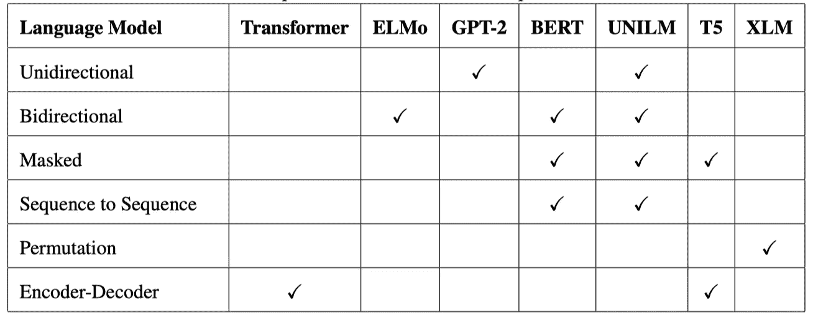
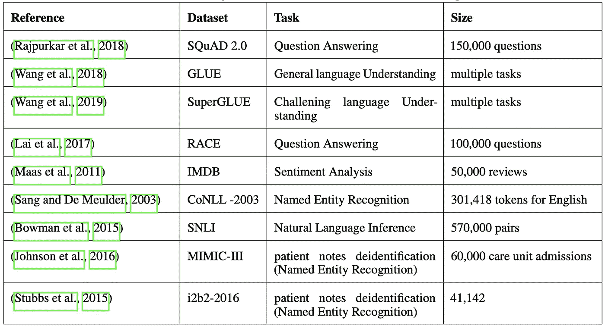
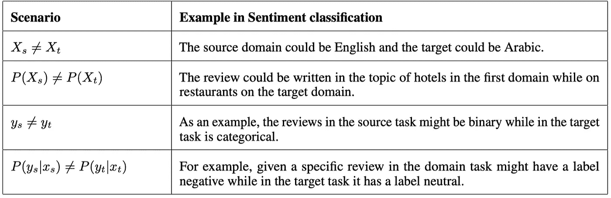

# 自然语言处理中的迁移学习:综述

> 原文：<https://medium.com/analytics-vidhya/transfer-learning-in-nlp-a-survey-2510e31b5f4c?source=collection_archive---------12----------------------->

深度学习模型的局限性，如需要大量数据来训练模型，以及对巨大计算资源的需求，迫使人们研究知识转移的可能性。如今，许多大型的 DL 模型正在出现，这些模型需要迁移学习。本文旨在讨论迁移学习在自然语言处理中的最新进展。本帖大部分工作摘自****《自然语言处理中迁移学习的调查》(* Alyafeai et al. 2020)。***

## ***用于 NLP 的型号***

*让我们从基于三种主要架构的用于 NLP 的不同模型开始。*

1.  ***基于循环的模型***

*递归神经网络(RNNs)处理顺序数据。在 RNNs 中，我们将先前的模型状态与每个输入一起传递，以使它们学习顺序上下文。RNNs 在许多任务中表现出色，例如语音识别、翻译、文本生成、时间序列分类和生物建模。不幸的是，由于使用反向传播和它的顺序性质，RNNs 遭受消失梯度的问题。由于梯度消失的问题，当误差通过重现层返回时，它会严重衰减。为了克服这个问题，出现了许多想法，例如使用整流线性单元(ReLU)作为激活函数，然后是长短期记忆(LSTM)架构、双向 lstm、门控递归网络(GRUs)。GRUs 是 lstm 最快的版本，在一些任务中可以击败 lstm，例如自动捕获输入句子的语法属性。*

***2。基于注意力的模型***

*除了 RNNs 的上述问题之外，相对于当前处理的单词，它给予每个单词序列相同的权重。此外，它将序列激活聚集在一个向量中，这使得学习过程忘记了过去输入的单词。另一方面，基于注意力的模型根据相似性分数对输入的每个单词给予不同的关注。注意可以在不同的序列之间或在同一序列中被应用，这被称为自我注意。*

***3。基于 CNN 的模型***

*卷积神经网络(CNN)最初被提出用于图像识别任务，例如字符识别。它使用卷积和最大池层进行子采样。卷积图层提取要素，池化图层减少提取要素的空间大小。在自然语言处理中，细胞神经网络已经成功地用于句子分类任务，如电影评论、问题分类等。字符级 CNN 用于文本分类。CNN 还被用于语言建模，其中门控卷积层被用于保持更大的上下文，并且与传统的递归神经网络相比，可以被并行化。*

## ***语言模型***

*语言建模是对取自固定词汇的一组标记的概率分布的学习。以下是文献中的不同方法。*

1.  ****单向 LM:*** 在这种技术中，我们考虑位于当前上下文左侧或右侧的标记。它也被称为自回归编码。*
2.  ****双向 LM:*** 在这种技术中，每一个标记都可以照顾到当前上下文中的任何其他标记。当使用这种技术时，下一个单词预测的任务变得无关紧要，因为任何令牌都可以进行下一个单词预测。为了克服这一点，我们通常使用掩蔽语言模型。*
3.  ****屏蔽 LM:*** 这种技术一般用在双向 LM 中，我们在当前上下文中随机屏蔽一些记号，然后预测这些屏蔽记号。它也被称为去噪自动编码。*
4.  ****序列到序列 LM:*** 该技术将输入分成两个独立的部分。在第一部分中，每个标记都可以看到该部分中任何其他标记的上下文，但在第二部分中，每个标记只能关注左边的标记。*
5.  ****置换 LM:*** 这种语言模型结合了自回归和自动编码的优点。*
6.  ****编码器-解码器 LM* :** 与使用单个编码器/解码器块堆栈的其他方法相比，这种方法使用两个块。*

*下表显示了文献中各种预训练模型之间的比较。*

**

*该表显示了文献中各种预训练模型之间的比较。来源:[https://arxiv.org/pdf/2007.04239.pdf](https://arxiv.org/pdf/2007.04239.pdf)*

## *数据集*

*过去有许多数据集被用于 NLP 任务。下表提供了一些数据集的摘要。*

**

*用于迁移学习的数据集总结。来源:https://arxiv.org/pdf/2007.04239.pdf*

## *迁移学习*

*现在，我们将讨论自然语言处理中的迁移学习。如果我们有一个源域-任务元组 **(Ds，Ts)** 和一个不同的目标域-任务元组 **(Dt，Tt )** ，迁移学习可以定义为在目标域任务的学习过程中使用源域和任务的过程。用数学术语来说，迁移学习的目的就是利用从 ***Ds*** 中获得的信息，学习***【Dt***中的目标条件概率分布 **P(Yt|Xt)** 和 **Ds ≠Dt** 或 **Ts ≠ Tt** 。在下表中，我们比较了当域对不同或任务对不同时的不同场景。*

**

*域和任务对的所有可能组合。来源:[https://arxiv.org/pdf/2007.04239.pdf](https://arxiv.org/pdf/2007.04239.pdf)*

## *迁移学习的类型*

*自然语言处理中的迁移学习可以大致分为两类:*

1.  *传导迁移学习*
2.  *归纳迁移学习*

## *传导迁移学习*

*直推式迁移学习是指对于相同的任务，目标域或任务没有标记数据或只有很少的标记样本。它可以进一步分为以下子类别:*

****A .域适配:*** 这个涉及到学习一个目标域中不同的数据分布。如果要训练的新任务具有不同的分布或者标记的数据量很少，那么这是有用的。在最近的一项工作中，为了将知识从多个领域转移到一个领域，研究人员在无监督的方法中应用了师生模型。对于域相似性，他们使用了三种度量方法，即 Renyi 散度、Jensen-Shannon 散度和最大平均差异。在 12 个域对中，该模型在 8 个上实现了单源无监督域适应的最新结果。*

*另一项工作涉及使用对抗性领域适应检测重复问题。这种方法有三个主要部分:一个编码器，一个相似性函数，和一个域适应模块。编码器对问题进行编码，并进行优化以欺骗领域分类器，使其认为问题来自目标领域。相似性函数计算一对问题相似或重复的概率。并且使用域适应组件来减小目标和源域分布之间的差异。这种方法被证明是更好的，对于不同的域对，比最佳基准平均提高了约 5.6%。*

****B .跨语言迁移学习:*** 这个涉及到适应目标领域的一门不同的语言。当我们想要使用高资源语言来学习低资源语言中的相应任务时，这种方法是有用的。在其中一项工作中，研究人员提出了一个跨语言环境下的词性标注模型，其中输入和输出语言具有不同的输入大小。该模型使用两个双向 lstm(BLSTM ),称为公共和私有 bl STM。公共 BLSTM 具有不同语言之间的共享参数，而私有 BLSTM 具有特定于语言的参数。然后，使用交叉熵损失优化，将两个模块的输出用于提取词性标注。在这种模型语言中，使用了对抗训练，这迫使公共 BLSTM 是语言不可知的。这种方法在没有任何关于源语言和目标语言之间关系的语言学知识的情况下，在 14 种语言上显示了显著的词性标注结果。*

*在另一项工作中，一个新的数据集被用来评估三种不同的跨语言迁移方法在用户意图分类和时隙检测任务中的作用。该数据集包含 57k 个英语、泰语和西班牙语的注释话语，并被分为三个领域，即提醒、天气和警报。使用的三种跨语言转换方法是翻译训练数据，使用跨语言预训练嵌入，以及使用多语言机器翻译编码器作为上下文单词表示的新方法。后两种方法优于只有几百个训练样本的目标语言(即低资源目标语言)上的翻译方法。*

## *归纳迁移学习*

*归纳迁移学习是指对于源领域和目标领域中的不同任务，我们只标记目标领域中的数据。它可以分为两个子类别:*

****A .顺序迁移学习:*** 它涉及以顺序的方式学习多个任务。它进一步分为五个子类别:*

***顺序微调:**微调是指在目标任务上对预先训练好的模型进行训练。在过去几年里，在这一类别下已经做了大量的工作。最近的一项工作涉及统一预训练语言模型的模型，即 UNILM。它结合了三个不同的训练目标，以统一的方式对模型进行预训练，包括单向、双向和序列到序列。UNILM 模型在不同的任务上取得了最先进的结果，包括生成性问题回答、抽象摘要和基于文档的对话响应生成。*

*另一项工作涉及研究大型语言模型的知识检索性能。在这项工作中，研究人员研究了开放领域问题回答的任务，约束条件是不能查找任何外部资源来回答问题。调查是使用 T5 预训练模型完成的，该模型有 110 亿个参数，因此可以存储大量知识，这些知识可以从特定任务中提取。此外，T5 是文本到文本的模型，这使得它适合于开放领域的问题回答任务。通过使用带有特定任务标签的问题作为输入，任务被映射到 T5 模型，并且它预测答案作为输出。结果表明，这种方法优于使用外部领域明确查找答案的模型。*

***适配器模块:**它们是用于 NLP 的紧凑且可扩展的迁移学习方法，通过为每个任务仅添加*几个*可训练参数来提供参数效率，并且随着新任务的添加，先前的任务不需要重新访问。在最新的工作中，适配器模块用于通过微调 BERT 模型在不同任务之间共享参数。使用投影注意层(PALs ),它是低维的多头注意层，与 BERT 的注意层并行训练。该模型针对 GLUE 任务进行了评估，并在实现参数效率的同时获得了最先进的文本蕴涵结果。*

***基于特征:**在这种方法中，预训练模型的表示被馈送到另一个模型。它提供了对类似数据再次使用特定于任务的模型的好处。此外，如果重复使用相同的数据，提取一次特征可以节省大量计算资源。在最近的一项工作中，研究人员使用半监督方法来完成序列标记任务。使用预训练的神经语言模型，其在无监督的方法中被训练。这是一个双向语言模型，其中向前和向后隐藏状态连接在一起。然后，输出被扩充为标记表示，并被馈送到监督序列标记模型(TagLM ),该模型然后以监督方式被训练以输出每个序列的标记。使用的数据集是 CoNLL 2003 NER 和 CoNLL 200 组块。与其他形式的迁移学习相比，该模型在两个任务上都取得了最先进的结果。*

***Zero-shot:** 这是最简单的方法，对于给定的预训练模型，我们不应用任何训练程序来优化/学习新参数。在最近的一项研究中，研究人员在文本分类中使用了零触发转移。每个分类任务都被建模为一个文本蕴涵问题，其中正类意味着有蕴涵，负类意味着没有。然后，在零镜头场景中，使用预训练的关于文本分类的 Bert 模型在不同的任务中对文本进行分类，如情感检测、主题分类和情境框架检测。与 Word2Vec 等无人监督的任务相比，这种方法在三项任务中的两项任务中取得了更好的准确性。*

****B .多任务学习:*** 它涉及到同时学习多个任务。例如，如果我们有一个预先训练好的模型，并且想要将学习转移到多个任务中，那么所有的任务都是以并行的方式学习的。*

***多任务微调:**在最近的工作中，研究人员使用这种方法来探索使用统一文本到文本转换转换器(T5)的效果。所使用的架构类似于具有编码器-解码器网络的变压器模型。但是它使用了完全可见的屏蔽，而不是随意屏蔽，特别是对于需要基于前缀(如翻译)进行预测的输入。用于训练模型的数据集是从大约 750GB 的通用爬网数据集创建的。该模型需要在如此大的数据集上训练大约 110 亿个参数。多任务预训练模型用于在不同任务上表现良好，其中模型通过使用诸如“将英语翻译成德语”的前缀在不同任务上进行训练。通过微调，该模型在文本分类、摘要和问题回答等不同任务上取得了最先进的结果。*

## *结论和未来范围*

*在这项调查中，我们看到基于注意力的模型比基于 RNN 和 CNN 的语言模型更受欢迎。此外，BERT 似乎是语言建模的默认架构，因为它的双向架构使它在许多下游任务中取得了成功。在用于 NLP 的迁移学习技术中，顺序微调似乎是最受欢迎的方法。此外，近年来多任务微调似乎越来越受欢迎，因为许多研究发现，同时进行多任务训练会产生更好的结果。此外，我们看到，与 NLP 中的其他任务相比，文本分类数据集的使用更广泛，因为在此类任务中微调模型更容易。*

*对于未来的工作，建议使用双向模型，如用于抽象问题回答、情感分类和词性标注等特定任务的 BERT，以及用于生成性问题回答、摘要和文本生成等生成性任务的 GPT-2、T5 等模型。此外，在未来，适配器模块可以取代顺序微调，因为它们显示出与传统微调相当的结果，并且由于参数共享而更快、更紧凑。总之，我认为应该进行广泛的研究来缩小这些大型语言模型的规模，以便它们可以很容易地部署在嵌入式设备和网络上。*

## *参考*

 *[## 自然语言处理中的迁移学习综述

### 深度学习模型通常需要大量的数据。然而，这些大型数据集并不总是可以获得的…

arxiv.org](https://arxiv.org/abs/2007.04239)*