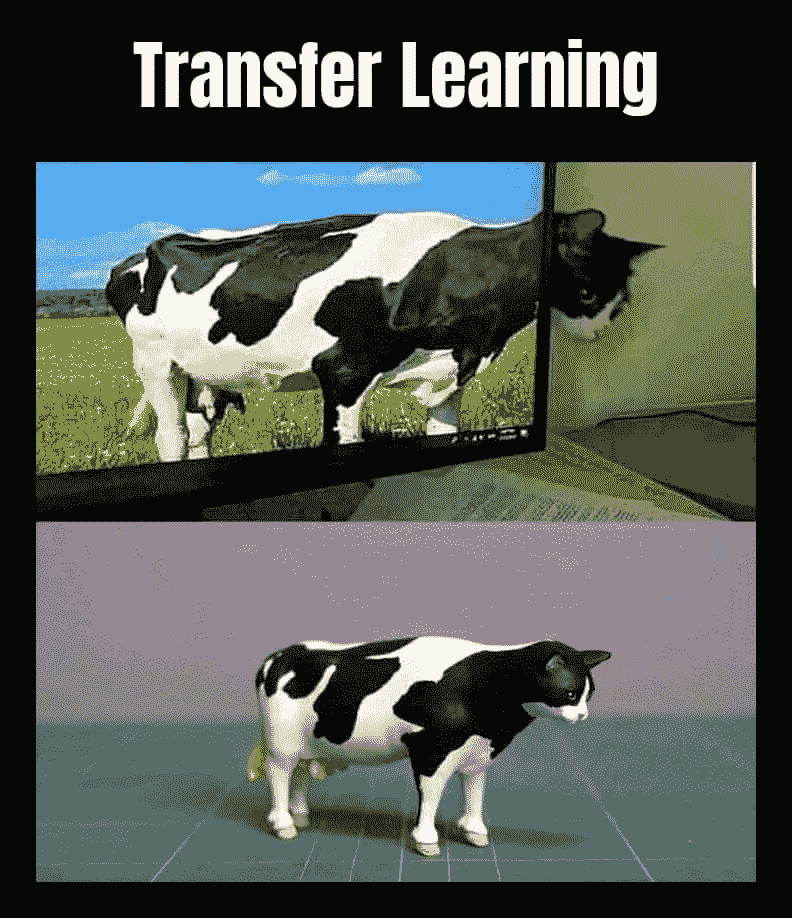

# “神经网络中的迁移学习”一言以蔽之。

> 原文：<https://medium.com/analytics-vidhya/transfer-learning-in-nutshell-f49cf3ab5f7f?source=collection_archive---------19----------------------->

构建完美的神经网络是**经验过程**，需要一点时间和经验来实现它。但是，现在一天的**转移学习**使它的方式更快，更少忙乱。那么，什么是迁移学习呢？简单来说。迁移学习基本上是一个借用部分或全部现有的**预训练模型**的过程。有哪些预先训练好的模型？该模型已经在大型数据集上进行了训练，可供所有人使用。



图片中迁移学习的定义。

所以你有了迁移学习的想法。现在我们来讨论一下如何动手做。有两种方法可以完成这一过程，第一种是**只是转移学习**，它只是将预训练的模型原样用于您的模型，而不对其进行任何更改。第二步**用迁移学习进行微调**，这里的过程和你平时做的一样，只是做了一些剪裁。目前有许多预训练模型可用，如 Xception、VGG16、VGG19、ResNet50、InceptionV3、MobileNet、MobileNetV2 等。在这里，我在这篇文章中使用的是 16 层 CNN 模型，在属于 1000 个类别的 1400 多万张图像上进行训练。

因此，首先让我们把注意力集中在标准的迁移学习上，然后你将开始微调。这里的 VGG16 模型在 keras 库中可用，所以基本上我们可以从 keras 导入它并开始工作

```
from tensorflow.keras.applications.vgg16 import VGG16
```

就是这样！你做到了，简单吧？现在让我们为模型创建一个对象，你已经为训练做好了准备。

```
vgg_model = VGG16(input_shape=<image input size>,
                  weights="imagenet",
                  include_top=False)
```

这里，对象 vgg_model 是 VGG16 模型，它采用类似“input_shape”的参数，这将是您想要给出的图像数据集的形状。“权重”是模型训练的基础，如果你想为自己初始化模型，那么你可以简单地将“图像网”替换为“无”。“include_top”基本上是网络的最后一层或输出层，我们不需要它，所以我将其设置为“False ”,因为它有 1000 个输出，而我们的模型输出与此不同。如果你想要它，那么只要把它变成“真”就可以了。

通过这两个简单的步骤，你得到了 vgg_model 对象中的 VGG16。你会得到这个。

```
>>vgg_model.summary() Model: "vgg16" _________________________________________________________________ Layer (type)                 Output Shape              Param #    ================================================================= input_1 (InputLayer)         [(None, 224, 224, 3)]     0          _________________________________________________________________ block1_conv1 (Conv2D)        (None, 224, 224, 64)      1792       _________________________________________________________________ block1_conv2 (Conv2D)        (None, 224, 224, 64)      36928      _________________________________________________________________ block1_pool (MaxPooling2D)   (None, 112, 112, 64)      0          _________________________________________________________________ block2_conv1 (Conv2D)        (None, 112, 112, 128)     73856      _________________________________________________________________ block2_conv2 (Conv2D)        (None, 112, 112, 128)     147584     _________________________________________________________________ block2_pool (MaxPooling2D)   (None, 56, 56, 128)       0          _________________________________________________________________ block3_conv1 (Conv2D)        (None, 56, 56, 256)       295168     _________________________________________________________________ block3_conv2 (Conv2D)        (None, 56, 56, 256)       590080     _________________________________________________________________ block3_conv3 (Conv2D)        (None, 56, 56, 256)       590080     _________________________________________________________________ block3_pool (MaxPooling2D)   (None, 28, 28, 256)       0          _________________________________________________________________ block4_conv1 (Conv2D)        (None, 28, 28, 512)       1180160    _________________________________________________________________ block4_conv2 (Conv2D)        (None, 28, 28, 512)       2359808    _________________________________________________________________ block4_conv3 (Conv2D)        (None, 28, 28, 512)       2359808    _________________________________________________________________ block4_pool (MaxPooling2D)   (None, 14, 14, 512)       0          _________________________________________________________________ block5_conv1 (Conv2D)        (None, 14, 14, 512)       2359808    _________________________________________________________________ block5_conv2 (Conv2D)        (None, 14, 14, 512)       2359808    _________________________________________________________________ block5_conv3 (Conv2D)        (None, 14, 14, 512)       2359808    _________________________________________________________________ block5_pool (MaxPooling2D)   (None, 7, 7, 512)         0          ================================================================= Total params: 14,714,688 Trainable params: 14,714,688 Non-trainable params: 0 _________________________________________________________________
```

在这里你可以看到 VGG16 模型的所有 16 层，在底部有一些描述。“总参数”是一个模型可以拥有的参数总数。“可训练参数”是你可以训练的参数数量，基本上这个模型是空的，带有权重，这意味着你只有 vgg16 的架构。最后“不可训练参数”顾名思义，这些参数在训练过程中是冻结的，不可更新。请注意，这里您看不到最后一层，因为我们将其设置为“假”。

现在你有了迁移学习的想法，让我们继续微调它。这里的过程是一样的，但是我们只取那些我们需要的，比如模型的层数。现在让我们举一个例子，假设我们需要从 VGG16 模型构建一个只有 10 层的模型，并向它添加另一个额外的层。这可以通过创建两个对象来实现，一个用于我们的模型，另一个用于完整的 VGG16 模型。我们首先声明一个空的顺序对象，然后我们继续从 vgg16 对象添加层到这个对象。为此，我们进口了一些 keras 组件。

```
from tensorflow.python.keras.models import Sequential
from tensorflow.keras.applications.vgg16 import VGG16
from tensorflow.python.keras.layers import Dense, Conv2D, Flatten
```

当我们构建顺序模型时，我们将导入顺序和进一步的密集、Conv2D 和扁平化，以便向网络添加额外的层。这可以这样做，

```
#model to be built
model = Sequential()#vgg16 model
vgg_model = VGG16(input_shape=<image input size>,
                  weights="imagenet",
                  include_top=False)
```

所以这里 model 和 vgg_model 是对象，其中 model 是空序列模型，vgg_model 是 16 层模型。因为我们应该从 16 层中只取 10 层 VGG16。这可以通过，

```
for layer in vgg_model.layers[:11]:
      model.add(layer)
```

这里“层”将迭代 vgg_model 的所有 16 层，这是通过使用一种称为“vgg_model.layers”或 <model_name>.layers 的方法来完成的。由于我们只需要 10 层，所以我们通过说“vgg_model.layers[:11]”将迭代限制到第 10 层。如果我们总结一下这个模型，</model_name>

```
>>model.summary() Model: "sequential_1" _________________________________________________________________ Layer (type)                 Output Shape              Param #    ================================================================= block1_conv1 (Conv2D)        (None, 224, 224, 64)      1792       _________________________________________________________________ block1_conv2 (Conv2D)        (None, 224, 224, 64)      36928      _________________________________________________________________ block1_pool (MaxPooling2D)   (None, 112, 112, 64)      0          _________________________________________________________________ block2_conv1 (Conv2D)        (None, 112, 112, 128)     73856      _________________________________________________________________ block2_conv2 (Conv2D)        (None, 112, 112, 128)     147584     _________________________________________________________________ block2_pool (MaxPooling2D)   (None, 56, 56, 128)       0          _________________________________________________________________ block3_conv1 (Conv2D)        (None, 56, 56, 256)       295168     _________________________________________________________________ block3_conv2 (Conv2D)        (None, 56, 56, 256)       590080     _________________________________________________________________ block3_conv3 (Conv2D)        (None, 56, 56, 256)       590080     _________________________________________________________________ block3_pool (MaxPooling2D)   (None, 28, 28, 256)       0          ================================================================= Total params: 1,735,488 Trainable params: 1,735,488 Non-trainable params: 0 _________________________________________________________________
```

正如你所看到的，我们只从 VGG16 模型中提取了 10 层，我知道这很简单，对吗？现在我们得到了“模型”对象，让我们完成这个 CNN 模型。我们可以添加另一层，就像我们在构建 CNN 时所做的一样。

```
model.add(Conv2D(32, (3, 3), activation = "relu"))
model.add(Flatten())
model.add(Dense(2, activation="softmax"))
```

因此，这增加了另一个 Conv2D 层，进一步平坦的完全连接，这里我已经添加了 2 个节点作为输出。现在，如果我们总结一下这个模型，它看起来会像这样。

```
>>model.summary() Model: "sequential_1" _________________________________________________________________ Layer (type)                 Output Shape              Param #    ================================================================= block1_conv1 (Conv2D)        (None, 224, 224, 64)      1792       _________________________________________________________________ block1_conv2 (Conv2D)        (None, 224, 224, 64)      36928      _________________________________________________________________ block1_pool (MaxPooling2D)   (None, 112, 112, 64)      0          _________________________________________________________________ block2_conv1 (Conv2D)        (None, 112, 112, 128)     73856      _________________________________________________________________ block2_conv2 (Conv2D)        (None, 112, 112, 128)     147584     _________________________________________________________________ block2_pool (MaxPooling2D)   (None, 56, 56, 128)       0          _________________________________________________________________ block3_conv1 (Conv2D)        (None, 56, 56, 256)       295168     _________________________________________________________________ block3_conv2 (Conv2D)        (None, 56, 56, 256)       590080     _________________________________________________________________ block3_conv3 (Conv2D)        (None, 56, 56, 256)       590080     _________________________________________________________________ block3_pool (MaxPooling2D)   (None, 28, 28, 256)       0          _________________________________________________________________ conv2d_1 (Conv2D)            (None, 26, 26, 32)        73760      _________________________________________________________________ flatten_1 (Flatten)          (None, 21632)             0          _________________________________________________________________ dense_1 (Dense)              (None, 2)                 43266      ================================================================= Total params: 1,852,514 Trainable params: 1,852,514 Non-trainable params: 0 _________________________________________________________________
```

我们也完成了微调，就这样！简单吧？现在尝试在你的项目中使用其他预先训练的模型，这将使你的项目在性能上更加有效。

但是…… *等一下，*

有一个技巧可以产生实际的差异，采用没有任何权重的完全空模型或使所有可训练参数为真会使你的网络失去一些重要的价值。这些网络是在数百万个数据集上训练的，因此模型肯定会有一些复杂的参数，这些参数是用常规方法无法获得的。所以我的建议是保持开始的一些层打开学习，其余的冻结。这样，您的模型将在初始层熟悉您的数据集，并在网络末端变得更加智能。为此，您只需在为模型创建对象后添加几行代码。

```
for layer in model.layers[7:]:
    layer.trainable = False
```

这两行将使你的模型半开放供学习，其余的不开放。在这里，我允许模型学习到第 7 层，之后的任何东西都不允许有任何重量的增加。如果我们进行总结，我们会得到:

```
>> model.summary() Model: "sequential_1" _________________________________________________________________ Layer (type)                 Output Shape              Param #    ================================================================= block1_conv1 (Conv2D)        (None, 224, 224, 64)      1792       _________________________________________________________________ block1_conv2 (Conv2D)        (None, 224, 224, 64)      36928      _________________________________________________________________ block1_pool (MaxPooling2D)   (None, 112, 112, 64)      0          _________________________________________________________________ block2_conv1 (Conv2D)        (None, 112, 112, 128)     73856      _________________________________________________________________ block2_conv2 (Conv2D)        (None, 112, 112, 128)     147584     _________________________________________________________________ block2_pool (MaxPooling2D)   (None, 56, 56, 128)       0          _________________________________________________________________ block3_conv1 (Conv2D)        (None, 56, 56, 256)       295168     _________________________________________________________________ block3_conv2 (Conv2D)        (None, 56, 56, 256)       590080     _________________________________________________________________ block3_conv3 (Conv2D)        (None, 56, 56, 256)       590080     _________________________________________________________________ block3_pool (MaxPooling2D)   (None, 28, 28, 256)       0          _________________________________________________________________ conv2d_1 (Conv2D)            (None, 26, 26, 32)        73760      _________________________________________________________________ flatten_1 (Flatten)          (None, 21632)             0          _________________________________________________________________ dense_1 (Dense)              (None, 2)                 43266      ================================================================= Total params: 1,852,514 Trainable params: 555,328 Non-trainable params: 1,297,186 _________________________________________________________________
```

因此，您可以看到，我们有 555，328 个参数可以训练或用于反向传播中的权重更新，1，297，186 个参数将保持与 VGG16 模型相同。原来如此！现在你知道迁移学习了🎉。检查以下链接的完整代码脚本，不要忘记尝试自己和尝试它 ALOT。

[](https://github.com/Jairus313/TransferLearning) [## jai RUS 313/转移学习

### 在 GitHub 上创建一个帐户，为 Jairus313/TransferLearning 的发展做出贡献。

github.com](https://github.com/Jairus313/TransferLearning) 

不断学习🤓💻….！