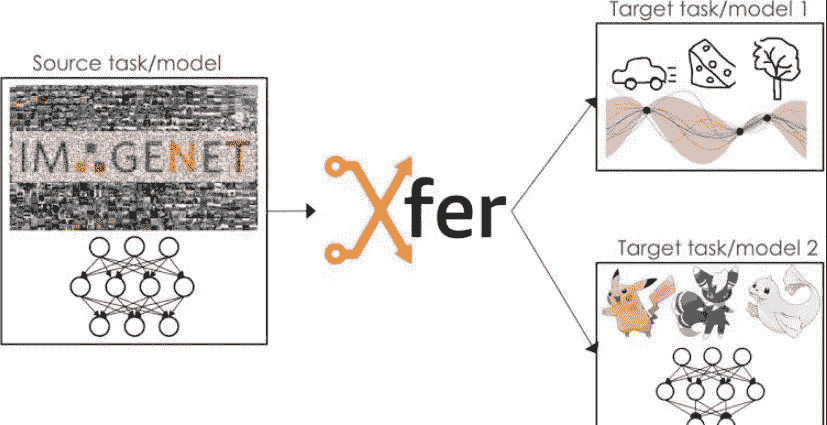
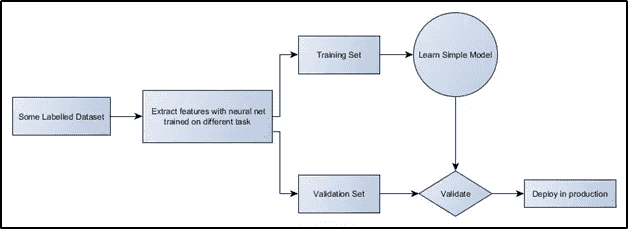
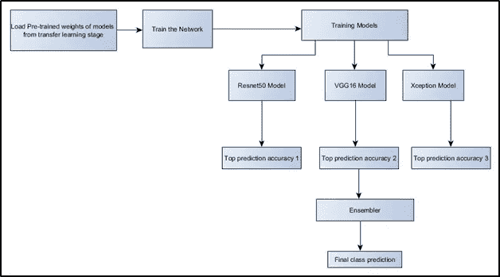
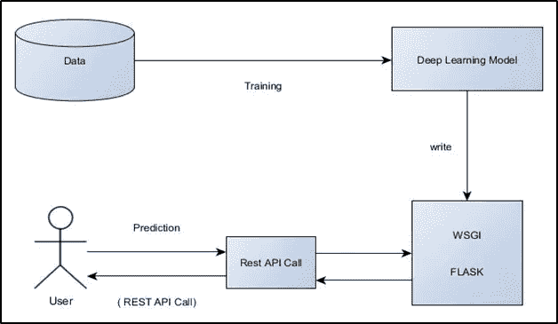
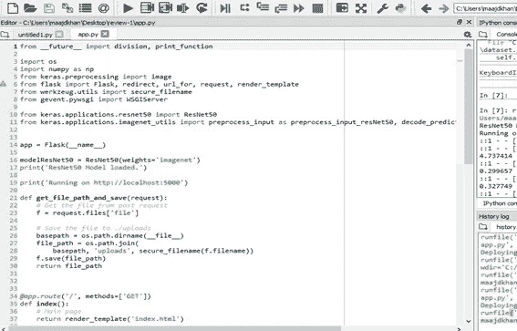
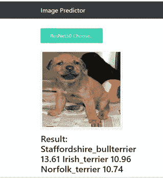
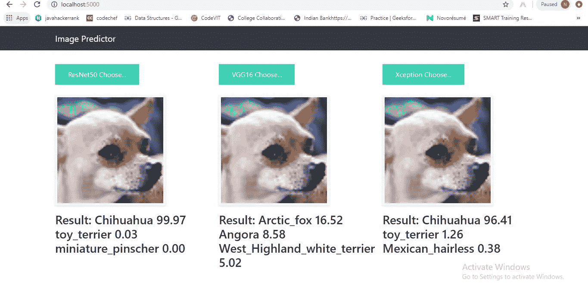

# 迁移学习(Keras)——生活变得更加简单！！

> 原文：<https://medium.com/analytics-vidhya/transfer-learning-life-just-got-easier-11805a375039?source=collection_archive---------19----------------------->

## **挑选你的模型，部署它，然后玩一玩(Resnet50 + VGG16 + Xception) - >集合它们..**

**使用各种深度学习模型进行图像分类的 web App。**

最近，深度学习因为其在各种机器学习算法中的表现而获得了很大的流行。深度学习试图通过利用多个处理层来对信息的高级抽象进行建模。多类图像分类是当前人工智能领域一个具有广泛应用前景的主要研究方向。本课程项目描述了这种学习方法的使用，如 VGG16、ResNet50、Xception 等。；在 ImageNet 年度挑战任务的大规模多类图像分类数据集上执行多类图像分类并实现这些深度学习算法。我们将使用一个大型训练过的深度卷积神经网络来将 120 万张高分辨率图像分类到 1000 个不同的类别中。该实现将各种图像分类到其最可能的类别中，并显示预测概率的说明性示例。使用 python 的 flask API 开发了一个 web 应用程序，使用上述模型将这些图像分为不同的类别。我们的目标是找到一种计算效率高的算法，以更高的精度正确地对图像进行分类。

**转移学习:**

如果不是为了**迁移学习**，机器学习对于一个绝对的初学者来说是一件相当困难的事情。在最底层，机器学习包括计算一个函数，该函数将一些输入映射到它们相应的输出。虽然函数本身只是一堆加法和乘法运算，但当通过一个非线性激活函数并将这些层堆叠在一起时，**函数可以用来学习任何东西**，只要有足够的数据可以学习，以及巨大的计算能力。

这就是迁移学习发挥作用的地方。在迁移学习中，我们采用已经训练好的模型的预训练权重(该模型已经在几天内在几个高功率 GPU 上对属于 1000 个类别的数百万幅图像进行了训练),并使用这些已经学习的特征来预测新的类别。*迁移学习的优势在于，不需要非常大的训练数据集，并且不需要太多的计算能力，因为我们使用预先训练的权重，并且只需要学习最后几层的权重。*

它工作得如此好的原因是，我们使用了一个在 imagenet 数据集上预先训练的网络，这个网络已经学会了在其初始层中识别不同对象的微小形状和小部分。通过使用预训练网络进行迁移学习，我们只需在预训练网络的末端添加几个密集层，并了解这些已学习特征的组合有助于识别新数据集中的对象。

因此，我们只训练几个密集层。此外，我们正在使用这些已经学习的琐碎特征的组合来识别新的对象。所有这些有助于使训练过程非常快，并且与从头开始训练 conv 网络相比，需要非常少的训练数据。

## **硬件要求:**

四核英特尔酷睿 i7 Skylake 或更高处理器

8GB 或更高的内存(8GB 是可以的，但对于您可能想要和/或期望的性能来说不是)

**GPU**:RTX 2070/RTX 2080 Ti/GTX 1070/GTX 1080/GTX 1070 Ti

**CPU** :每个 GPU 1-2 个内核，取决于您预处理数据的方式

数据硬盘(> = 1TB)

额外的监视器

PSU 有足够的 PCIe 连接器(6+8 针)

用于处理多个 GPU 的鼓风机式风扇

**带有多个 PCIe 插槽的主板**

## **软件要求:**

Windows 操作系统

Python 3.6 以上版本

Anaconda 导航器(工具)

Spyder IDE

Flask API (Python)

数字包

操作系统包

Keras 包

WSGIServer 包

熊猫套餐

Pycharm IDE(用于 flask 项目)

**详细设计:**

该项目用于开发一个 web 应用程序，使用 Imagenet 数据集上预先训练的模型将图像分类为不同的类别。ImageNet 是机器学习中用于训练图像识别系统的常见学术数据集。基本思想是允许用户从他/她的系统上传图像，并对其运行不同的深度学习图像分类模型，以通过置信度(概率)得分分类到不同的类别中。

**系统架构:**

该系统的整体架构分为 3 个阶段:

**第一阶段:(迁移学习阶段)**

这是项目的初始阶段。获取带有类别标签的大量数据(Imagenet ),并使用各种深度学习模型对其进行训练。这些模型通过从特征中提取模式来学习，并接受训练。

**图 1:迁移学习阶段(第一阶段)**

使用神经网络的下一步是训练。在训练期间，网络被输入数据(在这种情况下是图像)，网络的输出或猜测与预期结果(图像的标签)进行比较。随着每次数据的运行，网络的权重被修改以降低猜测的错误率；也就是说，它们被调整以使猜测更好地匹配图像的正确标签。(在数百万幅图像上训练大型网络会占用大量计算资源，因此像这样分发预先训练好的网络是有意义的。)

一旦经过训练，网络就可以用于推理，或者对它看到的数据进行预测。推理恰好是一个计算量少得多的过程。

**第二阶段:(建立混合分类模型)**

在这一阶段，我们加载我们从第一阶段生成的预训练模型权重，然后我们使用这些权重来训练我们的深度学习模型 ResNet50、VGG16 和 Xception。然后，我们从每个分类器中推断出前 3 个准确度结果。然后，我们集成每个模型的前 1 类输出并显示最终结果。这样，预测图像的正确类别的准确性显著提高。

**图 2:建立混合分类模型(第二阶段)**

**第三阶段:(将模型部署为 web 应用程序)**

在这个阶段，我们将使用 python 的 Flask API 开发一个 web 应用程序来部署我们新构建的深度学习图像分类模型。

**图 3:将模型部署为 Web App(第三阶段)**

我们将待测试的图像从机器上传到 web 应用程序中。web 应用程序进行 API 调用，计算模型，并将输出返回给用户屏幕。

**实现:**

**带有 Flask web App 代码片段的 Resnet50 模型:**

ResNet50 模型代码片段

**Flask Web 应用 UI:**

**用于单一模型的 Flask web App(resnet 50)**

**适用于我们 3 款车型的 Flask web 应用:**

**我们 3 款车型的图像预测器网页**

现在，我们有了 3 个顶级深度学习模型来预测同一张图像的结果(每个都给出了前 3 个预测)，我们可以选择最佳预测作为概率最高的预测。

在上述情况下，我们可以将结果视为 ResNet50 模型预测的“吉娃娃”，准确率为 99.97%。

这个项目的代码可以在 GitHub 找到:

[https://github . com/MaajidKhan/deploying 3 deeplearningmodels-Flask-](https://github.com/MaajidKhan/Deploying3DeepLearningModels-Flask-)

**参考文献:**

[1][https://in . mathworks . com/MATLAB central/file exchange/59133-neural-network-toolbox-TM-model-for-Alex net-network](https://in.mathworks.com/matlabcentral/fileexchange/59133-neural-network-toolbox-tm--model-for-alexnet-network)

[2]李，h .格罗斯，r .兰加纳思，r .和 Ng，A.Y .，2009 年 6 月。卷积深度信念

分层表示的可扩展无监督学习网络。在*第 26 届机器学习国际年会会议录*(第 609–616 页)。ACM。

[3]利用 MATLAB 进行深度学习— matlab expo2018

[4]用 MATLAB 介绍深度学习——由

mathworks

[5]n .辛格和 s .辛格，2017 年 3 月。使用深度学习分析医学成像数据的对象分类。在 *2017 信息、嵌入式与通信系统创新国际会议(ICIIECS)* (第 1–4 页)。IEEE。

[6] Azizah，L.M.R .，Umayah，S.F .，Riyadi，s .，Damarjati，c .和 Utama，N.A .，2017 年 11 月。在山竹表面缺陷检测中使用卷积神经网络的深度学习实现。在 *2017 年第七届 IEEE 控制系统、计算与工程国际会议(ic 欧安会)*(第 242–246 页)。IEEE。

[7] Shiddieqy，H.A .，Hariadi，F.I .和 Adiono，t .，2017 年 10 月。基于深度学习的图像分类在单板机上的实现。在 *2017 电子与智能设备国际研讨会(ISESD)* (第 133–137 页)。IEEE。

[8]图夫龙，h .，韦达尔迪，a .，杜泽，m .和杰古，h .，2019 年。修复列车测试分辨率差异。 *arXiv 预印本 arXiv:1906.06423* 。

[9]f .乔莱，2017 年。例外:具有深度可分卷积的深度学习。在*IEEE 计算机视觉和模式识别会议论文集*(第 1251-1258 页)。

[10]krijevsky，a .，Sutskever，I .和 Hinton，G.E .，2012 年。基于深度卷积神经网络的图像网分类。在*神经信息处理系统的进展*(第 1097-1105 页)。