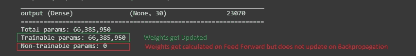
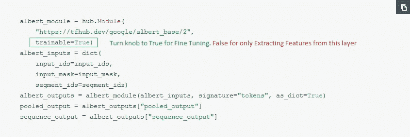

# 迁移学习—使用预训练模型启动(阅读:BERT)

> 原文：<https://medium.com/analytics-vidhya/transfer-learning-powering-up-with-pretrained-models-read-bert-ce7da68f3e08?source=collection_archive---------8----------------------->

奖励:在互联网关闭的情况下使用变形金刚


由[马库斯·斯皮斯克](https://unsplash.com/@markusspiske?utm_source=medium&utm_medium=referral)在 [Unsplash](https://unsplash.com?utm_source=medium&utm_medium=referral) 上拍摄的照片

关于这些预训练模型已经说了很多，但是，围绕迁移学习意义的重要概念，我们如何使用它需要一些挖掘。例如，如果您使用了 BERT 的 tfhub 版本。有人可能会问，这一层的“可训练”是什么？

事实证明，我们有三种方法可以进行预训练模型的迁移学习:

*   特征提取:预训练层仅用于提取特征，如使用 BatchNormalization 将权重转换为 0 到 1 之间的范围，平均值为 0。在这种方法中，权重在反向传播期间不更新。这是在模型摘要中标记为不可培训的内容



并且在 tfhub 中为可训练=假。



如果你想手动设置。然后，像这样选择图层:

> model.add(dense(100，可训练=False))

*   微调:这就是整个比赛的意义所在。BERT 是这项任务的理想选择，因为它接受过问答训练。因此，我们只需微调模型以适应我们的目的。含义-该图层已针对常规数据集进行了训练。我们需要重新培训，以优化我们的具体任务。同样，在 TFHUB 中，这是可训练的=真。(见上文—以绿色突出显示)。在 Keras 模型总结中，它被称为可训练参数(见上文-以绿色突出显示)。对于具有多层的预训练模型，通常这将是巨大的。Albert 是轻型版本，包含 1100 万个参数。
*   提取层:在这种方法中，我们只提取任务所需的那些层。例如，我们可能希望只提取 BERT 中较低级别的层，以执行 POS、情感分析等任务，其中只提取单词级特征就足够了，不需要太多的上下文或序列匹配。下面是一个例子

```
import tensorflow as tf
from transformers import BertTokenizer, TFBertModeltokenizer = BertTokenizer.from_pretrained(‘bert-base-uncased’)
model = TFBertModel.from_pretrained(‘bert-base-uncased’)
input_ids = tf.constant(tokenizer.encode(“Hello, my dog is cute”, add_special_tokens=True))[None, :] # Batch size 1
outputs = model(input_ids)
last_hidden_states = outputs[0] # The last hidden-state is the first element of the output tuple
```

***BERT —重要提示***
鉴于对参数的狂热，采用 BERT 论文推荐:

*   纪元-范围在 3，4 之间
*   Batch_size — 4，8，16(如果您针对特定群体进行训练，比如较小的样本，那么可能是 32)
*   层-除了输出和平均/最大池以外，您可能不需要添加任何额外的层来根据您的要求重新调整 bert 输出。因为伯特或等同物已经为我们优化了层和隐藏单元。我尝试添加一个消失梯度层——这些深度信念网络可以将权重缩小到几乎为零，所以我添加了一个泄漏的 relu 层来减缓权重恶化。模型运行时间疯狂上涨。

**奖金**

如果你是一个人，正在寻找一个可行的解决方案，但被一家公司的防火墙挡住了，你需要在本地实现这些功能。这是一个喘息的机会，至少可以节省一个星期的时间去尝试从 tfhub，google-research，huggingface 等的不同版本中找出相同的模型。我们将使用 Huggingface，因为他们可以很容易地在不同型号之间切换，并且兼容 pytorch 和 keras。

1.  进入 huggingface transformers 的 github 页面—来源—链接—[https://github . com/hugging face/transformers/tree/master/src/transformers](https://github.com/huggingface/transformers/tree/master/src/transformers)
2.  打开相关的配置、建模或标记化。在这种情况下，例如，它将是 configuration_albert.py
3.  在 Config_Archive_Map 列表下，你会找到 aws source 它下载所需的文件
4.  你将需要，一个 config.json，spiece.model(如果句子片段被使用)或 vocab.txt/vocab 和 tf_model.h5(对于 keras)
5.  瞧啊。下载文件并将其作为数据集添加到您的内核中。

有些模型有点复杂，有些模型需要使用 sentencepiece，而有些模型可能需要不同的 vocab 文件。为了使它更容易，我已经为他们中的一些人这样做了。你可以从以下网站下载这些数据集—

https://www.kaggle.com/stitch/albertlargev2huggingface

[https://www.kaggle.com/stitch/bertcasecasedhuggingface2](https://www.kaggle.com/stitch/bertcasecasedhuggingface2)

[https://www.kaggle.com/stitch/distilrobertabasehuggingface](https://www.kaggle.com/stitch/distilrobertabasehuggingface)

[https://www.kaggle.com/stitch/robertalargehuggingface](https://www.kaggle.com/stitch/robertalargehuggingface)