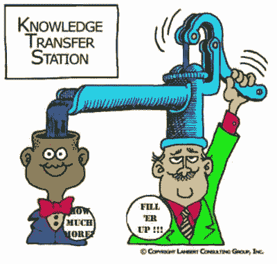
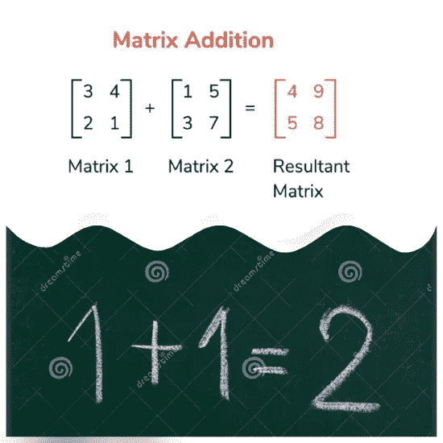
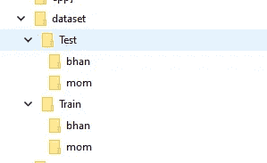
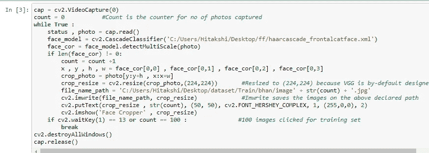
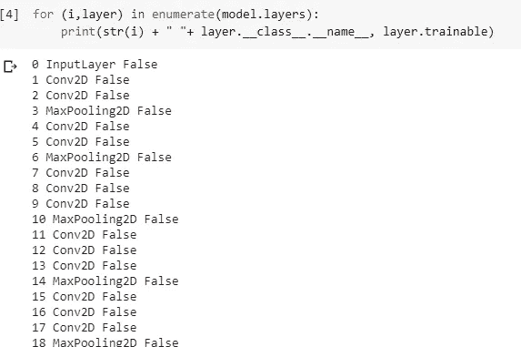
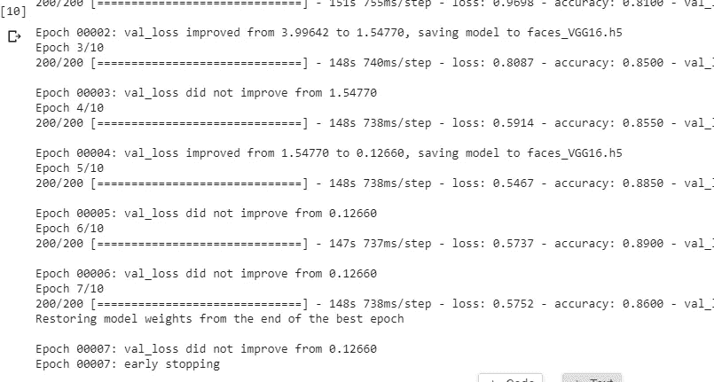
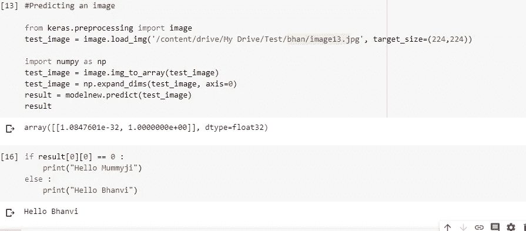

# 迁移学习:时间救星

> 原文：<https://medium.com/analytics-vidhya/transfer-learning-the-time-savior-71a86ad9273b?source=collection_archive---------39----------------------->

人工智能和深度学习的整个背景是模仿人脑，而我们大脑最显著的特征之一是它在任务之间转移知识的固有能力。简单来说，就是用你在幼儿园学到的知识，将两个数相加，来解决高中数学中的矩阵加法。

机器学习领域也利用了这样一个概念，用大量数据训练的训练有素的模型可以增加我们模型的准确性。

这是我实现的迁移学习项目的代码。

# 第 1 部分:准备数据集

我已经利用 open cv 来捕捉面部的实时图像，并将它们用作训练和测试数据集。我点击了 100 张图片用于训练，50 张用于测试。数据集由我和我母亲的图像组成。

数据集结构

库被导入，并且在 while 循环中编写了捕获图像并保存它们的基本代码，以捕获 100 个图像。

密码

这给了我一个定制的数据集。

# 第 2 部分:使用迁移学习

VGG16 模型已导入，它使用 imagenet 的权重和以下预训练层，我们冻结了除输入和输出层之外的所有层:

模型被训练 10 个时期，并且早期停止也被应用以防止过度拟合。

关于预测，给出了来自测试集的图像，并且预测变得正确。

这里是我的 github repo 的链接，其中包含该项目的完整代码！

谢谢！

 [## bhanvimenghani/Transfer _ learning

### 在 GitHub 上创建一个帐户，为 bhanvimenghani/Transfer _ learning 开发做贡献。

github.com](https://github.com/bhanvimenghani/Transfer_learning.git)