# 利用 Inception-v3 进行图像分类的迁移学习

> 原文：<https://medium.com/analytics-vidhya/transfer-learning-using-inception-v3-for-image-classification-86700411251b?source=collection_archive---------0----------------------->

皮查拜在[pexels.com](https://www.pexels.com/photo/girls-on-desk-looking-at-notebook-159823/)拍摄的照片

在我的 [**上一篇**](/analytics-vidhya/end-to-end-image-classification-project-using-tensorflow-46e78298fa2f) 中，我对原始的狗与猫[数据集](http://www.kaggle.com/c/dogs-vs-cats/data)(从 25000 张图像的原始数据集采样的 3000 张图像)的子集进行了工作，以建立一个能够以 **82%** 的准确度对狗和猫的图像进行分类的图像分类器。

这个项目是上一个项目的延续，在那个项目中我们试图提高我们的性能，并且基于 tensor flow in Practice[Specialization](https://www.coursera.org/specializations/tensorflow-in-practice?)。

当我们有一个相对较小的数据集时，一个超级有效的技术是使用**迁移学习**，其中我们使用一个预训练的模型。这个模型已经在一个非常大的数据集上进行了训练，我们将能够转移在多个高性能 GPU 上通过数百个小时的训练学习到的权重。

许多这样的模型都是开源的，比如 VGG 19 和 Inception-v3。他们接受了数百万张图像的训练，这些图像具有极高的计算能力，从零开始实现可能非常昂贵。

我们在项目中使用 **Inception-v3** 模型。

迁移学习已经变得非常流行，因为它大大减少了训练时间，并且需要更少的数据来提高性能。

我们开始吧。

**获取数据**(共 3000 张图像)

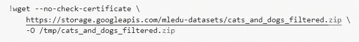

**导入 Inception-v3 模型**

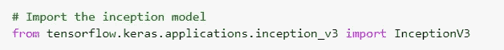

我们将使用模型中的所有层，除了最后一个完全连接的层，因为它特定于 [ImageNet](https://http//image-net.org/challenges/LSVRC/) 竞赛。

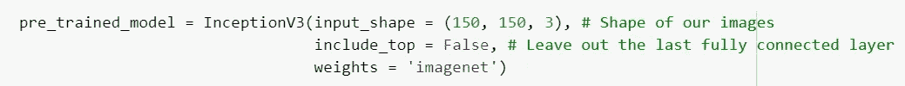

使所有层不可训练(我们可以重新训练一些较低的层来提高性能。请记住，这可能会导致过度拟合)

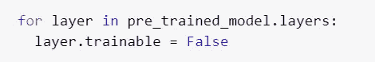

我们使用二元交叉熵作为损失度量，因为我们有两个目标类(这是一个二元分类问题)

我们的优化器是 **RMSprop** ，学习率为 **0.0001** (我们可以对此进行实验；Adam 和 Adagrad 优化器也能很好地工作)

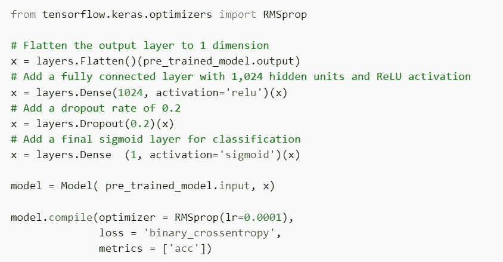

在重新缩放图像并使用图像增强后，我们使用 train_datagen 和 test_datagen 以 20 个为一批对它们进行流动。详情可以在我的[上一篇](/analytics-vidhya/end-to-end-image-classification-project-using-tensorflow-46e78298fa2f)中找到。

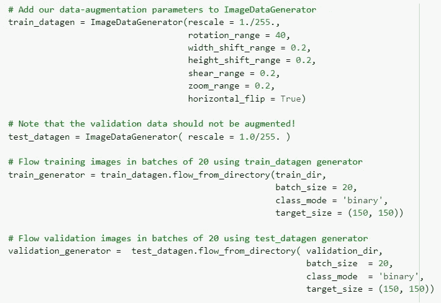

我们有 **2000** 训练图像和 **1000** 用于验证。

**让我们训练**

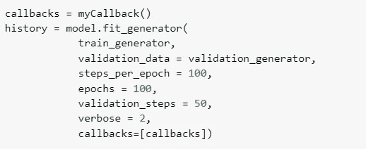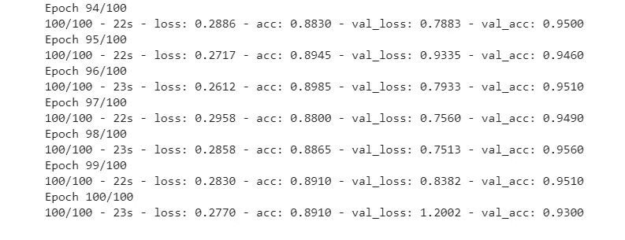

大约 35 分钟后，我们能够达到 94%的准确率。在我们达到一定的准确度后，回调可以很容易地实现。

这是我们希望使用**迁移学习**得到的结果；建立在预训练模型的基础上，并将其用于我们的定制应用程序，该应用程序仅在 2000 张图像上进行训练后就能够实现出色的性能。

解决这个问题的另一种方法是不使用 Inception-v3 的所有层。

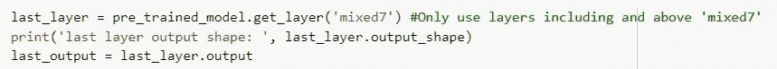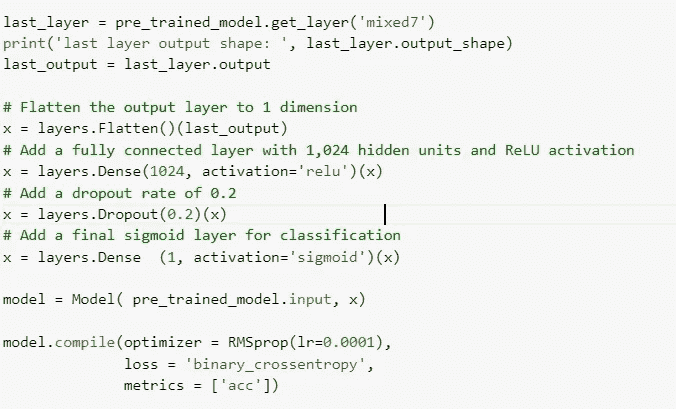

在这里，我们能够使用回调达到 96%的准确率。

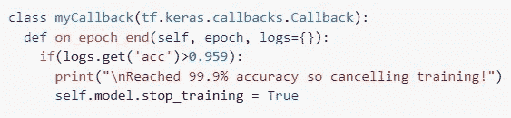

如你所见，**迁移学习**在计算机视觉中有很大的应用。

除了访问数百万张图像来为他们的定制用例构建高性能的 CNN 模型，不是每个人都能够负担得起数周的培训，这就是迁移学习的用武之地。您获得了使用合理数量的资源重新培训一些较低层(根据您的目标类)的能力和灵活性。[这是一篇旨在通过 IOS 应用部署此类模型的文章。](/datadriveninvestor/image-classifier-using-create-ml-core-ml-and-vision-framework-in-swift-345557960786)

在 [LinkedIn](http://www.linkedin.com/in/tejan-irla) 上与我联系。你可以在这里找到完整的代码。

干杯！！