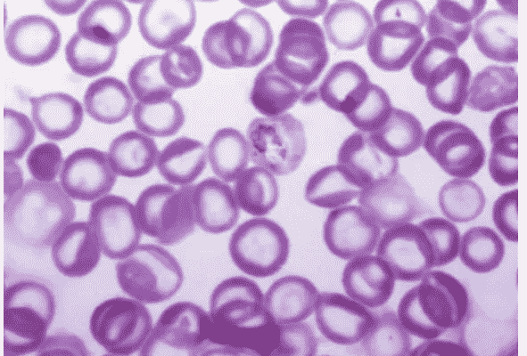
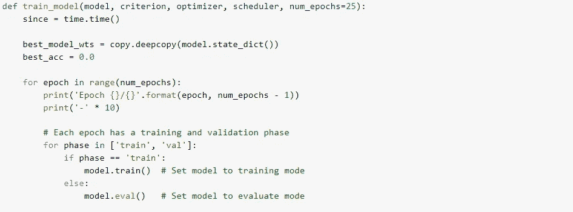

# 使用 Pytorch 进行迁移学习——初学者方法

> 原文：<https://medium.com/analytics-vidhya/transfer-learning-using-pytorch-a-beginners-approach-44b3d37a990c?source=collection_archive---------22----------------------->

## 利用深度卷积神经网络对疟疾感染细胞进行分类

[*https://www.who.int/news-room/fact-sheets/detail/malaria*](https://www.who.int/news-room/fact-sheets/detail/malaria)

# *疟疾检测*

*疟疾是一种威胁生命的疾病，由寄生虫引起，通过受感染的雌性疟蚊的叮咬传播给人类。它是可以预防和治愈的。*

*疟疾是由疟原虫寄生虫引起的。这些寄生虫通过被感染的雌性按蚊的叮咬传播给人类，被称为“疟疾病媒”导致人类疟疾的寄生虫有 5 种，其中两种——恶性疟原虫和间日疟原虫——构成的威胁最大。*

****诊断疟疾可难*** :*

*   *在疟疾不再流行的地方(如美国)，卫生保健提供者可能不熟悉这种疾病。临床医生在治疗疟疾患者时，可能会忘记将疟疾列为潜在诊断之一，也不会安排必要的诊断测试。实验室工作人员可能缺乏疟疾方面的经验，在显微镜下检查血涂片时无法发现寄生虫。*
*   *疟疾是一种急性发热疾病。在非免疫个体中，症状通常在被感染的蚊子叮咬后 10-15 天出现。最初的症状——发烧、头痛和发冷——可能很轻微，很难被识别为疟疾。如果不在 24 小时内治疗，恶性疟原虫疟疾可能发展成严重疾病，通常导致死亡。*

****显微镜诊断****

*疟疾寄生虫可以通过在显微镜下检查患者的一滴血，在显微镜载玻片上展开成“血涂片”来识别。在检查之前，标本被染色，使寄生虫具有独特的外观。这项技术仍然是实验室确认疟疾的金标准。然而，这取决于试剂、显微镜的质量以及病理学家的经验。*

**

*[https://blog . insightdatascience . com/https-blog-insightdatascience-com-malaria-hero-a 47d 3d 5 fc 4 bb](https://blog.insightdatascience.com/https-blog-insightdatascience-com-malaria-hero-a47d3d5fc4bb)*

***从解决方案开始。***

*尝试的解决方案是使用 VGG16 预训练模型对感染的细胞进行分类。尝试以初学者的角度使用 Google Colab 学习 PyTorch。*

***数据来源:** Kaggle*

***导入数据:** *！kaggle 数据集下载-d iarunava/cell-images-for-detecting-malaria**

**

*文件夹结构*

*深度学习模型，或者更具体地说，卷积神经网络(CNN)已经被证明在各种各样的计算机视觉任务中非常有效。虽然我们假设你对 CNN 有所了解，但如果你不了解，请点击这里的查看[这篇文章。简而言之，CNN 模型中的关键层包括卷积层和池层，如下图所示。](http://cs231n.github.io/convolutional-networks/)*

**

*典型的 CNN 架构*

***什么是迁移学习？***

*迁移学习是一种机器学习方法，其中为一项任务开发的模型被重新用作第二项任务模型的起点。*

*这是深度学习中的一种流行方法，其中预先训练的模型被用作计算机视觉和自然语言处理任务的起点，因为开发关于这些问题的神经网络模型需要大量的计算和时间资源，并且它们在相关问题上提供了巨大的技能飞跃。*

**

*这两种主要的迁移学习情景如下:*

*   ***微调 convnet** :我们用一个预训练的网络来初始化网络，而不是随机初始化，就像在 imagenet 1000 数据集上训练的网络一样。其余的训练看起来和往常一样。*
*   ***作为固定特征提取器的 conv net**:这里，我们将冻结所有网络的权重，除了最后完全连接的层。这个最后完全连接的层被替换为具有随机权重的新层，并且只有这一层被训练。*

*这里我们使用了 VGG16 架构*

**

*VGG16 架构*

***导入库:***

**

***用于训练和验证的数据扩充和标准化***

****

***可视化一些训练图像，以便理解数据扩充。***

****

***训练模型***

********

***加载预训练模型，重置最终全连接层***

# ***模型架构:***

****VGG(****

****(特征):时序(****

****(0): Conv2d(3，64，kernel_size=(3，3)，stride=(1，1)，padding=(1，1))****

****(1):ReLU(in place = True)****

****(2): Conv2d(64，64，kernel_size=(3，3)，stride=(1，1)，padding=(1，1))****

****(3):ReLU(in place = True)****

****(4):maxpool 2d(kernel _ size = 2，stride=2，padding=0，exploation = 1，ceil_mode=False)****

****(5): Conv2d(64，128，kernel_size=(3，3)，stride=(1，1)，padding=(1，1))****

****(6):ReLU(in place = True)****

****(7): Conv2d(128，128，kernel_size=(3，3)，stride=(1，1)，padding=(1，1))****

****(8):ReLU(in place = True)****

****(9):maxpool 2d(kernel _ size = 2，stride=2，padding=0，exploation = 1，ceil_mode=False)****

****(10): Conv2d(128，256，kernel_size=(3，3)，stride=(1，1)，padding=(1，1))****

****(11):ReLU(in place = True)****

****(12): Conv2d(256，256，kernel_size=(3，3)，stride=(1，1)，padding=(1，1))****

****(13):ReLU(in place = True)****

****(14): Conv2d(256，256，kernel_size=(3，3)，stride=(1，1)，padding=(1，1))****

****(15):ReLU(in place = True)****

****(16):maxpool 2d(kernel _ size = 2，stride=2，padding=0，exploation = 1，ceil_mode=False)****

****(17): Conv2d(256，512，kernel_size=(3，3)，stride=(1，1)，padding=(1，1))****

****(18):ReLU(in place = True)****

****(19): Conv2d(512，512，kernel_size=(3，3)，stride=(1，1)，padding=(1，1))****

****(20):ReLU(in place = True)****

****(21): Conv2d(512，512，kernel_size=(3，3)，stride=(1，1)，padding=(1，1))****

****(22):ReLU(in place = True)****

****(23):maxpool 2d(kernel _ size = 2，stride=2，padding=0，exploation = 1，ceil_mode=False)****

****(24): Conv2d(512，512，kernel_size=(3，3)，stride=(1，1)，padding=(1，1))****

****(25):ReLU(in place = True)****

****(26): Conv2d(512，512，kernel_size=(3，3)，stride=(1，1)，padding=(1，1))****

****(27):ReLU(in place = True)****

****(28): Conv2d(512，512，kernel_size=(3，3)，stride=(1，1)，padding=(1，1))****

****(29):ReLU(in place = True)****

****(30):maxpool 2d(kernel _ size = 2，stride=2，padding=0，exploation = 1，ceil_mode=False)****

***T97)***

****(avgpool):AdaptiveAvgPool2d(output _ size =(7，7))****

****(量词):顺序的(****

****(0):线性(in_features=25088，out_features=4096，bias=True)****

****(1):ReLU(in place = True)****

****(2):辍学(p=0.5，原地=假)****

****(3):线性(in_features=4096，out_features=4096，bias=True)****

****(4):ReLU(in place = True)****

****(5):辍学(p=0.5，原地=假)****

****(6):线性(in_features=4096，out_features=1000，bias=True)****

****)****

***T29)***

**

***注意** `*print(model_ft)*` *输出一个顺序对象，需要像列表一样查询。否则你可能会看到一个* `***VGG object has no attribute***` *错误。**

**请注意不同的 Pytorch 型号可能有不同的属性名称，您可能需要自定义名称* `*<model_name>.<feature_name>[0]*`*

**例如:***model _ ft . classifier[0]。in_features** *如果序列被命名为* `*classifier*` *。**

# *培训和评估*

****

****最佳验证准确度得分:0.957366****

## ***可视化预测***

**

***模型预测***

**

*模型做出的预测*

***结论:***

**该模型预测被寄生虫感染的细胞的准确率为 95.74 %**