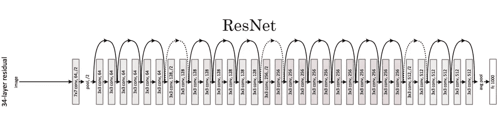

# 使用 Keras 进行迁移学习

> 原文：<https://medium.com/analytics-vidhya/transfer-learning-with-keras-9a1b3253211c?source=collection_archive---------5----------------------->

在这个博客中，我们将学习什么是迁移学习，以及何时和如何使用它。

**迁移学习**是深度学习中的一个研究问题，专注于存储在解决一个问题时获得的知识，并将其应用于另一个不同但相关的问题。

**想法:**我们可以重用现有的模型(VGG16)，而不是从头开始编码一个神经网络来解决我们的问题。

## **为什么要转学？**

深度学习模型通常需要非常大的数据集来训练。当我们没有大的数据集时，这导致了过拟合的问题。

如果我们用更多的层来训练我们的模型，那么过度拟合的可能性非常高。

为了防止这种情况，我们需要大型数据集。一个**预训练模型**是一个保存的网络，它以前在一个大数据集上训练过，通常是在一个大规模图像分类任务上。您可以直接使用预先训练好的模型，也可以使用**迁移学习**来定制该模型以完成给定的任务。

**图像网络数据集:**

ILSVRC 是一年一度的计算机视觉竞赛，它是基于一个名为 ImageNet 的公开计算机视觉数据集的子集开发的。因此，任务甚至挑战本身通常被称为 ImageNet 竞赛。

**它拥有超过 1400 万个数据点和超过 2 万个类别。**

ImageNet 数据集是一个非常大的人类注释照片集合，由学者设计用于开发计算机视觉算法。

**何时以及如何应用迁移学习？**

我们可以应用迁移学习的例子有很多。我们将逐一进行分析。

**情况 1:当我们的数据集非常小，但与 image-Net 数据集相似时。**

冻结所有图层，添加一些服装密集层，训练模型。

**情况 2:当我们的数据集很大并且类似于 Image-Net 数据集时。**

以较小的学习率对整个网络进行微调。

**情况 3:当数据集是中等大小并且类似于 Image-Net 数据集时。**

微调最后几层。冻结顶层。

**情况 4:当数据集较大且与 Image-Net 数据集不相似时。**

用预训练的模型初始化网络的权重，并重新训练整个模型。

**用于迁移学习的预训练模型的类型:**

自 2012 年以来，出现了许多解决图像网络分类的模型。以下是一些模型:

1.  **Alex-Net** : Alex-net 是 Alex Krizhevsky 设计的一种卷积神经网络的名称。AlexNet 包含八层；前五层是卷积层，其中一些是最大轮询层，后三层是全连接层。它使用了非饱和 ReLU 激活函数，该函数显示出比 tanh 和 sigmoid 更好的训练性能。

**2。VGG 网** : 2 版本(VGG16 和 VGG19):是 AlexNet 的简化版，内核为 3*3，步幅=1，填充=相同。

**3。RESNET(34，50，101，152)** :残差网络设计为跳过死连接，减少层数对性能的影响。

# **应用迁移学习(VGG16):**

我们将在 RVL-CDIP 数据集上应用迁移学习。

数据来源:[https://www.cs.cmu.edu/~aharley/rvl-cdip/](https://www.cs.cmu.edu/~aharley/rvl-cdip/)

数据集中总共有 400，000 个文档图像。未压缩时，数据集大小约为 100GB，包含 16 类文档类型，每类 25，000 个样本。示例类包括电子邮件、简历和发票。

**目标:**

对于给定的图像，将其分类到 16 个类别之一。

**第一步:导入库**

**步骤 2:使用图像数据生成器预处理并加载图像**

我只从 RVL-CDIP 数据集加载一些样本。

**第三步:使用迁移学习建立模型(VGG16)**

第四步:冻结顶层，添加一些自定义的致密层。

**第四步:由于我的问题是 16 个类的多类分类，添加 16 个单元密集层，编译模型**

**第五步:查看最终模型:**

我们可以看到，在 2200 万个参数中，我们只训练了 1000 万个参数。

**第六步:训练最终模型:**

**结论:**

1.  冻结预训练 VGG16 模型的顶层，因为数据集是中等大小的。
2.  为了防止过度适应，尝试迁移学习。
3.  使用迁移学习，我训练了很少的参数，节省了很多时间。

4.当我们有类似 ImageNet 的数据集时，迁移学习效果最好。

**参考文献:**

[https://en.wikipedia.org/wiki/Transfer_learning](https://en.wikipedia.org/wiki/Transfer_learning)

 [## RVL-CDIP 数据集

### 亚当·w·哈利、亚历克斯·乌弗克斯和康斯坦丁诺·g·德帕尼斯 RVL-CDIP(瑞尔森视觉实验室综合文档信息…

www.cs.cmu.edu](https://www.cs.cmu.edu/~aharley/rvl-cdip/) 

如果你是机器学习的新手，想知道多标签分类是如何工作的，那么就去看看这个 [**博客**](/@akshaygoswaami/imdb-movie-genre-tag-prediction-4ee71a0aa9bd) **。**

 [## IMDB 电影类型标签预测

### 在这篇博客中，我们将知道如何使用经典和深度学习技术进行多标签分类。

medium.com](/@akshaygoswaami/imdb-movie-genre-tag-prediction-4ee71a0aa9bd)