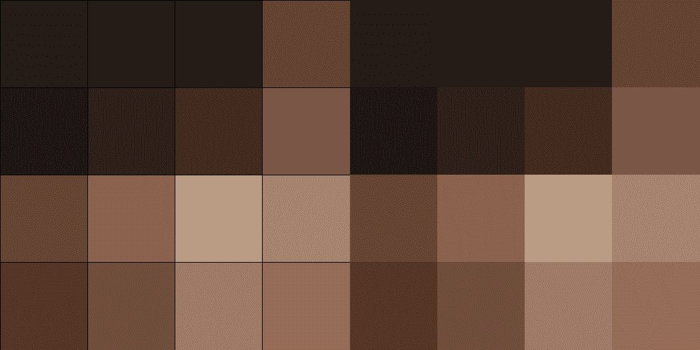
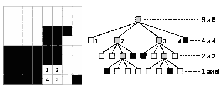

# 将图像转换成四叉树

> 原文：<https://medium.com/analytics-vidhya/transform-an-image-into-a-quadtree-39b3aa6e019a?source=collection_archive---------1----------------------->

发现数据结构的有趣实验

[山上的绿叶树](https://www.pexels.com/photo/dawn-nature-tree-romania-56875/)

我最近发现了四叉树和八叉树数据结构，我必须找到一个想法来试验它们。灵感来自于[四叉树维基百科页面](https://en.wikipedia.org/wiki/Quadtree#QuadTree_class) e 上这张漂亮的 gif

图像的四叉树压缩。来源:维基百科[https://en . Wikipedia . org/wiki/quad tree #/media/File:quad tree _ compression _ of _ an _ image . gif](https://en.wikipedia.org/wiki/Quadtree#/media/File:Quadtree_compression_of_an_image.gif)

我认为这是一个很酷的尝试和重现的小实验。我启动了 Jupyter notebook，开始尝试 Python、numpy 和 matlplotlib。

# 四叉树

四叉树是一种特殊的树，它将每个节点定义为有四个子节点。通过递归分割成四个象限来细分 2D 空间是非常有用的。关于这个主题的维基百科页面非常完整，并且提供了一些使用的例子。

将一个简单的图像存储到四叉树中

# 加载图像

显然，要做的第一件事是加载图像并将其转换成我能够使用的东西。Matplotlib 有一个很酷的方法叫做 [*imread*](https://matplotlib.org/api/_as_gen/matplotlib.pyplot.imread.html) ，它允许加载一个文件并将其转换成一个 *numpy.array* 对象。

这张图片是来自用户 yokok 在 Flickr 上的照片。图像被加载到一个表示每个像素的高度、宽度和 RGB 值的三维 numpy 数组中。使用 matplotlib，您可以简单地调用 *plt.imshow* 来显示图像。

# 将图像分成 4 份

算法的下一步是能够将图像分割成四个“相等”的部分。当然，只有在高度或宽度上有一对像素的图像才能被分割成 4 个完全相等的部分，但这对我们的算法来说并不重要。所以我们分头行动吧。

正如你所看到的，将图像分成 4 份并不太复杂，它在一个方向使用 [*array_split*](https://docs.scipy.org/doc/numpy/reference/generated/numpy.array_split.html) 一次，然后在另一个方向使用。你必须使用地图的技巧来保持正确的尺寸。

# 把图像重建回来

当我们从四叉树中读取图像时，我们必须从四个分裂的孩子中重建一个完整的图像。

我们可以通过使用 numpy 的[连接](https://docs.scipy.org/doc/numpy/reference/generated/numpy.concatenate.html)方法很容易地做到这一点，它需要一个*轴*参数来确定在哪个轴上连接数组。

# 计算平均颜色

工具箱中的最后一个工具，我们需要用它来构造四叉树，我们将计算每个节点的平均颜色。该颜色将保存在节点中，并将用于显示中间图像。

同样，numpy 非常有用，只需通过定义使用哪个轴来配置 [*mean*](https://docs.scipy.org/doc/numpy/reference/generated/numpy.mean.html) 方法，就可以获得平均颜色。

# 四叉树数据结构

最后，我们得到了算法的核心。我定义了一个四叉树类和一个允许将图像插入四叉树的 *insert* 方法，以及一个在特定级别显示图像的 *show_image* 。

四叉树结构是一种递归结构，每个四叉树包含四个其他的四叉树(或者没有叶子)。

## 插入

insert 方法是一种将被递归调用的方法。传递一个级别，从第一个节点的 0 开始，在每个级别上加 1。它让我们知道在遍历树的时候我们在哪个层次。

我们保存这个级别以及为当前级别计算的平均颜色(对于接收到的整个图像)。最后，我们保存分辨率，以便用传递的分辨率重新创建图像。

我们检查图像中的所有像素是否相等。如果是这种情况，我们在这里停下来，我们将能够在当前级别上重新创建图像，方法是从具有平均颜色的分辨率重新创建图像。我们通过设置一个标志来保存它是一个假期。

如果我们有不同的像素颜色，我们创建四个子四叉树，并通过调用 insert 方法将相应的四分之一插入每棵树，传递当前级别+ 1。

## 显示图像

为了在特定的层次上重建图像，我们只需要遍历四叉树，将每个分割连接成一个图像，然后发送回父调用者。

递归方法调用的停止条件是当前节点级别与 level 参数中传递的级别相同，或者当前节点是叶子( *final = true* )。

如果是这种情况，我们用平均颜色创建一个存储分辨率的图像。

# 结论

这是一个有趣的小项目，让我更好地理解四叉树是如何构建和使用的。这肯定不是构造四叉树的最快方法，也不是存储四叉树的更好方法。似乎有以“平面”方式(在数组中)存储四叉树的解决方案非常高效，但我还没有找到算法或示例。我可能会进一步研究。

你可以在我的 GitHub 上找到完整的 Jupyter 笔记本，网址是[https://GitHub . com/Gimly/image-quad tree/blob/master/Transform _ image _ into _ quad tree . ipynb](https://github.com/Gimly/image-quadtree/blob/master/Transform_image_into_quadtree.ipynb)

感谢阅读！