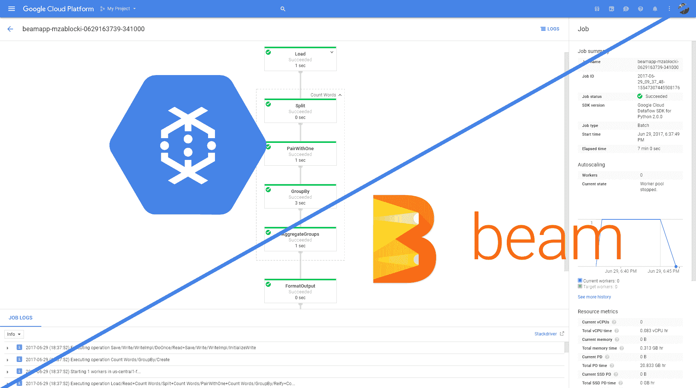

# 使用数据流 Python 管道将 JSON 从 Google bucket 转换为 CSV

> 原文：<https://medium.com/analytics-vidhya/transform-json-to-csv-from-google-bucket-using-a-dataflow-python-pipeline-92906c87cc96?source=collection_archive---------7----------------------->

在本文中，我们将尝试使用数据流和 python 将 JSON 文件转换成 CSV 文件

首先，我们需要一个服务帐户，赋予它“数据流工作者”的角色，不要忘了在最后将其导出为 JSON，以便我们以后使用。