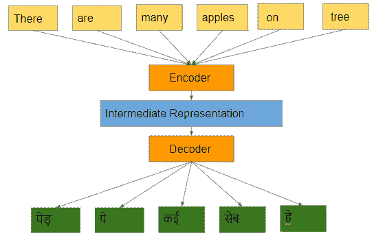
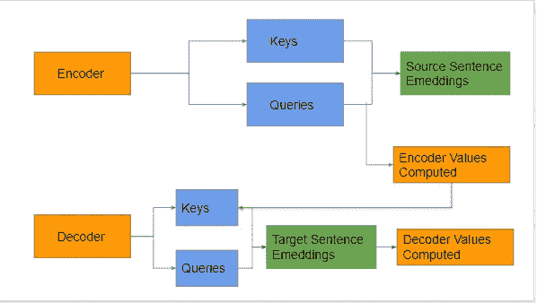
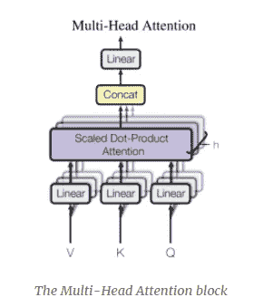
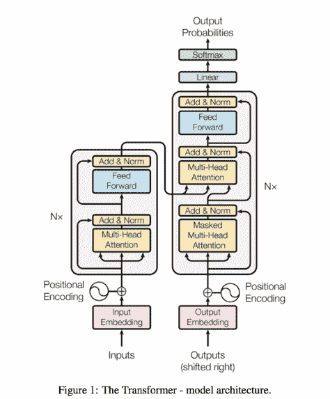
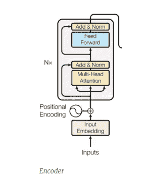
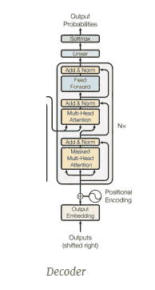
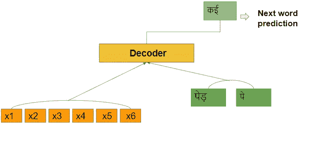

# 变形金刚:一个令人好奇的“关注”案例

> 原文：<https://medium.com/analytics-vidhya/transformers-a-curious-case-of-attention-7d2ee20cbb0b?source=collection_archive---------24----------------------->

在本帖中，我们将深入探讨变形金刚假说背后的错综复杂，以及这如何为伯特模型奠定了基础。此外，我们应该注意到 NLP 中迁移学习的潮流是不断发展的，我们可以期待未来有更多的模型可以克服现有模型的局限性。

当谷歌发表了一篇名为“注意力是你所需要的全部”的论文时，变形金刚在 NLP 的迁移学习领域迅速抓住了所有人的注意力。在这篇文章中，让我们深入研究这篇论文的各个方面，让它更容易理解。

**内容:**

1.  **现有车型上的闪回**
2.  **当前架构的局限性**
3.  注意力机制是如何解决问题的？
4.  **多头关注**
5.  **变压器:编码器和解码器**
6.  **带 BERT 的变压器的潜在应用**
7.  **结论**

**现有车型上的闪回**:

NLP 领域中的任何机器学习模型都将始终朝着一个目标努力，即理解给定文本的上下文。在这些方面， [RNN](/analytics-vidhya/i-strongly-recommend-to-first-know-how-rnn-algorithm-works-to-get-along-with-this-post-of-gated-9b4bf4f0ced2) 通过引入门的概念并在 [LSTM 和 GRU](/analytics-vidhya/lstm-and-gru-a-step-further-into-the-world-of-gated-rnns-99d07dac6b91) 的架构中使用长期依赖性，已经获得了相当大的准确性。

此外，在某种程度上，Word2Vec 和 GLoVE 模型使迁移学习成为可能，但是，正如我所说，这个领域一直在发展，这导致了 transformers 及其后续模型，如 XLNet、BERT、RoBERTa 和 DistilBERT。

## **当前架构的局限性**:

尽管《LSTM》和《GRU》表现出了一些令人印象深刻的表现，但当单词有多重含义，只有在上下文中才变得明显时，他们就不能坚持下去了。比如**网**这个词在这几个句子里的意思完全不一样。该公司的净总体增长看起来很光明。而且“*用更大的网钓鱼更容易*”因此，这些边缘情况在注意力机制中得到更好的处理，这种机制构成了变形金刚体系结构的一个组成部分。

## 注意力机制是如何解决问题的？

变压器模型中采用的“注意”方法将通过考虑来自 RNN 模型的一个小调整来基本上解决依赖性(同一个词的多个含义)的问题，在该模型中，它允许编码器一次访问所有输入令牌，而不是一个序列。那么，什么是编码器和解码器呢？…嗯…编码器是模型中试图为输入序列创建中间表示的组件。解码器是试图将这种表示转换成有意义的输出。

这里我们应该注意的一点是，有意义的输出可以是任何语言，这实质上意味着我们可以进行语言翻译。因此，一旦获得了序列的中间表示，我们就可以将这些权重传递给我们需要翻译的语言的解码器模型。这或多或少是谷歌翻译的工作方式。

编码器和解码器机制

那么，问题出在哪里呢？…..只有当句子变大时，映射才会变得困难，因为模型需要有长期的依赖性。那是什么..？考虑上图中的例子。在将序列从英语翻译成印地语时，解码器模型必须看到整个输入序列，并且只有这样才能决定目标语言中的正确序列。单词 tree 出现在序列的最后，但是पेड़出现在目标语言的第一个标记中。

这正是传统 RNN 的问题所在，你可能会想，LSTM 正在解决这种依赖性，但将令牌保存在内存中更长时间仍然是一个挑战。这形成了提出注意机制的主要思想。

注意机制直观地给予解码器一次访问所有输入标记的权限，并允许它提取所需的特定信息。这消除了像在 LSTM 中那样将上下文保存在存储器中更长时间的问题，并给予模型在需要时提取信息的自由。

所以，让我们深入了解它的细节…

## **多头注意:**

注意机制只是基于一些键和查询计算一组值。值、查询和键取决于我们的问题陈述的上下文。对于编码器，关键字和查询是源语句嵌入，从源语句嵌入计算值，而对于解码器，编码器的值(输出)成为关键字，目标语句嵌入成为查询。

编码器和解码器的关键字、查询和值

基于这一点，计算整个序列的一个加权平均值对我们没有任何意义，因此我们选择多头注意力。多头注意力本质上帮助我们捕捉输入序列中的实体。(在我们例子中是树和苹果)。对于每个注意力头部，不同的线性变换被应用于键、值和查询，以计算多注意力头部。

## 变压器:

让我们把这个复杂的结构分解成简单的比特，并理解每一个比特。相信我，这并不像看起来那么疯狂。请继续阅读…

.

.

.

.

.

因此，在上述架构中，我们仍然可以看到带有多头注意力层和少量前馈层的编码器和解码器。让我们更深入地研究编码器。

## 编码器:

编码器由两部分组成，主要是多头注意力层和一个简单的前馈网络。正如我们在图像中看到的，这只是一个矩阵乘法，很少有元素方面的操作。但是，每个子层都有一个标准化，这实际上有助于我们的模型更快地收敛，因此变压器非常快。

## 解码器:

正如你们大多数人已经猜到的，解码器有一个类似的架构，但有一个额外的掩蔽多头注意力。那么，让我们开始吧。

通常，解码器模型被训练为基于当前单词之前的所有单词来预测句子。因此，我们屏蔽句子，同时将其作为解码器模型的输入。当输入本身首先包含单词时，您可能会怀疑为什么要屏蔽然后预测该单词…

..嗯，在任何给定点，解码器都可以访问其先前的标记以及源句子嵌入(参考下图)。因此，我们的目标是将输入序列映射到解码器输出序列，以获得另一种语言的有意义的句子。然而，在训练转换器时，我们将一次给出所有的输入序列。当我们这样做时，解码器可以访问所有的令牌，从而使它成为一个多余的任务，因为解码器没有任何东西可以学习。换句话说，这就是我们的模型倾向于过度适应我们的训练数据的地方。【 ***换句话说*** *:* 从线性到神经网络的所有监督模型都需要一个因变量来预测，然后相应地收敛于误差函数。如果没有要预测的变量，任何模型都变得多余，这里的变量就是输入序列中的屏蔽字。]

使用解码器模型的下一个字预测

因此，屏蔽给解码器一个假任务来训练和学习数据，以便它可以很好地概括盲测试数据。这样，解码器预测序列中的屏蔽字作为其任务，并相应地收敛于其误差函数。

## BERT 变压器的潜在应用

查看下面的 github repo 链接，了解如何实施 BERT 模型，以从我们迄今为止所学的知识中提取价值。

[BERT-QA 实施](https://github.com/abhishekperambai/BERT/tree/62933d9e0a7228ac5297d1c539799c71346fcc22)

伯特模型可以用来理解一篇文章或文本，并提取所需的信息。目前，我只将该模型应用于谷歌的一篇随机文章，以测试其性能，它看起来令人印象深刻。

您可以尝试同样的方法来适应您的业务环境，以进一步增加价值。

## 结论

总之，transformer 模型在时间复杂度上优于 LSTM，并且能够理解给定输入中的实体，从而为我们提供了优势。这为最有前途的模型 BERT 铺平了道路，该模型在理解文本方面有着令人印象深刻的记录，并使 NLP 中的迁移学习成为可能。

我非常依赖下面的帖子，试图让这个概念尽可能简单。如果你有进一步的兴趣，请查看以下资源。：

1.  [论文剖析—“注意力是你所需要的一切”](https://mlexplained.com/2017/12/29/attention-is-all-you-need-explained/)
2.  [谷歌的论文](https://arxiv.org/abs/1706.03762)
3.  [建筑研究帖](https://ai.googleblog.com/2017/08/transformer-novel-neural-network.html)