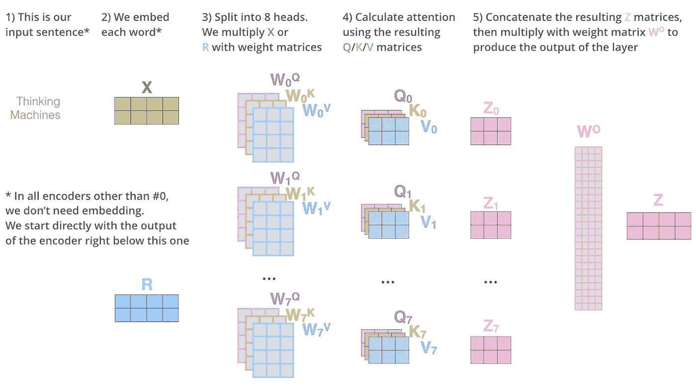

# 变形金刚——让我们继续沉睡吧！

> 原文：<https://medium.com/analytics-vidhya/transformers-lets-dive-deeeep-7784bdb20807?source=collection_archive---------2----------------------->

**警告**！！

这个**博客**是**而不是**给那些**害怕**数学的人看的！

(但是如果你被冒犯了，一定要读一读:P)

# 那么，什么是变形金刚呢？

现在，你一定在想美国科幻动作片**中**迈克尔·贝**系列的机器人**！

不，这是不同的东西。

The**Transformer**是在 **2017** 中推出的一款[**深度学习**](https://en.wikipedia.org/wiki/Deep_learning) 模型，以其**架构**在论文中提出的**[**注意力就是你所需要的**](https://arxiv.org/abs/1706.03762)**为基础的一种**自我注意机制**而使用****

# ****是什么让《变形金刚》成为“语言理解的新型神经网络架构”？****

****与**rnn**不同，**变压器**不要求顺序数据按照顺序进行**处理。例如，如果输入数据是自然语言语句，则转换器**不需要在结束**之前处理它的开始**。由于这个特性，**转换器比 RNNs 更适合于** [**并行化**](https://en.wikipedia.org/wiki/Parallel_computing) **，因此减少了训练次数。******

**当我去研究提出这个模型(我上面提到的那个)的研究论文时，我太笨了，甚至连一个句子或其中包含的复杂计算都不懂。因此，在花了几个晚上在各种参考博客上之后，我终于成功地破解了 NLP 这个庞然大物！**

> **在这里，在这个博客中，我将尽我所能简化文章中的东西，你需要知道这些来获得一个关于 Transformer 架构的像样的知识！相信我，你会喜欢的！**

## **所以，我们开始吧！**

## **1.过于简单的表情(为了不吓到你) :**

****

**让我们不要一开始就把事情复杂化，看看巨大的**艺术模型**就像一个简单的**黑盒**，它只需用一种语言(这里说我们用英语)输入的**句子，**将其翻译成另一种语言**作为输出(这里说它用德语输出)。****

## **2.是时候打开野兽了！(但是很慢:“3”**

****

**所以，在**将**分解后，我们看到**里面有两个主要组件**。左侧为**编码器**组件，右侧为**解码器**组件。在继续之前，让我们向您介绍一下编码器和解码器各自的作用。**

****编码器**—**编码器**将一个输入序列映射到一个抽象的连续表示中，该表示保存了该输入的所有学习信息。**

****

****解码器**—**解码器**然后获取该连续表示，并逐步生成单个输出，同时也被馈送先前的输出。**

****

**在提出的论文中，研究人员已经将编码器作为一个由 6 个编码器组成的**堆栈，解码器组件也是由一个相同编号**的解码器**堆栈组成。这里必须提到的是，他们已经用**尝试了编码器和解码器**数量的许多变化，其中采用 **6 作为超参数，获得了最好的结果，**因此他们在论文中提出了 6。****

****

## **3.现在，让我们深入研究编码器架构！**

****编码器**共用**相同的结构**，其中**各由两个子层**、**自关注层**和**前馈神经网络层**组成。看下图。**

****

****自我关注层**:自我关注层使模型能够学习当前单词与句子前一部分的**相关性。****

****

**红色表示当前单词，蓝色表示相关激活级别。**

**简而言之，自我关注层所做的就是，它允许**编码器**到**查看输入句子中的其他单词**，**将它们与**，**相关联，捕捉它们的重要性，同时它对特定的单词进行编码。****

**考虑下面的句子:**

**这个男孩因为受伤而无法参加比赛。**

**这句话中的“**他**指的是**男孩**，而不是**“受伤”**这个词的直觉，一个**人类**可以立刻理解，但对于一个学习算法来说，这绝对是一个**更难的任务。所以，当模型在处理“他”这个词的时候，**自我注意允许它把“他”和“男孩”联系起来**。****

****自我注意力计算**仍然需要非常深刻的**理解，因为其中有许多复杂的**步骤**，需要仔细观察。我们一个一个来看。(这个真的需要耐心:0)****

## **步骤 1:创建查询向量(q1，q2)、关键向量(k1，k2)和值向量(v1，v2)。**

****键/值/查询**概念通常来自**信息检索**系统。您可以简单地将'**查询**映射到一组相关的'**键**'，以检索给定'**查询**'的最佳'**值**。这些向量通过**将嵌入乘以在训练期间训练的三个矩阵**来创建。**

**因此，如果 **X1 和 X2** 是我们的嵌入输入，并且 **W(Q)，W(K)和 W(V)** 是权重矩阵、w.r.t 查询、键和值，那么我们的查询、键和值向量可以通过以下公式计算**

****X1 x W(Q) = q1，X2 x W(Q) = q2****

****X1 x W(K) = k1，X2 x W(k) = k2****

****X1 x W(V) = v1，X2 x W(V) = v2****

## **第二步:计算每个单词的分数**

**现在我们需要计算输入句子中每个单词相对于我们一次考虑的单词的分数。这个过程非常关键，因为它**建立了一个注意力分数**，或者基本上是**当在某个位置对一个单词进行编码时，与其他单词**相比，对该特定单词**给予**多少注意力。**

**分数的计算方法是—**

*   ****计算查询(q1，q2)向量与相应单词的关键向量(k1，k2)的点积。****

****q1。k1**=位置 1 的单词的分数**

****q2。k2** =位置 2 的单词得分…以此类推。**

****

**这里需要注意的一点是，查询、键和值向量的**维度比嵌入向量**要小得多。在所提出的论文中，嵌入向量的维数被取为 **512** ，而 q、k 和 v 向量据说具有 **64** 的维数。**

## **步骤 3:将获得的分数除以关键向量(d(k))的维数的平方根，并对其应用 softmax 激活。**

****第三步**包括将先前获得的分数除以 8(因为 root(d(k))= root(64)=8)。**

****请注意,( 1/√dk)是比例因子，为模型提供更稳定的梯度。然而，点积的大小往往会随着查询和关键向量的维数而增长，因此转换器会重新调整点积的大小，以防止它爆炸成巨大的值。****

**因此，这一步的一般公式如下:**

****分数/根(d(k)) = (q1.k1)/8，(q1.k2)/8，…诸如此类。****

**现在，我们将 **softmax 激活**应用于获得的值，这**将**分数归一化，因此它们可以**相加为 1.0** 。**

## **步骤 4:计算缩放的点积关注度**

**这个步骤过于简单，我们可以说这个步骤仅仅包括**将每个值向量**乘以之前获得的 **softmax 得分**。做这一步的原因基本上是**保留我们想要关注的单词的值**，而**剔除不相关的单词**。在这之后，我们简单地对加权值向量求和，以获得一个新的向量，比如 z**

**因此，计算自我注意力的整个过程的公式是这样的**

********

**这就是**自我关注度的计算方法**。希望方程式看起来不那么迷人**现在****:p .****

## **得到的向量是我们可以发送给前馈神经网络的向量！！**

****前馈神经网络**——自关注层产生的输出然后**传递**到**前馈神经网络**，在那里相同的 FFNN 层被**独立地应用到每个位置**。在编码器中，每个位置的字都遵循它们自己的路径**。自我关注层中的这些路径之间存在依赖关系，但是前馈层**不**具有这些依赖关系。因此，不同的路径可以**并行**运行，同时穿过前馈层。****

**希望现在你已经对**编码器**的主要组件有了一些直觉。**

## **所以，现在让我们更深入，让向量进入框架！**

**如果你熟悉文本预处理的**基本 NLP 技术，你一定知道这个任务包括**使用**单词嵌入技术**(带有 **Word2Vec** 、 **tfidf 编码、潜在语义分析编码、二进制编码等)将每个输入单词转换成一个矢量**。**)。****

**嵌入**发生在**最下面的编码器**中。编码器接收每个维度为 **512** 的向量列表。尺寸仅仅是一个**超参数，**我们需要用它来**微调**。通常，这将是我们训练数据中最长句子的**长度。**

将单词嵌入我们的输入序列后，每个单词都流经上面指定的编码器的两层中的每一层，最后，FFNN 的输出被传递到下一个编码器层。

既然你头脑中已经有了关于编码过程如何执行的清晰画面，让我们进入研究人员开发的奇妙概念“多头注意力”。

## 4.多头野兽

Transformer 中的注意机制被解释为基于一些**键**和**查询**来计算一组**值**(信息)的相关性的方式。

如果我们只计算值的单个注意力加权和，将很难捕捉输入的各种不同方面。为了解决这个问题，研究人员提出了**多头注意力**模块。

这样计算出 ***多个*注意力**的加权和，而不是一个 ***单个*注意力**传递过来的值——因此得名**“多头”注意力。**

多头注意力将**不同的线性变换**应用于每个注意力“头”的值、键和查询。

# 不要把你对“多头注意力”架构的想法复杂化，而是像这样想—

**我们上面讨论的**的自我关注计算**只需要用不同的权重矩阵**重复 8 次，其中**权重被随机初始化**，从而**创建多个自我关注模型。**

## 所以，现在我们有八个不同的 Z 矩阵(Z0，Z1，Z2，…..Z7)，其中 Z0 =注意力头部矩阵 0，Z1 =注意力头部矩阵 1..诸如此类。

# 万岁！！

**等一下**！它还没有完成。我们需要记住，**前馈神经网络只接受一个矩阵**(每个单词的向量)。所以我们必须**将所有这 8 个矩阵**连接成一个**单一矩阵。**

## 怎么会？

嗯，没什么大不了的。

**我们连接这些矩阵，然后将它们乘以一个额外的权重矩阵 W(O ),与模型一起训练。**

## 那么我们现在得到了什么？

我们得到了一个 **Z 矩阵，它存储了来自所有 8 个注意力头的相关信息，现在可以发送到 FFNN。**

# 耶！！

**到目前为止我们讨论的所有内容的直观描述—**

来源—[http://jalammar.github.io/illustrated-transformer/](http://jalammar.github.io/illustrated-transformer/)

# 位置编码—一个重要的概念

与**递归神经网络和 LSTM-RNNs** 不同，**多头注意力网络不能自然地利用单词在输入序列中的位置。**如果没有位置编码，多头注意力网络的**输出**对于句子**“我喜欢鸡多过鱼”**和**“我喜欢鱼多过鸡”，将是同样的**。**位置编码**将输入的相对/绝对位置**明确编码为矢量，然后添加到**输入嵌入中。****

## **什么时候执行位置编码？**

**位置编码是**至关重要的步骤**，在将字转换为向量之后，在将其传递给嵌入之前执行**。****

## **使用位置编码的好处-**

1.  **在嵌入向量投影到 Q、K、V 向量时，在嵌入向量之间提供有意义的距离。**
2.  **它提供了模式，**对单词**的顺序感，从而遵循了**单词的特定模式**。**

****直觉** —使用这种技巧是因为**没有语序的概念**(第一个词，第二个词，..)在建议的架构中。输入序列的所有字都被馈送到网络，没有特殊的顺序或位置(不像常见的 RNN 或康文网络架构)，因此，模型**不知道这些字是如何排序的**。因此，依赖于位置的**信号**被添加到每个单词嵌入中，以帮助**模型合并单词的顺序**。**根据实验，这种添加不仅避免了破坏嵌入信息，而且添加了重要的位置信息。****

****注意** —位置编码器的作用是借助 sin(x)和 cos(x)函数的循环特性，返回单词在句子中的位置信息。**

**本文使用以下等式**计算位置编码**:**

********

**其中， **pos** 代表**位置**， **i** 代表**尺寸**，原文中 **d(型号)=512，(因此 I∈【0，255】)**。对于**输入向量**上的每个**奇数索引**，使用 cos 函数创建一个**向量。对于每个**偶数索引**，使用正弦函数**创建一个**向量。然后**将这些向量添加到它们相应的输入嵌入中。**这成功地给出了关于每个矢量位置的网络信息。****

****剩余漏失****

**作者在将每个子层添加到原始输入之前，对其应用了**丢弃。他们还将 dropout 应用于嵌入的总和以及**位置编码。**辍学率默认为 0.1。****

**每个编码器中的每个子层(自关注，FFNN)都有一个围绕它的残差连接，然后是一个[层归一化](https://arxiv.org/abs/1607.06450)步骤。**

## **这背后的基本概念是跳过自我关注层，如果不需要的话，通过层规范化(类似于放弃)。**

**它**将 X 和 Z 矩阵**相加，**以特定比率(文中使用 0.1)**将其归一化。这也适用于解码器的子层。**

****

# **因此，我们需要了解的变压器编码器模块的所有内容都结束了！**

> **等等…，你需要在喝咖啡前把这个喝完！**

## **解码器模块仍有待发现！让我们跳进来吧！**

# **解码器**

****

****解码器架构类似于编码器**，除了一个额外的“**屏蔽多头注意力**层，帮助**解码器将更多注意力放在输入序列中的相关位置。****

****

**解码器**

**记住，解码器通常被训练成基于当前单词之前的所有单词来预测句子。**

## **这一层覆盖了先前的解码器输入，因此起到了与解码器隐藏状态相似的作用，将解码器的输入与未来的时间步骤屏蔽开。**

**干得好！**

## **所以，为了总结编码和解码的工作原理，让我们创建几个简单的步骤-**

1.  **编码器通过**处理输入序列**启动。**
2.  **输入通过嵌入层和位置编码层得到**位置嵌入**。**
3.  **这些被馈送到解码器的**第一个"*被屏蔽的*多头注意力层"**以屏蔽来自**未来时间步**的解码器输入，以便它能够**计算解码器输入**的注意力分数。**
4.  ****第一个多头关注层输出**为**值**。**第二多头关注层的输出**是**查询和关键字。**该步骤将**编码器的输入匹配到解码器的输入，**允许**解码器决定关注哪个编码器输入。****
5.  **第二多头注意力的**输出经过**逐点前馈层进一步处理**。每一步的输出在下一个时间步被馈送到**底部解码器。******
6.  **这些步骤**继续运行**直到**序列结束**，或者串结束 **< eos >** 信号到达**指示变压器解码器已经完成其输出。****

# **最终层-线性分类器和 Softmax 层**

**在**解码器层**将输出作为向量进行处理之后，**最终逐点前馈层的输出通过最终线性层**，其充当**分类器**。它有**个单元，其大小与您通过让您的模型从训练数据集学习而获得的输出词汇的大小一样大。****

**这个巨大的输出然后被馈送到一个 **Softmax 层，以生成范围在 0 到 1 之间的概率值。****

**所以，为了简化你的事情，**

****最高概率得分指数(argmax) =我们预测的单词。****

# **这就是全部！**

> **希望这个博客能帮助你理解这篇研究论文，并节省你在阅读时花在理解上的时间。**

**也试着通过运行 [**Tensor2Tensor 笔记本**](https://colab.research.google.com/github/tensorflow/tensor2tensor/blob/master/tensor2tensor/notebooks/hello_t2t.ipynb) 让你的**之手变脏**，在那里你可以**加载一个 Transformer 模型、**并用一些有用的**交互式可视化来玩代码。****

> ****如果你是数据科学和机器学习的初学者，并对数据科学/ML-AI、向数据科学的职业过渡指导、面试/简历准备有一些具体的疑问，甚至想在你的 D-Day 之前获得模拟面试，请随时在这里** **预约 1:1 电话** [**。我很乐意帮忙！**](https://topmate.io/sukannya)**

**快乐学习！**

**下次见！**