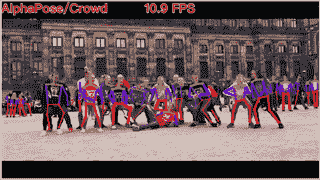

# 将 2D 视频转换为 3D 动画

> 原文：<https://medium.com/analytics-vidhya/transforming-2d-video-to-3d-animation-dc48cf1227f2?source=collection_archive---------2----------------------->

使用深度学习的魔法

照片由 [Unsplash](https://unsplash.com/images/things/dance?utm_source=unsplash&utm_medium=referral&utm_content=creditCopyText) 上的 [Aditya Ali](https://unsplash.com/@aditya_ali?utm_source=unsplash&utm_medium=referral&utm_content=creditCopyText) 拍摄

# 问题陈述

我们正试图从 2D 视频中通过跟踪一个人的运动来渲染这个人的 3D 动画。

# 我们为什么选择这种说法？

在 3D 图形中制作一个人的动画需要一个巨大的运动跟踪器来跟踪这个人的运动，并且手动制作每个肢体的动画也需要时间。我们的目标是提供一种节省时间的方法来做同样的事情。

# 我们是怎么解决的？

我们对此问题的解决方案包括以下步骤:

1.  **2D 姿态估计:**人体至少需要 17 个标志点来完整描述其姿态。
2.  **DeepSORT+FaceReID:** 追踪姿势的移动。
3.  **提升 2D 到 3D:** 我们从上一步得到的坐标在 2D。为了让它们变成 3D 动画，我们需要将这些二维坐标映射到三维空间。
4.  **渲染为 3D:** 上一步检测到的这 17 个标志点的坐标，现在就是需要动画的 3D 角色四肢关节的位置。

让我们在文章的其余部分详细讨论这些步骤。

# 2D 姿态估计

如上所述，只需指定 17 个关键的关键点(在深度学习社区中称为标志点)，就可以完全描述一个人的姿势。你可能已经猜到了，我们正在使用深度学习来估计人类的姿态(即在视频帧中跟踪人类的姿态)。在网上(我指的是在 Github 上)可以找到相当多的先进框架(比如 PoseFlow 和 AlphaPose ),它们已经实现了相当精确的姿态估计。

1.  **PoseFlow:** 第一个框架是由[修等人](https://arxiv.org/pdf/1802.00977.pdf)开发的 PoseFlow。PoseFlow 算法的基本概述是，该框架首先通过最大化视频所有帧的整体置信度来构建姿势。下一步是删除使用非最大抑制(通常缩写为 NMS)技术检测到的冗余姿态。
2.  **AlphaPose:** 你可以在下面附上的 GIF 中看到，使用 PoseFlow(在左边)估计的姿势在一些帧中有小故障。这就把我们带到了下一个框架:AlphaPose。AlphaPose 是由[郝-方舒等人](https://arxiv.org/pdf/1612.00137.pdf)开发的。该框架在帧中检测到的人周围绘制边界框，并估计他们在每帧中的姿势。它还可以检测姿态，即使一个人被另一个人部分遮挡。

左边的 PoseFlow。阿尔法姿势在右边。GIFs 来源:【https://github.com/MVIG-SJTU/AlphaPose 

AlphaPose 框架的代码可以在这里找到。

# DeepSORT + FaceReID

我们已经使用 Alpha Pose 来检测视频中人的姿势。下一步是跟踪他们的运动，以便能够建立一个流畅的运动动画。DeepSORT 框架的研究论文可以在[这里](https://arxiv.org/pdf/1703.07402.pdf)找到。

使用 DeepSORT 和 FaceReid 边界框的输出，我们以下面的方式分离不同人的姿势。

在每一帧中围绕人绘制边界框

用于检查姿态关键点是否在边界框内的函数

循环分离不同人的姿势

深度排序框架的实现

# 将 2D 提升到 3D

如上所述，我们在姿态估计步骤中获得的坐标是二维的(即，它们位于二维空间中)。但是为了实现我们 3D 动画的主要项目目标，这些坐标必须被映射到一个三维空间。这也是用…你猜对了！…深度学习！Github 上有一个知识库，还有一篇[研究论文](https://arxiv.org/pdf/1705.03098.pdf)被 ICCV 2017 年接受。可以在[这里](https://github.com/una-dinosauria/3d-pose-baseline)找到存储库的链接。

**TL；DR:**3d-pose-baseline 知识库在 Human3.6M 数据集上训练他们的模型。该数据集包含 17 个不同场景中大约 360 万人的 3d 姿态及其相应的图像。简而言之，模型的输入是 360 万人的图像，期望的输出是数据集中存在的 3d 姿态。现在，可以建立和调整深度学习模型，直到它达到相当高的精确度。

[三维姿态基线](https://github.com/una-dinosauria/3d-pose-baseline)库的结果

# 3D 动画

一旦我们从姿势估计框架中获得了标志点的坐标，我们就可以将这些坐标输入到 3D 角色身体的每个肢体中。在这里，我们使用 Unity 作为 3D 动画环境来完成任务。

每一帧的 17 个标志点的坐标存储在一个文本文件中，这个文本文件在 Unity 中使用 C#读取。从文件中读取的坐标现在被重定位到 3D 人形模型中。这 17 个关键点与 Unity 内置的人形头像的身体关键点进行映射。

现在，动画是使用 Unity 的反向运动学，骨骼旋转和四元数完成的。

# 我们的结果

单人动画

多人 3d 动画

# 结论

总之，我们能够实现视频中多人的姿势估计，并使用 Unity 等 3D 环境制作运动动画，同时还能保持视频中两个不同人之间的相对位置。

相关资源库的 Github 资源库链接如下:

1.  AlphaPose/PoseFlow 的 Github 知识库:[https://github.com/MVIG-SJTU/AlphaPose](https://github.com/MVIG-SJTU/AlphaPose)
2.  深度排序的 Github 库:【https://github.com/nwojke/deep_sort 
3.  Github 三维姿态基线库:【https://github.com/una-dinosauria/3d-pose-baseline 

相关研究论文的链接如下:

1.  PoseFlow 的研究论文:[https://arxiv.org/pdf/1802.00977.pdf](https://arxiv.org/pdf/1802.00977.pdf)
2.  AlphaPose 的研究论文:[https://arxiv.org/pdf/1612.00137.pdf](https://arxiv.org/pdf/1612.00137.pdf)
3.  深度排序的研究论文:[https://arxiv.org/pdf/1703.07402.pdf](https://arxiv.org/pdf/1703.07402.pdf)
4.  三维姿态基线研究论文:[https://arxiv.org/pdf/1705.03098.pdf](https://arxiv.org/pdf/1705.03098.pdf)

我们项目的 Github 资源库链接可以在[这里](https://github.com/laxmaniron/3D-Animation)找到。

感谢阅读！如果你喜欢这篇文章和评论，别忘了鼓掌。

此项目的合作者:

1.  拉克斯曼·库马拉普:[https://github.com/laxmaniron](https://github.com/laxmaniron)
2.  斯里苏亚·斯里干达:[https://github.com/SuryaSrikanth](https://github.com/SuryaSrikanth)
3.  斯拉万·库马尔·维纳科塔:[https://github.com/JekyllAndHyde8999](https://github.com/JekyllAndHyde8999)