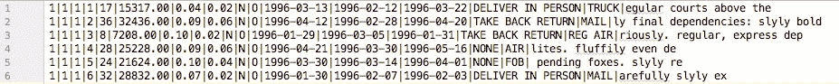
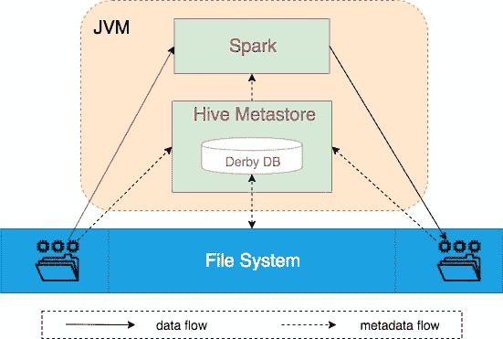
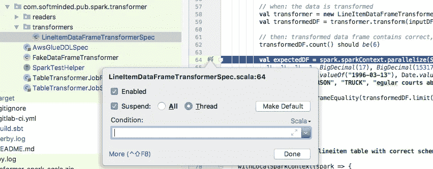
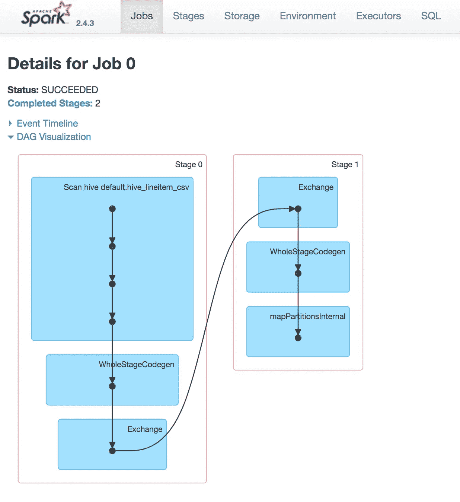
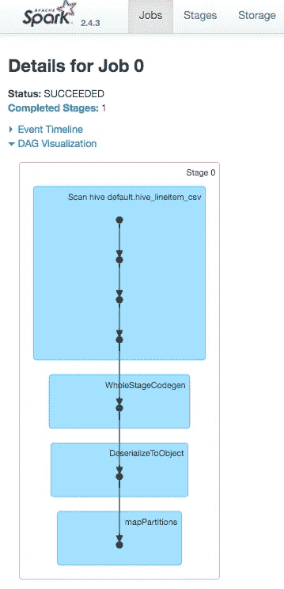
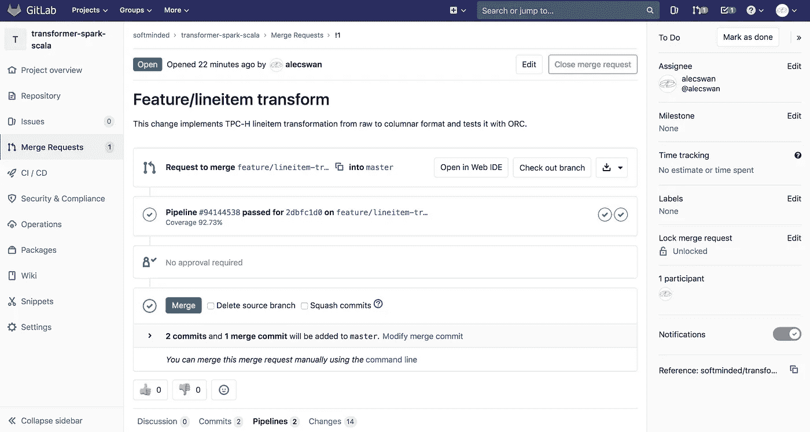

# 利用嵌入式 Spark 转换数据

> 原文：<https://medium.com/analytics-vidhya/transforming-data-with-embedded-spark-65fecaf682ba?source=collection_archive---------7----------------------->

在本文中，我们继续探索用 Scala 编写的 Spark jobs，构建在本系列前一篇文章“Scala 中 Spark jobs 的谨慎开发”中建立的基础之上。本文的目标是增强我们的 transformer 作业，以处理实际用例，并深入了解 Spark 作业执行的操作细节。文章组织如下:

1.[生成测试 TPC-H 数据](#5d43)
2。[转换行项目数据](#da50)
2.1 [选择表模式表示](#8bea)
2.2 [定义行项目表模式](#400e)
2.3 [在配置单元中创建行项目表](#198c)
2.4 [读取原始行项目数据](#fea8)
2.5 [将行项目数据从 CSV 转换为 ORC](#f2eb)
3 .[拾遗补缺洞察星火工作绩效](#6d7e)
4。[敲定功能实现](#226a)
5。[总结](#0afb)

# 生成测试 TPC-H 数据

在本文中，我们将实现 [TPC-H 基准](http://www.tpc.org/tpch/)数据从原始文本格式到列格式的转换。来自 TPC-H 网站:

> TPC Benchmark H(TPC-H)是一个决策支持基准。它由一套面向业务的特别查询和并发数据修改组成。

这里的目标不是对 Spark 转换作业进行基准测试，因为 [TPC-DI 基准测试](http://www.tpc.org/tpcdi/default.asp)可能更合适，而是生成一些数据，我们可以使用这些数据根据转换的数据对 Spark 和其他查询引擎的查询性能进行基准测试。

让我们用 [tpch-kit](https://github.com/gregrahn/tpch-kit) 工具生成一些 TPC-H 样本数据。下面将创建一个大约 100KB 的基准数据集，它足够小，可以签入到项目 repo 中，并在由我们的 [GitLab CI/CD 管道](https://docs.gitlab.com/ee/ci/)运行的集成测试中使用。或者，我们可以将样本数据集上传到一个共享位置，比如 S3 的一个存储桶，并配置构建过程在运行测试之前下载文件。(如果不是在 Mac OS 上运行，您可能需要调整 build 命令。)

生成的 TPC-H 数据集由以下文件组成:customer.tbl、lineitem.tbl、nation.tbl、orders.tbl、part.tbl、partsupp.tbl、region.tbl、supplier.tbl。这些文件包含模拟自虚拟零件订购系统的数据，在该系统中，客户订购零件，供应商完成这些订单。

让我们也生成可以针对 TPC-H 样本数据运行的 TPC-H 查询。下面将生成 tpch-q${i}。qgen 可执行文件所在文件夹中的 sql 文件。

生成的查询允许我们回答一些关于模拟数据的业务问题。例如，下面是来自 [TPC-H 规范](http://www.tpc.org/tpc_documents_current_versions/current_specifications.asp)的查询#3 的描述:

> **发货优先级查询(Q3)**
> 该查询检索价值最高的 10 个未发货订单。

这应该让您对 TPC-H 基准数据和查询有所了解。

# 转换行项目数据

TPC-H 基准数据集由几个表组成，在本节中，我们将为 LineItem 表实现一个转换器。所有表格的模式在完整的 TPC-H 规范中有所描述，可以从 [TPC 下载页面](http://www.tpc.org/tpc_documents_current_versions/current_specifications.asp)下载 PDF 格式的表格。

我们在这里的目标是从上一节中生成的 lineitem.tbl 文件中读取 LineItem 数据，将数据转换为所需的格式，如 ORC 或 Parquet，并存储转换后的数据以供进一步分析。这是包含 6 行项目的 lineitem.tbl 文件的内容，我们将在下面的测试中使用它。



由 TPC-H 生成的比例尺为 0.001 的 lineitem.tbl

首要任务是创建一个新的 Git 分支来托管我们的更改。

```
> git branch feature/lineitem-transform
> git checkout feature/lineitem-transform
```

## 选择表模式表示

在深入研究代码之前，让我们考虑一下我们希望转换器产生的数据的模式。

首先，让我们决定如何表示 LineItem 表的模式。一种选择是使用 SQL DDL 并编写一个“CREATE TABLE AS”语句，该语句将为我们创建一个具有正确模式的表。SQL 已经存在了很长一段时间，最初是设计用于关系数据库(RDBMs)的。但是，ANSI SQL 标准不支持表达表模式的某些属性，例如与底层物理存储的格式、分区和数据布局有关的属性。相反，标准的 ANSI SQL 遵从实现标准的 RDBMs 来做出这些决定。

另一个选择是使用 [Apache Hive SQL](https://cwiki.apache.org/confluence/display/Hive/LanguageManual) 语言来表达我们的表模式。Hive 是一个数据仓库软件，最初是作为 Apache Hadoop 框架的一部分开发的。Hive 的核心组件之一是 metastore。Hive metastore 是一个注册表，它维护有关数据库、表模式和其他元数据的信息。它的作用类似于关系数据库中的[信息模式](https://en.wikipedia.org/wiki/Information_schema)。流行的数据技术，如 Apache Spark 和 Presto，与 Hive metastore 集成。

Hive DDL 似乎是表示我们的表模式的一个不错的选择。然而，如果我们能够将 Hive 表模式表示为 Scala 对象并避免解析 Hive DDL 命令，那就太好了。为此我们将借用另一项技术，叫做 [AWS 胶水](https://aws.amazon.com/glue/)。Hive metastore 如此受欢迎，以至于 AWS 实现了自己的完全托管的元数据存储库，称为 [AWS 粘合数据目录](https://docs.aws.amazon.com/glue/latest/dg/populate-data-catalog.html)，以与 Hive metastore 兼容。AWS Glue 实现了一个 [Create Table Web API](https://docs.aws.amazon.com/glue/latest/webapi/API_CreateTable.html) ，我们可以用它作为在代码中表达表格模式的模板。将 AWS Glue Create Table API 请求有效负载转换为 Scala 会产生以下简单的配置单元表模式表示:

## 定义行项目表架构

Hive 中表模式的定义由传统的列名和类型以及物理数据格式和布局的描述组成。我们可以为保存由 LineItemDataFrameTransformer 生成的 LineItem ORC 数据的表定义模式，如下所示:

请注意，除了列类型之外，该模式还定义了 SerDe(序列化程序/反序列化程序)库*org . Apache . Hadoop . hive . QL . io . orc . orc SerDe*，它将使用*org . Apache . Hadoop . hive . QL . io . orc . orc input format*从底层存储(如 HDFS)读取数据，并使用*org . Apache . Hadoop . hive . QL . io . orc . orc output 向底层存储写入数据*

## 在配置单元中创建行项目表

Spark 与 Hive metastore 集成，后者可以以嵌入式、本地和远程模式部署。在嵌入式模式下，Hive 使用 Derby 数据库来持久存储元数据，这对于我们的集成测试来说很好，但是对于生产级的工作负载来说可能不可伸缩。下图显示了集成测试中的数据和元数据流。Hive metastore 维护有关输入 CSV 文件存储位置和转换后的数据应写入位置的信息，Spark 使用这些信息来执行数据的实际读取和写入。



嵌入式 Spark 和 Hive metastore

为了在配置单元表中存储转换后的数据，我们首先需要用适当的模式创建表。我们可以在 SparkTestHelper 类中引入下面的 helper 方法，它将创建一个配置单元表，给出一个模式表示参数 *tableSchema* :

现在让我们在 LineItemDataFrameTransformerSpec 中添加一个测试，以验证我们可以使用 LineItemDataFrameTransformer 中定义的 LineItem 模式创建一个配置单元表。

## 读取原始行项目数据

[在上一篇文章](/@alecswan_76492/playing-with-spark-in-scala-warm-up-game-8bfbb7cfbcc4#37c5)中，我展示了如何在内存中创建一个数据帧，并用 SparkSession 将其注册为一个表。这里，我们可以通过将数据从文件读入 DataFrame 来扩展这种方法。

以下代码片段显示了如何使用[data frame reader # csv](https://spark.apache.org/docs/latest/api/java/org/apache/spark/sql/DataFrameReader.html#csv-java.lang.String-)Spark API 读取一个没有标题的 CSV 文件，并将|作为数据帧的自定义分隔符。

遵循[上一篇文章](/@alecswan_76492/playing-with-spark-in-scala-warm-up-game-8bfbb7cfbcc4#3628)中建立的模式，我们创建一个 DataFrameCsvFileReader 类来读取 CSV 文件。

接下来，我们实现一个集成测试，检查从 CSV 文件中读取的数据是否正确。请注意，尽管可能，我们并没有为读取的数据帧指定模式，因为我们无论如何都要将这些数据转换成不同的模式。因此，在这一点上，将所有列作为字符串读取就足以满足我们的需求了。

尽管这种方法可行，但它一次只能对一个文件进行操作。当大规模运行时，我们希望我们的作业一次读取多个文件。实现这一点的一种方法是使用对多个文件进行操作的 [DataFrameReader#csv](https://spark.apache.org/docs/latest/api/java/org/apache/spark/sql/DataFrameReader.html#csv-scala.collection.Seq-) API。这是可行的，但是需要我们找到所有需要在运行时读取的 CSV 文件。如果需要，这可以通过列出目录中的文件或监视目录中的文件修改来完成。然而，存储中的数据通常是按照写入时间来划分的，例如，存储结构是按照日期/小时层次结构来组织的。请注意，这种数据组织的优势在于它保证了数据一旦被写入，就不可改变。这种数据组织的缺点是，如果不在存储中创建大量的文件夹/分区组合，就很难按照其他属性(如发货日期)对相关数据进行分组。数据不变性是一个非常重要的属性，因为它简化了数据的增量处理和状态推理。这就是为什么通常按写入时间组织原始数据，然后将数据转换为更合适的格式，如 ORC 或 Parquet，以及分区结构，如按发货日期。

读取文件夹中所有文件的一个选项是创建一个位置指向该文件夹的 Hive 表，然后使用我们的 DataFrameTableReader 从 Hive 表中读取数据。下面展示了一个测试。

## 将行项目数据从 CSV 转换为 ORC

此时，我们有代码将行项目数据从 CSV 文件读入数据帧，并将数据帧写入配置单元表。请注意，数据是从 CSV 读入包含所有字符串类型列的数据帧中的。因此，我们想要做的一个转换是将每一列转换为适当的类型。下面显示了 LineItemDataFrameTransformer 类中此类转换的实现。转换将输入字符串列转换为输出表模式定义中声明的类型，该定义来自*lineitemdataframeformer . get schema()*:

以下测试将 CSV 文件存放在文件夹中，在该文件夹上创建一个配置单元表，将配置单元表读入数据帧，将数据帧传递给转换器，并验证转换器是否生成了具有正确类型方案的正确行数的数据帧。

# 收集对 Spark 工作绩效的见解

围绕我们的 Spark 工作进行测试是很棒的，但是当这些测试在嵌入式模式下执行时，我们能知道 Spark 实际上在做什么吗？我们如何深入了解幕后发生的事情？

事实证明，就像独立的本地和远程模式一样，Spark 也可以在嵌入式模式下运行 UI 服务器。Spark UI 是一个 web 界面，它提供了对 Spark 作业的性能特征的可见性，包括作业如何分解成阶段以及每个作业如何利用 Spark 执行器。

在嵌入式模式下，Spark UI 与测试在同一个 JVM 中运行，并在测试结束前关闭。因此，为了能够在测试运行时访问 UI，我们在 Spark 作业完成后立即放置了一个断点。在上面的测试中，Spark 作业是由 *transformedDF.count()* 调用启动的，因为在 Spark DAG 术语中， *count()* 是一个**动作**，与在我们的测试中触发 DAG 执行的**转换**相反。请参考 [Apache Spark 文档](https://spark.apache.org/docs/latest/rdd-programming-guide.html#rdd-operations)了解 Spark 支持的转换和动作的详细信息。

这里需要注意的是，我们希望断点暂停执行测试的线程，但允许服务于 Spark UI 的线程继续执行。在 IntelliJ IDEA 中，这可以通过右键单击断点并选择 Suspend 部分中的 Thread 来完成，如下所示。



测试执行暂停以允许访问 Spark UI

现在，我们可以在调试模式下运行测试，并在遇到断点时访问 Spark UI。请注意，Spark UI 服务器默认启动，但可以通过将*Spark . UI . enabled*config 设置设置为 *false* 来禁用。如果启用了 Spark UI，那么您将会在测试期间生成的日志中看到下面一行:

```
19/11/24 11:12:16 INFO Utils: Successfully started service 'SparkUI' on port 4040.
```

这意味着当测试在断点处暂停时，可以通过在浏览器中打开 [http://localhost:4040/](http://localhost:4040/) 来访问 Spark UI。可通过将 spark.ui.port spark 配置设置为所需端口来更改 UI 端口，例如在`SparkSession.builder().config(“spark.ui.port”, “4041”).getOrCreate()`中创建 Spark 会话时。



这个屏幕截图显示了 Spark UI，其中的作业及其阶段在测试到达断点之前已经完成。有趣的是，一个简单的 count()操作导致了两个作业阶段的数据混乱。原因是[数据集#count()](https://github.com/apache/spark/blob/master/sql/core/src/main/scala/org/apache/spark/sql/Dataset.scala#L2788) 是使用 groupBy()实现的。使用空键计数()。这导致在每个分区中计算部分计数，并将所有这些计数发送到映射到空键的单个分区。然后，该分区将生成最终的聚合计数。因此，在这种情况下，shuffle 会移动少量数据，这不是一个需要关注的问题。



有趣的是，从[数据集#count()](https://github.com/apache/spark/blob/master/sql/core/src/main/scala/org/apache/spark/sql/Dataset.scala#L2788) 切换到 [RDD#count()](https://github.com/apache/spark/blob/master/core/src/main/scala/org/apache/spark/rdd/RDD.scala#L1227) API 消除了这种额外的洗牌，因为后者不使用 groupBy，而是直接累加从每个分区接收的部分计数。

在使用 Spark UI 时，我们可以发现许多类似这样的细微差别。Spark 作业优化的主题超出了本文的范围，在网上有大量的支持文献。

我想指出的最后一点是 UI 中的 SQL 选项卡，它显示了作业运行的 Spark SQL 查询及其执行计划。注意，通过在查询前加上*解释*或*解释扩展*，可以以编程方式获得相同的执行计划。

# 最终完成功能实现

此时，行项目转换已经实现，我们需要确保所有的测试仍然通过，并且我们有一个良好的代码覆盖率。一种方法是在 IDE 中运行覆盖测试，就像我们在[上一篇文章](/@alecswan_76492/playing-with-spark-in-scala-warm-up-game-8bfbb7cfbcc4#1659)中所做的那样。另一种方法是运行以下命令来生成覆盖率报告:

```
> sbt clean coverage test
> sbt coverageReport
```

最后一个命令将在项目文件夹中产生一个*target/Scala-2.11/s coverage-report/index . html*。在 web 浏览器中打开该文件，并查看覆盖率报告。

一旦我们对代码覆盖率感到满意，我们就可以将特性分支推送到 Git 服务器，这将触发 CI/CD 管道。

```
> git push --set-upstream origin feature/lineitem-transform
```

一旦对通过测试和 CI/CD 产生的代码覆盖率感到满意，让我们用我们在`feature/lineitem-transform`分支中所做的更改创建一个 pull 请求(在 GitLab 中称为“合并请求”),供其他开发人员审查。当创建这样的请求时，使用`feature/lineitem-transform`作为源分支，`master`作为目标分支，提供变更的清晰描述，并将其分配给应该审阅请求的用户。以下是 GitLab 中此类拉取请求的一个示例:



GitLab 中的拉/合并请求

一旦请求被批准，通过点击 UI 中的合并按钮或使用`[git merge](https://git-scm.com/docs/git-merge)`命令，请求中的变更可以被合并到主分支中。请注意，如果在我们从主分支中分支出特性分支之后，在主分支中进行了更改，那么我们会希望在将拉请求合并到主分支之前将这些更改应用到特性分支。这可以通过使用`[git rebase](https://git-scm.com/docs/git-rebase)`命令来完成，该命令将暂时回滚在特征分支中所做的更改，重放在主分支中所做的更改，并重放在重放的更改之上恢复的更改。有时，这可能会导致合并冲突，您必须在将特征分支合并到主分支之前，在特征分支中解决这些冲突。

# 摘要

在本文中，我们介绍了 TPC-H 基准，并简要讨论了它所包含的数据集和查询。我们评估了使用 Scala 对象模型在 Spark 中表示表模式的不同选项，并确定了在 [Create Table AWS Glue Web API](https://docs.aws.amazon.com/glue/latest/webapi/API_CreateTable.html) 中使用的格式。我们回顾了用于读写文件的不同 Spark API，并使用它们实现了将 TPC-H LineItem 数据从原始格式转换为 ORC 格式的 Spark 作业。接下来，我们讨论了在底层物理存储中组织数据的不同方法的利弊。最后，我们窥视了 Spark API 的幕后，在嵌入式模式下运行 Spark 作业时，查看了 Spark UI 中的作业执行细节。一直以来，我们都遵循最佳的软件工程实践，确保我们产生高质量的干净代码。