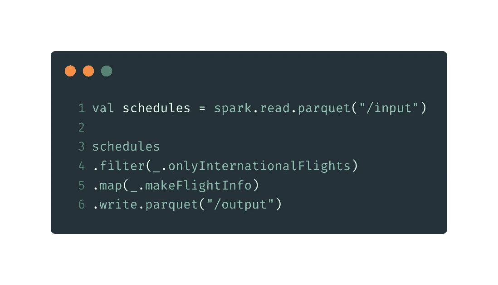
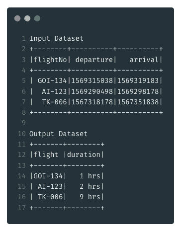
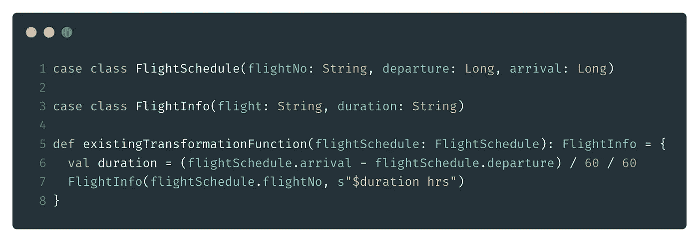
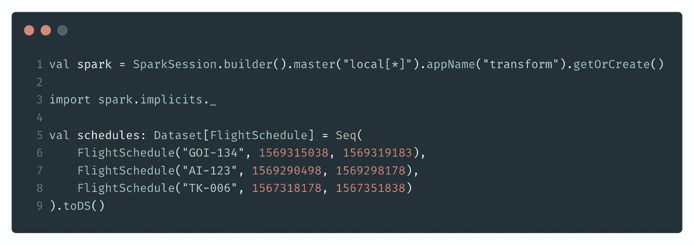
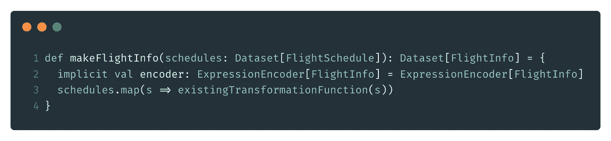
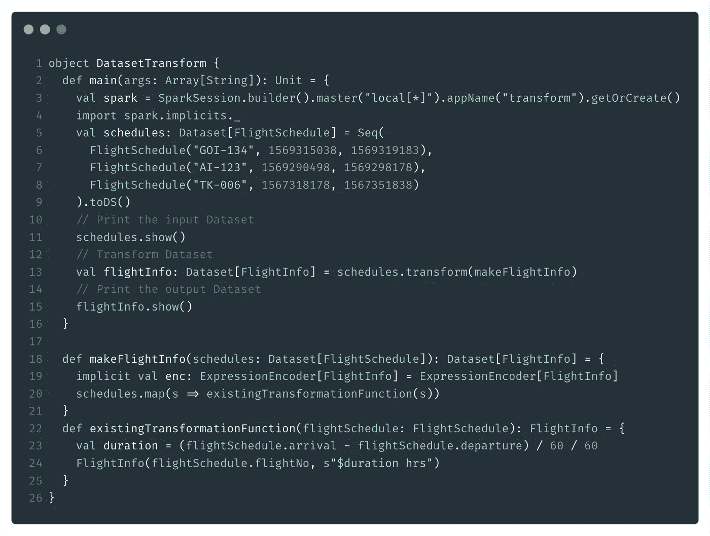

# 使用 Scala 转换函数转换 Spark 数据集

> 原文：<https://medium.com/analytics-vidhya/transforming-spark-datasets-using-scala-transformation-functions-36007a7ac57f?source=collection_archive---------8----------------------->



转换 Spark 数据集

在读写拼花、csv 或 xml 文件时，我很少选择 Spark 作为 ETL 工具，因为它很容易使用。

阅读这些文件格式中的任何一种都像一行 spark 代码一样简单(当然是在您确保拥有所需的依赖项之后)

## 目的

大多数在线可获得的转换数据集的参考资料都指向调用`createOrReplaceTempView()`并将`Dataset/Dataframe`注册为一个表，然后对其执行`SQL`操作。

虽然这对于大多数用例来说可能没问题，但有时使用 Spark 的 Scala 转换函数会感觉更自然，尤其是如果您已经用`Scala`或`ReactiveX`甚至`Java 8`编写了一些预先存在的转换逻辑。

如果这听起来像是你想做的事情，那么请继续读下去。

## 入门指南

假设我们想要使用数据集进行以下转换。



## 领域对象和转换函数

我们假设我们有下面的域对象和转换函数，它将一个`FlightSchedule`对象转换成一个`FlightInfo`对象。



## 创建 spark 会话并读取输入数据集

为了简洁，创建输入`Dataset`很简单。



## 定义编码器和火花变换

这就是事情开始变得有趣的地方。为了将一个`Dataset[FlightSchedule]`转化为一个`Dataset[FlightInfo]`，Spark 需要知道如何*“编码”*你的`case class`。省略这一步将会导致下面可怕的编译时错误。

```
Error:(34, 18) Unable to find encoder for type stored in a Dataset.  Primitive types (Int, String, etc) and Product types (case classes) are supported by importing spark.implicits._Support for serializing other types will be added in future releases.
schedules.map(s => existingTransformationFunction(s))
```

`Encoders[T]`用于将任何类型`T`的 JVM 对象或原语与 Spark SQL 的 [InternalRow](https://jaceklaskowski.gitbooks.io/mastering-spark-sql/spark-sql-InternalRow.html) 表示相互转换。由于`Dataset.map()`方法要求将编码器作为隐式参数传递，我们将定义一个`implicit`变量。



## 转换数据集

现在剩下唯一要做的事情就是调用输入`Dataset`上的`transform`方法。我将在这里包含整个代码以及对`show()`的调用，这样我们就可以看到我们的结果。



# 参考

1.  [Spark SQL 编码器](https://jaceklaskowski.gitbooks.io/mastering-spark-sql/spark-sql-Encoder.html)

*也贴在:*[*https://olivermascarenhas . com/2019-09-25-how-to-transform-a-spark-dataset/*](https://olivermascarenhas.com/2019-09-25-how-to-transform-a-spark-dataset/)