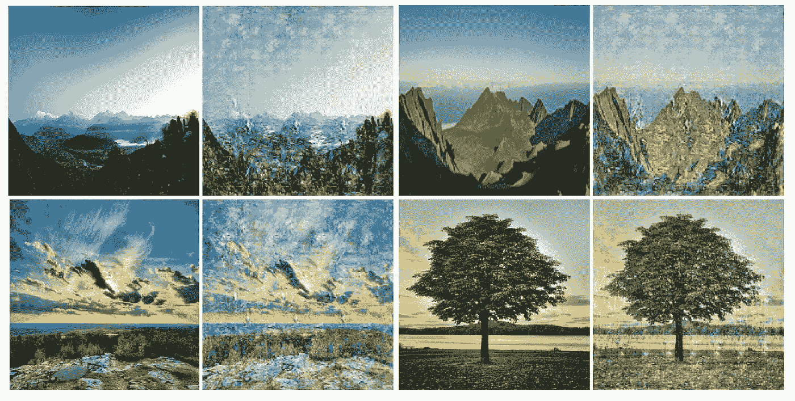

# 用 CycleGAN 将世界转化为绘画

> 原文：<https://medium.com/analytics-vidhya/transforming-the-world-into-paintings-with-cyclegan-6748c0b85632?source=collection_archive---------5----------------------->

## 在 Keras 和 Tensorflow 2.0 中实现 CycleGAN

一些最终结果

*本文假设您已经对 CycleGAN 的工作原理有了很强的概念性理解。如果你是 CycleGAN 的新手，或者需要快速复习，我会推荐阅读我以前的文章，详细介绍驱动 cycle gan***的直觉和数学。**