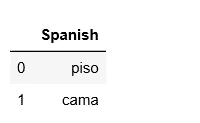
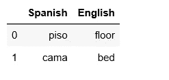
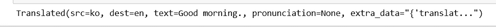
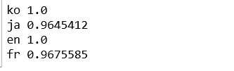
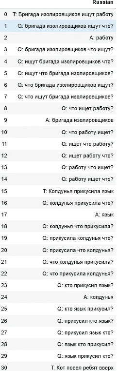
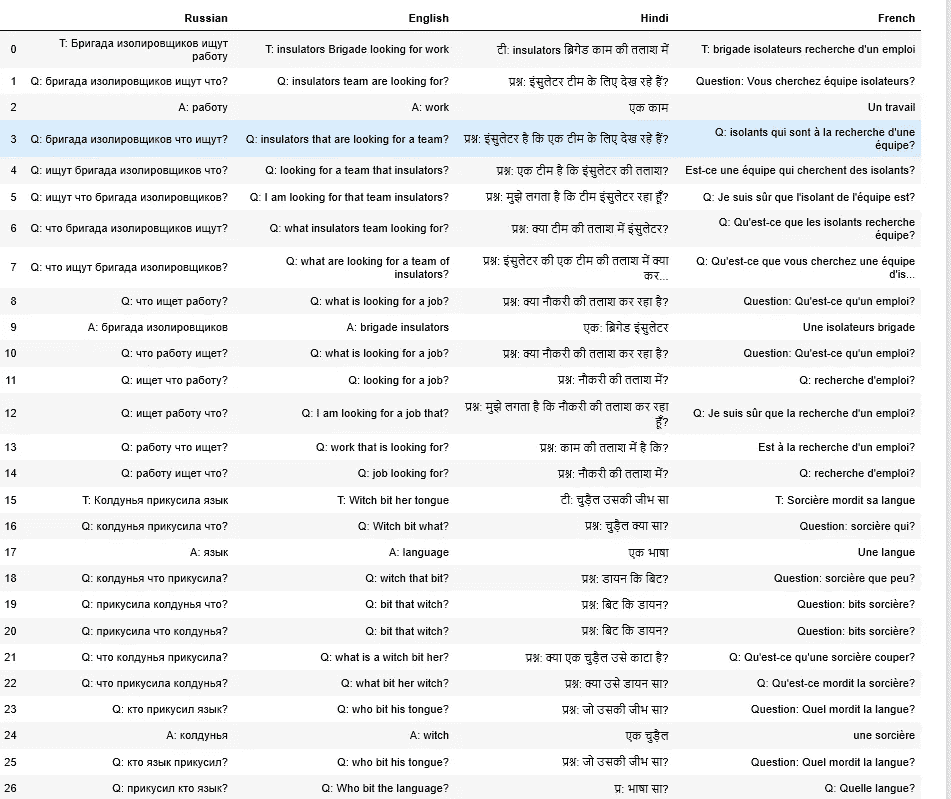

# 使用 python 中的 googletrans 库翻译列表和 Pandas 数据框

> 原文：<https://medium.com/analytics-vidhya/translate-list-and-pandas-data-frame-using-googletrans-library-in-python-f28b8cb84f21?source=collection_archive---------0----------------------->

使用这个库，我们可以根据需要翻译数据。


由[🇸🇮·扬科·菲利](https://unsplash.com/@itfeelslikefilm?utm_source=medium&utm_medium=referral)在 [Unsplash](https://unsplash.com?utm_source=medium&utm_medium=referral) 上拍摄的照片

在本教程中，我将把数据从西班牙语翻译成英语，英语翻译成印地语，最后一节是俄语翻译成英语、印地语和法语。我将在 Pandas 数据框、列表和字符串上演示翻译。

最近我偶然发现了 [Google Colab notebook](https://colab.research.google.com/) ，我们可以在上面写代码，如果你没有在你的系统中安装 anaconda 软件，你可以使用它，我在本教程中使用 Jupyter notebook。

# **什么是 googletrans？**

googletrans 是一个免费且无限制的 python 库，实现了 Google Translate API。

特征

*   快速可靠—它使用的服务器与 translate.google.com 使用的相同
*   自动语言检测
*   批量翻译
*   可定制的服务 URL
*   连接池(使用请求的优势。会话)


查尔斯·雷在 [Unsplash](https://unsplash.com?utm_source=medium&utm_medium=referral) 上拍摄的照片

## 装置

要安装 googletrans 库 run below 代码，此命令会自动下载并安装该库。

```
pip install googletrans
```

# 导入必要的库

在这一步中，我们将导入我们将在整个教程中使用的重要库。

```
from googletrans import Translator
import pandas as pd
```

## 案例 1

我已经创建了一个熊猫数据框架，并将把它翻译成英文。

```
translator = Translator()
df = pd.DataFrame({'Spanish':['piso','cama']})
df
```

输出:



将此数据帧翻译成英语:

```
df['English'] = df['Spanish'].apply(translator.translate, src='es', dest='en').apply(getattr, args=('text',))
df
```

以下是最终输出:



最终输出

## 案例 2

将下面代码中的列表从英语翻译成印地语

```
from googletrans import Translatortranslator = Translator()  # initalize the Translator objectdf=['How are you doing today', 'Good morning, How are you ','I hope you are doing great']translations = translator.translate(df, dest='hi')
for translation in translations:  # print every translation
    print(translation.text)
```


输出

同样，我们可以从一种语言翻译成另一种语言，我们只需要在代码中提到源语言和目的语言。我将在本文的后面解释这个例子，在此之前，我们将看到一些例子，我们想检测在我们的工作表中提到的语言的原始来源。

示例 1:

在这个例子中，我们不知道这个文本的源语言'안녕하세요'.

下面的代码将检测源语言，并告诉我们翻译的语言(dest)。

```
from googletrans import Translator
translator = Translator()
print(translator.translate('안녕하세요.'))
```



输出

在上面的输出中，我们现在知道'안녕하세요'这个文本是(ko: Korean)并翻译成(en: English)的。

示例 2:

我们将使用`**detect**` ( *text* )函数:这个函数帮助我们检测输入文本的语言。

```
from googletrans import Translator
translator = Translator()
translator.detect('이 문장은 한글로 쓰여졌습니다.')
print(translator.detect('이 문장은 한글로 쓰여졌습니다.'))
```


输出

如果我们有一个包含不同语言的不同文本的列表，并且我们想要识别语言，那么我们将运行下面的代码。

```
langs = translator.detect(['한국어', '日本語', 'English', 'le français'])
for lang in langs:
    print(lang.lang, lang.confidence)
```



输出


威廉·艾文在 [Unsplash](https://unsplash.com?utm_source=medium&utm_medium=referral) 上的照片

## 案例 3

在大多数情况下，我们在 excel 表中获取数据，我们需要将数据翻译成不同的语言，在本例中，我们有俄语数据并希望进行翻译

一.俄语到英语

二。俄语到印地语

三。同一数据帧中的俄语到法语。

```
df1=pd.read_excel('russiandataset.xlsx',sheet_name='Dataset1')
df1
```



数据帧

```
df1['English'] = df1['Russian'].apply(translator.translate, src='ru', dest='en').apply(getattr, args=('text',))df1['Hindi'] = df1['Russian'].apply(translator.translate, src='ru', dest='hi').apply(getattr, args=('text',))df1['French'] = df1['Hindi'].apply(translator.translate, src='hi', dest='fr').apply(getattr, args=('text',))df1
```

以下是输出:



**结论**

googletrans 在翻译 pandas 数据帧、列表和字符串方面非常有帮助。

如果我们有一个包含不同语言的大型数据集，并且需要翻译成其他语言，那么在 googletrans 库的帮助下，我们可以很容易地做到这一点。

我希望这篇文章能帮助你并节省大量的时间。如果你有任何建议，请告诉我。

快乐编码。

来源:

https://pypi.org/project/googletrans//

[https://py-googletrans.readthedocs.io/en/latest/](https://py-googletrans.readthedocs.io/en/latest/)/


安德拉兹·拉济奇在 [Unsplash](https://unsplash.com?utm_source=medium&utm_medium=referral) 上拍摄的照片