# 机器翻译

> 原文：<https://medium.com/analytics-vidhya/translation-seq2seq-attention-4f8b23f33965?source=collection_archive---------29----------------------->

## 这个故事涵盖了前神经机器翻译、神经机器翻译和注意力。这个故事是对课程的一个简短总结:[斯坦福 CS224N:带深度学习的| Winter 2019 |第八讲—翻译，Seq2Seq，注意](https://www.youtube.com/watch?v=XXtpJxZBa2c&list=PLoROMvodv4rOhcuXMZkNm7j3fVwBBY42z&index=8)。

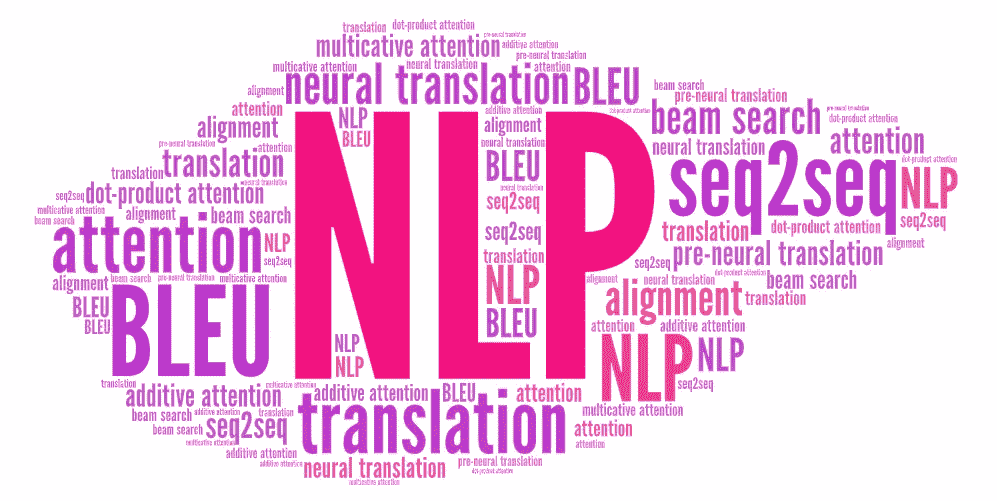

这个故事包括前神经机器翻译，神经机器翻译，注意力。以下是课程总结: [Stanford CS224N:带深度学习的| Winter 2019 |第八讲—翻译，Seq2Seq，注意](https://www.youtube.com/watch?v=XXtpJxZBa2c&list=PLoROMvodv4rOhcuXMZkNm7j3fVwBBY42z&index=8)。

# **预神经机器翻译**

**机器翻译(MT)** 是将一种语言(源语言)的句子 x 翻译成另一种语言(目标语言)的句子 y 的任务。机器翻译研究始于 20 世纪 50 年代初，始于将俄语翻译成英语，这是冷战的推动。系统大多基于规则，使用双语词典将俄语单词映射到英语单词。

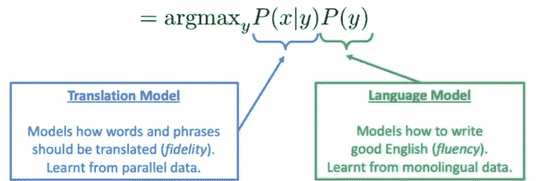

统计机器学习。来源:[课程幻灯片](https://www.youtube.com/watch?v=XXtpJxZBa2c&list=PLoROMvodv4rOhcuXMZkNm7j3fVwBBY42z&index=8)

从 20 世纪 90 年代到 2010 年代，统计机器学习主导了 MT，即从数据中学习概率模型。假设我们把法语翻译成英语。我们想找到最好的英语句子 y，给定法语句子 x。使用贝叶斯规则将其分解为两个部分，分别学习。如何学习翻译模型 P(x|y)？首先，需要大量的并行数据(例如，成对的人工翻译的法语/英语句子)。那么如何从平行语料库中学习翻译模型 P(x|y)？我们进一步分解它:我们实际上想要考虑:P(x，a|y)其中 a 是对齐，即法语句子 x 和英语句子 y 之间的单词级对应。

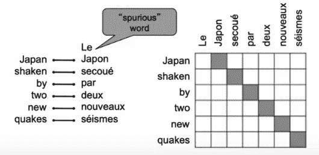

对齐。来源:[课程幻灯片](https://www.youtube.com/watch?v=XXtpJxZBa2c&list=PLoROMvodv4rOhcuXMZkNm7j3fVwBBY42z&index=8)

***对齐是翻译句子对*** 中特定单词之间的对应关系。值得注意的是，有些词没有对应词。对齐是复杂的，可以是多对一、一对多和多对多。我们认为 P(x，a|y)是许多因素的组合，包括 1)特定单词对齐的概率(也取决于在句子中的位置)；2)特定单词具有特定生殖力的概率(对应单词的数量)

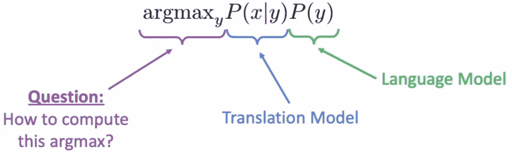

统计机器学习的解码。来源:[课程幻灯片](https://www.youtube.com/watch?v=XXtpJxZBa2c&list=PLoROMvodv4rOhcuXMZkNm7j3fVwBBY42z&index=8)

我们可以列举每一个可能的 y 并计算概率。但是太贵了！一种解决方案是使用启发式搜索算法来搜索最佳翻译，丢弃概率太低的假设。这个过程叫做解码。统计机器学习(SML)是一个巨大的研究领域。最好的系统极其复杂。它包含了数百个我们在这里没有提到的重要细节。系统有许多单独设计的子组件。它需要大量的特征工程。它需要设计一些功能来捕捉特定的语言现象。它需要编译和维护额外的资源。它就像等价短语的表格，需要大量的人力来维护。

# 2.神经机器翻译

神经机器翻译(NMT) **这是一种用单个神经网络进行机器翻译的方法。神经网络架构被称为**序列到序列(又名 seq2seq)** ，它涉及**两个 rnn****

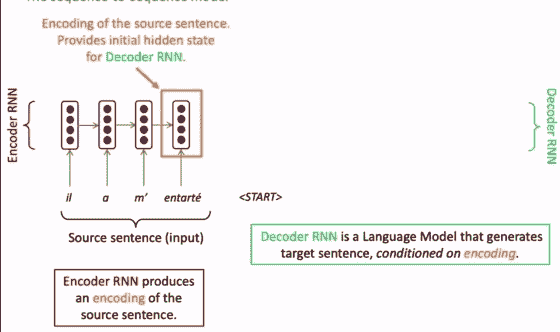

seq2seq NMT 解码示例。来源:[课程幻灯片](https://www.youtube.com/watch?v=XXtpJxZBa2c&list=PLoROMvodv4rOhcuXMZkNm7j3fVwBBY42z&index=8)

序列到序列(seq2seq)不仅仅适用于机器翻译。许多自然语言处理任务可以表述为序列到序列:摘要(从长文本到短文本)、对话(从前面的话语到下一个话语)、解析(从输入文本到输出解析为序列)和代码生成(从自然语言到 python 代码)。序列到序列模型是**条件语言模型的一个例子。它是一个语言模型**因为解码器正在预测目标句子 y 的下一个单词**它是有条件的**因为它的预测也是以源句子 x 为条件的 NMT 直接计算 P(y|x)。

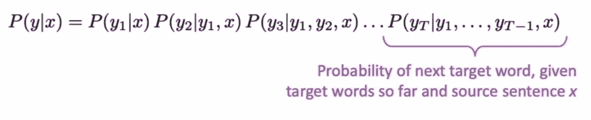

NMT 直接计算 P(y|x)

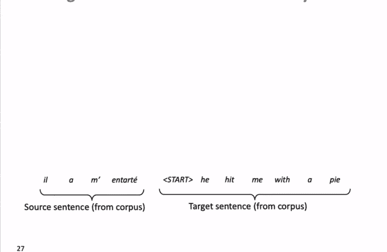

NMT 培训流程。来源:[课程幻灯片](https://www.youtube.com/watch?v=XXtpJxZBa2c&list=PLoROMvodv4rOhcuXMZkNm7j3fVwBBY42z&index=8)

得到一个大的平行语料库，我们可以训练一个 NMT 系统。 ***Seq2seq 优化为单一系统，反向传播“端到端”操作*** 。

我们看到了如何通过在解码器的每一步使用 argmax 来生成(或“解码”)目标句子。这是贪婪解码，在每一步中取最可能的单词)。贪婪解码的问题是它没有办法撤销决定。理想情况下，我们希望找到一个(长度为 T)的平移 y，使 p(y|x)最大化。这就是**穷举搜索解码**算法。

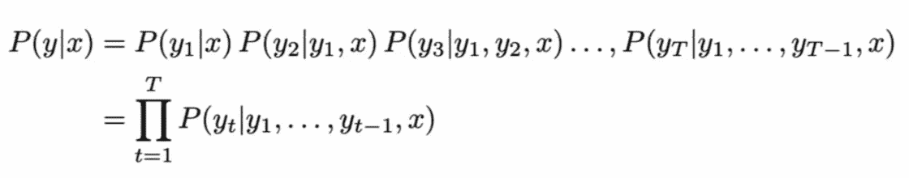

理想情况下，我们希望找到一个(长度为 T)的平移 y，使 p(y|x)最大化。来源:[课程幻灯片](https://www.youtube.com/watch?v=XXtpJxZBa2c&list=PLoROMvodv4rOhcuXMZkNm7j3fVwBBY42z&index=8)

*我们可以尝试计算所有可能的序列 y。*这意味着在解码器的每一步 t，我们都在跟踪 Vt 可能的部分翻译，其中 V 是 vocab 大小。这 O(V^T)的复杂性是**太昂贵了！**

我们可以使用波束搜索解码。在解码器的每一步，它跟踪 K 个最可能的部分平移(我们称之为假设)，其中 K 是光束大小(实际上大约为 5 到 10)。

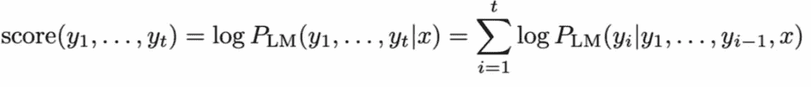

光束搜索得分。来源:[课程幻灯片](https://www.youtube.com/watch?v=XXtpJxZBa2c&list=PLoROMvodv4rOhcuXMZkNm7j3fVwBBY42z&index=8)

一个假设 y1，…yt 有一个分数，这是它的对数概率。分数都是负数，分数越高越好。我们搜索高分假设，跟踪每一步的前 k。波束搜索不能保证找到最优解，但它比穷举搜索效率高得多！

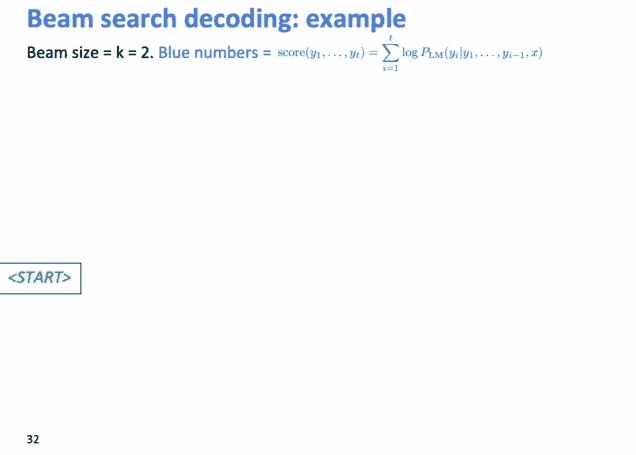

波束搜索解码示例。来源:[课程幻灯片](https://www.youtube.com/watch?v=XXtpJxZBa2c&list=PLoROMvodv4rOhcuXMZkNm7j3fVwBBY42z&index=8)

先说解码中的停止准则。 ***在贪婪解码中，我们通常会解码到 model 产生一个< END > token，*** 比如`< START >他用馅饼砸我< END >`。在波束搜索解码中，不同的假设可能在不同的时间步长上产生<和>记号。当一个假设产生<结束>时，那个假设就完成了。波束搜索把它放在一边，继续探索其他假设。 ***我们通常继续波束搜索，直到到达时间步长 T(其中 T 是某个预定义的截止值)，或者我们至少有 n 个完整的假设(其中 n 是预定义的截止值)*** 。

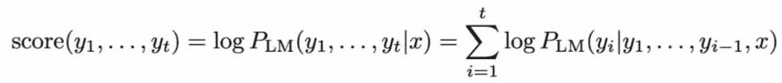

我们列表中的每个假设 y1，…yt 都有一个分数

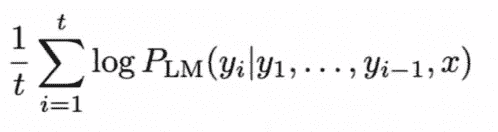

标准化射束搜索分数。来源:[课程幻灯片](https://www.youtube.com/watch?v=XXtpJxZBa2c&list=PLoROMvodv4rOhcuXMZkNm7j3fVwBBY42z&index=8)

现在我们有了完整的假设列表，但是如何选择得分最高的一个呢？我们列表中的每个假设 y1，…yt 都有一个分数。这样做的问题是，越长的假设得分越低。我们可以通过用长度 t 归一化分数来解决这个问题。

与 SMT 相比，NMT 有许多优势:1)它有更好的表现:更流畅，更好地利用上下文和短语相似性；2)要端到端优化的单个神经网络:没有要单独优化的子组件；3)它需要更少的人工工程努力:不需要特征工程，并且对所有语言对使用相同的方法。与 SMT 相比，也有一些**的缺点**，比如 NMT 的可解释性较差，难以控制(s.t .不容易指定翻译的规则或指导方针)。

我们用 BLEU 来评价 ML。 [***BLEU***](https://www.aclweb.org/anthology/P02-1040.pdf) 代表双语评价替角。它将机器编写的翻译与一个或几个人类编写的翻译进行比较，然后 ***根据以下因素计算相似性得分:n 个字母的精度(通常是 1、2、3 和 4 个字母的精度)，加上对过短系统翻译的惩罚*** 。蓝色是有用的，但不完美。翻译一个句子有许多有效的方法。所以一个好的翻译可以得到一个很差的 BLEU 分数，因为它与人类翻译的 n-gram 重叠很低。

NMT 取得了不错的进展，[但是机器翻译还没有解决](http://www.skynettoday.com/state_of_nmt)。NMT 是 NLP 深度学习的旗舰任务。NMT 研究公司开创了 NLP 深度学习的许多最新创新。2019 年，NMT 研究继续蓬勃发展。研究人员已经发现了我们今天展示的“香草”seq2seq NMT 系统的许多改进。但有一项改进是如此不可或缺，那就是新香草，*注意。*

# *3.注意力*

*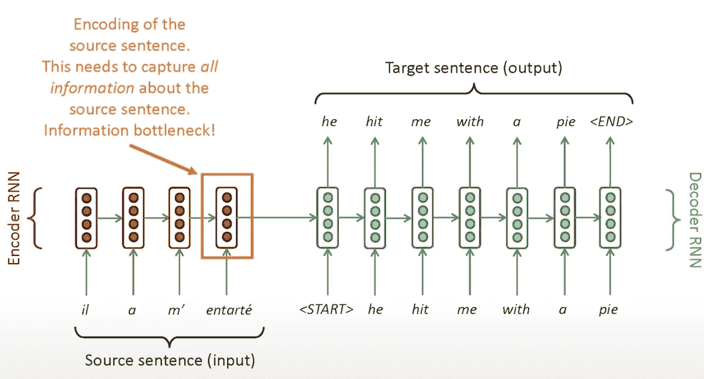*

*seq2seq:瓶颈问题。来源:[课程幻灯片](https://www.youtube.com/watch?v=XXtpJxZBa2c&list=PLoROMvodv4rOhcuXMZkNm7j3fVwBBY42z&index=8)*

*seq2seq 的瓶颈问题是，瓶颈需要捕获关于源句子的所有信息。注意力为瓶颈问题提供了解决方案。T ***他的核心思想是，在解码器的每一步上，使用直接连接到编码器来聚焦源序列的特定部分*** 。*

*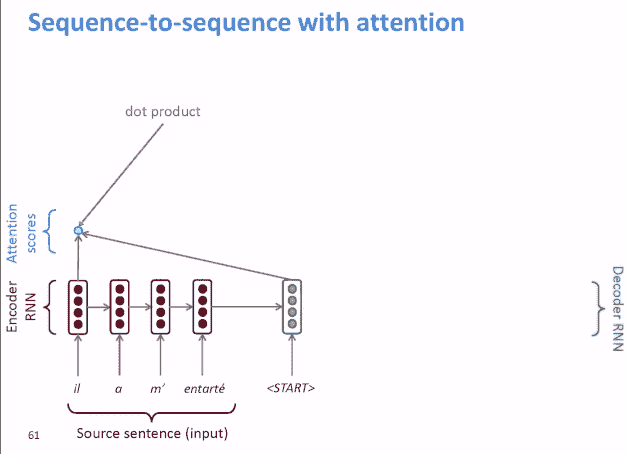*

*注意从序列到序列。来源:[课程幻灯片](https://www.youtube.com/watch?v=XXtpJxZBa2c&list=PLoROMvodv4rOhcuXMZkNm7j3fVwBBY42z&index=8)*

**首先，我们计算<开始>和源句子中每个标记之间的点积。然后我们拿 softmax 把分数变成概率分布。从这个分布中，我们可以看到，在这个编码器时间步长上，我们主要关注第一个编码器隐藏状态“他”。然后，我们使用注意力分布对编码器隐藏状态进行加权求和。注意力输出主要包含来自受到高度关注的隐藏状态的信息。然后，我们将注意力输出与解码器隐藏状态连接起来，以计算第一个解码器输出，在本例中是“他”。有时我们从上一步中提取注意力输出，并将其输入到解码器中(和通常的解码器输入一起)*。最后，我们重复整个过程，一个单词一个单词地生成单词。*

*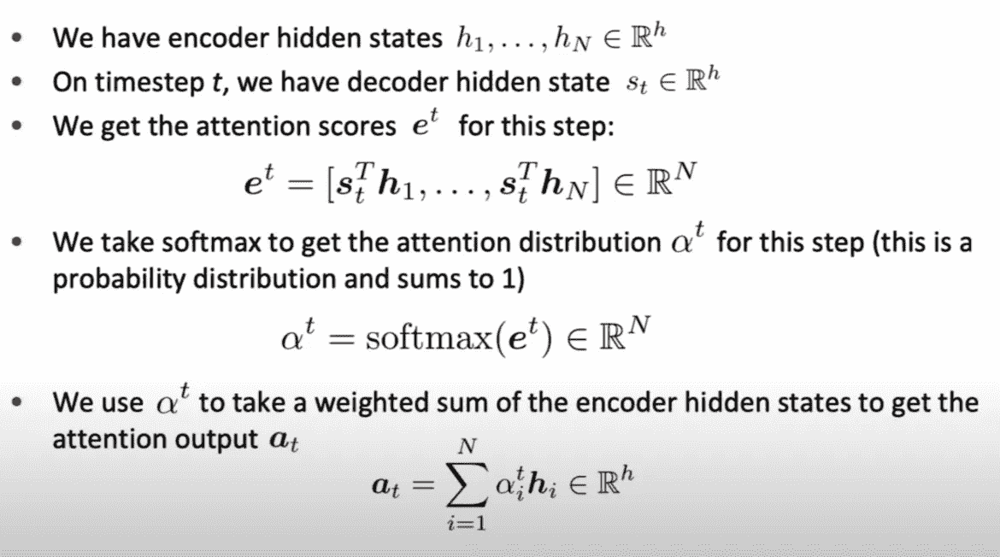*

*方程式中的注意。来源:[课程幻灯片](https://www.youtube.com/watch?v=XXtpJxZBa2c&list=PLoROMvodv4rOhcuXMZkNm7j3fVwBBY42z&index=8)*

*关注度很大。注意力通过允许解码器聚焦于源的某些部分而显著提高了 NMT 性能；注意力通过允许解码器直接查看源并绕过瓶颈来解决瓶颈问题；注意力有助于解决消失梯度问题，因为它提供了一条通往遥远状态的捷径。注意力也提供了一些可解释性。通过观察注意力分布，我们可以看到解码者关注的是什么。我们免费获得(软)校准。这很酷，因为我们从来没有明确训练一个对齐系统。网络只是自己学会了对齐。*

*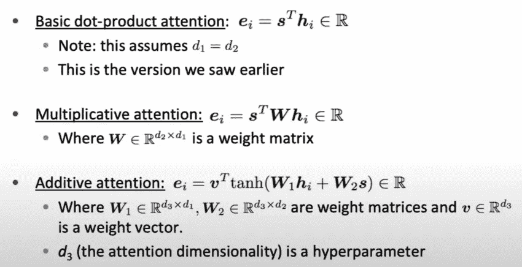*

*计算注意分数的注意变量。来源:[课程幻灯片](https://www.youtube.com/watch?v=XXtpJxZBa2c&list=PLoROMvodv4rOhcuXMZkNm7j3fVwBBY42z&index=8)*

*注意力在深度学习技术中是普遍的。我们已经看到，注意力是改进机器翻译的序列对序列模型的一个很好的方法。但是，你可以在很多架构(不仅仅是 seq2seq)和很多任务(不仅仅是 MT)中使用注意力。 ***注意力的更一般定义是给定一组向量值，并进行向量查询，注意力是一种计算这些值的加权和的技术，依赖于查询。*** 我们有时会说*查询关注的是值。*例如，在 seq2seq with attention 模型中，每个解码器隐藏状态(查询)关注所有编码器隐藏状态(值)。**直观关注的背后是，加权和是值中包含的信息的*选择性汇总*，其中查询确定关注哪些值**。*注意力是一种获得任意一组表示*(值)的固定大小表示的方式，依赖于一些其他的表示(查询)。注意力总是包括 3 个步骤:1)计算注意力得分 e，有多种方法可以做到这一点(如下图所示)；2)取 softmax 得到注意力分布α；3)利用注意力分布取权值之和。*

# *参考:*

1.  *[斯坦福 CS224N:具有深度学习的| Winter 2019 |第八讲—翻译，Seq2Seq，注意](https://www.youtube.com/watch?v=XXtpJxZBa2c&list=PLoROMvodv4rOhcuXMZkNm7j3fVwBBY42z&index=8)。*
2.  *[BLEU:一种自动评估机器翻译的方法](https://www.aclweb.org/anthology/P02-1040.pdf)*

*3.[联合学习对齐和翻译的神经机器翻译](https://arxiv.org/pdf/1409.0473.pdf)*