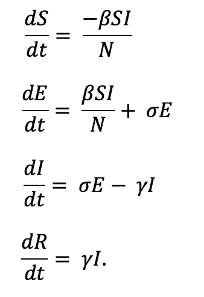
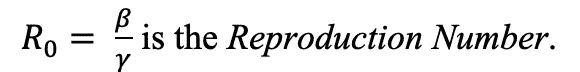
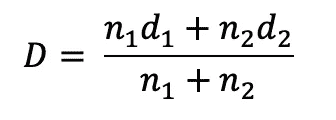
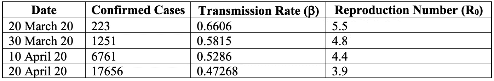
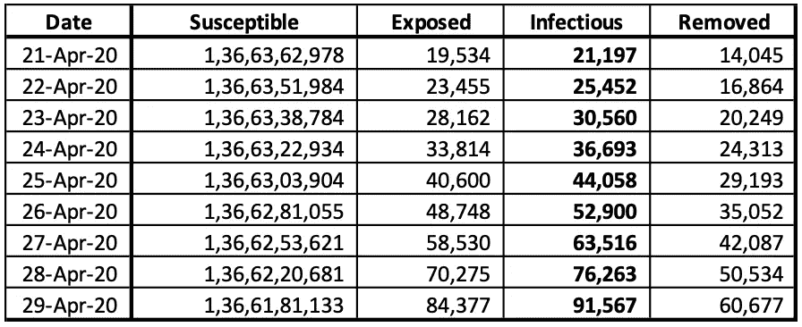
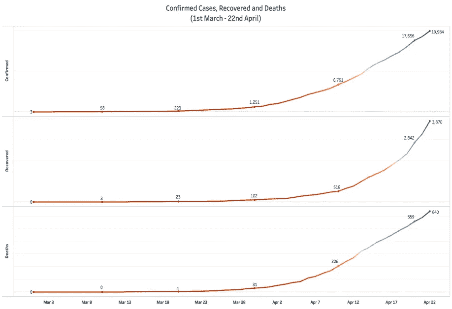
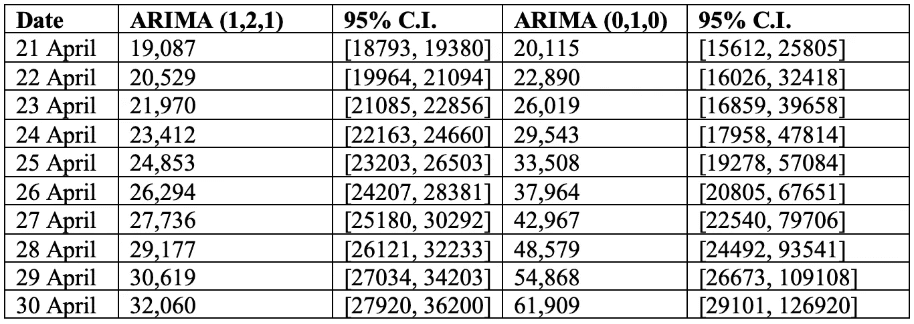
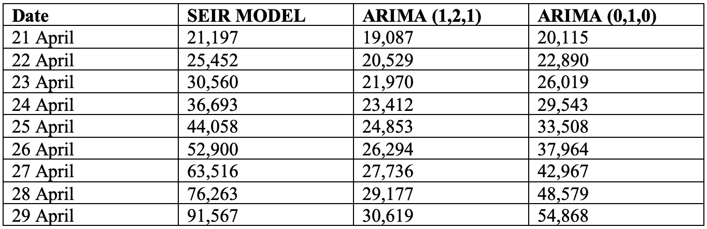
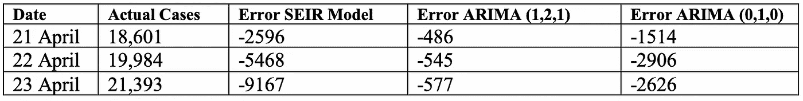

# 新冠肺炎在印度的传播率

> 原文：<https://medium.com/analytics-vidhya/transmission-rates-of-covid-19-in-india-881f1f2732ed?source=collection_archive---------23----------------------->


PC: Glenn Carrie，网站:Unsplash

## 新冠肺炎在印度的传播速度是多少？

大约一个月前，我预测了到 4 月 7 日印度可能出现的新冠肺炎病例数。最近，我收到了一些回复，根据当前的情况修改了我的预测。这篇文章就是为了做到这一点。除此之外，我们还将发现该病毒在印度的传播率，以及它是如何变化的。一个感染者有可能感染多少人？我们将应用流行病的分室模型。

# SEIR 流行病模型

流行病的 SEIR 房室模型被广泛用于模拟疾病在已知人群中的传播。它是 SIR 模型的进一步阐述。单独理解这些术语，SEIR 模型包含以下内容，*易感人群是处于被感染风险中的那部分人群。*暴露(E)* 是已经被病毒污染但尚未表现出症状的人数。它们确实有影响易感者的风险。*受感染(I)* 是指那些已经出现症状并被认为患病的人。*康复者(R)* 是已经从疾病中康复或者已经死于疾病的那部分人口。*

## *假设*

*为了使模型与我们对新冠肺炎的研究相一致，我们做了以下假设:*

*在考虑的时间段内，人口保持不变，也就是说，没有出生和死亡。*

*死于这种疾病的人被统计在*康复(R)项下。**

*从疾病中康复的病人被认为对它有短期免疫力。*

## *方程式*

*模型中使用了以下常微分方程:*

**

*模型中使用的 ode*

*其中， *N = S + E + I + R* 为总人口。*

*在上面的等式中，*

**β*或*感染率*，是病毒从易感到暴露的传播速度。*

**适马*或*潜伏期*，是潜伏个体变得具有传染性的比率。*

**γ*或*恢复率*，是感染的平均持续时间。*

**

*再现数*

*它表示因暴露于索引病例而导致的病例数。如果*再现数*为 1，则例升。如果*再现号*和<为 1，则下降。*

*为了预测潜在的病例数，确定参数很重要。*

## ***参数估计***

*由于对新冠肺炎还有很多不了解的地方，我们依靠目前公布的信息。感染率很难计算，因为它随着时间而变化。假定在初始阶段感染率较高，但是，随着人们对病毒的认识提高，并采取预防措施，感染率会降低。*

**或*潜伏期*是潜伏个体变得具有传染性的比率。它基本上是暴露者变得有传染性的速度。根据目前的信息，受感染个体开始感染他人的平均天数为 D = 3 天。因此，*σ*变成了 *0.33* (因为*σ= 1/D)***

**为了确定*γ*或*恢复率，*我们首先确定受感染患者恢复所需的天数。感染者需要的天数取决于疾病的严重程度。受感染的人出现轻度症状的平均天数约为 7 天。然而，对于病情危重的患者，这一时间从 3-6 周不等。为了获得恢复的平均天数，我们获得了加权平均值。**

****

**恢复所需天数的加权平均值**

**在哪里，**

```
**n1 is the number of patients with moderate conditionsd1 is the number of days taken by moderately ill patients to recover.n2 is the number of patients with moderate conditionsd2 is the number of days taken by moderately ill patients to recover.(n1 + n2) is total number of infected.**
```

**假设感染总人数为 17，656 人(截至 4 月 20 日)，且所有感染者中有 5%病情危重，我们得到 D 为 *8.25 天*。所以*伽马*就变成了 *0.1212(伽马= 1/D)。***

**如前所述，由于传播率(*β*)随着疾病进展而变化，其值不能取为常数。因此，有必要以实际数据为参考，在不同的时间点得出该值。视为常数的参数有:**

```
**Estimated 2019 Population of India (N) = 1,366,417,754Incubation Rate (s) = 0.33Recovery Rate (g) = 0.1212*S (0)* = 3, Susceptible at Time (t) = 0.**
```

**通过考虑上述参数求解常微分方程，我们在不同的时间点得到以下传输速率。**

****

**传输率和复制数**

**评估的时间段为 2020 年 3 月 20 日至 2020 年 4 月 20 日。在一个月的时间里，病例数成倍增加。病例从 3 月 20 日的 223 例增加到 4 月 20 日的 17656 例。然而，*传输速率*随着时间的推移已经降低。平均每 10 天下降 0.06 点。**

**同样，繁殖数量也从 3 月 20 日的 5.5 例减少到 4 月 20 日的 3.9 例，这意味着一个指标病例现在平均感染近 4 人，而一个月前是 5-6 人。**

**印度社会中社会距离的影响可以从生育数量的减少中看出来。**

**根据目前的*传播率*，预计到月底病例将达到**91567**。**60677**将从人口中移除。该值是死亡和恢复的*的累计值。***

****

**预测未来**

**观察印度新冠肺炎病例的当前趋势，我们观察到:**

****

**截至 4 月 20 日印度的确诊病例、康复病例和死亡病例**

**最近几天*确诊病例*和*死亡*似乎呈线性增长，过去几天*痊愈病例*呈指数增长。基于此，SEIR 模型可能会高估*感染病例。***

# **时间序列方法**

**为了正确地模拟这种变化，我们可以依靠经典的时间序列模拟方法。使用时间序列建模，我们得出以下预测:**

****

**ARIMA (1，2，1)和 ARIMA (0，1，0)**

***ARIMA (1，2，1)* 和 *ARIMA (0，1，0)* 给我们分别的预测，ARIMA (0，1，0)预测指数增长而 ARIMA (11，2，12)给我们线性增长的情况。**

***ARIMA (1，2，1)* 似乎是一个更好的模型，因为其 95%置信区间更低。较低的 95%置信区间表示较低的标准误差。**

# **结论**

****

**3 种模型的比较**

**在编写本报告时，已经报告了 4 月 21 日、22 日和 23 日的病例。它们的立场如下:**

****

**3 个模型中的错误**

**从上表可以看出， *ARIMA (1，2，1)* 在三种模型中误差最小。**

***感谢您的阅读。我真诚地希望它对你有所帮助，我一如既往地欢迎讨论和建设性的反馈。***

**给我发邮件:icy.algorithms@gmail.com**

**你可以在 LinkedIn 上找到我。**