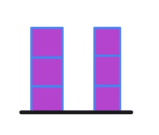
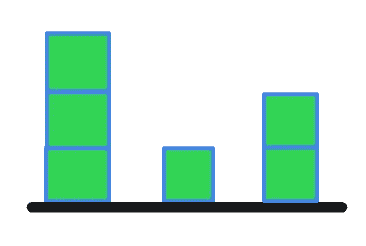

# 收集雨水——第 11 天(Python)

> 原文：<https://medium.com/analytics-vidhya/trapping-rain-water-day-11-python-4d74045ae35b?source=collection_archive---------6----------------------->


英格·玛利亚在 [Unsplash](https://unsplash.com?utm_source=medium&utm_medium=referral) 上拍摄的照片

今天我们来看看 leetcode 的一个难回答的问题。

[**42**](https://leetcode.com/problems/trapping-rain-water/) **。收集雨水**

给定代表高程图的非负整数 n，其中每个条形的宽度为 1，计算下雨后它可以收集多少水。


资料来源:Leetcode

上面的高程图用数组[0，1，0，2，1，0，1，3，2，1，2，1]表示。在这种情况下，6 个单位的雨水(蓝色部分)被截留。

**示例:**

```
**Input:** [0,1,0,2,1,0,1,3,2,1,2,1]
**Output:** 6
```

在研究解决方案之前，让我们先看几个例子。

```
**Input:** [3, 0, 3]
**Output:** 3
```



```
**Input:** [3, 0, 1, 0, 3]
**Output:** 8
```


```
**Input:** [3, 0, 1, 0, 2]
**Output:** 5
```



一次考虑 2 个柱状图，柱状图之间的封闭空间就是水量。让我们看看算法。

1.  运行循环，直到遍历了数组中的所有条形。

2.找到当前条左侧的最大值。设这个值为 left_max。

3.在当前条的右侧找到最大值。设这个值为 right_max。

4.求 left_max 和 right_max 之间的最小值。

5.从当前条形图中减去最小值。

6.如果结果值大于 0，则将其添加到我们的结果中。因为我们不能有负数量的水被截留，我们忽略它。

```
class RainWaterTrapper:
    def trap(self, height: List[int]) -> int:
        total_water = 0
        for i in range(1, len(height)-1):
            l = max(height[:i])
            r = max(height[i+1:])
            water = min(l, r) - height[i]
            if(water>=0):
                total_water += water
        return total_water
```

复杂性分析。

**时间复杂度**

我们正在遍历需要 O(N)的完整数组。此外，我们在遍历数组时计算最大值，这需要 O(N)。因此时间复杂度是 O(N)。

**空间复杂度**

因为我们没有使用任何额外的空间，所以空间复杂度是 O(1)。

我们能把算法做得更好吗？

每当我们到达一个新的酒吧，我们就不断地计算最大值。我们能预先跟踪最大值吗？我们可以有 2 个数组来记录左侧和右侧的最大值。

1.  为左创建一个数组，为右创建一个数组，都初始化为 0。
2.  对每个条形的左侧和右侧运行循环，记录最大值并将其保存在各自的位置。
3.  完成上述步骤后，对数组中的每个条形运行循环。
4.  在左、右中找出最小值，并将其从当前条中减去。包括在总水量中。

```
class RainWaterTrapper:
    def trap(self, height: List[int]) -> int: if height == []:
            return 0 left = [0 for i in range(len(height))]
        right = [0 for i in range(len(height))]
        total_water = 0

        left[0] = height[0]
        for i in range(1, len(height)):
            left[i] = max(left[i-1], height[i])

        right[-1] = height[-1]
        for i in range(len(height)-2, -1, -1):
            right[i] = max(right[i+1], height[i])

        for i in range(len(height)): 
            total_water += min(left[i], right[i]) - height[i] 

        return total_water
```

**时间复杂度**

我们正在遍历需要 O(N)的完整数组。

**空间复杂度**

我们使用 2 个额外的 N 大小的数组来存储最大值，因此空间复杂度为 O(N)。

如果你发现文章中有错误，请告诉我。此外，我想提高我的写作技巧，欢迎任何建议或意见。