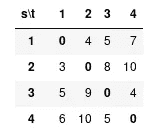
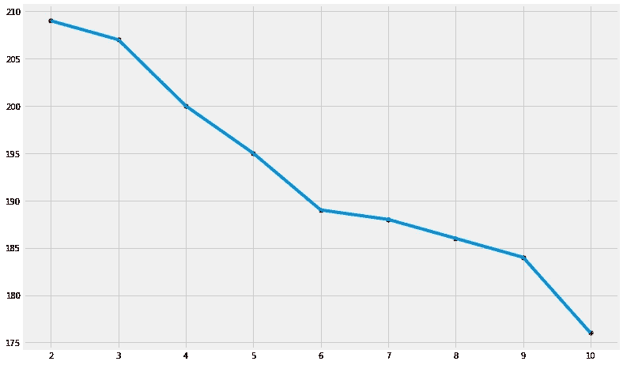

# 旅行商问题——动态规划方法

> 原文：<https://medium.com/analytics-vidhya/travelling-salesman-problem-dynamic-programing-approach-e1732c649c03?source=collection_archive---------2----------------------->

旅行推销员问题描述了一个必须在`N`个城市之间旅行的推销员。他所做的顺序是他不关心的事情，只要他在旅行中访问每个城市，就在他开始的地方结束。

这个问题可以使用不同的方法来解决，如动态规划、遗传算法实现、蚁群优化等。但最终该算法必须返回覆盖所有城市并返回源城市所需的最小距离。


照片由 [Emran Yousof](https://unsplash.com/@emranyousof?utm_source=medium&utm_medium=referral) 在 [Unsplash](https://unsplash.com?utm_source=medium&utm_medium=referral) 上拍摄

# 动态规划方法

动态规划是一种解决代表特定结构的问题的方法，在这种结构中，问题可以被分解成与原始问题相似的子问题。因此我们使用递归函数调用。然而，没有必要总是使用递归方法来解决动态规划问题。

让我们考虑像`[1, 2, 3, 4]`这样的虚拟城市，我们可以有一个距离或成本矩阵，显示每个城市到其他城市的距离或成本。我们可以通过分配随机值来实现这一点。



随机距离矩阵

对角线值为`0`，因为从源到源的距离始终为`0`。below 函数为作为参数传递的所需城市数设置距离/成本矩阵。

```
def SetCostMatrix(num):
    cmatrix = {}
    for i in range(1, num + 1):
        for j in range(1, num + 1):
            if i == j:
                cmatrix[(i, j)] = 0
            else:
                cmatrix[(i, j)] = random.randint(10, 50)
    return cmatrix
```

对于这个问题，我只拿了`10`的城市。上面的函数返回一个有`{(row, col) : distance}`的字典。

```
total_num = 10
num_cities = SetCostMatrix(total_num)
```

现在我们有了一个距离矩阵，我们应该能够检索与`source`和`target`相关的实际距离。为了做到这一点，我们需要一个助手函数来检查字典键并返回距离值。

```
def GetCostVal(row, col, source):
    if col == 0:
        col = source
        return num_cities[(row, col)]
    return num_cities[(row, col)]
```

看起来一切都准备好了。相信我，不是的。该算法的最终目标是通过迭代过程获得最小距离。为了完成这个任务，我们需要一个递归函数。

```
**iterative_process = []**
def TSPGetMinDistance(main_source, source, cities):
    if len(cities) == 1:
        minDis = GetCostVal(source, cities[0], main_source) + GetCostVal(cities[0], 0, main_source)
        return minDis
    else:
        Dist = []
        for city in cities:
            dcities = cities[:]
            dcities.remove(city)
            Dist.append(GetCostVal(source, city, source) + TSPGetMinDistance(main_source, city, dcities))
        iterative_process.append(Dist)
        return min(Dist)
```

上面的函数在成功执行时返回 traveller 找到的覆盖所有城市并最终到达源的最小距离。列表`iterative_process`显示了算法执行的逐步结果。它显示了从第二步开始的结果，因为在接下来的步骤中需要第一步的结果。最后一个索引(`iterative_process[-1]`)显示了总距离，但是我们想要最小距离。因此，迭代过程。

```
>>> TSPGetMinDistance(1, 1, [2, 3, 4, 5, 6, 7, 8, 9, 10])
>>> iterative_process[-1]
[207, 176, 184, 188, 209, 195, 189, 186, 200]
```

如果我们将上述值可视化，我们会看到一个递减的顺序，这清楚地显示了算法的性能。

```
import matplotlib.pyplot as plt
plt.figure(figsize=(12, 8))
final_costs = sorted(iterative_process[-1])
final_costs = final_costs[::-1]
plt.scatter(list(range(2, len(final_costs) + 2)), final_costs, color='red')
plt.plot(list(range(2, len(final_costs) + 2)), final_costs)
plt.show()
```



TSP 算法性能

如果更改了源城市值，城市的结果将是相同的。获得的最小距离是源城市`1`的`176`。

# 挑战

以上是一种递归的求解方式，当我们增加`n`的值时，函数会消耗很多时间和内存来求解问题。

1.  我们可以使用遗传算法技术来实现，这种技术需要很少的计算来解决同样的问题。
2.  蚁群优化是另一个不同的视角，本质上是纯粹的概率性。这项技术是基于真正的蚂蚁如何能够找到到达目的地的最短路径。