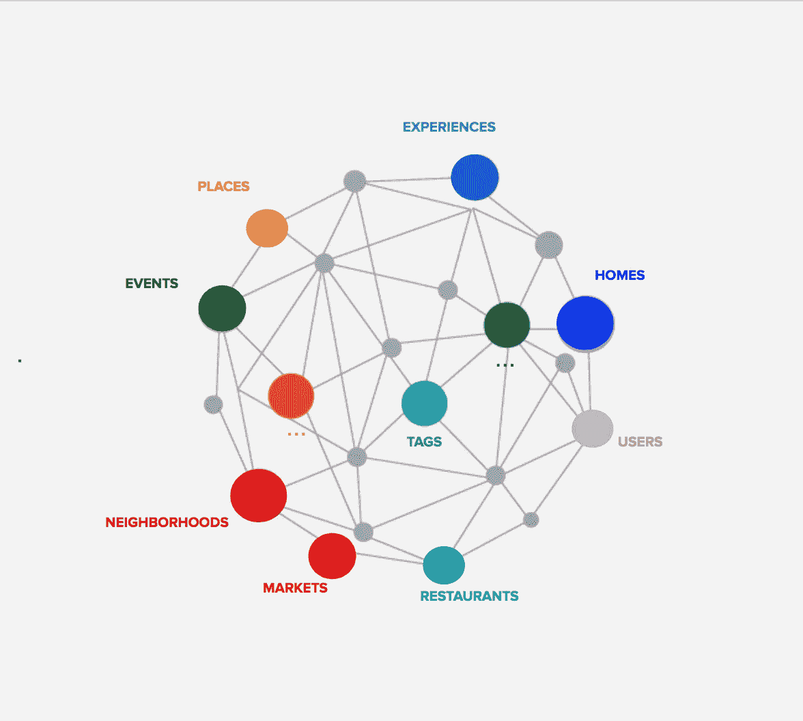

# 在向量空间中遍历知识图

> 原文：<https://medium.com/analytics-vidhya/traversing-knowledge-graph-in-vector-space-509e2aa77c13?source=collection_archive---------11----------------------->

**研究论文解释->**[**【https://arxiv.org/pdf/1506.01094.pdf】**](https://arxiv.org/pdf/1506.01094.pdf)

1.  **什么是组合知识库表示？**

组合化是使用向量空间模型来完成知识库的方法。基本向量空间模型被认为是通过知识图的软边遍历算子。组合化包括使用基础…