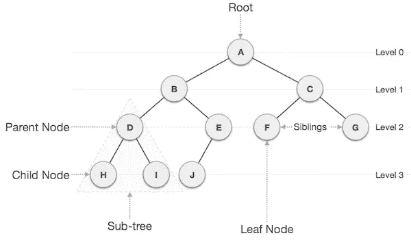
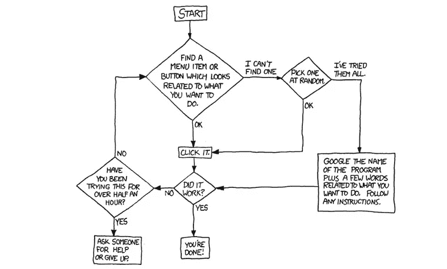
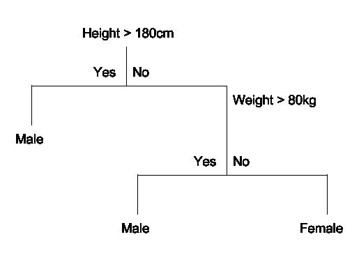

# 树和机器学习，有什么联系？

> 原文：<https://medium.com/analytics-vidhya/trees-and-machine-learning-whats-the-connection-4bb6336bd644?source=collection_archive---------12----------------------->

## 看看这些树，以及它们如何被用来开发复杂和简单的机器学习算法。

在 [Unsplash](https://unsplash.com/?utm_source=unsplash&utm_medium=referral&utm_content=creditCopyText) 上由 [Franck V.](https://unsplash.com/@franckinjapan?utm_source=unsplash&utm_medium=referral&utm_content=creditCopyText) 拍摄的照片

*下面的文章试图通过结合流行的和信息丰富的文章和视频，使人们更容易理解在 ML 中如何使用树。我自始至终使用来自各种文章、博客帖子和视频的信息，我不希望声称这些信息是我自己的。所以，如果你想更深入地了解本文讨论的主题，我在最后链接了原始帖子。*

# 我们在谈论什么树？

如果你想深入了解树数据结构和它们是如何工作的，我推荐你阅读 Vaidehi Joshi 的关于树和它们的属性的文章。然而，我会给你一个快速概述树，更具体地说是决策树，以及它们是如何工作的。

树的一个重要属性是它们是由节点和更小的子树(分支)组成的，这些子树与它们所连接的树具有相同的属性，这使得递归成为处理它们的有用工具。这对它们在机器学习中的应用很重要，但我们稍后会讲到。

这些属性是特定于树的，与它们的命名非常相似，包括边、叶节点、高度和深度。边是节点之间的连接。叶节点是没有子节点的节点。高度是从节点到根的边数。深度是从节点到其最深子节点的边数。这是我所说的一个图像。

树与其他基于节点的数据结构(如链表、堆栈和队列)的最大区别在于，它们可以以非线性的方式被遍历。这意味着不是从列表中的第一项到下一项直到最后，树可以从中间开始，并根据搜索的内容向左或向右移动。如果正确地创建了树，这允许非常快速的遍历，但是我将把你重定向回[Vaidehi](/@vaidehijoshi) 来学习更多关于它是如何工作的。

# 什么是决策树？

[决策树](https://www.geeksforgeeks.org/decision-tree/)是一种特殊类型的树，主要用于，你猜对了，做决策！不过，更具体地说，对于 ML，它们用于相对较大的数据集的分类，这些数据集不会改变太多。

思考决策树的一个好方法是像流程图一样。你跟着图表走，通常，你会得到一个帮助你做决定的结果。

从机器学习(ML)的角度来看，决策树的特别之处在于它们可以自我创建。

# 它们在 ML 中是如何使用的？

决策树主要用于两种类型的 ML；分类和回归。CART 是它们的总称，是**分类和回归树**的缩写。

CART 被表示为一棵二叉树，它使用输入和分割点来创建自己。ML 在计算使用哪个输入和分割点时出现，可以被称为**贪婪分割**，最佳分割等。

## 贪婪分裂

贪婪分割是指在输入上测试不同的分割点，以获得训练数据的最佳分割点。为此，我们需要一个成本函数来比较所有可能的分割点及其结果，并选择最佳的一个。

一个成本函数涉及使用**基尼系数；**当前拆分不正确猜测的概率和**信息增益；**杂质的总减少量，以找到数据的最佳分割。

## 停止创建和修剪

幸运的是，停止决策树的创建非常简单，因为我们几乎没有输入。基本上，因为我们使用了递归，一旦树用完了要分割的数据，它就会自己创建。我们还可以修剪树木以获得更好的结果，这涉及到手动浏览树木，看看移除一片叶子会如何影响结果，如果是积极的，就移除它们，如果不是，就保留它们。

贪婪分裂的基础是递归二进制分裂，正如我前面所说，树使得实现递归变得非常容易。

# 我们如何创建决策树？

为了向您展示如何制作决策树，我们将使用 Python 编程语言。

## 基尼杂质

为了得到基尼系数，我们需要计算一个给定输入被错误猜测的几率。假设我们有一个三人小组，其中一个人最喜欢的活动是游戏，另一个人的活动是体育，最后一个人的活动是制作艺术，我们目前正在寻找一个喜欢游戏的人。把他随机正确分类的几率是 1/3，使得基尼不纯度为 70%。下面的代码是一个计算数据集基尼系数的函数。

## 信息增益

信息增益是一个相当基本的等式，它包含分割数据的平均杂质，并将其从数据的总杂质中减去。下面的函数执行这个等式。

## 拆分数据

既然我们有办法得到基尼系数和信息增益，我们就可以分割数据了。为此，我们需要一个函数来测试所有可能的拆分，并通过基于每个值进行拆分来找到最佳拆分，计算每个值拆分的 gini 杂质，然后计算拆分的信息增益，并返回具有最高信息增益的拆分。

## 将这一切结合在一起

为了构建/生长树，我们需要递归地分割数据，直到没有数据差异，因为我们这样做时，我们需要递归地创建一个用于真实分类的分支和一个用于虚假分类的分支，同时创建叶/决策节点，这些节点将在输入通过树时决定是哪种情况。这可以通过下面的函数来完成。

# 使用我们创建的树

既然我们有了构建决策树的方法，我们需要能够用它来进行预测。

为了用我们的树进行预测，我们在输入上递归地对树中的节点进行预测。在这样做的时候，我们检查决策节点，如果我们找到一个，我们返回它的分类/预测决策。

## 包扎

在整篇文章中，我们已经讨论了什么是树和决策树，它们如何在 ML 中使用，如何在 python 中创建它们，以及它们如何根据它们进行预测。我希望这篇文章对你有所帮助，但是如果你仍然不知道事情是如何运作的，我强烈建议你看看下面的文章。

# 资源

如果您有兴趣更深入地了解我谈到的一些想法，请查看帮助我撰写本文的这些资源。

1.  [如何不被树绊倒](/basecs/how-to-not-be-stumped-by-trees-5f36208f68a7)，Vaidehi Joshi 的
2.  [决策树](https://www.geeksforgeeks.org/decision-tree/)，极客 ForGeeks
3.  [决策树——可视化决策的简单方法](/greyatom/decision-trees-a-simple-way-to-visualize-a-decision-dc506a403aeb)
4.  [机器学习的分类和回归树](https://machinelearningmastery.com/classification-and-regression-trees-for-machine-learning/)，MachineLearningMastery
5.  [让我们从头开始写一个决策树分类器](https://www.youtube.com/watch?v=LDRbO9a6XPU&feature=youtu.be&t=18s)，谷歌开发者