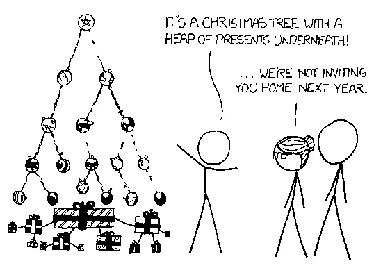
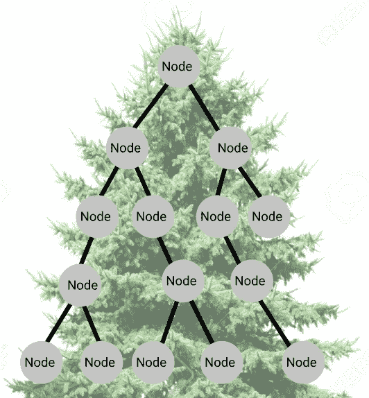
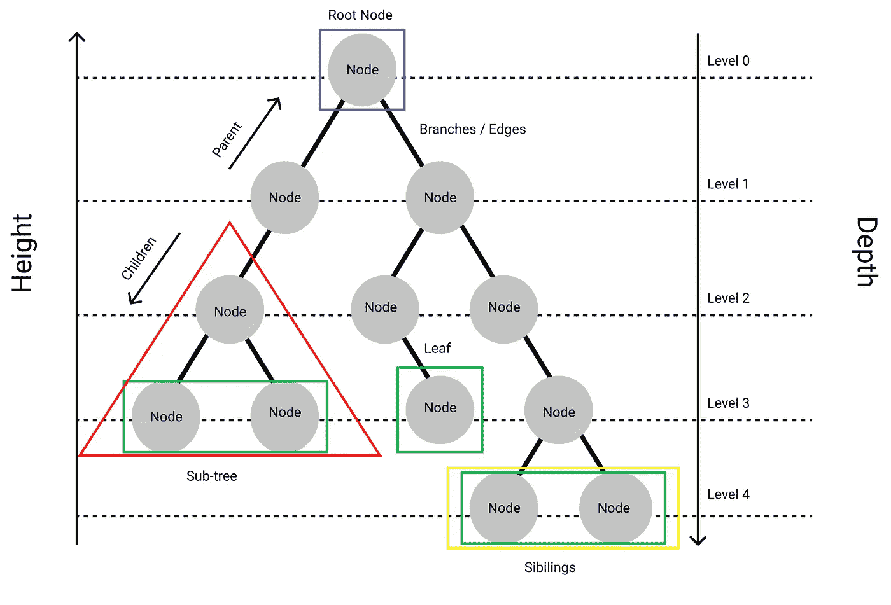
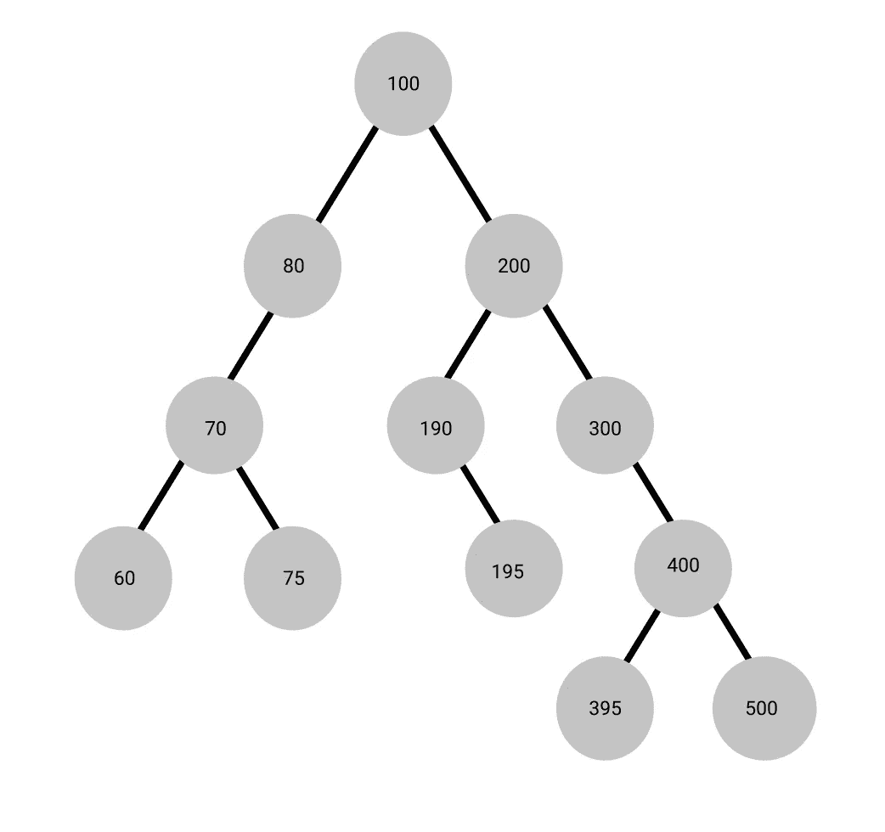
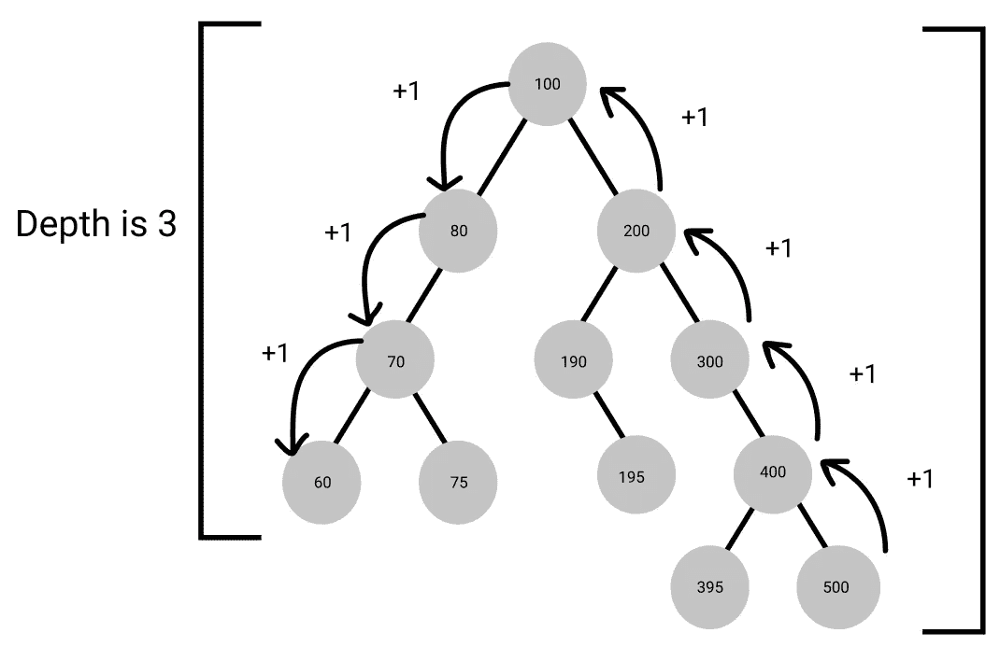

# 树，树和更多的树

> 原文：<https://medium.com/analytics-vidhya/trees-trees-and-more-trees-4d31c62b8d71?source=collection_archive---------24----------------------->

来源:[https://xkcd.com/835/](https://xkcd.com/835/)

`***Arrays***`、`***Stacks***`、*、*、`***Linked-List***`和`***Queue***`，都有一个共同点:数据结构的逻辑起点和终点，这些被认为是“线性的”然后我们到达`***Trees***` *，*一个巨大的分支混乱，没有明确的结尾，并且有一种非常特定的方式来存储数据，这引发了各种各样的混乱。

我们将一起澄清任何关于树木的困惑，激发更多使用树木的信心。

我们开始吧！

# 什么是树？

> `***Tree***`是一种广泛使用的抽象数据类型(ADT)——或实现这种 ADT 的数据结构——它模拟一种分层的`**tree**`结构，具有`**root**`值和带有`**parent node**`的`**children**`子树，被表示为一组非线性链接的`**nodes**`。—[https://computersciencewiki.org/](https://computersciencewiki.org/)

我知道，我知道，有很多要理解，所以让我们一起来分析一下:

**抽象数据类型(ADT)，**其行为由一组值和一组操作定义的对象。简而言之，它们是*执行的是什么操作 vs**一个操作是如何实现的。这意味着它可以应用于你需要它代表的任何东西；在这种情况下，一个`***tree***`可以代表:一个家庭，一个流程图，甚至一个故事。***

**现在我们来看最难的部分:什么是树的技术细节，但是不要担心，最容易理解的方法是通过可视化。**

****

**想象一棵绿色的大松树。树的顶端是第一个`***node***`，然后随着我们越往下，第一个`***node***` 分支到另一个`***nodes***`，我们在树上越往下，它就变得越大。**

**就像树叶用树枝连接到其他树叶一样，这些节点用树枝连接到其他节点，你猜怎么着？树枝！这就是树的极端简单性:`***leaves***`、`***branches***`和`***nodes***`**

# **树的属性**

****

**每个`***node***`包含一个`***value***`或`***data***`，可以有也可以没有`***child*** ***node***`。`***Nodes***` 由`***edges***`管理并相互连接。**

**`***tree***`中用蓝色表示的`***first node***`*称为`***root***`。如果这个`***root*** ***node***`由另一个`***node***`连接，那么`***root***`既是一个`***parent node***`，连接的`***node***`是一个`***child***`。每个`***node***`的这种精确格式在每个深度级别中被进一步遵循，相反，它们表示`***parent node***`。这些孤立的集合是子树[ *用红色*表示]。***

*绿色的`***Leaves***`*是`***tree***` ***上的最后一个`***nodes***`。*** 它们是没有`***children***`的节点。**

*然后我们有了最后两个属性:`***Height***`和`***Depth***`。`***tree***`的`***height***`是到`***leaf***`的最长路径的长度，`***node***`的`***depth***`是到其`***root***`的路径的长度。*

**

## *高度、深度和类型*

*让我们试着一起找出树的不同部分。*

*100 是什么类型的`***node***`？*

*什么是`***height***` 之树？*

*`***node***` 60 的`***depth***`是什么？*

**

*`***Node 100***`是第一个节点，因此它是一个根，也有节点与之相连，所以它也是一个父节点。*

*当我们从叶子向上数时，`***node 500***`的`***height***`是 4。*

*`***node 60***`的`***depth***`是 3 倒数到叶子。*

# *编码一棵树！*

*现在我们已经有了主要的抽象上下文，让我们开始实现我们自己的`***Tree***`，特别是`***binary tree***`。*

*`***Binary trees***`是`***tree***`数据结构的最简单版本，您一直都可以看到它们！可以猜到`***binary trees***`只允许两个`***node***` `***branches***`。具体来说，这两个`***nodes***`就是属性`***left***`和`***right***`及其`***data***`。所以让我们试着创建一个二叉树类:*

*让我们像前面的例子一样，从 100 开始初始化前三个节点:*

*现在我们可以继续做`root.left.left(70)`等等来完成这个树，但是这不是太程序化了，不是吗？*

## *自动插入节点*

*所以在我们的类中，让我们创建两个新的方法，命名为:`insert_left`和`insert_right`。之后，我们将检查适当的名称是否是`None`，这样我们就可以在该点分配节点数据。否则，我们会将该节点重新分配给下一个节点，并再次检查，直到我们找到一个空节点。*

*现在它工作了，试着创建上面描述的整个树。*

*等等！*

*我们怎么知道它是否有效？“我甚至不能读取数据，”你一定在想，但这就是为什么我们有树遍历！*

## *树遍历*

*在树遍历中，我们有三种类型，它们的优先级顺序如下:*

1.  *`***Post Order***`:左、右、根*
2.  *`***Pre Order***`:根，左，右*
3.  *`***In Order***`:左、根、右*

*那就这么定了！*

# *摘要*

*简而言之，这篇文章有助于阐明什么是树，它们的用途，方法，以及如何实现它们。本文还有助于理解如何对节点进行编程、插入和遍历。希望你所有的困惑都已经消除，或者你已经学到了一些新的东西。现在出去用那些树吧！*

## *互动链接:*

*[https://www.figma.com/embed?embed_host=share&URL = https % 3A % 2F % 2fwww . fig ma . com % 2ff ile % 2fcfnidaitfeyeoegphqgyfra % 2f 节点-树-树-树](https://www.figma.com/file/cfniDAItfeYeOgphQGyFRa/Node-Tree-Tree-Tree?node-id=0%3A1)*

## *来源:*

*[https://www . geeks forgeeks . org/tree-traversals-in order-preorder-and-post order/](https://www.geeksforgeeks.org/tree-traversals-inorder-preorder-and-postorder/)*