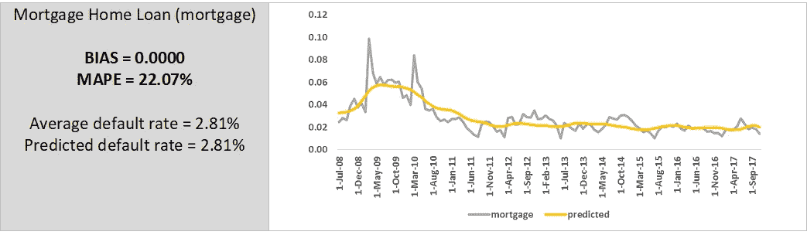

# 趋势分析和回归模型结合趋势(时间序列)

> 原文：<https://medium.com/analytics-vidhya/trend-analysis-and-regression-models-to-combine-trends-time-series-a41213a0014d?source=collection_archive---------1----------------------->

# **简介**

本文的目的是建立数学概念来结合趋势(时间序列)。**存在趋势相似(高度相关)的情况，直接组合(取平均值/加权平均值)会导致信息丢失。**选择之一是使用转换。这将有助于我们以保留信息的方式组合这些趋势，并且我们可以从组合的趋势中恢复原始趋势。

在本文中，我们已经看到了担保贷款的违约趋势。**担保贷款大致可分为住房抵押贷款(Mortgage)、汽车贷款(auto)和其他组合贷款(Others)。**这些贷款的趋势是相似的，并且已经使用转换来组合这些趋势(参考:图 1)。

**趋势分析和关联**

图为 2008 年 7 月至 2017 年 11 月三类贷款的违约趋势。**这三种默认趋势具有相似的模式，峰值出现在 2009 年 3 月和 2010 年 3 月。这些趋势涵盖了压力期和基期。**这三种违约趋势在两个时期表现相似，表明潜在的宏观经济情景对所有三种类型的贷款具有相似的影响。

压力期:2009 年 1 月至 2010 年 12 月

基期:2011 年 1 月至 2017 年 11 月

如果我们能把这些趋势合并成一个，这将把模型的数量从三个减少到一个。这也将减少模型开发和模型验证所需的时间。**此外，如果我们能够有一个函数将组合趋势分解成原始趋势，我们可以将预测趋势与每个原始趋势进行比较。**

图 1:默认趋势

***相关性:*** 三类贷款的违约趋势相关性非常高，说明三种趋势彼此相似(参考:表 1)。

表 1:相关矩阵

图 2:住房抵押贷款(按揭)——违约趋势

图 3:汽车贷款(汽车)—违约趋势

图 4:其他组合(其他)—默认趋势

# **结合趋势**

*需要注意的是，只有斜率相似的趋势才可以合并*。**相关性分析不足以结合趋势。为了确保这两个趋势是相同的并且可以被组合，这两个趋势的差异已经相对于时间进行了回归(_n_)。**如果差值的斜率为零(即 p 值应大于 0.05，表示贝塔系数为零)，我们可以合并趋势。

H0:系数等于零(没有影响)

H1:系数不为零(有影响)

低 p 值(< 0.05) indicates that you can reject the null hypothesis.

In the tables below, it is observed that ‘mortgage and auto’ / ‘mortgage and others’ / ‘auto and others’ have p-value less than 0.05 (indicating that the slope of the difference is other than zero). Hence, we must apply transformations to combine the trends (ref: table 3).

Table 2: Possible Combinations

Table 3: Regression — Checking if Slope is 0 (Pr > > 0.05)

图 5:抵押贷款—汽车(差异)

图 6:抵押贷款-其他(差异)

图 7:自动-其他(差异)

***概念证明:*** 我们在这个例子中取了两个趋势 y1 (x + y = 6)和 y2 (2x + y = 13)。这两个趋势的相关性是 1.00(它们是完全相关的)。**然而，如果我们取平均值来组合趋势，那么它既不会保留趋势的斜率，也不会保留趋势的敏感性**(参考:图 8) **。**

y1 的斜率(红线)= -1

y2 的斜率(琥珀色线)= -2

y 平均值的斜率(灰色线)= -1.5

图 8:概念验证

为了结合这两种趋势，如果我们能把 y2 转换成 y1，那么我们就能结合这两种趋势。**观察到 y2 _ transformed(y2 _ t = 0.5 * y2–0.5)更接近 y1。**组合趋势是 y1 和 y2_t 的平均值(参考:图 9)。

Y1 —无转换(基本)

Y2 —已转换(线性)

图 9: Y_mean = Mean(y1，y2_t)

我们可以从组合趋势中恢复原始趋势，因此没有信息损失。如果我们采取措施，不经改造就把原来的趋势结合起来，这是不可能的。

Y1 = Y _ 均值

Y2 = 2 * (Y_mean + 0.5)

# **应用变换**

抵押贷款被视为基本趋势，汽车/其他趋势被转换以匹配抵押贷款趋势。**抵押与汽车/其他之间产生零散地块。趋势线(线性、二次和多项式)用于评估抵押贷款和汽车/其他贷款之间的关系。**

自动:选择线性趋势线，因为二次和多项式的改善是 R 平方的，不显著。r 平方从 0.91(线性)增加到 0.92(二次)(参考:图 10)

其他:选择二次趋势线是因为与线性趋势线相比，R-square 有显著改善。r 平方从 0.80(线性)增加到 0.87(二次)(参考:图 11)。

图 10:抵押贷款与汽车

图 11:抵押贷款与其他

等式 1:自动转换

***auto _ t = 0.5846 * auto—0.0048***

等式 2:其他转换

***others _ t = 1.4711 * others * others+0.0462 * others+0.0133***

***对转换后的趋势进行回归分析:*** 再次进行回归，检查两个趋势的斜率是否相同，是否可以合并。如果差值的斜率为零(即 p 值应大于 0.05，表示β系数为零)，我们可以合并趋势。此外，对残差进行增强的 Dickey Fuller (ADF)测试，以检查平稳性。

扩展的 Dickey Fuller 检验(ADF)检验时间序列样本中存在单位根的零假设。

测试中使用的 ADF 统计数据是负数。越是否定，就越是强烈的拒绝在某个置信水平上存在单位根的假设。ADF 测试可以处理比 Dickey Fuller 测试更复杂的模型，也更强大。

H0:有单位根(不是静止的)

H1:没有单位根(静止的)

低 p 值(< 0.05) indicates that you can reject the null hypothesis.

**)在下表中，观察到 p 值远大于 0.05，表明差异的斜率为零。还观察到残差是稳定的。**因此，这些趋势可以合并成一个趋势(参考:表 5)。

表 4:更新的相关矩阵

表 5:回归—检查斜率是否为 0 (Pr >> 0.05)

表 6: ADF 测试

图 12:差异

# **组合趋势**

这些趋势已经结合在一起，产生了一种新的趋势。**新趋势与抵押贷款趋势非常接近，因为汽车和其他汽车已经转变为尽可能接近抵押贷款。**

等式 3:新的组合趋势

***mortgage _ t = mean(mortgage，auto_t，others_t)***

现在可以在新的组合趋势上开发该模型。新趋势保留了原始趋势的属性:

2009 年 3 月和 2010 年 3 月的峰值(参考图 14)

组合趋势可以被分解以获得原始趋势

图 13:原始趋势与转变趋势

图 14:新的组合趋势(mortgage_t)

# **使用宏观经济变量的单一模型**

组合违约趋势(mortgage_t)映射到各种宏观经济变量，如失业保险(索赔)、零售销售、住房价格指数(仅购买)、产能利用率(制造业)、失业率等。在这个例子中没有使用投资组合信息。

数据中有 114 个观测点(9.5 年)。**产能利用率和失业率是该模型的强预测指标。该模型已调整 R 平方为 0.68，这表明拟合良好。**尝试了宏观经济变量的各种其他组合，但是由于它们之间的高度相关性，独立变量的数量被限制为两个(参考:表 7)。

产能利用率:违约率与产能利用率负相关，因为产能利用率的增加表明经济性更好，这意味着违约率更低

失业率:违约率与失业率正相关，因为失业率上升表明经济恶化，这意味着违约率更高

表 7:回归模型

**与基准期相比，该模型可以捕捉压力期更高的违约率。偏差接近于 0，平均绝对百分比误差为 20.12%。**

偏差衡量误差的大小。它被计算为预测值和实际值之差的平均值(参考:等式 4)。

平均绝对百分比误差(MAPE)用百分比来衡量误差的大小。它计算为无符号百分比误差的平均值(参考:等式 5)。

等式 4:偏差

**偏差= 1/n ∑(预测—实际)**

方程式 5: MAPE

**MAPE =1/n ∑|(预测—实际)|/实际**

图 15:实际与预测

表 8:实际比率与预测比率(默认比率)

# **趋势分解**

对预测的违约趋势进行分解，并与原始趋势(抵押贷款、汽车和其他)进行比较。**据观察，MAPE 在抵押贷款(22.07%)和汽车(21.66%)方面较低，而 MAPE 在其他方面较高(46.09%)。**

等式 6:分解(抵押)

**抵押=预测**

等式 7:分解(自动线性)

**自动=(预测值+ 0.0048) / 0.5846**

等式 8:分解(其他——二次)

**其他=(–B+SQRT(B2–4 * A * C))/(2 * A)**

**其中，A = 1.4711，B = 0.0462，C = 0.0133 —预测值**

图 16:实际与预测(住房抵押贷款-分解)

图 17:实际与预测(汽车贷款—分解)

图 18:实际与预测(其他组合—分解)

# **结束注释**

使用转换合并趋势(时间序列)将有助于我们实现以下目标:

**保留原始信息:**从组合趋势中恢复原始趋势

**减少模型数量:**减少模型开发时间和模型验证时间