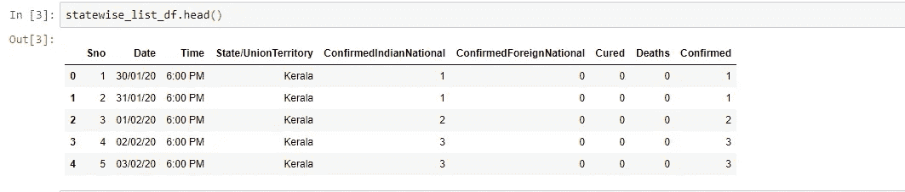
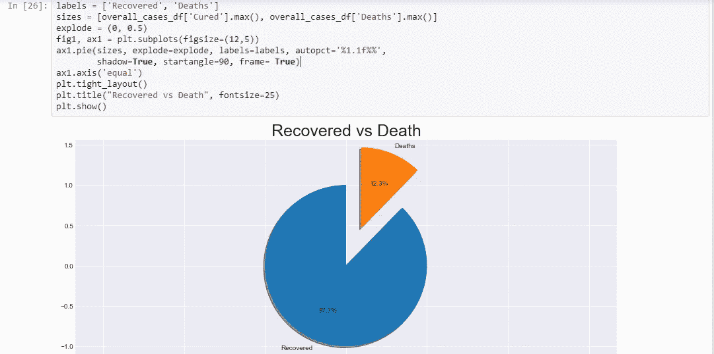

# 小说《新冠肺炎》在印度的走向 Python 语言详解

> 原文：<https://medium.com/analytics-vidhya/trend-of-novel-covid-19-in-india-detailed-analysis-in-python-ec10310601c2?source=collection_archive---------23----------------------->

在 [Unsplash](https://unsplash.com?utm_source=medium&utm_medium=referral) 上 [engin akyurt](https://unsplash.com/@enginakyurt?utm_source=medium&utm_medium=referral) 拍摄的照片

在过去的几个月里，世界各国一直在与一种名为 Covid 19 的未知致命病毒进行斗争。世界各地的科学家正在进行大量研究，以制造这种致命病毒的疫苗。到目前为止，超过 300 万人受到这种病毒的影响，其中超过 20 万人死亡，超过 90 万人从这种病毒中康复。

在人口约 13.3 亿、医疗设施达不到全球标准的印度，根据《世卫组织报告》，印度每 1000 名公民拥有 1.34 名医生，在 133 个发展中国家中排名第 67 位。尽管如此，印度在控制病毒方面已经取得了巨大的进步。

今天，我将分析在印度增长的新冠肺炎病例。我将使用公开的 [kaggle](https://www.kaggle.com/sudalairajkumar/covid19-in-india) 数据集。我正在使用 jupyter 笔记本和 python 库，如 pandas、numpy、matplotlib 和 seaborn。

## **导入和理解数据**

首先让我们导入必要的库，如 pandas、matplotlib、seaborn 和印度的新冠肺炎区域数据集。

数据集包含 1350 行和 9 列。数据集的列，如 Sno、日期、时间、州/联邦领地、已确认的 dianNational、已确认的 ForeignNational、已治愈、死亡、已确认。

现在，我们通过运行 info 方法来检查数据的完整性，从下面的输出中，我们可以看到日期和时间列是对象数据类型，而 confirmed Dian national/confirmed foreignnational 是对象类型，是印度和外国患者的计数。

下一步是将“Date”列的数据类型转换为 datatime 对象，并删除不必要的列，如 Sno、confirmedIndianNational、confirmedForeignNational，因为我们的分析不需要这些列。

删除不必要的列后，数据框中只剩下几列。现在，我们对每天的数据计数感兴趣，而不考虑州，因为我们正在对国家进行分析。因此，我们将按日期对数据框进行分组，并获得每天的病例数。

现在我们已经从数据集中清除了数据。让我们在数据框中添加一些有用的信息，这将有助于我们的分析。上述数据框中的数字是连续的，不用于每日计数。下面的方法 get_daily_report 将给出每日新病例、新恢复和新死亡的数量。我还添加了一些列进行额外的分析，如每天之后的活动病例，活动病例的增长百分比，死亡和治愈百分比。

下面是我们的最终数据框，可用于分析。它添加了分析所需的所有列。

**数据分析**

让我们使用 matplotlib 和 seaborn 库添加条形图和线图的方法。

首先，我们绘制了截至 2020 年 4 月 26 日冠状病毒病例总数增长的线图。我们可以注意到，随着时间的推移，图表呈指数增长。迄今为止，确诊病例总数已超过 25000 例。

我们还可以在对数尺度上检查冠状病毒病例，因为图中的偏斜度较大，第二个原因是对数图显示了百分比变化或乘法因子。

现在我们可以检查病毒在这个国家的增长速度。下图总结了该国病毒病例每天增长 8.6%。我们还可以看到病毒增长率开始下降的趋势。

下图显示了该国每天新确诊的病毒病例数。最近一周平均报道了 1000 起病例。

分析的一个重要方面是关于这种疾病的恢复和死亡率。这种病毒的全球死亡率在 20-25%之间。印度也有同样的趋势。我们来看看这个。

受感染的人已经开始从病毒中康复，从上周开始平均每天 650 人。

目前，总共约有 6000 名感染者已经从这种致命的病毒中康复，这种康复是一种指数增长，这对国家来说无疑是一个好迹象。

现在让我们来看看这种致命病毒在印度的死亡率。截至目前，全国已有 800 多人死亡，约 6000 人康复。如果我们检查死亡率，这是 12.3%，与全球平均死亡率 20-25%相比是不错的。

下面的饼图显示，在所有已结案的病例中(痊愈+死亡)，87.7%痊愈，12.3%死亡。

现在，我们可以比较全国新发病例的增长率和恢复病例的增长率。下图显示了这两个图是如何随时间变化的。

下图显示了印度每日新增死亡人数。如果你注意到最近几周平均每天死亡人数是 35 人。

下面的恢复率和死亡率曲线图显示了在控制死亡率方面情况是如何得到控制的。在 4 月初达到约 25%的死亡率后，他们以非常值得称赞的方式控制了病毒。当我们战胜这种病毒时，下图将是完美的矩形。

我希望我们理解当前的全球危机，并保持社会距离。注意安全，待在家里。

感谢阅读！！

 [## Santosh 12678/冠状病毒 _ 分析

### permalink dissolve GitHub 是 4000 多万开发人员的家园，他们一起工作来托管和审查代码，管理…

github.com](https://github.com/santosh12678/Coronavirus_Analysis/blob/master/Covid_19_Analysis_for_india.ipynb)