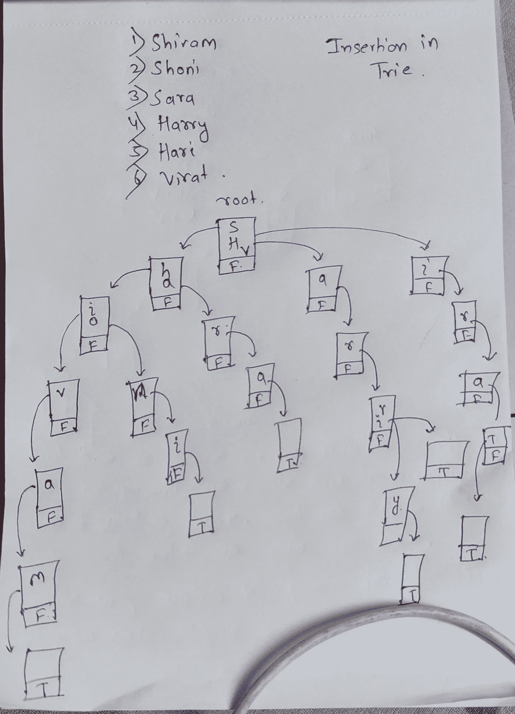
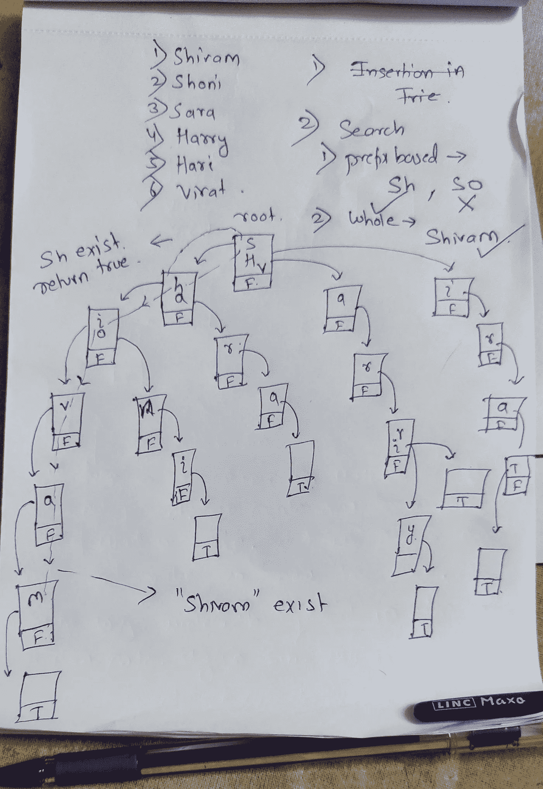

# 数据结构

> 原文：<https://medium.com/analytics-vidhya/trie-data-structure-a1c96cee016f?source=collection_archive---------7----------------------->

Trie 是一种信息检索数据结构，使用它我们可以优化搜索的复杂性。

使用 Trie，我们可以在 O(1)时间内搜索密钥。但是惩罚是存储要求

使用 Trie，我们可以进行基于前缀的搜索，我们可以按字典顺序排序。

使用哈希表，我们也可以按字典顺序排序，但我们没有基于前缀的搜索，而且常规哈希表比 trie 占用更多的空间。

**用例**

1.  当你有成千上万的数据，然后使用 trie 你可以存储它，然后很容易搜索任何记录。
2.  自动完成:-正如我所说，使用 trie，我们可以进行基于前缀的搜索，因此许多文本编辑器和移动应用程序使用 trie 数据结构来实现自动完成。
3.  拼写检查:-拼写检查是一个三步的过程，首先加载字典，然后生成一个潜在的建议，排序的建议与预期的单词在顶部。Trie 可以用来存储字典。
4.  浏览器历史:-在 trie 上存储浏览器历史，然后用户只需给出前缀，然后我们可以加载所有的建议。
5.  搜索引擎:-与浏览器历史相同，我们可以只通过前缀搜索配置文件。
6.  创建通过多个位置连接的路径。

**Java 中的 Trie 结构**

```
private class TrieNode{ Map<Character, TrieNode> children; boolean isEndOfWord; public TrieNode() { children= new HashMap<>(); size =0; isEndOfWord= false; }}
```

每个节点都有两个主要组成部分，一个是 Map，它有 key 和 trie 节点来建立父子关系。第二，一个名为 isEndOfWord 的布尔值，用于检查字符是否是单词的结尾。

**对 Trie 进行插入操作**



最初，我们的 trie 是 root。根有一个空映射，布尔 isEndofword 为 false。然后我们取第一个单词，一个接一个地插入字符。

第一个词是“ **Shivam** ”

首先，我们检查“S”在 trie 中是否存在。不，不是。然后我们创建一个新的节点，并在根节点中放入" S "作为新节点的键和值。

同样，我们检查“h”是否出现在“S”的节点中。不，不是。然后我们再创建一个新节点，把“h”作为键放在“S”节点中，把值作为新节点。

我们这样做，直到单词“m”的末尾，创建一个新的节点，并把它放在“a”节点作为键，新节点作为值，我们使 isEndOfword 布尔值为真，因为它是单词的最后一个字符。

第二个词是“ **Shoni** ”

我们检查“S”是否存在。是的，它存在，然后我们继续前进

“h”存在与否。是的，它存在，然后我们忽略并继续前进。

“o”存在与否。不，不是。然后我们创建一个新节点，把“o”作为“h”节点的键，把“o”的值作为新节点。

就像我们对其他人做的一样，直到我们到达单词的末尾，我们得到了“我”。因此，我们为“I”创建一个新节点，并将其作为“n”节点的键，并使 isEndOfword 为 True。

**用于插入的代码片段**

```
public void insert(String word) { TrieNode current = root; for(int i=0;i<word.length();i++) { char ch = word.charAt(i); TrieNode node = current.children.get(ch); if(node == null) { node = new TrieNode(); current.children.put(ch, node); } current= node; } current.endOfWord= true;}
```

**Trie 中的搜索操作**

我们可以执行两种类型的搜索

1.  **基于前缀的**(任何字符串都以前缀开头)
2.  **全词搜索**(全词存在与否)



参考前缀搜索中的图表，第一个单词是“Sh”。

所以我们从 root 开始检查 root 是否包含“S”。它确实包含，然后在根的映射中，我们检查“h”是否存在，或者它是否有“h”。所以我们至少有一个单词和“Sh”匹配。

我们返回 true。

接下来，我们有“所以。同样，我们从根“S”开始，但是在“S”图中没有“O”。我们返回 false。

搜索单词“Shivam”。我们再次从根开始，检查“S”的存在，而不是以同样的方式遍历到“m”。然后我们检查 m isEndOfWord 是否为真。这对于检查 isEndOfWord 的真假很重要。这里我们得到了真实。所以“Shivam”这个词确实存在。

**用于搜索的代码片段**

```
/*** Iterative implemention for both kind of search*/public boolean search(String word) { TrieNode current = root; for (int i = 0; i < word.length(); i++) { char ch = word.charAt(i); TrieNode node = current.children.get(ch); if (node == null) { return false; } current = node; } return current.endOfWord;}
```

**破解黑客排名问题的尝试**

请参考该问题的链接

[](https://www.hackerrank.com/challenges/ctci-contacts/problem) [## 尝试:联系人|黑客排名

### 用两个基本操作创建一个联系人应用程序:添加和查找。

www.hackerrank.com](https://www.hackerrank.com/challenges/ctci-contacts/problem) 

```
public class Contacts {private class TrieNode{ Map<Character, TrieNode> children; int size; public TrieNode() { children= new HashMap<>(); size =0; }}private TrieNode root; public Contacts() { root = new TrieNode();}public void insert(String word) {
 TrieNode current = root; for(int i=0;i<word.length();i++) { char ch = word.charAt(i); TrieNode node = current.children.get(ch); if(node == null) { node = new TrieNode(); current.children.put(ch, node); } current= node; current.size++;}}public int prefixCount(String word) { TrieNode current = root; for(int i=0;i<word.length();i++) { char ch = word.charAt(i); TrieNode node =current.children.get(ch); if(node == null) { return 0; } current = node; } return current.size;}public static void main(String args[]) { Scanner scan = new Scanner(System.in); Contacts contact = new Contacts(); int n = scan.nextInt(); for(int i=0;i<n;i++) { String operation= scan.next();
              String data = scan.next(); if(operation.equals("add")) { contact.insert(data); }else if(operation.equals("find")) { System.out.println(contact.prefixCount(data)); }}scan.close();}}
```

诀窍是在每次插入过程中跟踪尺寸计数。

这就是全部**如果你喜欢这个，请点击几下这些拍手。**