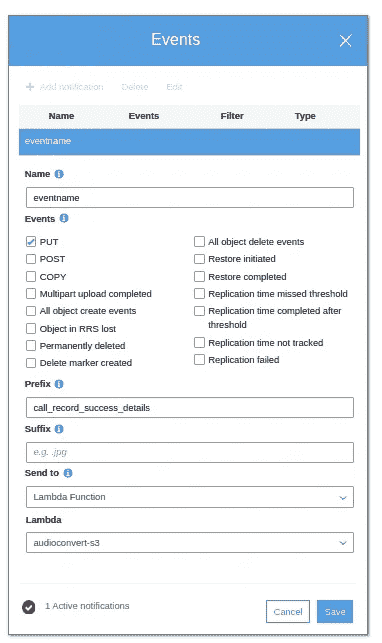
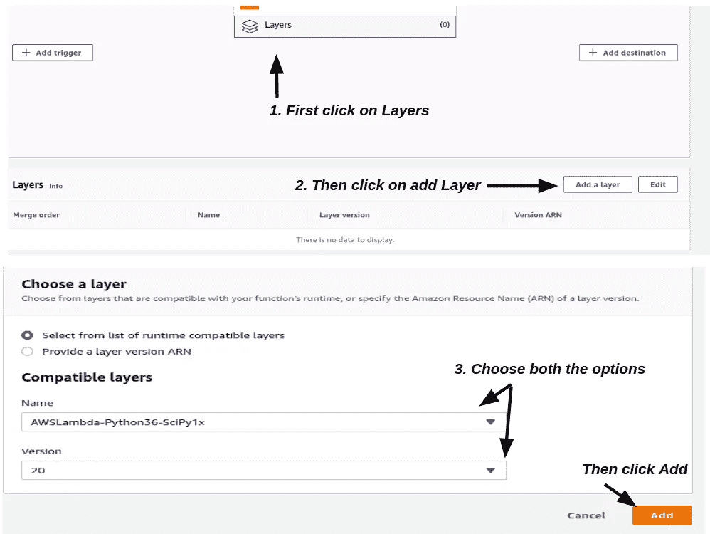
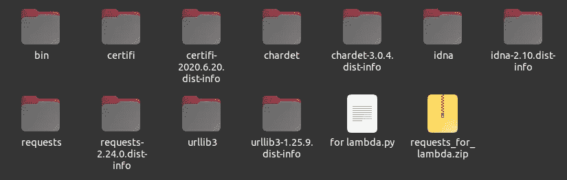
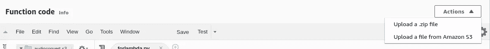
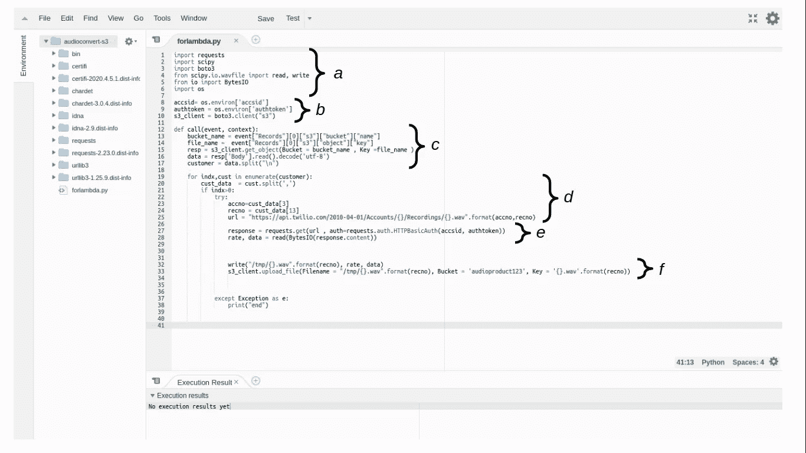
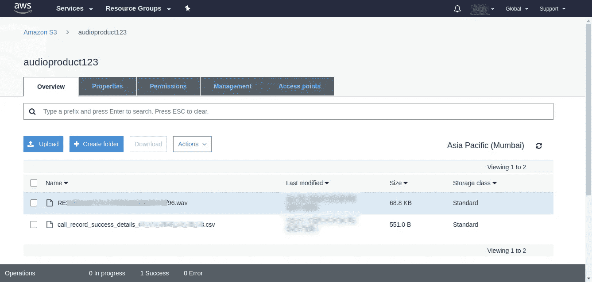

# 触发 AWS Lambda 函数以将来自 API 的音频存储在 S3 桶中

> 原文：<https://medium.com/analytics-vidhya/trigger-aws-lambda-function-to-store-audio-from-api-in-s3-bucket-b2bc191f23ec?source=collection_archive---------9----------------------->


由 [Ales Nesetril](https://unsplash.com/@alesnesetril?utm_source=medium&utm_medium=referral) 在 [Unsplash](https://unsplash.com?utm_source=medium&utm_medium=referral) 拍摄的照片

这是一个教程，我将展示当我们在 S3 桶中上传音频 API 并将音频存储回 S3 桶时，如何触发 lambda 函数。

我获取的音频来自 Twilio recording，通过 HTTP GET 调用 Recordings API 资源。

首先，我们将音频 API 细节存储在一个 CSV 文件中。我使用我的 CSV 文件*(名为 call _ record _ success _ details)*中的两列来形成完整的 API，如果你愿意，你可以将完整的 API 存储在一列中。

其次，我们必须创建一个 S3 桶*(名为 audioproduct123 )* ，我们将在其中存储文件，设置一个事件，这样一旦我们上传 CVS 文件，它就会从文件中获取 API 并触发 lambda 函数。



然后，我们必须创建一个 Lambda 函数 *( audioconvert-s3 )* ，它将读取 CSV 文件，从 API 获取详细信息，转换 API 中存储的音频，并将其上传到 s3 桶。为此，我们需要两个 python 库*请求*和 *Scipy。*有趣的是 lambda 函数中包含 Scipy 库，我们只需从层中添加相同的库即可。



对于请求库，我们必须使用命令— `pip install requests -t .`将其安装在本地目录中，并为 lambda.py 创建一个名为*的文件。把所有东西都拉上拉链。*



在 AWS Lambda 控制台中，只需上传 zip 文件。



一旦它被上传，我们可以在函数代码部分看到请求库以及λ. py 的*文件。*



在*中为 lambda.py 输入代码。*

a)导入 S3 连接、API 调用和转换音频所需的所有库。

b)设置与 S3 铲斗的连接。

c)获取特定的存储桶并读取 CSV 文件。

d)从 CSV 文件形成适当的 API。

e)调用 API 并存储响应。

f)将 API 响应转换成. wav 文件并上传到 S3 桶。

```
import requests
import scipy
import boto3
from scipy.io.wavfile import read, write
from io import BytesIO
import osaccsid=os.environ['accsid']
authtoken=os.environ['authtoken']
s3_client=boto3.client("s3")def call(event,context):
    bucket_name=event["Records"][0]["s3"]["bucket"]["name"]
    file_name=event["Records"][0]["s3"]["object"]["key"]
    resp=s3_client.get_object(Bucket=bucket_name,Key=file_name)
    data=resp['Body'].read().decode('utf-8')
    customer=data.split("\n")

    for indx,cust in enumerate(customer):
        cust_data=cust.split(',')
        if indx>0:
            try:
                accno=cust_data[3]
                recno=cust_data[13] 
                url="https://api.twilio.com/2010-04-                 
                            01/Accounts/{}/Recordings/{}.wav"
                            .format(accno,recno)
                response=requests.get(url,
                            auth=requests.auth.HTTPBasicAuth(accsid,
                            authtoken))
                rate, data = read(BytesIO(response.content))         
                write("/tmp/{}.wav".format(recno), rate, data)
                s3_client.upload_file(Filename=  
                             "/tmp/{}.wav".format(recno),Bucket=     
                             'audioproduct123',Key=
                             '{}.wav'.format(recno))

            except Exception as e:
                print("end")
```

现在，当我们上传一个缩写为*call _ record _ success _ details*的 CSV 文件时，lambda 函数会被触发并跟踪整个过程。结果，我们得到了期望的输出。



如果这篇文章对你有所帮助，请考虑给👏🏼来激励我。

如果你想知道更多关于音频转换和数据库存储的信息，请查看我的另一篇文章。

[](/analytics-vidhya/extracting-audio-files-from-api-storing-it-on-a-nosql-database-789c12311a48) [## 从 API 中提取音频文件并将其存储在 NoSQL 数据库中

### 存储和提取音频文件的最简单方法(。wav/API)

medium.com](/analytics-vidhya/extracting-audio-files-from-api-storing-it-on-a-nosql-database-789c12311a48) [](/analytics-vidhya/setup-and-crud-operations-in-mongodb-dd821c4621a) [## MongoDB 中的设置和 CRUD 操作

### 在这篇文章中，我们将看到如何在 MongoDB 云服务中建立一个帐户，并使用 Pymongo 进行 CRUD 操作。

medium.com](/analytics-vidhya/setup-and-crud-operations-in-mongodb-dd821c4621a) 

其他博客-

[](/swlh/confusion-matrix-in-machine-learning-920eda3d2cb6) [## 机器学习中的混淆矩阵

### 在这篇博客中，我将试着解释混淆矩阵的所有基本术语以及如何计算它们，用…

medium.com](/swlh/confusion-matrix-in-machine-learning-920eda3d2cb6) [](/@darpanlekharu4/what-it-takes-to-become-a-data-scientist-during-covid-19-pandemic-4ad5b9385c88) [## 在新冠肺炎·疫情期间成为一名数据科学家需要什么

### 上周，我与我的朋友讨论，我了解到他希望在数据领域发展自己的事业…

medium.com](/@darpanlekharu4/what-it-takes-to-become-a-data-scientist-during-covid-19-pandemic-4ad5b9385c88)