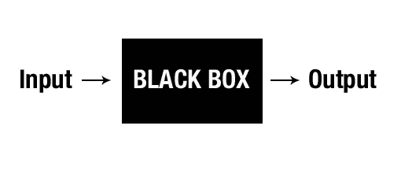
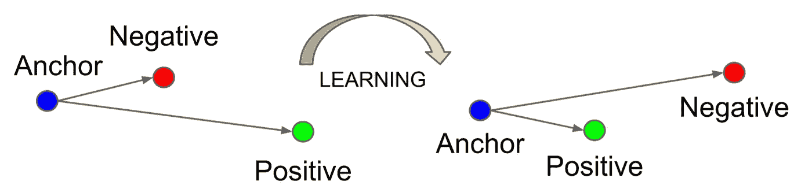
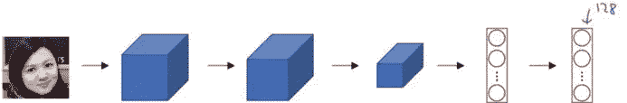
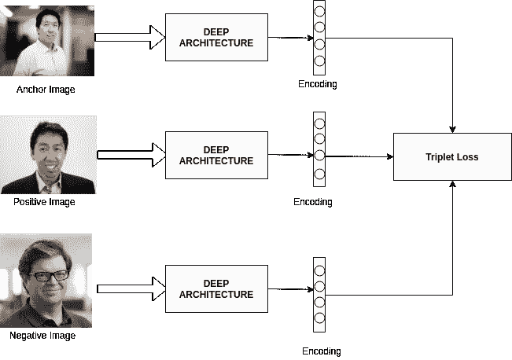
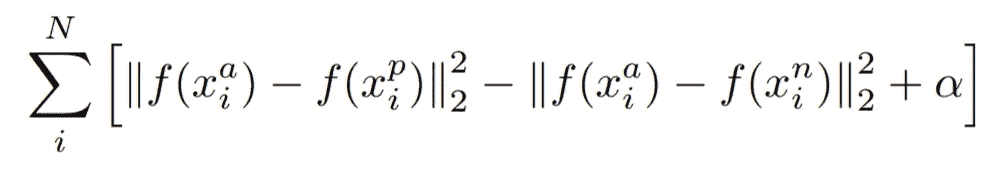

# 三重态损失的直觉

> 原文：<https://medium.com/analytics-vidhya/triplet-loss-b9da35be21b8?source=collection_archive---------0----------------------->

我们许多人都觉得机器学习是一个黑匣子，接受一些输入，给出一些奇妙的输出。近年来，这个黑匣子一直在创造奇迹，在各自的应用领域模仿人类。

但从我的经验来看，这是令人着迷的，有趣的，有时令人沮丧的(😜)随着我们深入这个黑匣子。这个黑匣子实现了很多十年前我们都没有想到的事情。ML 最有趣的部分是理解这个黑盒在幕后做事情的方式，这使它创造奇迹。

## 动机

最近，当我偶然发现一个名为 ***FaceNet*** 的*人脸识别模型*时，我惊讶于它是如何以如此令人难以置信的准确度识别人脸，以至于只需一次训练。我真的很好奇，想知道这个模型背后发生了什么。看了一点 FaceNet，对我来说，主人公就是正在使用的损失函数，不是别人，正是 ***三重损失函数*** 。我惊讶于几乎每秒钟在我们大脑中发生的一个小的、直觉的思维过程是如何解决非凡的问题的。这是我写这篇文章的动机。

## 我们走吧

这里我试着解释一下*我对 ***三重态损失函数*** 概念的理解。这个损失函数是在谷歌创建的模型 Facenet 成为使用 ***三重损失函数*** 的 ***人脸识别*** 中的艺术级模型之后流行起来的。*

我试着用一个类比让你对三重态损失有一个直观的认识。假设你有两个朋友(姑且称他们为***A******B***)。你们所有人都在同一个班级学习(因此也是同样的科目)。已知的事实是， ***A*** 是该类的状元。出成绩当天，你打了 50 分，你另外两个朋友( ***A，B*** )分别打了 95 分和 93 分。现在，当你的父母得知结果，并且假设他们知道 ***A*** 是状元，他们自然会推断 ***B*** 也是状元，因为 B 和状元(A)的分数之差*是* ***低，*** 而你是 NOOB😔😔作为*的标志，你和 topper 的区别(***)是**。**

**我们人类，几乎每次都通过遵循规则来进行这种类型的分类/推理；属于同一类别的元素*拥有相似的特征*(在我们的场景中，标记)。**

**三重损失采用了同样的逻辑，*即它*试图 ***减少*** 相似事物之间的距离/偏差而 ***增加*** 不同事物之间的相同。**

****

**三重损失最小化了锚和正片之间的距离，二者具有相同的身份，并且最大化了锚和不同身份的负片之间的距离。**

**让我们通过与我们的场景进行比较来理解上面的图表。 ***A*** 是 ***主播*** 众所周知他是a *主播*(身份固定)。你被认为是 ***负*** (既然你的和 ***主播*** 分数之差就是 ***高*** )。 ***B*** 被认为是*(由于 B 的 ***和锚*** 标志的区别是 ***低*** )。所以，在训练一个模型进行分类的时候，我们调整参数的权重，使*的三重损失最小化，*即 ***减少相似事物之间的差异，增加不同事物之间的差异*** 。***

**现在我们已经准备好理解三重态损失在 Facenet 模型中是如何工作的了。在 Facenet 模型的训练阶段，每个输入由 3 张人脸图像组成。其中，两个图像是同一个人(一个图像被认为是 ***锚*** ，另一个图像被认为是 ***正*** )，最后一个图像是不同的人( ***负*** )。Facenet 模型处理人脸的每一幅图像，并在 128 维空间中对特征进行编码，即给出大小为 128 的向量。**

****

**将图像编码为 128 大小的矢量**

**按照上述类比的思维过程，在 128 维空间中，如果两个编码点之间的距离为*，则可以说两张脸是 ***不同的*** ，如果距离为**低，则可以说是 ***相同的*** (通常我们保留一个阈值来决定距离的高低)。因此，模型以这样的方式调整权重，编码点之间的距离*****

*   ****锚*** 像& ***正*** 像低。*
*   ****锚*** 像& ***负*** 像高。*

**

*FaceNet 工作流程*

*现在我们能够理解 ***三重态损失函数*** 的数学方程了。*

**

*三重损失函数的数学方程。*

*   ****【x】***以 ***x*** 为输入，返回一个 128 维向量 ***w.****
*   ****i*** 表示第*I*输入。*
*   *下标 ***a*** 表示 ***锚*** 图像， ***p*** 表示 ***正*** 图像， ***n*** 表示 ***负*** 图像。*

*我们的目标是*最小化上面的等式*，这意味着:-*

> *最小化第一项→锚和正像之间的距离。*
> 
> *最大化(因为它前面有负号)第二项→锚和负像之间的距离。*

*第三项是作为阈值的 ***偏差*** (这里可以忽略)。*

*我希望你理解了这篇关于 ***三连音缺失*** 的文章😃。*

*请随意提出改进建议和问题。*

*机器学习快乐！！*

****参考文献&延伸阅读:*** 【1】Florian Schroff，Dmitry Kalenichenko，James Philbin， [FaceNet:人脸识别和聚类的统一嵌入](https://arxiv.org/pdf/1503.03832.pdf)*

****图片参考资料:
1)*** 谷歌
***2)*** FaceNet 论文:-[***https://arxiv.org/pdf/1503.03832.pdf***](https://arxiv.org/pdf/1503.03832.pdf)*