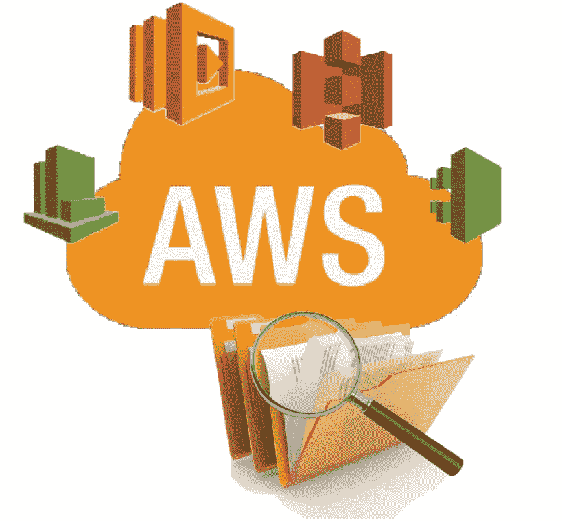
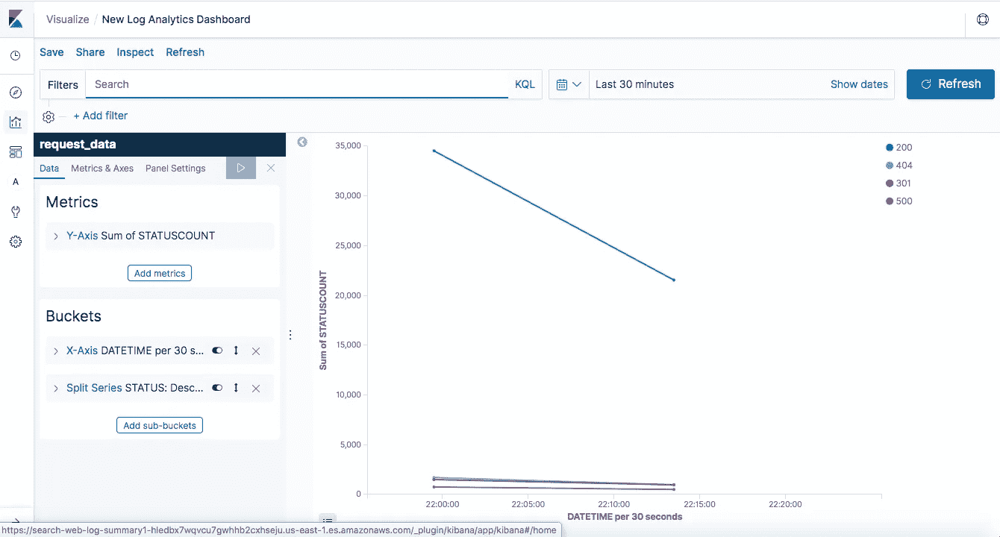

# 使用 Amazon Web Services 技术构建日志分析解决方案的疑难解答

> 原文：<https://medium.com/analytics-vidhya/troubleshoot-building-a-log-analytics-solution-using-amazon-web-services-technologies-ea2371ab1dfc?source=collection_archive---------15----------------------->



# 介绍

什么是大数据？您首先想到的是，数据量大吗？是的，在某种程度上。但是，大数据不仅仅由数量决定，它基本上是由 4v 定义的，即数量、速度、多样性和准确性。目前，有更多的 v 定义了大数据的有效性、可变性、脆弱性等。亚马逊网络服务(aws)是一家云服务提供商，拥有大量技术，可以在许多方面轻松处理大数据。在许多大数据用例中，日志分析是一种常见的用例，它允许您分析来自网站、移动设备、服务器、传感器和各种应用程序的日志数据。[这里提到的日志分析项目](https://aws.amazon.com/getting-started/projects/build-log-analytics-solution/)是一个使用 aws 技术构建日志分析器并在 [Kibana dashboard](https://www.elastic.co/guide/en/kibana/current/dashboard.html) 中可视化分析输出的综合示例。在本文中，我将介绍我在完成这个项目时遇到的问题以及故障排除步骤。

# 逐步指导和排除故障，使您的项目进入工作阶段

首先，你需要创建一个 aws 帐户，允许继续进行项目访问所需的技术。

然后启动一个 ec2 实例，如[项目指南](https://d1.awsstatic.com/Projects/P4113850/aws-projects_build-log-analytics-solution-on-aws.pdf)中所述。在 ec2 实例进入运行状态后，您可以使用 ssh 客户端连接到实例，如下例所示。在这里，sample.pem 是 ec2 密钥对，ec2–54–167–199–228.compute-1.amazonaws.com 是创建的 ec2 实例。

```
ssh -i sample.pem ec2-user@ec2–54–167–199–228.compute-1.amazonaws.com
```

然后，您需要附加一个 IAM 角色，该角色具有允许 wirte 访问 Amazon Kinesis Firehose 和 Amazon CloudWatch 的访问策略。您可以通过授予对这两种服务的完全访问权限来创建 IAM 角色。

然后，您需要使用[假 Apache 日志生成器](https://github.com/kiritbasu/Fake-Apache-Log-Generator)生成日志文件。运行项目的一种方法是手动下载它，然后使用下面的命令将它转移到 ec2 实例，假设您处于根级别。

```
scp -i Desktop/sample.pem -r Documents/Fake-Apache-Log-Generator ec2-user@ec2–54–167–199–228.compute-1.amazonaws.com:~/.
```

# 找不到 pip 命令

当您尝试使用 requirements.txt 文件和**pip install-r requirements . txt**来安装依赖项时，您可能会得到一个错误消息，说 *pip 命令未找到*。在这种情况下，您可以运行以下命令来安装 pip。

```
sudo yum install python-pip
```

# o 错误:[错误 13]权限被拒绝

之后，如果您尝试在项目级别运行该命令，您可能会得到一个错误，如 **OSError: [Errno 13]权限被拒绝:'/usr/local/lib/…。**。为了克服这个问题，作为一个简单的解决方案，您可以在根级别运行这个命令。

```
pip install -r Fake-Apache-Log-Generator/requirements.txt
```

这将成功导入运行项目所需的依赖项。按照指南中的说明完成此步骤。

然后，您必须创建一个 Amazon Firehose 交付流，它将允许您将生成的日志泵入配置的 s3 存储桶。接下来，您需要下载并安装 aws-kinesis-agent，它会将您的日志放入交付流。您可以按照指南中的说明根据需要更改 *agent.json* 文件。

# 0 条记录已解析、转换并成功发送了 0 条记录

接下来，您可以检查配置的 s3 存储桶，以检查流是否成功工作。如果没有，请检查位于**/var/log/aws-kinesis-agent/AWS-kine sis-agent . log .**的 AWS-kine sis-agent 日志。如果日志显示 **0 条记录已解析、转换并成功发送 0 条记录**，您将需要检查 aws-kinesis-agent-user 是否拥有对生成的日志文件位置的读取和执行权限。假设您的日志文件位于/home/ec2-user/Fake-Apache-Log-Generator 路径中。您可以通过发出以下命令来检查权限。

```
ls -l /home/ec2-user/Fake-Apache-Log-Generator
```

现在你必须设置权限给 **aws-kinesis-agent-user** 对路径中每个目录的读取和执行权限。在本例中，您需要将权限设置为/home、/home/ec2-user、/home/ec2-user/Fake-Apache-Log-Generator 目录和/home/ec2-user/Fake-Apache-Log-Generator/*。记录日志文件。为 aws-kinesis-agent-user 设置主目录权限的示例如下所示。

```
chown -R aws-kinesis-agent-user /home
chmod -R 755 /home
```

设置权限后，您需要使用以下命令重新启动 aws-kinesis-agent。

```
sudo service aws-kinesis-agent restart
```

然后，您将看到日志被传送到配置的 s3 存储桶。

嘣！！！现在你有一个流进入你的 s3 桶。现在完成项目已经不是什么难事了:d。

这些是我在项目中遇到的问题，我已经描述了故障排除步骤，这样你就可以让你的日志分析器在你的手边工作。完成该项目后，您将在 Kibana dashboard 中获得良好的可视化效果，并对日志进行适当的分析，如下所示。



基巴纳仪表板

希望你能够成功地完成这个项目，我的文章将有助于实现它。干杯！！！！！

如有任何疑问，请通过 sewwandikaus.13@cse.mrt.ac.lk 联系我。

# 参考

[1][https://AWS . Amazon . com/getting-started/projects/build-log-analytics-solution/](https://aws.amazon.com/getting-started/projects/build-log-analytics-solution/)