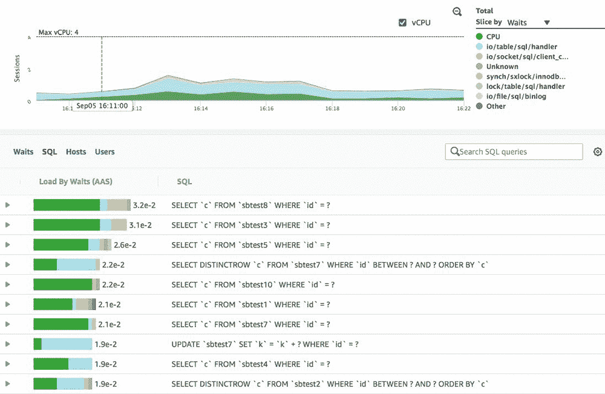
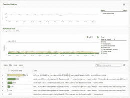

# 慢速 RDS 故障排除— PostgreSQL

> 原文：<https://medium.com/analytics-vidhya/troubleshoot-slow-rds-postgresql-c58edef30035?source=collection_archive---------4----------------------->



有时应用程序可能会很慢，人们指责的两个最常见的因素是网络和数据库。数据库的一些可能原因可能是 RDS CPU 使用率达到 100%，或者连接数不是最佳的，或者我们编写了错误的查询，因此您的许多查询变得较慢，并且您的应用程序整体上显示出较高的延迟。本指南旨在帮助调查和缓解一些潜在的问题。

当你阅读这篇文章时，记得问这样的问题，它能帮我实现什么？例如，如果您正在查看 ***查找具有最多活动/连接的数据库*** 查询，那么您应该问这样一个问题:我可以单独隔离这个数据库吗，或者我可以对此限制用户数量，以便减轻对系统的影响等等。最重要的是总是问正确的问题。



***有用组件:
___________________***

RDS 控制台
[RDS 性能洞察](https://aws.amazon.com/rds/performance-insights/)—[https://www.youtube.com/watch?v=RyX9tPxffmw](https://www.youtube.com/watch?v=RyX9tPxffmw)
[pg badger GitHub](https://github.com/darold/pgbadger)—用于分析 Postgres 日志文件。[http://pgbadger.darold.net/](http://pgbadger.darold.net/)pg analyze

***RDS 控制台
____________***

RDS 控制台是您查看以下内容的唯一位置:

系统规格— RAM、存储、IOPS(如果未配置，则为 3 倍存储)、vCPUs、参数组、安全组
监控—用于云监控的仪表盘、增强监控、操作系统流程、性能洞察
日志&事件—扩展、重新启动、备份、故障转移等事件。一段时间内收集的数据库日志。(您可以下载这些错误日志并使用 PGBadger 来分析它们)

***RDS 性能洞察
_ _ _ _ _ _ _ _ _ _ _ _ _ _ _ _ _ _ _ _ _ _ _ _***

Performance Insights 仪表板大致分为 3 个部分:
1 .*计数器指标* —包含*操作系统指标*(vcpu、CPU 利用率等)和*数据库指标*(缓存、检查点、IO 等)
2。*AAS 数据库负载* —这显示了一段时间内数据库上的负载，您可以按 4 个类别进行划分:
***等待*** *(有助于识别数据库正在等待的资源)、* ***SQL****(有助于识别慢速查询以进行优化)、* ***用户*** *(有助于限制速率)*

您还可以看到显示数据库峰值使用时间的趋势线，这有助于容量规划。

延伸阅读:[https://www . slide share . net/Amazon web services/using-performance-insights-to-optimize-database-performance-dat 402-AWS-reinvent-2018](https://www.slideshare.net/AmazonWebServices/using-performance-insights-to-optimize-database-performance-dat402-aws-reinvent-2018)

[***pg analyze***](https://pganalyze.com/)

PGAnalyze 提供以下帮助:

*   识别运行缓慢的查询
*   显示一段时间内活动、空闲和空闲事务连接的计数
    模式信息
*   来自解释语句的可视化查询计划
*   关于查询的统计信息(平均运行时间、每分钟调用次数、索引、高速缓存、CPU 与 IO)[用于调整索引，识别给数据库带来大量负载的查询]

***有用的 PostgreSQL 查询
_ _ _ _ _ _ _ _ _ _ _ _ _ _ _ _ _ _ _ _ _ _ _ _ _***

下面列出了一些有助于理解正在发生的事情的有用查询

***1 —显示数据库上的所有活动***

select * from `pg_stat_activity`其中 datname = ' < DB Name >

***2 —查找具有最多活动/连接的数据库:***

`select datname, count(*) as c from pg_stat_activity WHERE pid<>pg_backend_pid() group by datname order by c desc limit 10;
Helps identify problematic DB easily`

***3 —查找长时间运行的查询:***

`SELECT datname, client_addr, state,
floor(extract(epoch from clock_timestamp() - query_start)) as seconds, query
FROM pg_stat_activity
where pid<>pg_backend_pid()
and floor(extract(epoch from clock_timestamp() - query_start)) > 60
order by seconds desc;`

***4 —查找运行时间超过 60 秒且处于活动事务中的查询:***

`SELECT datname, client_addr, state,
floor(extract(epoch from clock_timestamp() - query_start)) as seconds, query
FROM pg_stat_activity
where pid<>pg_backend_pid()
and floor(extract(epoch from clock_timestamp() - query_start)) > 60
and state = 'active'
order by seconds desc;`

***5 —查找运行超过 60 秒且处于空闲/空闲中的查询事务:***

`SELECT datname, client_addr, state,
floor(extract(epoch from clock_timestamp() - query_start)) as seconds, query
FROM pg_stat_activity
where pid<>pg_backend_pid()
and floor(extract(epoch from clock_timestamp() - query_start)) > 60
and state like 'idle%'
order by seconds desc;`

***6 —查找数据库，活动/连接最多的用户:***

`select count(1) as cnt, datname, usename
FROM pg_stat_activity
WHERE pid<>pg_backend_pid()
group by datname, usename
order by cnt desc;`

***7 —按等待状态查找查询数:***

`select count(1), state
FROM pg_stat_activity WHERE pid<>pg_backend_pid() group by state;`

***按等待状态查找热门查询:***

`select datname, query, state, count(1) as c
FROM pg_stat_activity
WHERE pid<>pg_backend_pid()
group by datname, query, state
order by c desc, datname, query, state;`

***8—usename 和 datname 的关系:***

`select distinct usename, datname FROM pg_stat_activity limit 10;`

`select usename, datname, count(1) as c FROM pg_stat_activity group by usename, datname order by c desc limit 10;`

***9 —按特定查询的状态查找查询计数:***

`select state, count(1)
FROM pg_stat_activity
where query like 'select * from %' group by state;
Finds the no of times a query is currently being executed`

***10 —查找每个角色的连接限制:***

`SELECT rolname, rolconnlimit FROM pg_roles WHERE rolconnlimit <> -1;
-1 Indicates the role is allowed any no of connections`

***11 —查找每个角色每个数据库的连接限制:***

`select rolconnlimit, usename, datname
FROM (
select distinct usename, datname from pg_stat_activity
) t1 inner join pg_roles on t1.usename = pg_roles.rolname;`

```
SHOW max_connections;
```

***12 —锁***
锁的数量多并不是问题。只有当有大量的块时，这才是一个问题。使用下面的查询来查看是否有块:

`SELECT blocked_locks.pid AS blocked_pid, blocked_activity.usename AS blocked_user, blocking_locks.pid AS blocking_pid, blocking_activity.usename AS blocking_user, blocked_activity.query AS blocked_statement, blocking_activity.query AS current_statement_in_blocking_process FROM pg_catalog.pg_locks blocked_locks JOIN get_pg_stats() blocked_activity ON blocked_activity.pid = blocked_locks.pid JOIN pg_catalog.pg_locks blocking_locks ON blocking_locks.locktype = blocked_locks.locktype AND blocking_locks.DATABASE IS NOT DISTINCT FROM blocked_locks.DATABASE AND blocking_locks.relation IS NOT DISTINCT FROM blocked_locks.relation AND blocking_locks.page IS NOT DISTINCT FROM blocked_locks.page AND blocking_locks.tuple IS NOT DISTINCT FROM blocked_locks.tuple AND blocking_locks.virtualxid IS NOT DISTINCT FROM blocked_locks.virtualxid AND blocking_locks.transactionid IS NOT DISTINCT FROM blocked_locks.transactionid AND blocking_locks.classid IS NOT DISTINCT FROM blocked_locks.classid AND blocking_locks.objid IS NOT DISTINCT FROM blocked_locks.objid AND blocking_locks.objsubid IS NOT DISTINCT FROM blocked_locks.objsubid AND blocking_locks.pid != blocked_locks.pid JOIN get_pg_stats() blocking_activity ON blocking_activity.pid = blocking_locks.pid WHERE NOT blocked_locks.GRANTED;`

查看授予了哪些锁以及查询已经运行了多长时间

`SELECT a.datname, l.relation::regclass, l.transactionid, l.mode, l.GRANTED, a.usename, a.query, a.query_start, age(now(), a.query_start) AS "age", a.pid
FROM pg_stat_activity a
JOIN pg_locks l ON l.pid = a.pid ORDER BY a.query_start;`

***13 —描述表格***

`select column_name, data_type, character_maximum_length from INFORMATION_SCHEMA.COLUMNS where table_name = '<name of table>';`

你也可以从 pg_analyze 中得到这个

***14 —查找所有约束，表上的键***

`SELECT constraint_name, table_name, column_name, ordinal_position FROM information_schema.key_column_usage WHERE table_name = <name of table>;`

***15 —解释查询计划***

`BEGIN;
EXPLAIN ANALYZE <QUERY>;
ROLLBACK;`

***16 —找出表格中的共同点***
`select * from pg_stats where tablename = ‘<tablename>’;`

查询规划器使用它来决定索引

**17 —查找死行与活行的比率** `SELECT schemaname, relname, n_live_tup, n_dead_tup, last_autovacuum,
n_dead_tup
/ (n_live_tup
* current_setting(‘autovacuum_vacuum_scale_factor’)::float8
+ current_setting(‘autovacuum_vacuum_threshold’)::float8) as ratio
FROM pg_stat_user_tables
ORDER BY ratio DESC
LIMIT 10;`

***18 —查找是否在表上运行了任何序列扫描***
`select * from pg_stat_user_tables where relname = ‘<tablename>’;`

***19 —打印表格、行和索引的详细信息***
`SELECT l.metric, l.nr AS “bytes/ct”
, CASE WHEN is_size THEN pg_size_pretty(nr) END AS bytes_pretty
, CASE WHEN is_size THEN nr / NULLIF(x.ct, 0) END AS bytes_per_row
FROM (
SELECT min(tableoid) AS tbl — = ‘public.tbl’::regclass::oid
, count(*) AS ct
, sum(length(t::text)) AS txt_len — length in characters
FROM content t — provide table name *once*
) x
, LATERAL (
VALUES
(true , ‘core_relation_size’ , pg_relation_size(tbl))
, (true , ‘visibility_map’ , pg_relation_size(tbl, ‘vm’))
, (true , ‘free_space_map’ , pg_relation_size(tbl, ‘fsm’))
, (true , ‘table_size_incl_toast’ , pg_table_size(tbl))
, (true , ‘indexes_size’ , pg_indexes_size(tbl))
, (true , ‘total_size_incl_toast_and_indexes’, pg_total_relation_size(tbl))
, (true , ‘live_rows_in_text_representation’ , txt_len)
, (false, ‘ — — — — — — — — — — — — — — — ‘ , NULL)
, (false, ‘row_count’ , ct)
, (false, ‘live_tuples’ , pg_stat_get_live_tuples(tbl))
, (false, ‘dead_tuples’ , pg_stat_get_dead_tuples(tbl))
) l(is_size, metric, nr);`

您可以使用`pg_stat_statements`来查看实际的查询本身。

这有助于您分析特定查询的瓶颈所在。观察它选择的指数以及它是如何选择的。您可以查询`pg_stats`表来查看任何表中任何列的公共值。

阅读 [DataDogs guide](https://www.datadoghq.com/blog/aws-rds-postgresql-monitoring/) ,了解监控哪些信号，以便在出现问题之前识别数据库中的瓶颈。它讨论了你正在做的顺序扫描的数量，缓存命中，索引等等。

阅读 [AWS 博客](https://aws.amazon.com/blogs/database/how-to-use-cloudwatch-metrics-to-decide-between-general-purpose-or-provisioned-iops-for-your-rds-database/)了解 GP 存储和调配 IOPS 之间的差异以及突发限制。这将有助于回答您关于是否为工作负载提供了足够的 IOPS 的问题。

***进一步 Ref:
_ _ _ _ _ _ _ _ _ _ _ _***

1.  [https://www.youtube.com/watch?v=RyX9tPxffmw](https://www.youtube.com/watch?v=RyX9tPxffmw)
2.  [https://www.youtube.com/watch?v=OWL8jqrJKPQ](https://www.youtube.com/watch?v=OWL8jqrJKPQ)
3.  [https://www . compose . com/articles/common-misconcepts-about-locking-in-PostgreSQL/](https://www.compose.com/articles/common-misconceptions-about-locking-in-postgresql/)
4.  [https://wiki.postgresql.org/wiki/Lock_Monitoring](https://wiki.postgresql.org/wiki/Lock_Monitoring)
5.  [https://www . datadohq . com/blog/AWS-rds-PostgreSQL-monitoring/](https://www.datadoghq.com/blog/aws-rds-postgresql-monitoring/)
6.  [https://www.google.com/search?q=useful+postgres+queries](https://www.google.com/search?client=firefox-b-1-d&q=useful+postgres+queries)
7.  [https://www . holistics . io/blog/PostgreSQL-queries-usage-monitoring/](https://www.holistics.io/blog/postgresql-queries-usage-monitoring/)
8.  [https://AWS . Amazon . com/blogs/database/how-to-use-cloud watch-metrics-to-decision-general-purposed-or-provisioned-IOPs-for-your-rds-database/](https://aws.amazon.com/blogs/database/how-to-use-cloudwatch-metrics-to-decide-between-general-purpose-or-provisioned-iops-for-your-rds-database/)